# 花火 AI 软件操作手册

**文档版本：** 1.0  
**对应应用版本：** 0.1.0  
**界面核对与截图日期：** 2026-07-30  
**适用范围：** 花火 AI Flutter 移动端当前界面

> 本手册中的截图由 iOS 模拟器运行当前工程后采集。截图中的姓名、资产、文章、录音卡状态和其他内容均为操作示例，实际界面以当前账号数据、设备连接状态和服务返回结果为准。

## 目录

1. [使用前准备](#1-使用前准备)
2. [登录与首次进入](#2-登录与首次进入)
3. [首页与页面导航](#3-首页与页面导航)
4. [思想图谱](#4-思想图谱)
5. [内容采集与导入](#5-内容采集与导入)
6. [外部世界](#6-外部世界)
7. [我的资产](#7-我的资产)
8. [聊一聊](#8-聊一聊)
9. [创作空间](#9-创作空间)
10. [自由创作](#10-自由创作)
11. [录音、上传与转写](#11-录音上传与转写)
12. [录音卡](#12-录音卡)
13. [我的与活动日历](#13-我的与活动日历)
14. [设置与账号](#14-设置与账号)
15. [声纹管理](#15-声纹管理)
16. [代表作](#16-代表作)
17. [消息与后台任务](#17-消息与后台任务)
18. [常见问题](#18-常见问题)

---

## 1. 使用前准备

### 1.1 建议环境

- 保持手机有稳定网络。
- 录音前确认麦克风未被其他应用占用。
- 使用录音卡时打开蓝牙和 Wi-Fi，并保持设备有足够电量。
- 导入大文件或录音卡文件前确认手机有足够可用空间。
- 需要读取相册、文件、麦克风、蓝牙或本地网络时，按系统提示授权。

### 1.2 权限用途

| 权限 | 使用场景 | 拒绝后的影响 |
| --- | --- | --- |
| 麦克风 | 独白、会议、聊天语音、声纹录入 | 无法开始对应录音 |
| 蓝牙/附近设备 | 发现和控制录音卡 | 无法连接或读取设备状态 |
| Wi-Fi/本地网络 | 录音卡文件快速传输 | 无法连接录音卡热点或下载文件 |
| 文件 | 导入文档、音频，导出内容 | 无法选择或保存文件 |
| 相册 | 添加影像 | 无法选择照片 |
| 屏幕采集 | 系统内录 | 无法采集设备内部音频 |

权限被永久拒绝后，进入“我的 > 设置 > 设备权限”，点击“前往设置”，在系统设置中开启对应权限，再返回应用重试。

### 1.3 内容流转原则

应用中的内容主要经历以下过程：

```text
采集或订阅 → 生成个人内容 → 用户确认沉淀 → 进入思想图谱 → 对话或创作
```

“保存”“订阅”“浏览”和“沉淀”含义不同：

- 保存笔记或创作，不代表已经沉淀。
- 订阅频道，不代表频道文章已经沉淀。
- 浏览文章，不会自动把文章加入思想图谱。
- 只有执行“沉淀到我的资产”并成功后，内容才成为图谱资产。

---

## 2. 登录与首次进入

### 2.1 登录页面

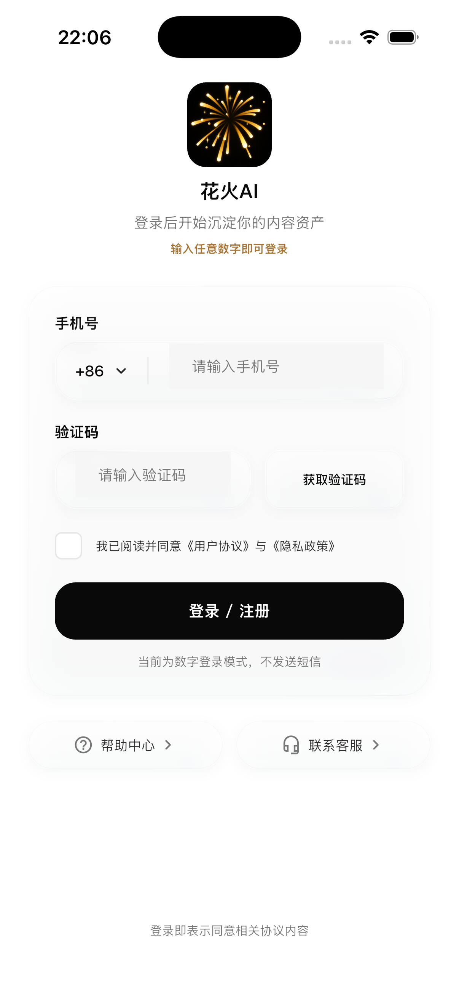

当前构建显示“数字登录模式”。操作步骤如下：

1. 在“手机号”输入框中输入手机号数字。
2. 在“验证码”输入框中输入数字。
3. 当前数字登录模式不会发送短信；“获取验证码”不代表已发送短信。
4. 阅读《用户协议》和《隐私政策》。
5. 勾选“我已阅读并同意”。
6. 点击“登录 / 注册”。

未勾选协议时不要继续登录。登录即表示同意页面列出的协议内容。

### 2.2 工作区恢复

登录后应用会恢复当前账号的会话、工作区、本地草稿和相关状态。恢复期间不要重复点击登录。

如果出现“工作区暂时不可用”或恢复失败页面：

1. 检查网络。
2. 点击页面上的重试。
3. 仍然失败时记录安全错误码和发生时间。
4. 不要为了绕过恢复问题重复注册新账号。

### 2.3 首次定位

首次账号需要按页面提示完成内容方向或定位信息。填写后提交，只有页面明确显示保存成功并进入首页，才表示首次设置完成。

---

## 3. 首页与页面导航

### 3.1 首页三个页面

首页由以下页面组成：

| 页面 | 主要用途 | 进入方式 |
| --- | --- | --- |
| 思想图谱 | 浏览和聚合已沉淀资产 | 登录后默认进入 |
| 创作空间 | 今日推送、专项创作、自由创作 | 图谱右侧边缘向左滑 |
| 代表作 | 查看、编辑和讨论代表作 | 创作空间继续向左滑；可在设置中关闭 |

页面底部的小圆点表示当前位置。代表作关闭后，首页只保留思想图谱和创作空间。

### 3.2 打开“我的”

可以使用两种方式：

1. 点击首页左上角菜单图标。
2. 在思想图谱最左侧边缘向右滑。

### 3.3 返回上一页

- 点击左上角返回箭头返回直接上级页面。
- 编辑、录音、批量处理或有未保存内容时，返回可能先弹出确认框。
- 确认框出现后，先阅读“保存、保留、放弃、删除”等操作含义，再选择。

---

## 4. 思想图谱

思想图谱展示已经沉淀的个人资产及其关系，是可拖动、缩放、搜索和选择的真实交互式图谱。

### 4.1 3D 图谱

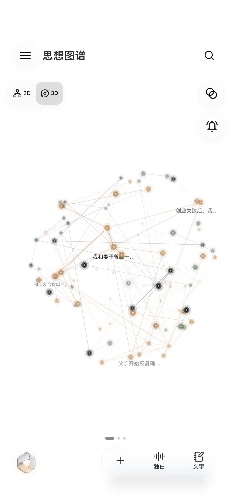

3D 视图适合观察整体分布：

1. 点击左上方“3D”。
2. 在空白区域拖动，改变观察方向。
3. 使用双指缩放调整视野。
4. 点击节点查看节点操作卡。
5. 点击空白处取消选择。

### 4.2 2D 图谱

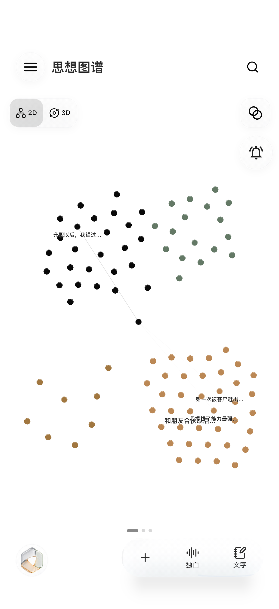

2D 视图更适合阅读节点名称和局部连线：

1. 点击“2D”。
2. 拖动空白区域平移画布。
3. 长按并拖动节点调整局部位置。
4. 点击关系线查看关系说明。

2D 与 3D 使用同一组资产，切换不会删除节点或取消后台任务。

### 4.3 搜索资产

1. 点击右上角放大镜。
2. 输入标题或关键词。
3. 在结果列表中点击目标内容。
4. 图谱会定位并选中目标节点。
5. 点击关闭或清空输入恢复完整视图。

如果搜不到刚创建的内容，先检查是否已经执行沉淀。仅保存在草稿、外部世界或创作历史中的内容不会自动成为图谱节点。

### 4.4 查看节点

点击节点后，操作卡通常提供“查看”和“聊一聊”：

- “查看”：打开内容详情，核对标题、原始正文、摘要、关联材料等。
- “聊一聊”：以当前节点内容作为上下文进入聊天。

引用节点前应先查看原始内容，避免把 AI 摘要或后续推断当作原始事实。

### 4.5 发起聚合

聚合需要至少 4 条可用的已沉淀资产。

空闲状态：


操作步骤：

1. 点击图谱右侧的聚合图标。
2. 系统选择 4 条资产，并组合当前热点。
3. 在确认框中核对所选材料。

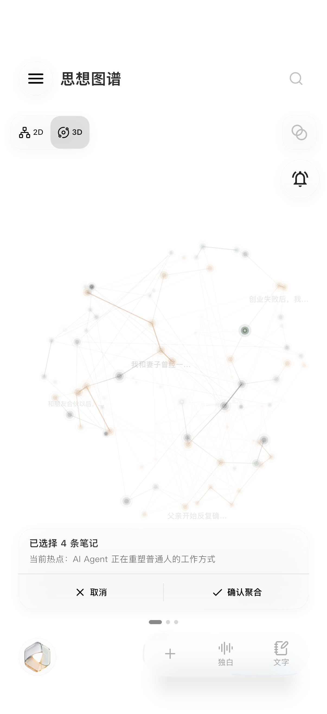

4. 选择“取消”会恢复图谱，不创建任务。
5. 选择“确认聚合”后进入前景处理动画。

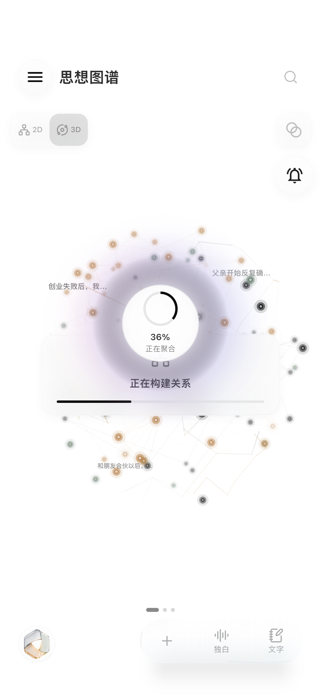

6. 前景动画结束后图谱恢复交互，任务继续在后台运行。
7. 点击消息入口查看后台状态。

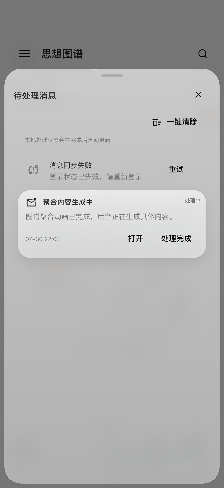

8. 显示“聚合完成”后打开生成内容。
9. 失败时根据消息提供的操作重试。

“一键清除”只处理消息，不等同于取消仍在运行的任务。

### 4.6 从图谱进入创作空间

在图谱最右侧边缘向左滑进入创作空间。请从屏幕边缘开始滑动；图谱中部的拖动仍用于浏览节点。

---

## 5. 内容采集与导入

### 5.1 打开采集菜单

思想图谱底部固定提供“+”“独白”和“文字”。点击“+”展开外录、内录、链接和导入。

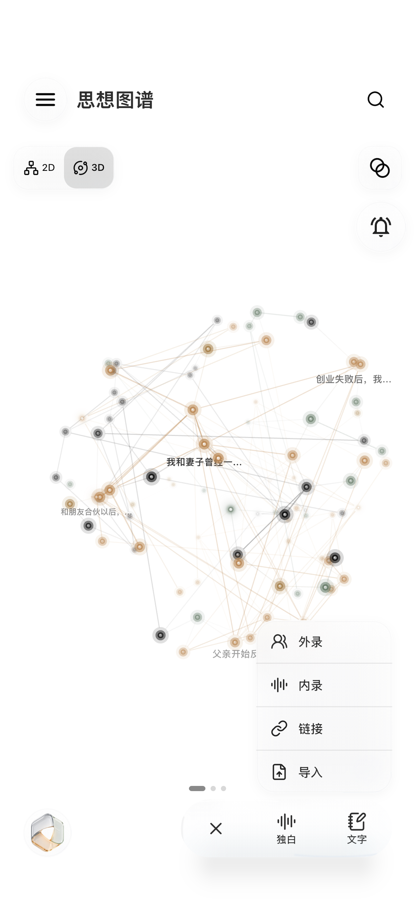

### 5.2 新建文字笔记

1. 点击底部“文字”。
2. 输入标题。
3. 输入正文并使用可用的文字格式。
4. 点击右上角保存。
5. 返回时如出现未保存提示，选择继续编辑或确认放弃。
6. 需要进入图谱时，在内容详情执行沉淀。

### 5.3 独白录音

1. 点击底部“独白”。
2. 首次使用允许麦克风权限。
3. 点击开始，观察计时、波形和实时文字预览。
4. 需要时点击暂停；再次点击继续。
5. 点击停止，等待本地文件保存。
6. 上传完成后查看正式转写结果。

实时文字只是录音过程预览，最终内容以完整录音上传后的正式转写为准。

### 5.4 外录

外录适合会议或多人现场记录：

1. 点击“+ > 外录”。
2. 允许麦克风权限。
3. 开始录音后保持手机靠近主要说话人。
4. 使用暂停和继续控制中断。
5. 结束后确认本地音频保存，再等待上传和转写。

### 5.5 内录

内录用于采集设备内部播放的声音：

1. 点击“+ > 内录”。
2. 按系统提示允许屏幕采集或内部音频权限。
3. 开始采集后播放目标内容。
4. 返回应用停止采集。
5. 检查文件时长和状态后再上传。

系统或内容源可能限制内部音频。页面没有显示成功前，不要把静音文件当作有效录音。

### 5.6 导入链接

1. 点击“+ > 链接”。
2. 输入完整的 `http` 或 `https` 地址。
3. 点击提交。
4. 等待页面显示处理结果。
5. 成功后打开内容详情；失败时检查网页是否公开可访问并重试。

需要登录、付费、地区限制或已经删除的页面可能无法导入。

### 5.7 导入文档或音频

1. 点击“+ > 导入”。
2. 选择本地文档导入。
3. 点击“选择文件并导入”。
4. 可一次选择多个文件。
5. 当前支持音频、TXT、Markdown、PDF、DOC、DOCX、PPT 和 PPTX。
6. 在“已选择文件”中核对名称和状态。
7. 等待所有项目完成，不要中途移动或删除原文件。

从其他应用“用花火 AI 打开”文件时，应用先显示外部文件确认页；确认后才会创建导入任务。

### 5.8 采集失败处理

- 取消选择：不会创建内容，可以重新选择。
- 权限失败：到系统设置开启权限后重试。
- 网络失败：保留本地文件，网络恢复后重试。
- 文件格式不支持：转换为支持格式后重新导入。
- 文件已经移动：重新选择原文件。

---

## 6. 外部世界

外部世界由“我的订阅”和“知识广场”组成。入口为“我的 > 外部世界”。

### 6.1 我的订阅


1. 顶部选择“全部订阅”查看所有已订阅频道文章。
2. 点击某个频道头像，只查看该频道。
3. 点击文章打开只读全文。
4. 核对来源、发布时间、标题和正文。

如果页面为空，先到知识广场订阅频道。

### 6.2 知识广场

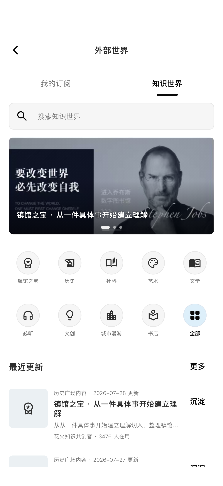

1. 切换到“知识广场”。
2. 使用搜索、主题入口或最近更新发现频道。
3. 点击频道查看简介和文章列表。
4. 点击订阅；再次操作可以取消订阅。

订阅对象是频道，不是单篇文章。

### 6.3 沉淀外部文章

1. 先订阅文章所属频道。
2. 打开文章详情。
3. 点击“沉淀到我的资产”。
4. 选择分类和文件夹，也可以暂不分类。
5. 成功后按钮变为“已沉淀”。

沉淀会创建个人资产副本，不修改频道原文。仅浏览或订阅不会把文章加入思想图谱。

---

## 7. 我的资产

入口为“我的 > 我的资产”。

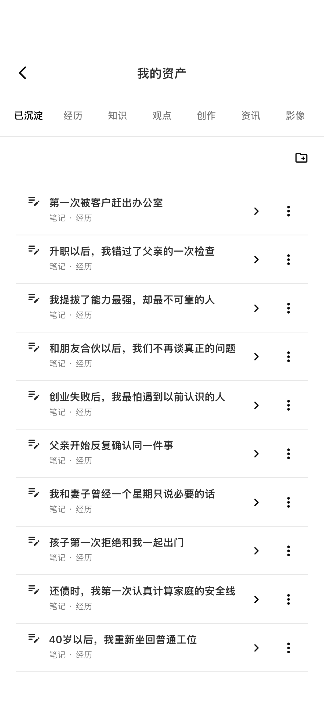

### 7.1 资产分页

当前分页包括：

- 已沉淀
- 经历
- 知识
- 观点
- 创作
- 资讯
- 影像

“已沉淀”显示全部有效沉淀记录；其他分页显示相应固定分类。

### 7.2 沉淀与分类

1. 在可沉淀内容的详情页点击“沉淀到我的资产”。
2. 选择一个或多个分类，或暂不选择。
3. 选择现有文件夹或新建文件夹。
4. 确认并等待“已沉淀”状态。

未分类内容仍保留在“已沉淀”中，可以稍后继续整理。

### 7.3 文件夹

1. 点击新建入口。
2. 输入文件夹名称并确认。
3. 点击文件夹进入；可继续创建子文件夹。
4. 使用右侧菜单重命名或删除。
5. 删除前确认影响范围。

文件夹用于整理位置，不改变内容的真实来源。

### 7.4 笔记操作

打开笔记操作菜单后，根据当前状态可以：

- 分享
- 导出为 Markdown 或 PDF
- 管理标签
- 立即同步或处理冲突
- 重命名
- 删除

删除会先进入回收站的内容，可在 30 天内恢复；永久删除不可撤销。

### 7.5 影像

1. 切换到“影像”。
2. 点击右上角添加照片。
3. 从相册一次选择最多 9 张支持图片。
4. 点击照片进入全屏预览并缩放。

影像相册中的照片不会自动生成笔记，也不参与思想图谱或等级计算。

---

## 8. 聊一聊

### 8.1 普通聊天

点击思想图谱左下角 AI 标记进入普通聊一聊。

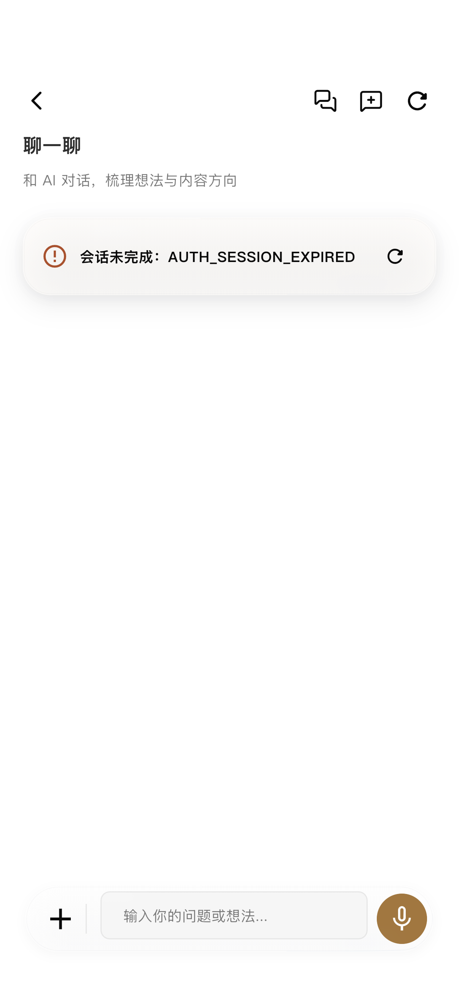

普通入口默认不附带整个图谱或某条资产。输入问题后点击发送，等待回复完成。

右上角提供会话列表和新建会话；更多操作中可以重命名当前会话或恢复原名称。

### 8.2 添加上下文

点击输入栏“+”，当前只提供“引用我的资产”和“上传资料”。

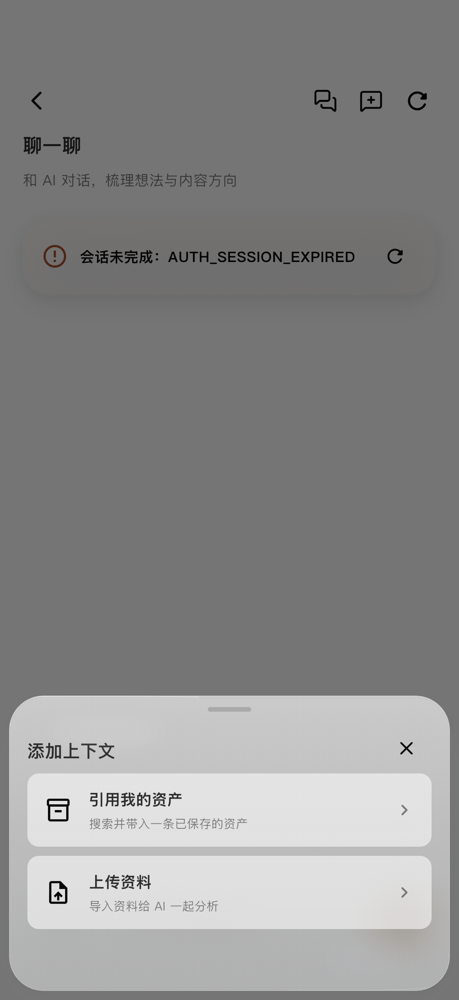

引用资产步骤：

1. 点击“引用我的资产”。
2. 按标题或内容搜索。
3. 选择一条资产。
4. 检查输入栏上方的上下文标记。
5. 输入问题并发送。

发送前可以移除上下文；消息发送后移除，不会改变已经提交的请求。

### 8.3 上传资料

1. 点击“+ > 上传资料”。
2. 进入文件导入流程。
3. 选择文件并等待导入。
4. 返回聊天后继续说明分析目标。

### 8.4 语音消息

1. 切换到语音输入。
2. 允许麦克风权限。
3. 开始录制后观察时长和状态。
4. 可以暂停、继续或取消。
5. 停止后等待上传和转写。
6. 失败时使用重试，不必重复录制已经安全保存的本地语音。

### 8.5 不同入口的上下文

| 入口 | 默认上下文 |
| --- | --- |
| 思想图谱普通聊一聊 | 不自动附带资产 |
| 图谱节点“聊一聊” | 当前节点内容 |
| 个人 IP/获客营销 | 进入前选择的资产 |
| 视觉设计/视频分析 | 对应能力标签 |
| 深度定位 | 定位对话上下文 |
| 代表作聊一聊 | 当前代表作全文 |

---

## 9. 创作空间

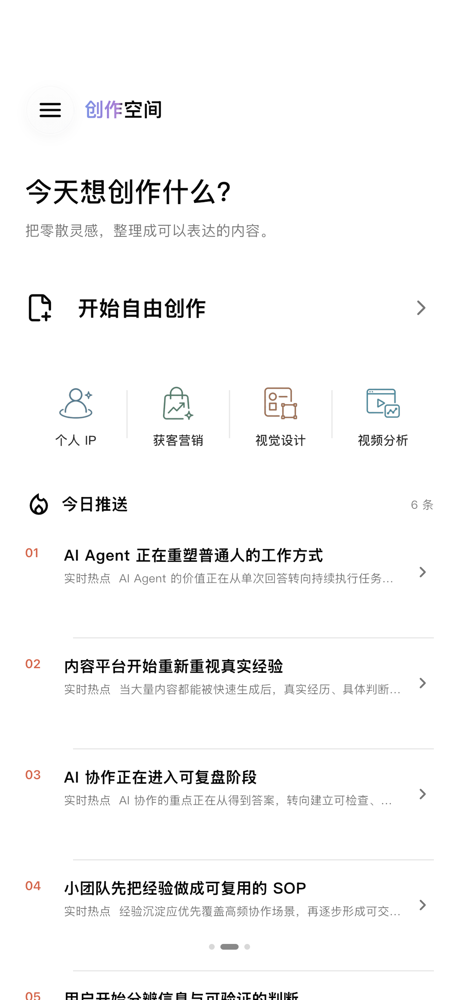

### 9.1 进入方式

从思想图谱最右侧边缘向左滑。页面顶部显示“创作空间”。

### 9.2 今日推送

1. 在“今日推送”选择一条内容。
2. 进入详情阅读标题、标签、摘要和全文。

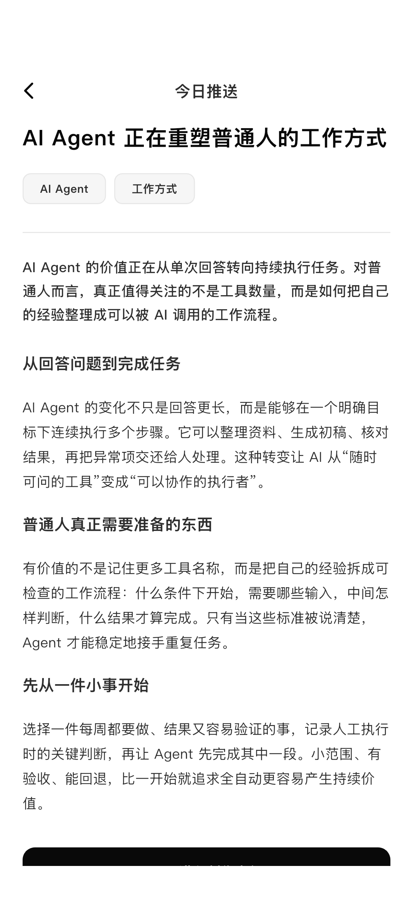

3. 点击底部“进入创作空间”。
4. 系统把标题和全文复制为新的自由创作草稿，不修改原推送。
5. 如果已有草稿，先在冲突对话框中选择保留旧草稿或使用当前选题新建。

### 9.3 个人 IP

1. 点击“个人 IP”。
2. 在“选择你的资产”中搜索并多选已沉淀内容。
3. 确认后进入带资产上下文的聊天。
4. 说明受众、平台、表达目标和输出形式。

### 9.4 获客营销

1. 点击“获客营销”。
2. 选择要引用的资产。
3. 进入专项聊天。
4. 说明客户阶段、核心问题、希望产生的行动和不能夸大的事实。

### 9.5 视觉设计

点击后直接进入带“视觉设计”标签的聊天。建议提供：使用场景、尺寸、文字、信息层级、品牌要求和视觉偏好。

### 9.6 视频分析

点击后直接进入带“视频分析”标签的聊天。可以上传资料，并说明希望分析结构、表达、节奏、受众或转化问题。

### 9.7 自由创作

点击“开始自由创作”进入完整编辑器，详细步骤见下一章。

---

## 10. 自由创作

### 10.1 编辑器主界面

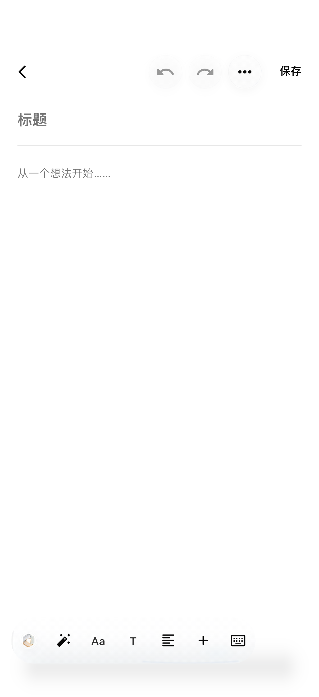

1. 在标题区域输入标题。
2. 在正文区域输入内容。
3. 顶部使用撤销、重做、更多和保存。
4. 底部使用聊天、AI 编辑、文字样式、段落、对齐、导入笔记和键盘控制。

### 10.2 草稿与保存

- 停止输入一段时间后自动保存草稿。
- 自动保存失败时页面显示提示和重试。
- 点击“保存”显式保存作品。
- 保存失败不会删除当前草稿。
- 离开时按确认框选择保留草稿或放弃。

### 10.3 文字样式

点击 `Aa` 可使用加粗、斜体、下划线、删除线、文字颜色、背景颜色和链接等。

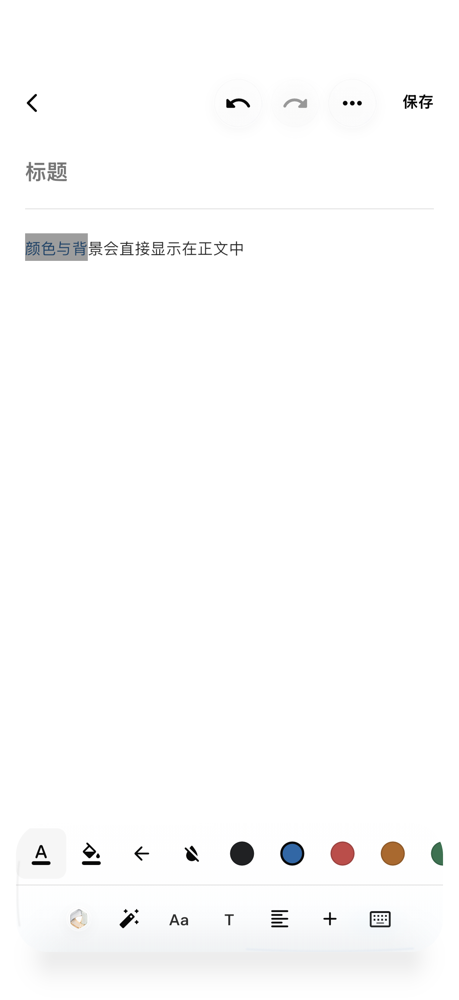

点击 `T` 可设置正文、一级至三级标题、任务列表、有序列表、无序列表、代码块、引用和分隔线。

### 10.4 对齐和键盘

- 点击对齐图标，在左对齐、居中、右对齐之间切换。
- 点击键盘图标显示或收起键盘。
- 长文中唤出键盘时，编辑器会尽量将光标保持在键盘上方。

### 10.5 导入笔记

1. 点击底部“+”。
2. 搜索标题或内容。
3. 多选需要引用的笔记。
4. 按选择顺序插入正文。

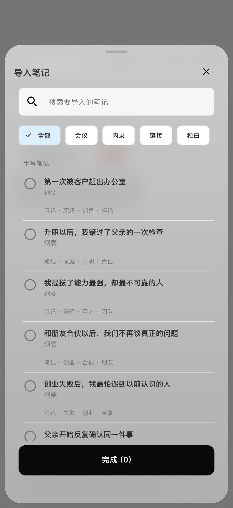

导入只复制内容，不修改原笔记。

### 10.6 AI 创作工具

点击底部 AI 编辑图标，可选择：社会关系转变、需求深化、差异化增强、开头优化、扩写、人设植入、配图和原子化。

操作步骤：

1. 先选中目标文字；不选择时默认使用受长度限制的全文上下文。
2. 点击 AI 编辑。
3. 选择能力并补充要求。
4. 等待建议生成。
5. 在预览中检查建议。
6. 确认后才写入正文；取消或失败不会修改原文。

### 10.7 创作聊一聊与改写

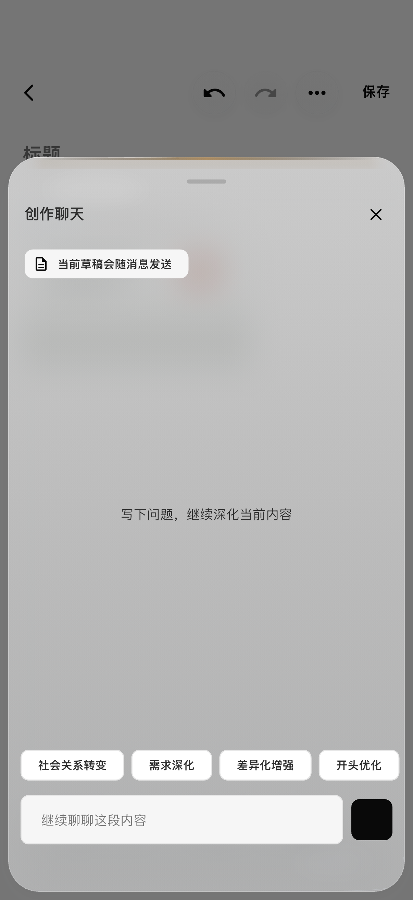

1. 点击底部左侧 AI 标记打开聊天。
2. 输入希望讨论或修改的问题。
3. AI 回复后可以复制、插入正文或选择“作为改写”。
4. 改写进入差异审阅：删除为红色，新增为绿色。
5. 点击“接受”才替换正文；点击“拒绝”保留原文。

正文或选区在请求后发生变化时，旧结果会过期，不能覆盖新版本。

### 10.8 创作历史

从更多菜单打开创作历史：


点击记录继续查看或编辑。历史按账号隔离；删除时留意回收站和永久删除提示。

---

## 11. 录音、上传与转写

### 11.1 实时文字与正式转写

- 实时文字：录音过程中的预览，可能不断修订。
- 正式转写：完整音频上传并处理后的结果。

正式转写是最终依据。网络或实时服务异常时，只要本地录音保存成功，就先保留音频并稍后重试。

### 11.2 上传状态

录音停止后可能依次经历：本地保存、等待上传、上传中、转写中、处理完成或失败。不要在上传中删除原文件。

### 11.3 查看结果

1. 从完成提示、消息或录音列表打开转写详情。
2. 查看原始转写。
3. 查看摘要或后续整理内容。
4. 核对人名、数字和关键事实。
5. 需要进入图谱时执行沉淀。

### 11.4 转写失败

- 检查录音是否有清晰声音。
- 检查文件大小、格式和完整性。
- 检查网络。
- 保留原音频并使用重试。
- 记录页面安全错误码，不要提交私有路径或账号凭证。

---

## 12. 录音卡

> 本章截图使用模拟器中的设备状态示例。真实连接、电量、文件和 Wi-Fi 状态以 FW920 硬件返回结果为准。

### 12.1 从“我的”查看录音卡

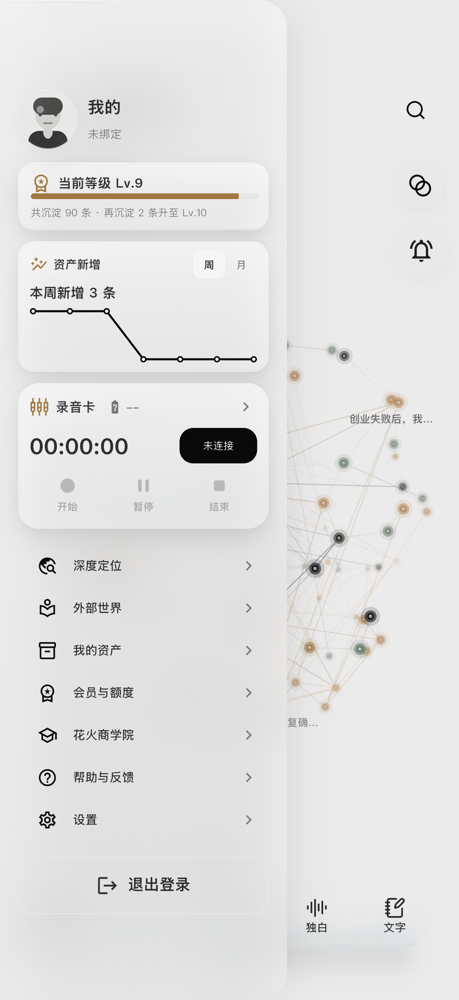

组件显示连接状态、录音状态、计时和电量。点击非控制区域进入设备管理；开始、暂停、继续、结束只执行对应设备命令。

### 12.2 连接录音卡

1. 打开录音卡并靠近手机。
2. 在录音卡组件或管理页点击连接。
3. 允许蓝牙或附近设备权限。
4. 等待页面显示设备名称和“已连接”。
5. 电量未上报时显示双横线，不代表电量为零。

如果无法连接，确认设备没有被其他手机占用，关闭再打开设备后重试。

### 12.3 设备与文件管理

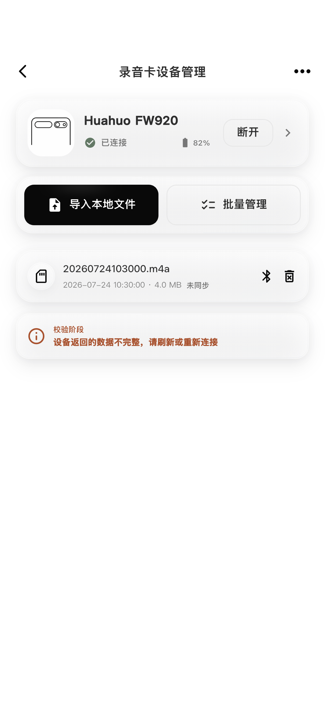

管理页统一显示设备和本地/卡内录音。顶部可导入本地文件或进入批量模式。

点击录音行可以播放可用本地文件；点击行尾三点打开紧凑菜单，根据状态可执行查看或上传转写、重命名、保存本地、用其他应用打开、删除卡内原文件或永久删除。

### 12.4 批量选择

1. 点击“批量操作”。
2. 勾选一个或多个文件。
3. 核对已选数量和总大小。
4. 选择 Wi-Fi 下载或删除。
5. 点击“清空”只取消选择，不删除文件。

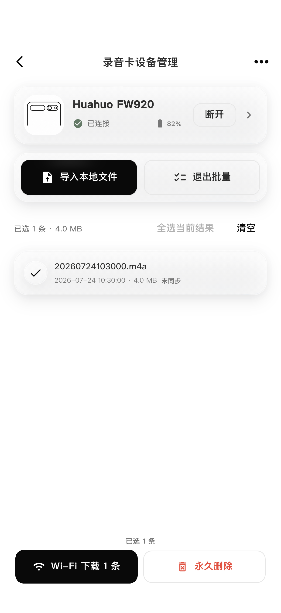

永久删除前先确认本地副本完整、可以播放且无需保留卡内原文件。

### 12.5 Wi-Fi 快速传输

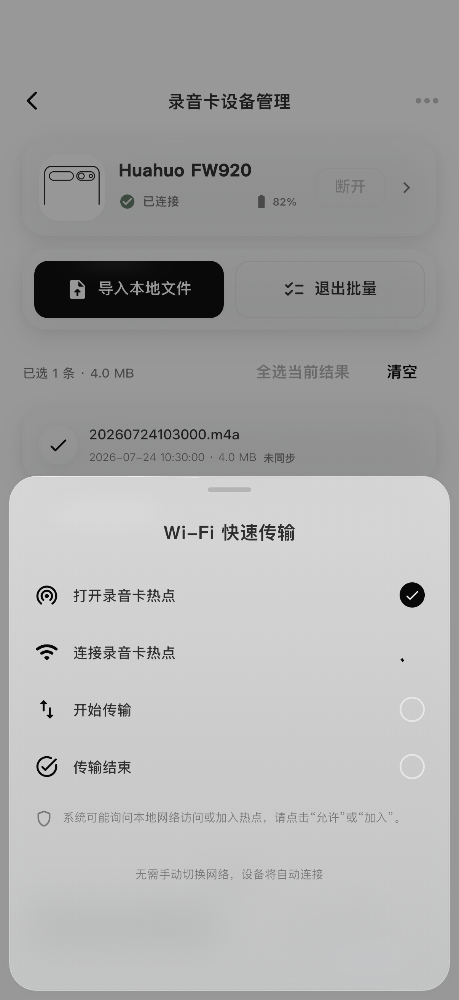

1. 在卡内文件列表进入批量操作并选择文件。
2. 点击“Wi-Fi 下载”。
3. **打开录音卡热点**：保持蓝牙控制连接，等待热点准备完成。
4. **连接录音卡热点**：系统询问本地网络或加入热点时点击允许。
5. **开始传输**：保持应用在前台，不要手动切换其他 Wi-Fi。
6. **传输结束**：逐项完成文件校验后关闭面板。
7. 到本地列表检查文件是否可以播放。

中断后可以恢复或只重试失败项；已经校验成功的文件不应重复下载。

### 12.6 自动处理设置

设备管理右上角三点菜单提供自动处理开关、同步状态和失败重试。修改开关后观察状态提示，设备离线时不要把本地开关变化当作硬件已执行。

### 12.7 设备详情与解除绑定

设备详情显示设备名称、连接状态、容量、型号和固件等信息。

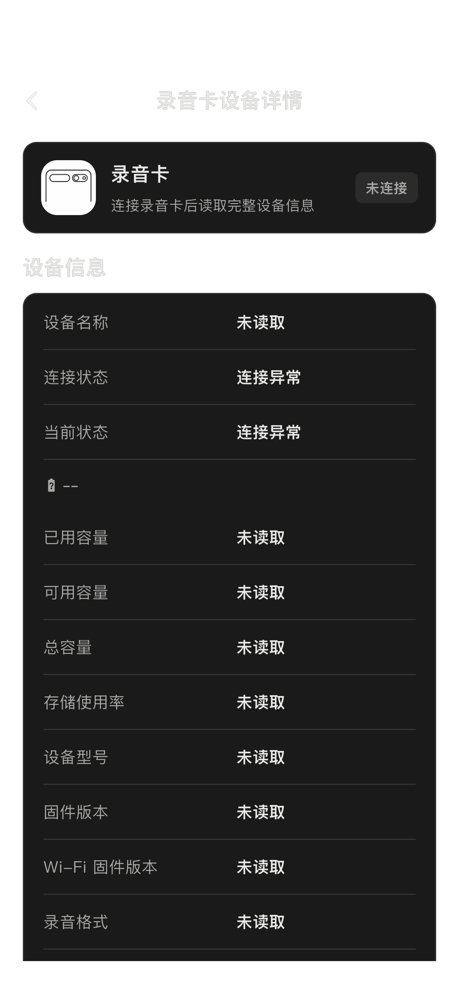

解除绑定通常需要多次确认：

1. 打开设备详情。
2. 找到解除本机设备绑定。
3. 阅读影响范围。
4. 完成最后确认。

不要在录音、传输或校验进行中解除绑定。

---

## 13. 我的与活动日历

### 13.1 我的侧边面板


面板从上到下包括：

1. 个人资料
2. 当前等级
3. 资产新增
4. 录音卡
5. 深度定位
6. 外部世界
7. 我的资产
8. 会员与额度
9. 花火商学院
10. 帮助与反馈
11. 设置
12. 退出登录

### 13.2 等级

等级卡只用于展示，不可点击。首次定位、进一步定位和有效沉淀数量共同影响成长阶段。沉淀数量增加后没有变化时，检查内容是否仍有效以及定位阶段是否完成。

### 13.3 资产新增与日历

点击“资产新增”进入活动日历。

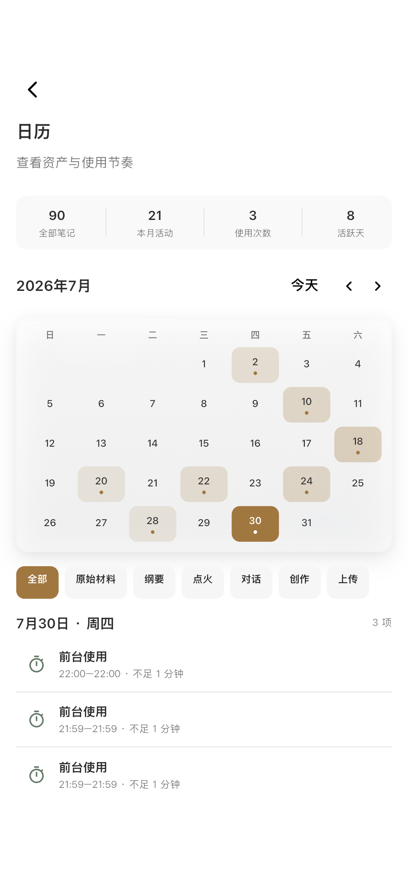

1. 点击日期查看当日内容。
2. 点击“今天”回到当前日期。
3. 使用内容类型筛选。
4. 在当日时间流查看使用记录和内容活动。
5. 使用周/月切换观察统计范围。

切换统计范围不会删除资产。

### 13.4 个人资料

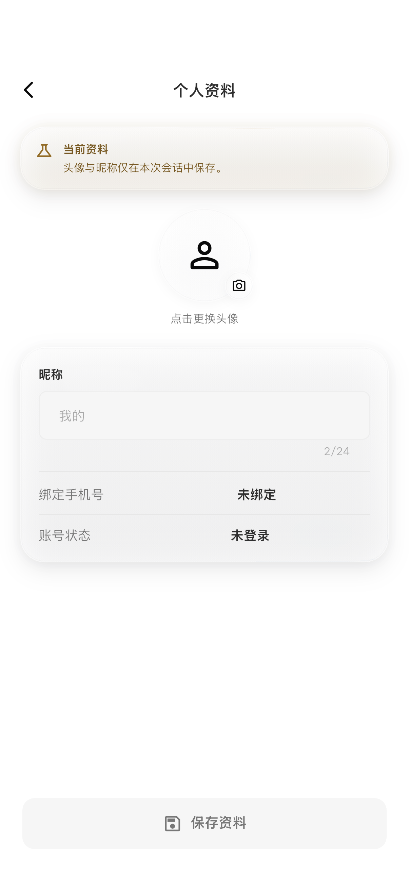

点击头像与昵称进入个人资料。手机号以脱敏形式显示。修改后以页面明确的保存结果为准。

### 13.5 会员与额度

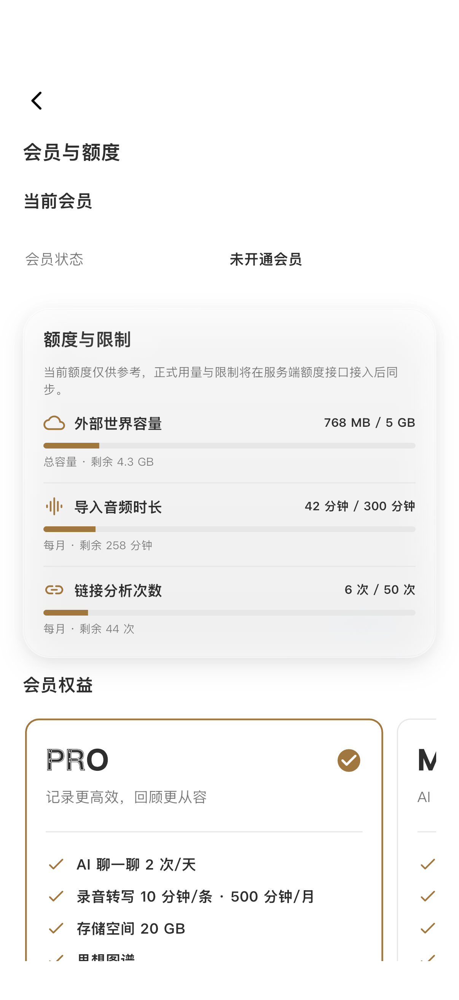

1. 查看当前会员和额度。
2. 横向选择 PRO 或 MAX 权益。
3. 选择计费周期。
4. 阅读会员服务和自动续费协议。
5. 勾选协议后再继续。

只有页面明确显示支付成功和会员状态更新，才表示操作完成。

### 13.6 退出登录

点击“退出登录”，在确认框中再次确认。退出后需要重新登录；账号数据、草稿和历史按账号隔离。

---

## 14. 设置与账号

### 14.1 设置首页

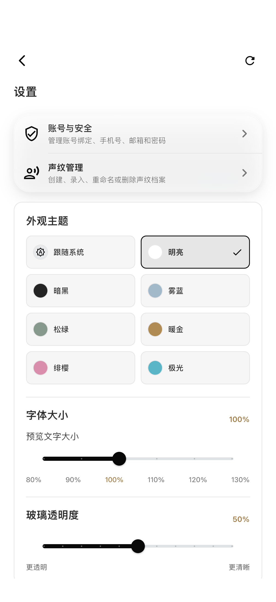

入口为“我的 > 设置”。设置包括外观、字号、玻璃透明度、回收站、代表作、账号与安全、声纹、设备权限和版本。

### 14.2 外观主题

选择系统、明亮、深色或其他配色预设。切换立即预览并按账号保存。

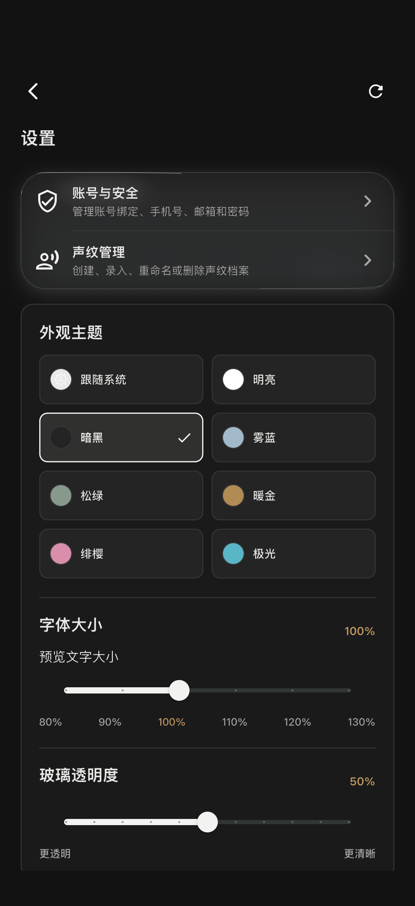

### 14.3 字体大小

字号提供 80%、90%、100%、110%、120% 和 130% 六档。拖动后检查长标题、按钮和正文是否完整；100% 为应用默认大小，仍会叠加系统辅助字号。

### 14.4 玻璃透明度

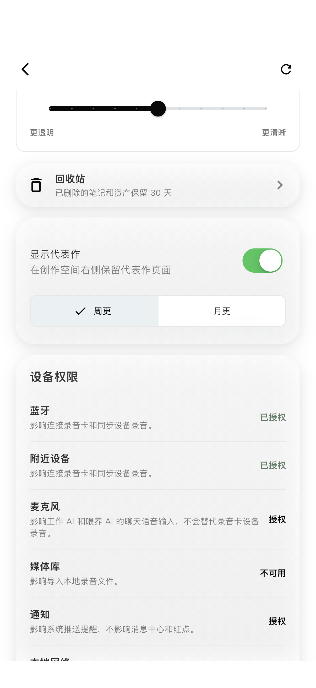

透明度范围为 0%-100%，默认 50%。调节后顶部工具、卡片、消息入口、聊天入口和底部 Dock 使用同一透明度基准。

### 14.5 回收站

1. 进入“回收站”。
2. 点击“恢复”还原内容及相关文件夹、标签和关联。
3. 点击“永久删除”并再次确认后不可恢复。
4. “清空回收站”会删除全部可见项目。

普通删除的支持项目保留 30 天。

### 14.6 代表作设置

- “显示代表作”控制首页是否保留代表作页面。
- 更新频率可选择每周或每月。
- 关闭时若正位于代表作，应用会返回创作空间。

### 14.7 账号与安全

账号与安全提供微信绑定、手机号换绑、邮箱绑定和密码修改。涉及验证码、密码或绑定变更时，按对话框完成二次确认，不要在反馈中填写验证码或密码。

### 14.8 版本检查与介绍

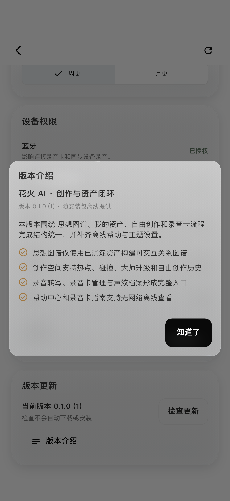

设置页显示当前版本并提供版本检查和离线版本介绍。只有系统实际完成下载或安装后，才能认为应用已经更新。

### 14.9 帮助与反馈

帮助中心无需登录即可阅读。反馈问题时填写发生时间、操作步骤、页面提示和安全错误码，不要提交令牌、验证码、无线密码、完整手机号或应用私有路径。

---

## 15. 声纹管理

入口为“我的 > 设置 > 声纹管理”。

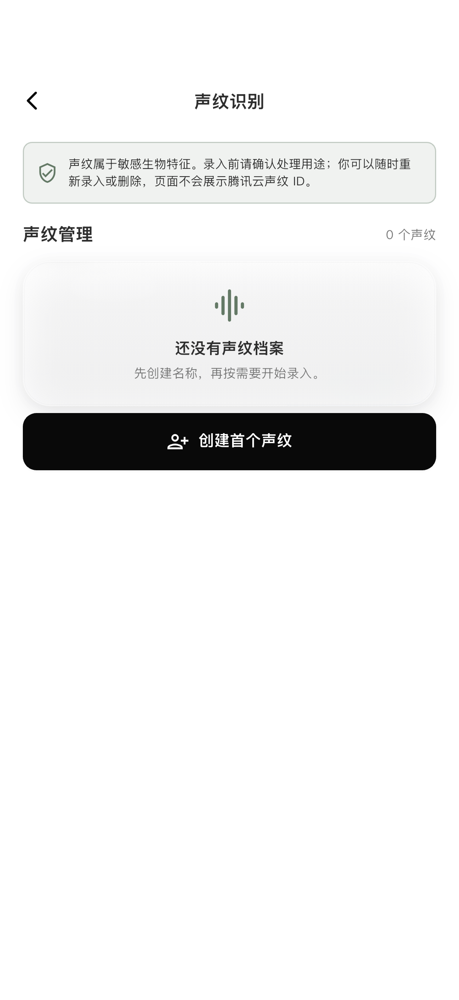

### 15.1 创建档案

1. 点击新建档案。
2. 输入说话人名称。
3. 确认后返回档案列表。
4. 再选择录入，不会在新建时自动开启麦克风。

同一账号内不要使用完全相同的档案名称。

### 15.2 录入声纹

1. 点击目标档案的录入操作。
2. 阅读敏感生物特征说明并明确同意。
3. 允许麦克风权限。
4. 在安静环境中按固定文本自然朗读。
5. 连续朗读约 20-30 秒。
6. 观察波形、时长和录入状态。
7. 停止并提交，等待页面明确显示成功。

### 15.3 管理档案

- 重命名：只修改显示名称。
- 重新录入：更新当前档案样本，不新建同名档案。
- 删除：确认后不再用于新的声纹匹配。

### 15.4 识别边界

声纹只用于辅助识别。只有明确匹配时才显示档案名称；未确认、分数不足或服务异常时保持匿名，不能把声纹结果作为绝对身份认证。

---

## 16. 代表作

代表作页面可在设置中显示或隐藏。未达到开放条件时会显示锁定说明。

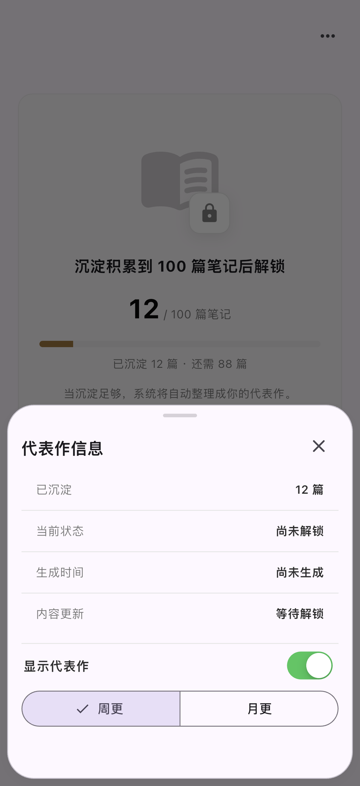

### 16.1 解锁前

1. 点击代表作右上角更多操作。
2. 查看解锁条件和当前沉淀进度。
3. 返回思想图谱继续沉淀有效内容。

### 16.2 查看与编辑

开放后可以阅读代表作，长按或使用可见编辑入口修改内容。编辑后保存，以页面保存成功提示为准。

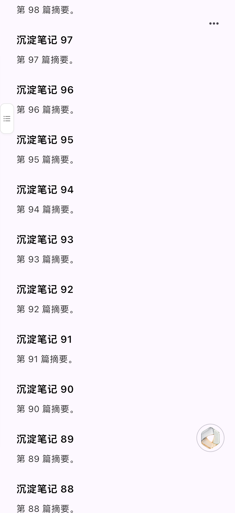

### 16.3 代表作聊一聊

点击代表作页面的 AI 标记进入聊天。该入口会携带当前代表作全文，适合讨论结构、表达和继续修改；发送前仍应检查是否包含不希望提交的敏感内容。

---

## 17. 消息与后台任务

思想图谱右侧铃铛打开消息浮层，完整消息页用于查看待处理任务。

常见消息包括：

- 聚合内容生成中
- 聚合完成
- 上传或转写状态
- 后台任务失败及重试操作

操作原则：

1. 点击消息查看详情。
2. 完成消息可打开对应内容。
3. 失败消息按页面提供的操作重试。
4. “一键清除”只处理当前消息，不等同于取消任务。
5. 清除生成中消息后，任务完成时仍可能再次出现完成消息。

---

## 18. 常见问题

### 18.1 无法登录

- 确认手机号和验证码栏输入的是数字。
- 当前页面为数字登录模式，不会发送短信。
- 确认已勾选用户协议和隐私政策。
- 仍失败时检查网络并记录页面错误提示。

### 18.2 找不到刚创建的内容

- 保存不等于沉淀。
- 到内容详情执行“沉淀到我的资产”。
- 确认页面显示“已沉淀”。
- 回到图谱重新搜索。

### 18.3 外部文章不能沉淀

- 先订阅文章所属频道。
- 确认文章仍可访问。
- 已沉淀文章按钮会锁定为“已沉淀”，不需要重复操作。

### 18.4 聚合按钮不可用

- 至少需要 4 条可用已沉淀资产。
- 清除搜索或筛选后重试。
- 查看消息中是否已有聚合任务运行。

### 18.5 录音没有实时文字

- 实时文字依赖网络和语音服务，但本地录音可以独立保存。
- 检查麦克风权限和录音状态。
- 停止后确认本地文件，再尝试正式上传和转写。
- 不要因为没有预览文字而删除原录音。

### 18.6 转写失败

- 检查文件是否完整且有有效声音。
- 检查格式、大小和网络。
- 保留原音频并重试。
- 记录安全错误码，不要提交私有路径或账号凭证。

### 18.7 录音卡无法连接

- 确认设备开机并有电。
- 确认没有被其他手机占用。
- 开启蓝牙和附近设备权限。
- 关闭再打开录音卡后刷新状态。
- 等待上一个命令完成，不要连续快速点击多个控制按钮。

### 18.8 Wi-Fi 传输失败

- 保持蓝牙连接。
- 允许本地网络和加入热点权限。
- 确认手机没有自动切回其他 Wi-Fi。
- 保持应用在前台。
- 使用恢复或只重试失败项。

### 18.9 草稿没有自动保存

- 查看编辑器底部是否显示自动保存失败。
- 点击重试。
- 使用右上角“保存”进行显式保存。
- 保存成功前不要选择“放弃并退出”。

### 18.10 AI 建议覆盖了错误范围

正常情况下，AI 建议必须经过预览和接受才写入正文。正文或选区变化后旧建议会过期。如果范围不正确，拒绝建议，重新选择目标文字后再次发起。

### 18.11 删除后如何恢复

进入“我的 > 设置 > 回收站”，选择目标内容并点击恢复。永久删除或清空回收站后不能恢复。

### 18.12 提交问题时需要提供什么

建议提供：

- 发生时间
- 手机和系统版本
- 应用版本
- 操作入口与完整步骤
- 页面显示的安全错误码
- 不包含敏感信息的截图

不要提供：验证码、密码、访问令牌、无线密码、完整手机号、声纹音频或应用私有文件路径。

---

## 附录 A：常用入口速查

| 要完成的操作 | 最短入口 |
| --- | --- |
| 新建笔记 | 思想图谱 > 文字 |
| 独白录音 | 思想图谱 > 独白 |
| 会议录音 | 思想图谱 > + > 外录 |
| 系统内录 | 思想图谱 > + > 内录 |
| 导入网页 | 思想图谱 > + > 链接 |
| 导入文件 | 思想图谱 > + > 导入 |
| 普通聊天 | 思想图谱左下角 AI 标记 |
| 图谱聚合 | 思想图谱右侧聚合图标 |
| 自由创作 | 创作空间 > 开始自由创作 |
| 外部世界 | 我的 > 外部世界 |
| 我的资产 | 我的 > 我的资产 |
| 活动日历 | 我的 > 资产新增 |
| 录音卡管理 | 我的 > 录音卡组件 |
| 声纹管理 | 我的 > 设置 > 声纹管理 |
| 回收站 | 我的 > 设置 > 回收站 |
| 账号与安全 | 我的 > 设置 > 账号与安全 |

## 附录 B：状态判断

进行上传、转写、聚合、生成、传输、同步或保存时，以页面明确状态为准：

- **进行中**：等待完成，不要重复提交。
- **已完成/成功**：可以打开结果或进入下一步。
- **失败**：保留原始材料，按页面提示重试。
- **已取消**：没有继续执行，需要重新发起。
- **已沉淀**：内容已经成为个人资产，可进入思想图谱。
- **已同步**：本地副本已经完成并通过校验。

未经页面确认，不要把按钮点击、动画结束或开关变化单独视为任务成功。
