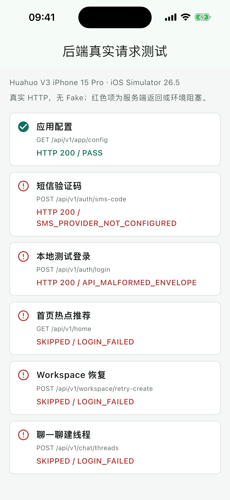
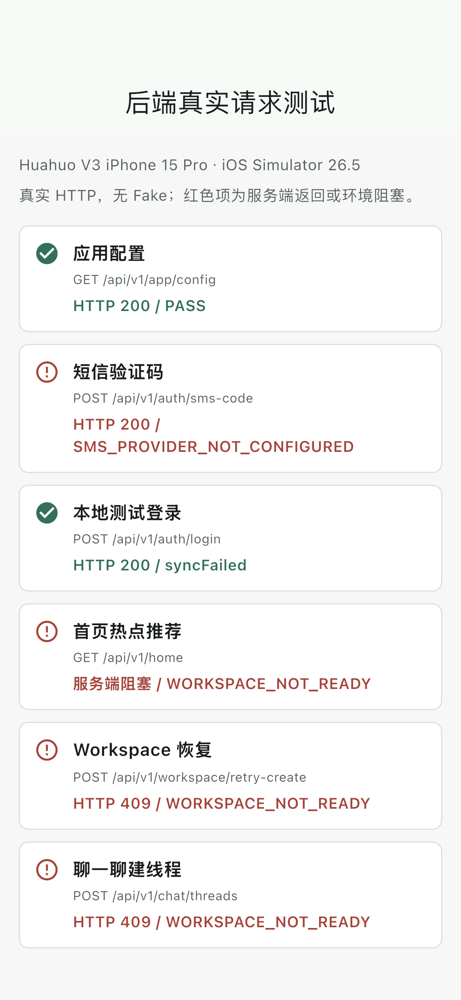
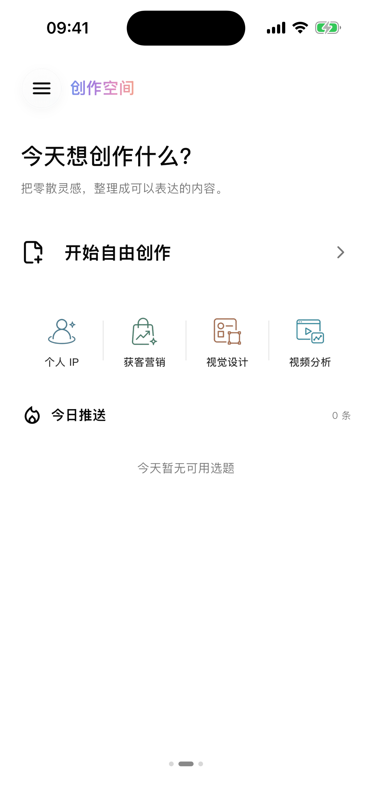
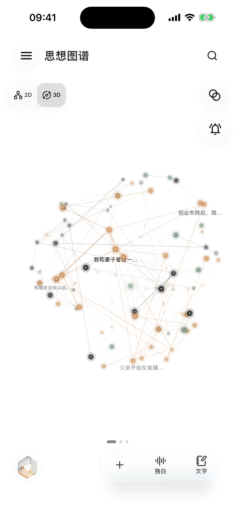
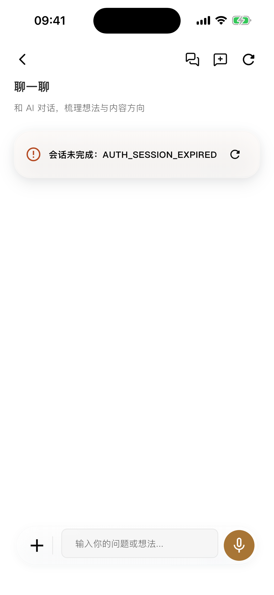
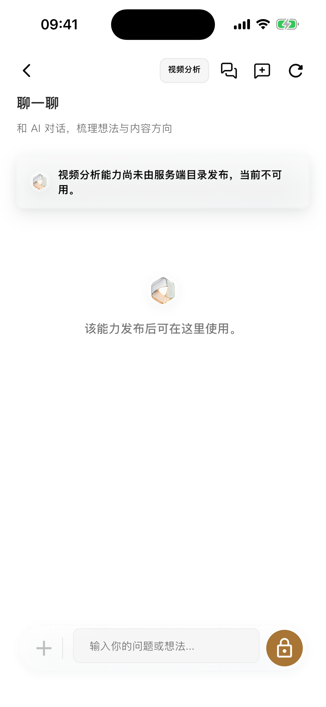
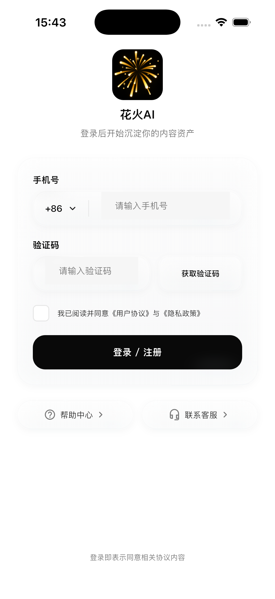
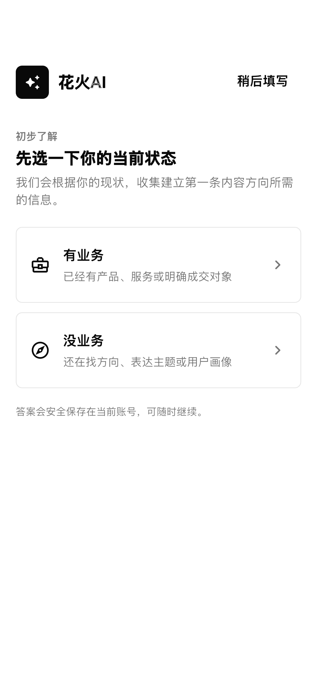
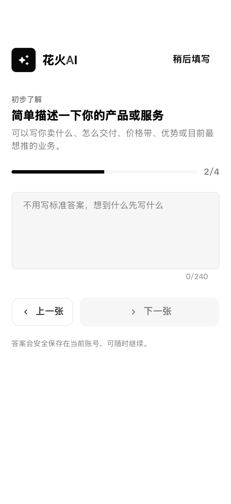
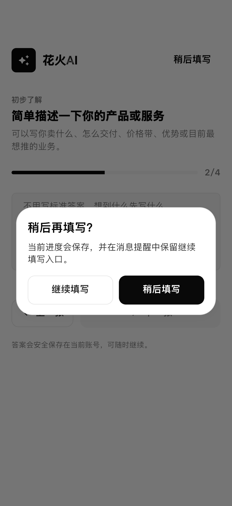

# Mobile/Desktop 后端交互与具体模拟器测试报告

## 1. 验收信息

- 测试日期：2026-08-01
- APP 当前 HEAD：`9fb4fcaa877c`，分支 `Flutter-Desk-Mobile`
- Docs 权威基线：`97e510c8b7e2a2e33cc4bbf809fa666e26983bd3`
- 本地 Backend：`cbe4f87`，只读联调，未修改服务端代码
- Flutter：`3.44.5` / Dart `3.12.2`；低于最终指定的 Flutter `3.44.6`
- 具体设备：`Huahuo V3 iPhone 15 Pro`
- UDID：`3E40E1D7-D9BC-4589-AC84-974C03A0CCAF`
- 系统：iOS Simulator 26.5
- 联调地址：`http://127.0.0.1:18080`，本机临时 Backend，不是生产环境

## 2. 最终结论

当前 Mobile 客户端中已发现的登录解析、热点未接线、Chat 旧 scene 路由和旧消息请求形状问题均已修复，
相关自动化测试全部通过。客户端没有调用被禁止的 Work AI/Feed AI 五个端点。

但“热点推荐”和“聊一聊”尚未在真实后端端到端恢复：本地 Backend 登录后把新用户 Workspace 标记为
`sync_failed`，Home、Workspace retry 和 Chat 均被认证守卫返回 `WORKSPACE_NOT_READY`。其中 retry
入口本身也无法穿过该守卫，客户端没有可用的自恢复路径。这是服务端问题，本轮按要求只记录，不修改
Backend。

## 3. 模拟器真实 HTTP 结果

探针使用生产 `HttpApiTransport`、`AuthApi`、`ApiClient`、Home 热点仓库、Workspace 合同和 `ChatApi`；
无 Fake Transport、无 Mock 成功、无 Token 输出。

| 顺序 | 操作 | 模拟器结果 | 判定 |
| ---: | --- | --- | --- |
| 1 | `GET /api/v1/app/config` | HTTP 200 | PASS |
| 2 | `POST /api/v1/auth/sms-code` | HTTP 200，业务结果 `SMS_PROVIDER_NOT_CONFIGURED` | 服务端环境阻塞 |
| 3 | `POST /api/v1/auth/login` | HTTP 200，`workspaceStatus=sync_failed` | 登录解析已修复；Workspace 服务端失败 |
| 4 | `GET /api/v1/home` | `WORKSPACE_NOT_READY` | 服务端阻塞，热点未恢复 |
| 5 | `POST /api/v1/workspace/retry-create` | HTTP 409 `WORKSPACE_NOT_READY` | 服务端恢复入口不可达 |
| 6 | `POST /api/v1/chat/threads` | HTTP 409 `WORKSPACE_NOT_READY` | 服务端阻塞，对话未建立 |

修复前，服务端登录虽然是 HTTP 200，Mobile 因 `user.phoneHash` 与 `phoneMasked` 字段差异返回
`API_MALFORMED_ENVELOPE`：

修复后，Mobile 能安全解析登录，只把严格 64 位哈希投影为 `前4位***后4位`，不保存或展示完整哈希；
其余失败准确显示服务端错误：

## 4. 热点推荐专项

### 客户端

- 已将 `GET /api/v1/home` 加入正式 EndpointCatalog，能力分类为 `BackendCapability.app`。
- 应用 bootstrap 现在注入真实 `ApiHotspotNoteRepository`，不再固定使用 unavailable repository。
- Home `hotspotSuggestion` 只映射公开、限长字段；忽略路径、对象 key、Prompt 和未知字段。
- 空 suggestion 是成功空列表；损坏响应是 `API_RESPONSE_INVALID`；后端错误码原样透传。
- `GET /home` 已在 190 项 Manifest 中标记为 `wiredMobile`。
- `POST /home/.../viewed` 尚无可见消费动作，保持 `contractOnly`，没有虚报接入。

### 服务端

- `TestHomeAggregationIncludesTasksHotspotFilesAndQuota`：PASS。
- `TestHotspotViewedIsIdempotent`：PASS。
- 说明 Home 聚合和已读幂等逻辑在“已就绪 Workspace”测试夹具下有效。
- 真实模拟器账号无法进入已就绪 Workspace，因此没有拿到活动热点；不能判定“热点已恢复”。

## 5. “聊一聊”专项

### 客户端已修复

- 新建线程不发送 `scene`；服务端旧 `work_ai/feed_ai` 仅作历史 provenance，不再过滤或拒绝本地会话。
- list/create/detail/message 的旧 scene 会适配到当前本地 UI 分区，避免后续
  `CHAT_THREAD_SCENE_MISMATCH`。
- 文本消息按 Docs API 19 发送规范 `input.content[]`，不再发送旧顶层 `content`。
- 不发送 Work/Feed scene、`taskType`、内部 Agent 名、Prompt、Token、本地路径或旧
  `huahuo.chat-context.v1`。
- Chat API、Controller、页面合计 37 项测试全部通过。

### 服务端仍有问题

- 三个 Chat 建线程/Workspace ownership 集成用例通过。
- `TestChatMessagePersistsActiveMetaWorkspaceTaskRunAndPlanningQueue` 失败：HTTP 422
  `META_WORKSPACE_UNAVAILABLE`。
- 当前 Backend `SendTextMessageRequest` 仍只声明旧顶层 `content`，而固定 Docs API 19 要求
  `input.content[]`；Workspace 修复后还需要服务端升级 wire contract。
- Backend 新线程未传 scene 时仍默认 `work_ai`。Docs 规定 scene 只能是历史展示信息，不能作路由键；
  Mobile 已做兼容，但服务端仍应收敛。
- 所以“聊一聊”目前不能判定正常：真实建线程被 409 阻塞，服务端消息集成测试又有 422。

## 6. 服务端问题清单

| 级别 | 问题 | 证据/影响 | 本轮处理 |
| --- | --- | --- | --- |
| P1 | Workspace bootstrap 缺少可用 Meta/模板环境 | 登录返回 `sync_failed`，Home/Chat 全部 409 | 记录，不改 Backend |
| P1 | Workspace retry 被 ready-workspace 认证守卫拦截 | identity-only Token 无法调用恢复入口 | 记录，不改 Backend |
| P1 | Chat 消息 Meta Workspace 不可用 | 后端集成测试稳定返回 422 | 记录，不改 Backend |
| P1 | Chat wire contract 落后固定 Docs | Backend 仍接旧 `content`，Mobile 已改 `input.content[]` | 记录，不回退客户端 |
| P2 | SMS Provider 未配置 | 获取验证码 HTTP 200 但业务失败 | 记录环境缺失 |
| P2 | App config 宣布禁区能力开启 | `workAiEnabled/feedAiEnabled=true`，与客户端禁区策略冲突 | 客户端继续零调用，服务端待修 |

## 7. 本地修复清单

| 修复 | 结果 |
| --- | --- |
| Debug 未配置 API 时静默访问固定公网 HTTP | 改为明确 unavailable transport |
| 未发布视频分析/深度定位显示为已启用 | 改为明确不可用，不加载 Chat、不伪造报告 |
| Home 热点仓库永远 unavailable | 接入真实 `/api/v1/home` 并补安全映射 |
| 登录成功 Envelope 因 `phoneHash` 被拒绝 | 增加严格、安全、不可逆的遮罩兼容解析 |
| Chat 把历史 scene 当路由键 | 改为本地兼容投影，不出站、不拒绝 |
| Chat 文本仍发送旧 `content` | 改为 Docs API 19 `input.content[]` |
| iOS 验收临时 JPush 桩与 Pods | 验收后全部清除，正式 podspec 和 Xcode 工程 diff 为零 |

## 8. UI 模拟器回归

当前产品流在同一台具体模拟器上 5/5 通过：

1. 个人 IP：选择真实本地资产并进入真实 Chat 页面。
2. 获客营销：选择资产并进入 Chat 页面。
3. 视频分析：未发布时明确不可用，无假报告。
4. 深度定位：未发布时明确不可用。
5. 思想图谱：真实交互式图谱搜索、节点卡和“聊一聊”导航。

上述 Chat 截图证明导航和页面交互可用，不代表后端 Assistant 已回复；真实 Backend 链路以第 3、5 节为准。

## 9. 自动化结果

| 测试层 | 结果 |
| --- | --- |
| Mobile 全量 | 1032 PASS，0 FAIL |
| Mobile 全量 analyze | 0 error，0 warning，175 info；低于 180 基线 |
| Auth 专项 | 12 PASS |
| Chat API/Controller/Page | 37 PASS |
| Home 热点仓库 + 工作台 | 9 PASS |
| 共享 `huahuo_api` | 29 PASS |
| API 逐操作审计 | 190 PASS，0 FAIL |
| SCM | 613 active files，PASS |
| iOS 真实 HTTP 探针 | PASS；业务阻塞已如实记录 |
| Backend Home 精确集成 | 2 PASS |
| Backend Chat 精确集成 | 3 PASS，1 FAIL (`META_WORKSPACE_UNAVAILABLE`) |

## 10. 禁区核查

以下五个端点未进入运行时 EndpointCatalog，参数化测试确认在 Transport 前返回
`API_ENDPOINT_PROHIBITED`：

1. `GET /api/v1/work-ai/topic-generation/options`
2. `GET /api/v1/work-ai/material-candidates`
3. `POST /api/v1/work-ai/topic-generations`
4. `GET /api/v1/feed-ai/messages/{messageId}/deposit-summary`
5. `POST /api/v1/feed-ai/messages/{messageId}/retry-deposit`

本次模拟器和 curl 联调均未调用这五个端点。

## 11. 验收判定

- 客户端后端接线质量：本轮发现的问题已修复，自动化通过。
- 热点推荐客户端接入：完成；真实数据效果被 Backend Workspace 阻塞。
- “聊一聊”客户端合同：已按 Docs 修复；真实建线程和回复均未通过服务端。
- 服务器问题：已定位并记录，未修改 Backend。
- 当前版本不能标记为“热点和对话全链路恢复”。Backend 至少需要先修复 Workspace bootstrap/retry、
  发布可用 Meta Workspace，并升级 Chat `input.content[]` 合同，再执行同一探针复验。

## 12. Xcode 正式短信登录补充复验

本节是对正式公网环境的补充复验，与第 1 至 11 节的本机 Backend 结果分开记录。

- 具体设备：`iPhone 17 Pro`，iOS Simulator 26.5，UDID
  `DC53F410-8577-4601-BC10-70A7BB931E04`。
- 根因：普通 Xcode Run 生成的 Dart Defines 没有 `HUAHUO_API_BASE_URL`，客户端按 fail-closed
  规则使用不可访问占位地址并显示“登录服务未配置，请联系开发人员”。这是客户端构建配置问题。
- 修复：Runner Scheme 的正式构建预处理默认注入已验证的 `https://chuda.cc`；允许通过
  `HUAHUO_API_BASE_URL` 覆盖其他环境，但拒绝非 HTTPS 地址。测试目标显式绕过逻辑保持不变。
- 配置证明：先用 Flutter 生成不含 API define 的配置，再执行 `Runner.xcworkspace` 构建；构建成功，
  随后的 `Generated.xcconfig` 和 `flutter_export_environment.sh` 均包含
  `HUAHUO_API_BASE_URL=https://chuda.cc` 的 Base64 define。
- 网络证明：`GET https://chuda.cc/api/v1/app/config` 为 HTTP 200、TLS 校验结果 0；
  `POST /api/v1/auth/sms-code` 使用空请求体进行无发送探测，服务端返回 HTTP 200 和业务错误
  `SMS_PHONE_INVALID`，证明正式短信路由可达且没有误发验证码。
- Provider 证明：`GET /readyz` 当前整体为 HTTP 503，阻塞项属于账户额度、SSE admission 和运行容量；
  其中 provider 子检查为 `ok`，`available.sms=1`，且没有缺失 purpose 或 secret。
- 未覆盖：没有用户授权的接收号码，因此本次不触发真实短信；运营商投递和验证码登录仍需用户在这版
  App 中输入自己的手机号完成一次真机或模拟器人工验收。

Xcode 工作区 Debug 模拟器构建通过。剩余警告是 `QCloudRealTime`、`VoiceCommon` Pod 的 iOS 9.0
部署目标和 `objective_c` code asset 命名不一致，与登录请求无关。

补充回归结果：Auth、Bootstrap、Provider、登录 UI 共 62 项测试全部通过；SCM 检查通过，覆盖
620 个 active files；Scheme XML 和 `git diff --check` 均通过。

## 13. 冷启动初步了解与延期提醒补充验收

原“创建第一条内容线”八字段页面已替换为 `archive/snapshots/agent-0008-cold-start-card` 风格的分步卡片：先选择
`有业务` 或 `没业务`，分别进入四题和七题路径，支持单选、多选、文本、上一步、下一步、进度和失败重试。

- 继续使用正式 `POST /api/v1/onboarding/creative-positioning`，没有迁入参考工程的旧 Feed AI
  聊天请求，也没有新增未记录的 wire 字段。
- 草稿和当前题目按账号摘要隔离保存在本地；损坏、未来版本、非法类型和非法时间戳均失败关闭。
- `稍后填写` 只延期本地路由，不修改服务端 `onboardingRequired`，首次登录可以进入主软件。
- 延期后，消息中心和思想图谱悬浮消息角标投影一条 `完善初步了解`；点击可继续同一份草稿。
- 该提醒可以标记已读，但没有 `处理完成`，也不参与一键清除。只有服务端确认 active、default、
  non-placeholder 的首条定位后，Session 和本地草稿同时完成，提醒才消失。
- 已删除替换后不可达的旧 `V3DeepPositioningForm`；深度定位页面本身不依赖该旧组件。

具体模拟器仍为 `iPhone 17 Pro` / iOS 26.5 / UDID
`DC53F410-8577-4601-BC10-70A7BB931E04`。专用集成测试实际完成模式选择、下一步、延期确认和提醒渲染，
不请求 Backend、不伪造 onboarding 成功。

验收结果：相关状态/页面/路由/消息测试 34 PASS；Mobile 全量 1049 PASS；iOS 模拟器集成流程 PASS，生成 4 张截图；
analyze 为 0 error、0 warning、174 info；SCM 621 active files PASS；Dart reachability 246/246。

## 14. 录音独立公网地址与聊一聊显示补充验收

### 14.1 录音服务地址

- 主登录、短信、文本 Chat 等业务 API 继续使用 `https://chuda.cc`。
- 录音元数据、ASR、录音文件的上传令牌/完成请求，以及聊一聊语音文件上传，使用独立
  `HUAHUO_RECORDING_API_BASE_URL`；默认值固定为 `http://101.201.70.18`。
- 对象存储上传 URL 仍使用服务端签发值，客户端不改写主机、路径、签名或 Header。
- 公网无凭据探测：`GET /api/v1/app/config` 返回 HTTP 200；`GET /api/v1/recordings`、
  `GET /api/v1/recording-card/files` 和 `GET /api/v1/asr-tasks/test` 返回 HTTP 401，证明录音路由
  存在并受认证保护。`101.201.70.18:18080` 连接超时，443 端口拒绝连接，因此本轮采用 80 端口。
- Android 网络策略默认拒绝明文，只对白名单 `101.201.70.18` 放行；旧地址
  `39.107.250.25` 已移除。iOS 产物已包含 ATS 临时兼容配置，Dart 运行时仍拒绝其他 HTTP
  主机、非 80 端口、路径前缀、凭据、查询和片段。

安全说明：录音服务当前没有 HTTPS，认证 Header 和录音元数据经过 HTTP 传输。这是服务端基础设施
限制，不是最终安全状态；服务端提供可验证的 HTTPS 域名后，应立即删除 iOS ATS 兼容和 Android
明文白名单，并通过 `HUAHUO_RECORDING_API_BASE_URL` 切换。

### 14.2 聊一聊时间与历史名称

- API 保留 `createdAt`、`created_at`、`sentAt`、`sent_at` 或 `timestamp` 中合法的 ISO-8601
  时间。用户发送消息优先显示服务端时间，缺失时使用实际本地发送时刻；助手回复缺失服务端时间时，
  使用该响应实际到达客户端的时刻。
- 每个用户气泡显示“发送于…”，每个助手气泡显示“回复于…”；旧历史确实没有时间时明确显示
  “发送时间未知/回复时间未知”，不编造历史时间。
- 历史会话默认名称的优先级为：用户本机重命名、首条用户消息、服务端标题、未命名兜底。
  首条消息会规范空白并限制为单行 32 字；打开历史列表时，仅对缺少首条摘要的会话后台读取详情，
  不改变当前会话和消息。

### 14.3 验收结果

- 新增行为专项：57 PASS，0 FAIL。
- Mobile 全量：1211 个 `testDone`，最终 `success: true`，0 FAIL。
- Analyze：0 error，0 warning，174 info，未超过 180 基线。
- SCM：622 active files PASS；Dart reachability：246/246；`git diff --check` PASS。
- Android：Debug APK 构建成功，产物为 `build/app/outputs/flutter-apk/app-debug.apk`。
- iOS：Xcode Debug Simulator Runner 构建成功；构建产物确认包含
  `NSAppTransportSecurity -> NSAllowsArbitraryLoads = true`。仅保留 QCloud Pod iOS 9.0
  deployment target 等既有非阻塞警告。

## 15. 关联报告

- 190 项逐操作报告：`../api-integration/latest.md`
- 机器可读报告：`../api-integration/latest.json`
- 接口消费者索引：`../api-integration/API_INTEGRATION_INDEX.md`
- 后端接入矩阵：`../api-integration/BACKEND_INTEGRATION_MATRIX.md`
