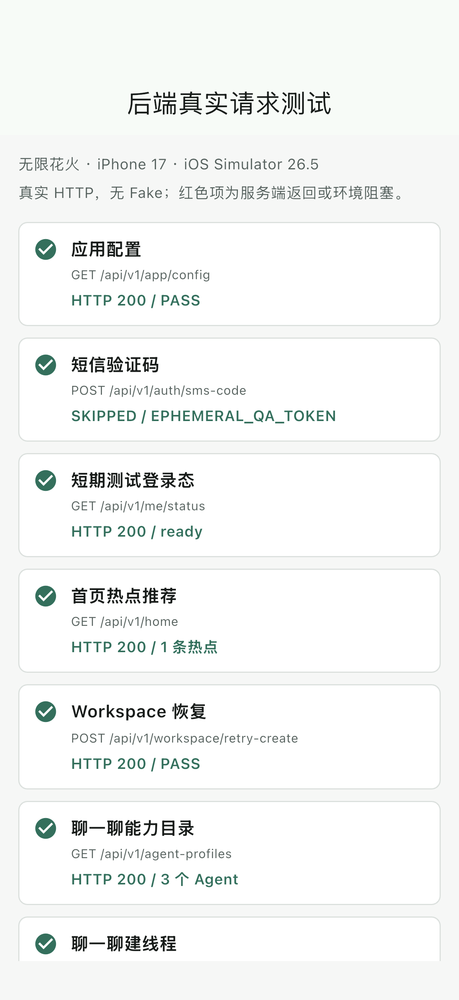
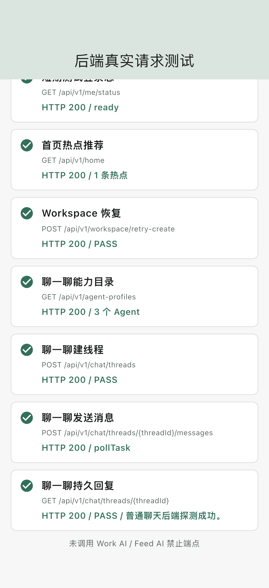
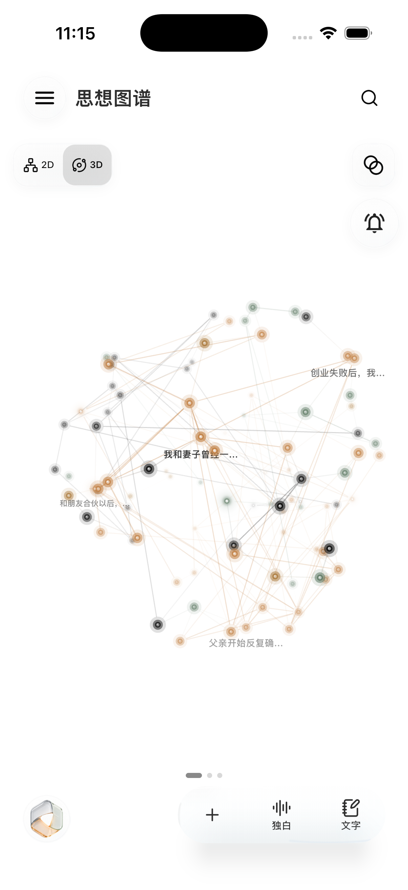
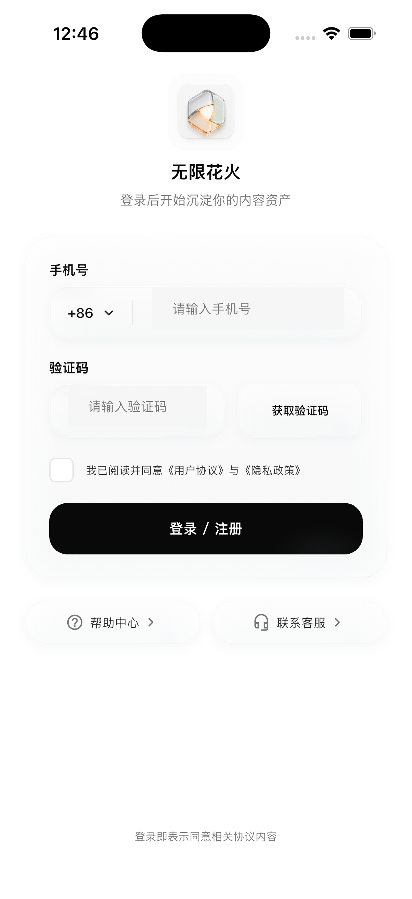

# 无限花火 Mobile 普通聊天接入与真实后端测试报告

## 1. 结论

本轮普通“聊一聊”已按固定 Docs 合同接入，并在具体 iPhone 模拟器上通过真实公网后端端到端测试。

- 普通聊天能力目录：PASS。
- 新建会话：PASS。
- 标准文本消息提交：PASS，服务端返回 `pollTask`。
- 异步处理：PASS，客户端随后从会话详情读取到持久化 Assistant Message。
- 历史会话、首条消息标题和消息时间：现有行为保留，专项测试通过。
- Work AI/Feed AI 五个禁止端点：未调用。
- 本轮发现的客户端合同、异步轮询、历史兼容和账号隔离问题：已修复。
- 后端遗留：`readyz` 仍因 `sseAdmission` 配置返回 503；普通 HTTP Chat 不受该项阻塞。

最终判定：普通文本聊天当前可用；本轮不把语音消息专项、SSE 实时事件或真实短信投递混同为普通文本聊天的成功证据。

## 2. 基线与环境

| 项目 | 值 |
| --- | --- |
| 测试时间 | 2026-08-07 12:46 CST |
| APP 分支 | `Flutter-Desk-Mobile` |
| APP HEAD | `a26b5626569e`，其上为本轮未提交工作树 |
| Docs 权威版本 | `97e510c8b7e2` |
| 主业务后端 | `https://chuda.cc` / 39.107.250.25 |
| 录音后端 | 101.201.70.18，本轮普通文本聊天未调用 |
| 模拟器 | iPhone 17，iOS Simulator 26.5 |
| UDID | `F716FB58-AC2B-4C04-B97B-92EA7876DF13` |
| Flutter | 3.44.5 / Dart 3.12.2，低于最终指定的 3.44.6 一个补丁版本 |

测试使用生产 `HttpApiTransport` 和 APP 自身的 `AuthApi`、`AgentCatalogClient`、`ChatApi`，没有 Fake Transport，也没有 Mock Assistant 回复。认证使用服务端为既有 QA 账号签发的短时 Token；Token 未写入仓库、截图或报告，测试期间未触发短信。

## 3. 阅读的权威文档

本轮以 `/Users/run/huahuoai-docs` 固定 commit 为准，重点核对：

- `05-api/02-endpoint-catalog.md`：活动 Endpoint Catalog。
- `05-api/06-chat-work-feed-api.md`：线程、文本消息、语音消息和历史兼容结构。
- `05-api/19-agent-meta-workspace-and-visual-input-api.md`：Chat/AgentRun 的标准 `input.content[]`、公开选择器和完成语义。
- `05-api/23-agent-skill-model-catalog-api.md`：公开 Agent/Skill/Model Catalog 与安装状态。
- `04-system-facing-design/protocols/agent-skill-catalog-release-protocol.md`：发布和运行时映射边界。

关键合同结论：

1. 新 App 使用顶层 `agentProfileId`，可附带排序去重后的 `skillProfileIds`；不能同时发送兼容字段 `expectedMetaWorkspaceKey`。
2. 消息正文使用有序 `input.content[]`；不得发送内部 Agent、Prompt、Token、本地路径或未同步的整篇正文。
3. Agent 必须来自 API 23 当前用户可见的 selectable Catalog；Skill 必须是该 Agent 的候选且 installation 为 enabled。
4. HTTP 2xx/202 只表示请求已持久接受。只有终态 Run 和持久 Assistant Message 才能对用户显示完成。
5. `voiceMessage` 是标准语音消息响应成员；历史 `scene` 只用于兼容展示，不能继续充当新请求路由键。

## 4. 接入前后端可用性测试

接入前先脱离 APP UI，使用同一公开合同进行最小真实探测：

| 检查 | 结果 |
| --- | --- |
| `GET /healthz` | HTTP 200 |
| `GET /readyz` | HTTP 503，仅 `sseAdmission` 失败 |
| `GET /api/v1/app/config` | HTTP 200 |
| `GET /api/v1/agent-profiles` | HTTP 200，包含 `self_media_creation` |
| `POST /api/v1/chat/threads` | HTTP 200 |
| 标准 `agentProfileId + input.content[]` 消息 | HTTP 200，服务端接受 |
| 再读线程详情 | 读取到持久 Assistant Message |

因此接入前已证明 39 的普通 Chat HTTP 主链可用；`readyz` 的 SSE 配置降级不是本次文本聊天的阻塞原因。

## 5. 客户端问题与修复

| 问题 | 根因 | 修复 |
| --- | --- | --- |
| 普通聊天仍发送 `expectedMetaWorkspaceKey` | 使用已安装旧客户端兼容合同 | 新增 `chat.general -> self_media_creation`，每轮按 API 23 校验并发送 `agentProfileId` |
| 2xx 后只识别 `poll_task` | 未覆盖 API 19 的 AgentRun/持久消息完成语义 | 同时支持 `poll_task`、`poll_agent_run`、嵌套 Run 以及 thread-only polling |
| 2xx 无 assistant 时可能过早显示完成 | 把接受误当成完成 | 保持 sending，轮询线程，直到出现新的持久 Assistant Message |
| 新服务端线程缺少旧 `scene` 时解析失败 | 将历史 provenance 当成必填 wire 字段 | 列表/create/detail 按当前普通聊天 scene 安全投影，显式非法值仍拒绝 |
| 标准语音响应未识别 `voiceMessage` | 只读取旧 `message/userMessage` | 优先解析标准 `voiceMessage`，旧字段继续只读兼容 |
| 语音上传仍标记 `feed_ai_voice` | 遗留 Feed AI 命名 | 改为中性的 `workspace_voice` 和对应幂等键 |
| Voice Controller 可能持有旧账号 ChatController | Provider 使用 `ref.read` 且未观察账号域 | 观察 `authenticatedUserDataScopeProvider` 并 watch ChatController |
| 页面声称本地材料已发送 | Chat API 实际没有上传这些本地正文 | 明确显示“尚未同步，本次仅发送你输入的文字” |
| 新 nextAction 导致两个 UI switch 编译失败 | 枚举扩展后分支不完整 | 补齐普通聊天页和创作画布的 pending 状态 |
| iOS 启动出现 Android 支付 `MissingPluginException` | Billing Controller 无条件同时监听 StoreKit 和 Android EventChannel | 按平台只监听对应购买流，重复启动不重复订阅，流异常 fail closed |

运行时不自动回退 Fake，不伪造 Assistant，不恢复任何 Work AI/Feed AI 禁止请求。

## 6. 接入后具体模拟器测试

在 iPhone 17 模拟器重新编译并运行测试包，逐项结果如下：

| 顺序 | 操作 | 真实结果 | 判定 |
| ---: | --- | --- | --- |
| 1 | `GET /api/v1/app/config` | HTTP 200 | PASS |
| 2 | 短信请求 | `SKIPPED / EPHEMERAL_QA_TOKEN` | 按测试安全策略跳过 |
| 3 | `GET /api/v1/me/status` | HTTP 200 / ready | PASS |
| 4 | `GET /api/v1/home` | HTTP 200 / 1 条热点 | PASS |
| 5 | `POST /api/v1/workspace/retry-create` | HTTP 200 | PASS |
| 6 | `GET /api/v1/agent-profiles` | HTTP 200 / 3 个 Agent | PASS |
| 7 | `POST /api/v1/chat/threads` | HTTP 200 | PASS |
| 8 | `POST /api/v1/chat/threads/{threadId}/messages` | HTTP 200 / `pollTask` | PASS，表示已接受 |
| 9 | `GET /api/v1/chat/threads/{threadId}` | HTTP 200，读到“普通聊天后端探测成功。” | PASS，持久回复完成 |

模拟器总览证据：

聊天发送与持久回复证据：

接入前模拟器现有 APP 状态记录：

修复后正式入口重新安装和启动证据（正常手机验证码登录页）：

## 7. 自动化结果

| 测试层 | 结果 |
| --- | --- |
| Workspace `pub get` | PASS |
| 共享 `huahuo_api` analyze | PASS，0 issue |
| 共享 Manifest 专项 | 7 PASS |
| Chat API/Controller/Voice/Page 专项 | 51 PASS |
| Billing 平台事件流专项 | 8 PASS |
| Mobile 全量测试 | 1,080 PASS，0 FAIL |
| Mobile analyze | 0 error、0 warning、176 info；低于 180 条基线 |
| SCM 映射检查 | 639 active files，PASS |
| iPhone 17 公网 integration test | PASS |
| 截图 Driver | 2 张证据写入成功 |
| 修复后正式入口重装/启动 | PASS，支付通道 `MissingPluginException` 未再出现 |
| `git diff --check` | PASS |

专项分支覆盖：普通 Agent 选择、Catalog 失败零消息请求、Agent 不可选、Skill disabled、标准请求体、幂等头、损坏响应、历史缺 scene、`poll_task`、`poll_agent_run`、thread-only polling、标准 `voiceMessage`、失败消息不伪造回复和页面中文错误状态。

## 8. 禁止端点核查

以下五项仍只在审计清单中，未进入运行时 EndpointCatalog；本轮单元、全量与模拟器测试均未调用：

1. `GET /api/v1/work-ai/topic-generation/options`
2. `GET /api/v1/work-ai/material-candidates`
3. `POST /api/v1/work-ai/topic-generations`
4. `GET /api/v1/feed-ai/messages/{messageId}/deposit-summary`
5. `POST /api/v1/feed-ai/messages/{messageId}/retry-deposit`

## 9. 剩余风险

1. 39 的 `/readyz` 仍为 503，唯一失败项为 `sseAdmission`。当前轮询式普通聊天已通过，但 SSE/事件流上线前必须修复并单独验收。
2. iOS 构建提示工程同时保留 CocoaPods 和 Swift Package 集成。现有构建成功，本轮未擅自迁移原生依赖；后续应单独规划迁移，避免与聊天修复混合。
3. 最终指定工具链是 Flutter 3.44.6；本机只有 3.44.5，因此本报告是低一个补丁版本的预验收。3.44.6 到位后需重跑 analyze、全量测试和 iOS build。
4. 本轮真实成功证据覆盖普通文本消息。语音聊天虽然完成合同兼容和单元测试，仍应在麦克风/上传/ASR 专项中另做真机验收。

## 10. 最终判定

普通“聊一聊”从公开 Catalog 选择、线程创建、标准消息提交、服务端异步处理到持久 Assistant Message 回读已经打通。先前客户端依赖兼容 Meta Workspace、异步分支不完整和历史字段过严的问题均已修复；当前没有需要通过修改 39 服务端才能恢复普通文本聊天的阻塞项。
