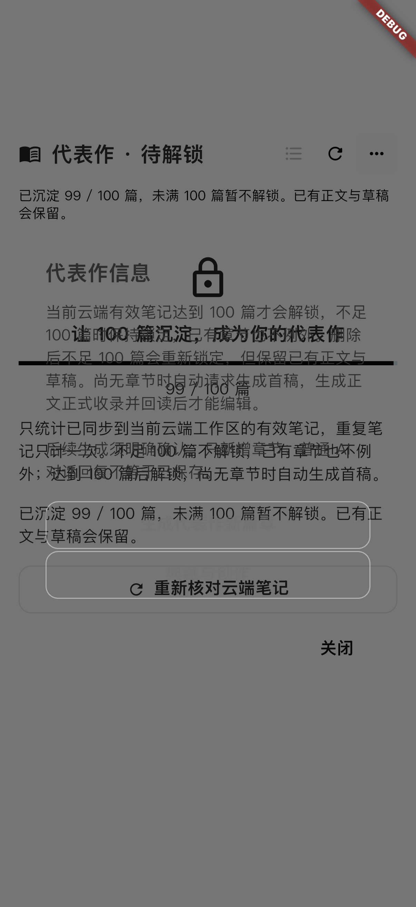
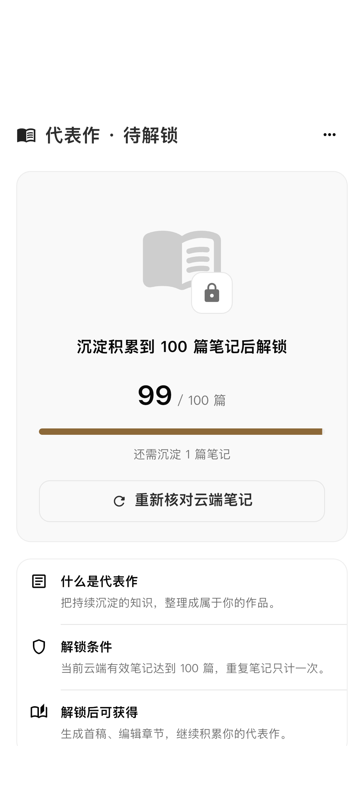
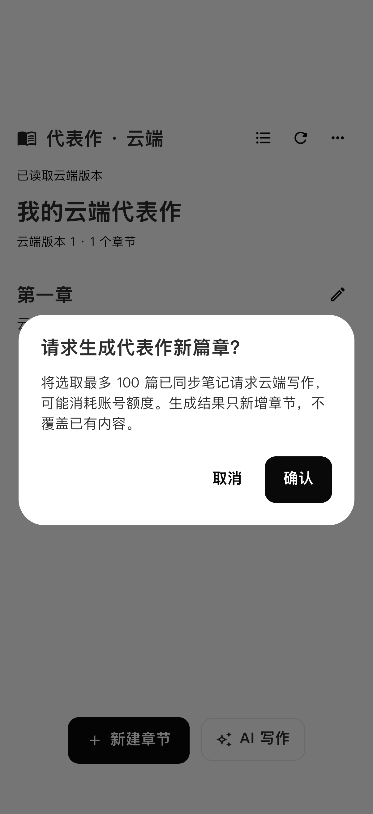

# 代表作锁定页与信息菜单修复记录

## 范围与历史对照

- 仅代表作 Flutter 界面、展示状态和对应测试；定位报告、纲要、链接导入、后端及全局主题不在本轮修改范围内。
- 对照两周前的 `2026-09-08 a3a4a820`，当时已改成云端代表作页面和 AlertDialog。
- 继续追溯到 `2026-09-05 99600b58` 云端重构前的父版本，找到原有书本锁定卡片、大号计数、剩余篇数、说明行和底部信息面板。
- 仅复用上述视觉层次；不恢复历史本地拼接正文、假更新时间或没有后端支撑的周/月自动生成设置。

## 原因与修复

1. 全局 `HuahuoV3Theme` 的 dialogTheme 背景为透明；旧信息菜单直接创建 AlertDialog，没有承载背景，因此标题、文案、按钮与底层页面重叠。该现象已在模拟器截图复现，而不是仅凭代码推测。
2. 信息菜单改用项目现有 `showV3GlassBottomSheet` 和 `V3SheetScaffold`：主题背景、固定标题和关闭入口、受屏幕安全高度约束的滚动区域，状态、说明、操作分组显示。
3. 代表作内目录、历史正文、生成/草稿确认与冲突弹窗显式使用当前主题 surface，避免同一透明背景问题；未改动公共组件或全局主题。
4. 锁定页恢复书本和锁标识、N/100、进度、剩余篇数及三个说明行；去掉重复状态文案和锁定时无效的目录入口，刷新保留在卡片内。
5. 仅当前资格核验成功后展示数值，不把缓存的旧计数伪装为当前进度；信息面板实时跟随资格变化，仍由原有状态机检查实际操作权限。云端正文、草稿和生成任务的保护机制保留。

## 验证与证据边界

- 物理设备：本轮未使用、未读取真机日志。
- Simulator：使用已有 iPhone 17 Pro / iOS 26.5，未创建模拟器。
- 测试注入隔离的 99/100 篇笔记数据，运行真实页面及控制器；没有线上接口请求、付费生成、真实用户数据修改或服务端操作。
- 28 项代表作定向测试通过，包括缓存计数、99→100→99 时已打开菜单的按钮权限、草稿保护、窄屏/横屏 1.6 倍字号、浅色/深色、滚动操作和关闭。
- 模拟器 2 个场景通过：99 篇锁定、100 篇已有章节解锁；打开/关闭菜单，以及打开并取消生成确认。取消后未创建生成意图。
- 6 个相关 Dart 文件静态分析无问题。没有扩大运行全量测试或修改已有 CocoaPods 配置。
- 截图用真实模拟器渲染；页面截图在关闭菜单后采集，避开原生启动屏淡出过渡。这里只验证代表作 UI，不声称完成整条真实云端生成链路。

## 截图

修复前，信息文字与底层页面重叠：

修复后，99 篇时的锁定卡片：

修复后，99 篇时的信息菜单：

100 篇已有章节时，生成与创作入口可用：

生成仍需确认，确认框不再透明：

