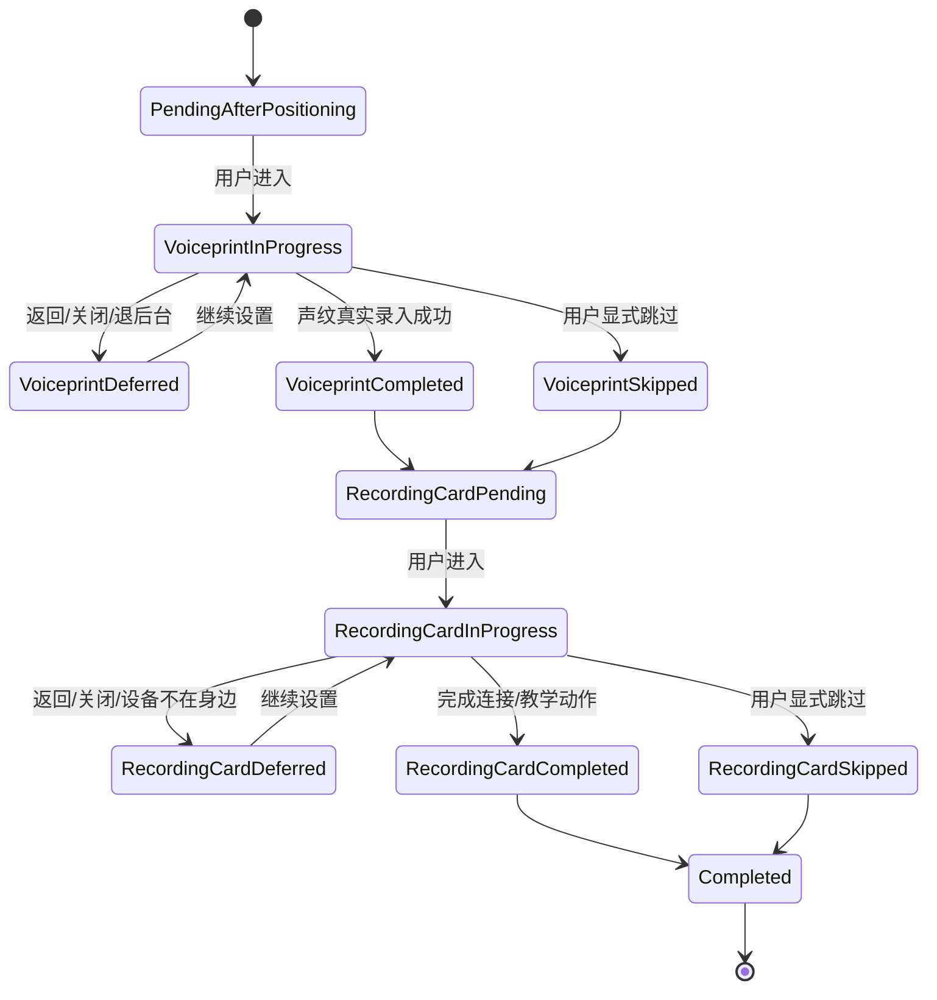

# 花火 Flutter 工程全量状态机、行业规范与可持续迭代审查报告

> 仓库：`Xieyangzai/Flutter`  
> 分支：`main`  
> 审查提交：`71d149c5228d576e99e98c8cfda06f6c19ed27a2`  
> 提交说明：`基本可以发布`  
> 审查日期：2026-09-01  
> 审查重点：用户流程、状态机完整性、跨资源一致性、文件与重命名、取消与恢复、账号隔离、重复能力、内存治理、后续 AI 开发规范  
> 文档用途：修复当前高危缺陷，并作为后续工程重构、SCM 补全、AI 编码和代码审查的长期执行依据

---

# 0. 如何阅读本报告

## 0.1 证据等级

本文使用四类结论，避免把推断写成已确认事实。

| 标记 | 含义 |
|---|---|
| **A：确定性 Bug** | 从当前代码路径可以直接推出错误结果，不依赖后端猜测 |
| **B：高风险设计** | 当前设计违反常见工程约束，在并发、弱网、进程退出或账号切换时很可能出错，需要联调或故障注入验证 |
| **C：可持续性债务** | 当前未必立即出错，但会持续放大维护成本、内存、重建或重复代码 |
| **G：正面样板** | 当前仓库里已经存在、应当复用和推广的成熟实现 |

## 0.2 审查范围

本次不是只看一个页面，而是覆盖了主要生产状态模块和公共基础设施，包括：

- APP 启动、登录恢复、Session、路由和前台恢复；
- 首次启动引导、基础定位、声纹和录音卡；
- 录音、录音卡、会议、独白、内录、实时转写；
- 文件选择、复制、导入、上传、转写、资产生成；
- 文档导入、媒体导入、照片墙、订阅文章；
- Chat、Agent、工作台生成、文档提案、数字孪生；
- 知识库、笔记关系、追加资料、搜索、指标和回收站；
- 通知、Push、会员购买、设置；
- SQLite Worker、写队列、TaskOrchestrator、缓存、文件存储；
- Provider 生命周期、页面级和进程级运行时；
- SCM、质量门、性能门和仓库治理。

本文是覆盖式静态审查和架构审查，不等同于对约 1,000 余个文件逐字逐行的形式化证明。需要通过本文列出的故障注入、真机、进程终止和后端联调测试完成最终验收。

---

# 1. 执行摘要

## 1.1 总体判断

当前工程已经具备较好的性能基础设施，但业务状态机仍普遍存在以下根本问题：

```text
状态很多，但状态边界不完整；
页面状态、业务状态、远程任务状态和清理状态混在一起；
“显示过”被当作“完成”；
“本地不再等待”被当作“远程已取消”；
“一半成功”被压成“整体失败”；
“后端可能已成功但客户端不知道”没有 unknown/reconciling 状态；
显示名称、文件名、存储路径和资源 ID 没有统一定义；
同一种远程任务在多个模块中重复实现；
部分 UI 看起来存在，但实际没有持久化或没有真实执行。
```

这正是用户举出的首次引导问题会发生的原因，而且仓库中存在多处同类问题。

## 1.2 当前发布建议

| 目标 | 建议 |
|---|---|
| 本地开发和功能演示 | 可以继续 |
| 内部测试 | 可以，但必须列出已知缺陷 |
| TestFlight / Android 内测 | 可以在修复首批 P0 后进入 |
| 小范围灰度 | 修复 P0，并完成进程退出、账号切换和弱网测试后 |
| 正式公开发布 | 当前不建议直接全量 |
| 宣称“状态机完整、不会丢任务或丢文件” | 当前证据不足 |

## 1.3 当前最高优先级

正式公开发布前至少要解决：

1. 首次启动引导被页面展示动作错误完成；
2. 回收站录音重新加载后自动复活；
3. 打开说话人标注面板就可能提交标签；
4. 自动把第一个说话人当作“本人”的错误归因；
5. 私有媒体目录没有账号隔离；
6. 自制低位哈希导致文件名碰撞和覆盖；
7. 登录凭据清理失败却进入匿名成功态；
8. 数据库 Worker 写失败可能被静默吞掉；
9. 本地取消与远程任务取消语义不一致；
10. 录音停止失败后，原生录音可能仍在继续；
11. 付款意图、协议接受和商店确认没有完整耐久状态；
12. 仓库根目录敏感凭据及 Secret Scan 范围问题；
13. 内存压力发生一次后，质量可能永久锁在最低档；
14. 永久删除、物理文件和数据库记录缺少事务日志。

---

# 2. 全仓库共性根因

## 2.1 把 UI 状态当作业务状态

大量控制器使用：

```text
idle / loading / ready / failed
```

表示所有事情。

但一个完整功能至少有四种相互独立的状态：

```text
数据状态：是否有数据、是否缓存、是否过期
操作状态：用户当前执行什么命令
业务状态：业务对象真实处于什么阶段
清理状态：临时文件、远程资源、缓存是否完成清理
```

例如声纹录入可能是：

```text
远程声纹：已经成功
本地配置：已经成功
临时录音：删除失败
```

这不是整体 `failed`，而是：

```text
业务结果 = committed
cleanup = pending
```

## 2.2 没有“未知结果”状态

网络超时不等于后端失败。

客户端在提交请求后断网，可能有三种真实情况：

```text
后端没有收到；
后端收到但还没有执行；
后端已经执行成功，只是响应丢失。
```

当前多个模块直接显示 `failed`，用户点击重试后可能产生重复对象、重复扣费、重复上传或重复 Agent 任务。

行业上必须存在：

```text
unknownOutcome
reconciling
accepted
cancelRequested
partialSuccess
cleanupPending
```

## 2.3 本地取消与远程取消混淆

当前多处 `cancel()` 只是：

```text
generation++
停止本地轮询
更新 UI 为 cancelled
```

但远程任务仍继续。

正确语义应区分：

```text
dismissed：页面不再展示，但任务继续；
cancelRequested：已发送取消请求，等待远程确认；
cancelled：服务端明确确认取消；
detached：客户端不再跟踪，但不能声称取消；
completedAfterCancelRequest：取消太晚，任务已经完成。
```

## 2.4 跨资源操作没有耐久意图

很多操作跨越：

```text
本地数据库
本地文件
对象存储
业务 API
后台任务
系统权限
第三方商店
```

但操作意图只保存在内存变量中。

进程在任何两个步骤之间退出，就会形成：

- 已上传但未绑定的资源；
- 已创建但客户端没有 taskId 的任务；
- 文件已经删除但数据库仍存在；
- 云端成功但 UI 显示失败；
- 本地显示成功但磁盘未保存；
- 商店已付款但客户端没有完成确认。

## 2.5 可选生产依赖静默成功

部分控制器使用：

```dart
_repository?.save(...)
return true;
```

当生产依赖为 `null` 时，操作没有执行，却返回成功。

生产环境中依赖缺失只能：

```text
启动失败；
功能明确 unavailable；
或使用明确标记的测试实现。
```

不能使用可选调用制造假成功。

## 2.6 文件身份概念混乱

当前多个模块没有明确区分：

```text
资源 ID
内容哈希
存储对象 ID
APP 私有 URI
物理路径
用户显示名称
导出文件名
原始文件名
```

结果是“重命名”到底改什么不清楚，复制路径也容易碰撞。

## 2.7 多个功能重复实现远程任务

以下功能本质相同：

```text
创建意图
提交后端
获得 taskId
后台运行
轮询或 SSE
取消
恢复
成功后对账
失败后重试
```

但每个模块都写了一套：

- 素材导入；
- 文档导入；
- Agent；
- 工作台生成；
- 文档提案；
- 数字孪生提案；
- Feed 聚合；
- Chat Run；
- 录音转写与纲要；
- 声纹处理。

这些重复实现导致状态命名、取消、重试、恢复和错误码互不一致。

## 2.8 无上限集合和全量扫描

典型风险包括：

- 二进制图片缓存没有字节上限；
- 已完成操作 ID 永久保留；
- Push 去重集合没有账号和容量边界；
- 任务记录没有终态保留策略；
- 每次状态变化重新扫描全部知识库；
- 每次输入重新排序全部数据；
- 长会话每次构建遍历全部消息；
- 实时转写每个句子事件重新复制和排序全部句子。

---

# 3. P0：必须优先修复的确定性问题

# P0-01 首次启动引导“页面出现即完成”

**等级：A，发布阻断**

## 证据位置

```text
Flutter/src/lib/features/onboarding/application/first_launch_device_setup_controller.dart
Flutter/src/lib/features/onboarding/presentation/v3_first_launch_device_setup_page.dart
Flutter/src/test/features/onboarding/v3_first_launch_device_setup_page_test.dart
```

## 当前行为

当前页面显示某一步时，会立即调用类似：

```text
markVoiceprintGuideViewed
markRecordingCardGuideViewed
```

因此流程可能变成：

```text
基础定位完成
→ 进入声纹引导
→ 声纹录入完成
→ 自动显示录音卡引导
→ 代码立即记录“录音卡引导已查看”
→ 用户点击右上角返回
→ 下次系统认为录音卡引导已完成
→ 用户再也看不到录音卡启动引导
```

这与用户实际发现的问题完全一致。

## 根因

```text
presented != viewed
viewed != completed
back != skipped
页面出现 != 用户完成
```

## 必须修改

不要再保存两个 `guideViewed` 布尔值。

改为耐久工作流：

```dart
enum SetupStepProgress {
  notStarted,
  inProgress,
  deferred,
  completed,
  skipped,
  failed,
}
```

```dart
class FirstLaunchSetupProgress {
  final String workflowId;
  final SetupStep currentStep;
  final SetupStepProgress voiceprint;
  final SetupStepProgress recordingCard;
  final DateTime createdAt;
  final DateTime updatedAt;
  final SetupExitReason? lastExitReason;
}
```

## 返回键规则

- 普通返回：`deferred`，不能是 completed；
- 显式点击“暂不设置”：`skipped`；
- 声纹真实录入成功：`completed`；
- 录音卡完成连接或完成明确的教学动作：`completed`；
- 只是打开页面：最多记录分析事件，不改变业务进度；
- `PopScope` 必须在退出前持久化 deferred；
- 首页或设置页保留“继续设备设置”入口；
- APP 重启后恢复未完成步骤；
- 不能只依赖“本次是否首次登录”的内存状态。

## 必测用例

```text
打开声纹页后返回，声纹步骤仍 pending；
声纹成功后进入录音卡页，立即返回，录音卡仍 pending；
杀进程后重新打开，继续录音卡步骤；
明确跳过录音卡后不再强制弹出，但设置页仍可重新进入；
打开页面不能触发 complete/viewed 持久化；
多次进入不能重复创建 workflow。
```

---

# P0-02 录音回收站内容会自动复活

**等级：A，数据语义错误**

## 证据位置

```text
Flutter/src/lib/features/recordings/application/recording_library_controller.dart
Flutter/src/lib/features/recordings/data/local_recording_repository.dart
```

## 当前行为

`RecordingLibraryController.load()` 每次加载都会调用：

```text
restoreHistoricalRecycledRecordings()
```

而该方法会把所有 `recycled` 录音恢复，并删除回收站记录。

因此：

```text
用户移入回收站
→ 页面重新加载或 APP 重启
→ 录音被恢复
→ 回收站语义失效
```

## 修复原则

如果该方法是一次性历史迁移，必须：

- 有明确的 migration version；
- 只处理满足旧数据特征的记录；
- 在同一事务中完成；
- 成功后写入 migration marker；
- 永远不能在每次普通 `load()` 中无条件执行。

## 建议迁移

```text
recording_trash_migration_version = 1
```

只迁移：

```text
旧版本产生
缺少 owner_scope
缺少 trashed_at
且能够证明是历史错误数据
```

不能迁移当前用户正常删除的数据。

## 必测用例

```text
移入回收站→reload→仍在回收站；
移入回收站→杀进程→仍在回收站；
恢复→回主列表；
永久删除→文件和记录最终消失；
一次性迁移只执行一次；
迁移失败后不会部分恢复。
```

---

# P0-03 打开说话人标注面板就可能提交数据

**等级：A，查看操作产生业务写入**

## 证据位置

```text
Flutter/src/lib/features/recordings/application/recording_detail_controller.dart
Flutter/src/lib/features/recordings/application/recording_processing_tracker.dart
```

## 当前行为

`loadSpeakerLabelPanel()` 在读取面板数据后，会继续调用 `submitSpeakerLabels()`。

也就是说：

```text
用户只是打开“说话人标注”
→ 代码可能直接向后端提交
```

这违反：

```text
GET/查看必须无副作用；
修改必须由显式用户动作触发；
提交前必须校验用户确认。
```

## 更严重的问题

自动处理路径可能在没有可靠匹配时，把第一个说话人当成“本人”，并自动提交以推动后续转写流程。

这可能造成：

- 错误声纹归属；
- 错误会议说话人；
- 资产内容被错误修改；
- 后续摘要和人物关系全部错误。

## 必须修改

```text
loadSpeakerLabelPanel()
仅加载候选和当前映射

confirmSpeakerLabels()
显式提交用户选择

autoSuggestSpeakerLabels()
只能提供建议，不能提交
```

当置信度不足时进入：

```text
actionRequired
```

不能自动选择第一个人。

## 必测用例

```text
打开面板无网络写请求；
关闭面板不改变后端；
用户确认后只提交一次；
低置信度不自动提交；
未知说话人保持 unknown；
提交冲突进入 conflict，不覆盖新版本。
```

---

# P0-04 “更新文件元数据”实际上是空操作

**等级：A，接口契约虚假**

## 证据位置

```text
Flutter/src/lib/core/storage/file_storage_port.dart
Flutter/src/lib/features/recordings/data/local_recording_repository.dart
```

## 当前行为

`updatePrivateAudioMetadata()` 只检查文件是否存在，然后返回成功，没有更新任何物理文件元数据。

上层重命名流程却把它当作一个已经完成的步骤。

## 影响

- UI 可能提示文件已经重命名；
- 数据库显示名称改变，但文件本身没有变化；
- 出错回滚逻辑建立在不存在的操作上；
- 后续开发者误以为底层支持物理重命名；
- SCM 和真实实现不一致。

## 正确选择

必须明确产品含义，只能二选一：

### 方案 A：内部只修改显示名称，推荐

```text
storageObjectId：不可变
appPrivateUri：不可变
physicalPath：不可变
displayName：可变
exportFileName：导出时生成
```

此时：

- 方法改名为 `updateRecordingDisplayName`；
- 删除虚假的 `updatePrivateAudioMetadata`；
- UI 文案使用“修改名称”，不要称为“重命名本地文件”。

### 方案 B：确实物理重命名

必须使用文件事务日志，完成：

```text
预检
目标冲突策略
临时路径
内容哈希
同文件系统原子 rename
数据库更新
失败补偿
进程重启恢复
```

---

# P0-05 私有媒体没有账号隔离，且存在哈希碰撞覆盖

**等级：A/B，隐私和数据覆盖风险**

## 证据位置

```text
Flutter/src/lib/features/ui_v3/application/v3_media_import_controller.dart
Flutter/src/lib/core/storage/private_media_path_resolver.dart
Flutter/src/lib/core/storage/file_storage_port.dart
```

## 当前行为

媒体文件写入类似：

```text
ApplicationSupport/HuahuoAI/MediaImports
```

路径没有账号 scope。

文件名使用自制的取模哈希，空间约为 10 亿级，而不是内容哈希。

目标文件存在时会直接删除再替换。

## 风险

```text
账号 A 导入媒体
→ 退出登录
→ 账号 B 使用同一个全局私有目录
→ 文件可能残留或被间接访问
```

哈希碰撞时：

```text
不同源文件
→ 相同短 ID
→ 目标文件被删除
→ 原文件内容被覆盖
```

## 必须修改

路径：

```text
ApplicationSupport/HuahuoAI/accounts/<accountDigest>/media/<sha256>.<ext>
```

规则：

- accountDigest 使用 SHA-256 后截取足够长度；
- 文件对象 ID 使用完整 SHA-256 或 UUIDv7；
- 文件内容必须验证 SHA-256；
- 不允许“目标存在就删除”；
- 相同哈希可复用，不同哈希必须创建不同对象；
- 登出时清理该账号的内存句柄，不跨账号暴露；
- 孤儿文件进入定期 GC；
- 数据库只保存私有 URI，不保存绝对路径。

---

# P0-06 安全令牌清理失败却进入匿名成功态

**等级：A/B，认证安全风险**

## 证据位置

```text
Flutter/src/lib/app/bootstrap/app_bootstrap_controller.dart
Flutter/src/lib/core/auth/session_store.dart
```

## 当前行为

某些认证恢复失败分支中，即使安全存储中的旧令牌清除失败，代码仍可能把会话切换为匿名，并进入登录页。

旧凭据仍可能留在安全存储中，下一次启动时再次被读取。

## 目标状态

```dart
enum CredentialPurgeState {
  none,
  required,
  purging,
  failed,
  completed,
}
```

认证失败且必须清理时：

```text
credentialCleanupRequired
```

不能把它当普通匿名成功。

## 处理方案

- 清理失败时禁止自动使用旧 Token；
- 写入独立 revocation marker；
- 下次启动先执行清理；
- 向用户显示“登录状态清理失败，请重试”；
- 提供安全退出；
- 诊断只记录错误码，不记录令牌；
- 清理成功后才进入可登录匿名态。

---

# P0-07 数据库 Worker 失败可能被静默吞掉

**等级：B，数据耐久性风险**

## 证据位置

```text
Flutter/src/lib/core/database/app_database.dart
Flutter/src/lib/app/runtime/database_worker_runtime.dart
Flutter/src/lib/core/database/database_write_queue.dart
```

## 当前行为

部分异步持久化 Future 使用空的错误处理，内存状态已经更新，但 Worker 写盘失败时，上层可能不知道。

## 典型结果

```text
页面显示保存成功
→ SQLite Worker 实际启动失败或写入失败
→ APP 进程退出
→ 数据丢失
```

## 必须修改

数据库运行时必须暴露：

```dart
enum DatabaseRuntimePhase {
  inactive,
  starting,
  ready,
  degraded,
  failed,
  disposing,
  disposed,
}
```

强一致写入返回：

```text
Committed
Deferred
Failed
Unknown
```

禁止：

```dart
unawaited(future.catchError((_) {}));
```

用于用户关键数据。

如果业务允许异步：

- 先进入 durable outbox；
- UI 显示“已保存到本地队列”；
- Worker 成功后进入 committed；
- Worker 失败进入 persistenceFailed；
- APP 退出前 flush；
- 启动时恢复未完成写入。

---

# P0-08 本地取消不能代表远程任务已取消

**等级：A/B，跨多个模块**

## 受影响模块

```text
素材导入
文档导入
Mobile Agent
工作台生成
文档提案
部分聚合和派生任务
```

## 当前典型实现

```text
generation++
停止轮询
状态 = cancelled
```

但未必调用后端 cancel，或 cancel 失败后仍显示 cancelled。

## 修复后的统一状态

```dart
enum RemoteJobPhase {
  drafting,
  submitting,
  accepted,
  queued,
  running,
  waitingForUser,
  cancelRequested,
  cancelling,
  cancelled,
  reconciling,
  succeeded,
  failed,
  unknownOutcome,
}
```

取消规则：

- 远程 ID 尚未获得：记录 cancel requested，获得 ID 后立即取消；
- 已有远程 ID：发送 cancel；
- cancel 请求失败：保持 cancelRequested，不能显示 cancelled；
- 远程已经完成：显示 completedAfterCancelRequest；
- 用户仅关闭页面：状态为 detached/deferred，不是 cancelled；
- 进程重启恢复 cancelRequested。

---

# P0-09 仓库敏感凭据与扫描范围不一致

**等级：A，安全发布阻断**

## 证据位置

```text
仓库根目录 AGENTS.md
Flutter/src/tool/secret_scan.dart
```

根目录规则文件中仍存在基础设施敏感凭据。本文不复述具体内容。

当前 Secret Scan 主要扫描 `Flutter/`，不能覆盖仓库根目录。

## 必须执行

1. 立即轮换相关凭据；
2. 删除明文；
3. 清理 Git 历史；
4. Secret Scan 扫描整个仓库；
5. 开启 GitHub Secret Scanning；
6. 开启 Push Protection；
7. 服务端使用最小权限账号；
8. 不在 AI 规则文档中保存密码；
9. 本地使用环境变量、系统 Keychain 或 Secret Manager；
10. 构建和诊断文件继续做脱敏。

---

# P0-10 一次内存压力可能永久锁定最低质量

**等级：A，长期退化**

## 证据位置

```text
Flutter/src/lib/app/lifecycle/app_activity_coordinator.dart
Flutter/src/lib/app/runtime/runtime_provider_module.dart
Flutter/src/lib/app/performance/performance_policy.dart
```

当前判断类似：

```text
memoryConstrained = memoryPressureRevision > 0
```

revision 只增不减。

因此一次内存压力后，当前进程可能永久使用 constrained：

- 图谱节点和边永久减少；
- 网络并发永久变为 1；
- CPU 任务永久变为 1；
- 图片缓存永久缩小；
- 视觉质量不恢复。

## 修改方案

使用带时间的状态：

```dart
class MemoryPressureObservation {
  final MemoryPressureLevel level;
  final DateTime observedAt;
  final DateTime constrainedUntil;
}
```

恢复：

```text
critical
→ 立即清缓存
→ constrained 60 秒
→ 连续稳定帧后 balanced
→ 再稳定后 high
```

---

# P0-11 深度定位“保存对话”生产路径可能是假成功

**等级：A**

## 证据位置

```text
Flutter/src/lib/features/ui_v3/application/deep_positioning_controller.dart
```

生产模式的 `saveConversation(entries)` 并未使用传入的对话内容完成保存，而是刷新已有报告；刷新成功后返回 `true`。

如果 UI 把该返回值解释为“对话已保存”，则属于明确的接口语义错误。

同一控制器部分异步方法在 `await` 后没有 `_disposed` 检查，可能在 dispose 后调用 `notifyListeners()`。

## 必须修改

- 方法名和行为保持一致；
- 如果对话由其他 Agent 模块提交，此方法必须删除；
- 如果需要提交，增加明确的 `DeepPositioningConversationPort`；
- 返回 typed receipt，不返回 bool；
- `refresh`、`save`、`saveConversation` 使用同一 operation generation；
- `await` 后先验证 scope、generation 和 disposed。

---

# P0-12 录音停止失败时，UI 可能不知道麦克风是否仍在工作

**等级：B，隐私和资源风险**

## 受影响模块

```text
InternalRecordingController
MonologueRecordingController
MeetingCaptureController
LiveTranscriptController
```

## 当前问题

当原生 `stop()` 失败时，部分控制器会直接进入 `failed/inactive`，但原生录音器可能仍然处于活动状态。

用户看到录音停止，实际上麦克风可能继续占用。

## 必须增加

```dart
enum CaptureTerminationState {
  notRequested,
  stopping,
  stoppedConfirmed,
  stopFailedMayStillBeRecording,
  forceStopRequired,
}
```

行为：

- UI 持续显示麦克风风险提示；
- 禁止启动第二个录音；
- 提供“再次停止”；
- 监听原生 recorder state；
- APP 退后台时执行受控停止；
- 诊断记录匿名状态；
- 只有原生明确确认后才显示停止完成。

---

# P0-13 支付意图、协议接受和商店确认缺少完整耐久状态

**等级：B，金钱和合规风险**

## 证据位置

```text
Flutter/src/lib/features/billing/application/billing_controller.dart
Flutter/src/lib/features/billing/widgets/v3_membership_page.dart
```

## 主要问题

- 协议勾选只存在于页面局部状态；
- Controller/API 只接收版本信息，其他调用者可以绕过 UI；
- 购买意图和幂等信息没有在网络前完整落盘；
- Android 取消状态可能仍保留 pending order，重启后继续恢复；
- iOS pending 与 confirming 混在一起；
- 权益已生效但 StoreKit finish 失败没有独立状态；
- 页面交易行使用 index 作为 key。

## 目标模型

```text
PurchaseIntentPersisted
StoreRequestStarted
StorePending
StorePurchased
ServerConfirming
EntitlementActive
StoreAcknowledgementPending
Completed
CancelledConfirmed
UnknownOutcome
FailedBeforeCharge
```

协议必须形成：

```text
userId
agreementVersion
privacyVersion
documentFingerprint
acceptedAt
explicitUserAction
purchaseIntentId
```

在调起商店之前耐久保存。

---

# P0-14 永久删除和文件修改没有统一事务日志

**等级：B，数据一致性风险**

## 当前典型问题

录音永久删除可能先删除物理文件，再删除数据库记录。

进程在中间退出：

```text
文件已无
数据库记录仍在
```

反过来先删数据库也可能：

```text
数据库无记录
文件成为孤儿
```

## 必须引入 FileMutationJournal

```text
operation_id
owner_scope
kind
source_uri
target_uri
expected_sha256
phase
entity_id
created_at
updated_at
last_error_code
```

阶段：

```text
prepared
fileApplied
metadataApplied
committed
compensationPending
completed
```

启动恢复所有非终态 journal。

---

# 4. P1：高风险状态机和行业规范问题

下表中的问题应在首批 P0 之后按模块迁移。

| ID | 模块 | 等级 | 问题 | 修改方向 |
|---|---|---:|---|---|
| P1-01 | 声纹 | A | 云端录入成功后，本地临时文件删除失败，被整体返回失败 | `committed + cleanupPending` |
| P1-02 | 录音卡批量同步 | A | 所有文件已经同步时先设 completed，又返回 `ALREADY_SYNCED` 失败 | 幂等 NoOpSuccess |
| P1-03 | 录音卡自动同步 | B | failed task 不算 terminal，pending 统计和执行逻辑不一致 | 明确定义 retryableTerminal |
| P1-04 | 录音卡自动同步 | C | 终态任务没有保留和清理边界 | TTL/容量/归档 |
| P1-05 | 录音卡绑定 | B | 连接/校验过程可能自动绑定账号 | 验证只读，绑定需显式确认 |
| P1-06 | 录音卡绑定 | B | 每次重试生成新幂等键 | workflow 内持久化稳定 key |
| P1-07 | 文档导入 | A/B | enum 有 cancelled，但 Controller 没有完整取消转移 | Durable import workflow |
| P1-08 | 文档导入 | B | 上传、创建、轮询、提升在一个长方法中，远程 ID 落盘太晚 | 每一步 checkpoint |
| P1-09 | 通知 | A/B | 单一 `markingRead` 表示多个通知操作，并发完成会互相覆盖 | per-notification command state |
| P1-10 | 通知 | B | load 与 markRead 并发可能恢复旧 unread | revision/ETag/operation merge |
| P1-11 | 通知 | B | 先在内存隐藏，再保存“结果已展示”；保存失败会重启复活 | durable first 或 pending ack |
| P1-12 | Push 导航 | A/B | 只保存一个 pending command，新消息覆盖旧命令 | 持久化有序 intent queue |
| P1-13 | Push 去重 | B/C | seen ID 未按账号和容量隔离 | account scope + bounded LRU |
| P1-14 | 设置 | A | 每日提醒、频率和时间只改内存，没有持久化和通知调度 | PreferenceRepository + Scheduler |
| P1-15 | 设置 | B | 权限查询与权限请求并发，旧结果可能覆盖新结果 | generation + serialized permission command |
| P1-16 | 设置 | A | `requestPermission` 的 bool 可能表示调用成功，不表示已授权 | 返回 PermissionDecision |
| P1-17 | 工作台生成 | A | 使用固定延时伪造生成阶段 | 使用真实后端事件 |
| P1-18 | 工作台生成 | A/B | cancel 只取消本地展示 | RemoteJobWorkflow |
| P1-19 | Mobile Agent | B | 新执行用全局 generation 放弃旧执行，但不取消远端 | 多 Run ledger |
| P1-20 | Mobile Agent | B | 40 次 × 750 ms 页面级轮询，超时后远端仍可能成功 | SSE/统一 Tracker/恢复 |
| P1-21 | 文档提案 | B | cancel API 失败仍显示 cancelled | cancelRequested/reconciling |
| P1-22 | 文档提案 | C | 最长约 10 分钟页面级轮询 | 进程级任务 Tracker |
| P1-23 | 媒体导入 | A/B | 复制成功、知识库登记失败会留下孤儿文件 | import journal + GC |
| P1-24 | 素材上传 | A/B | `uploadSelected()` 未按 status 加锁，双击可重复调用 | keyed command lock |
| P1-25 | 照片墙 | B | 顺序导入部分成功后整体 failed，用户不知道哪些成功 | BatchItemResult + partialSuccess |
| P1-26 | 照片删除 | B | `delete_pending` 只用内存集合隐藏，重启可能复活 | durable tombstone |
| P1-27 | 订阅文章 | B | 云端保存成功、本地采纳失败时整体失败，重试可能重复保存 | adoptedPending/reconcile |
| P1-28 | 订阅资产 | C | `_assetCache` 保存完整 Uint8List，无条目/字节上限 | BoundedByteCache |
| P1-29 | 用户头像 | B | 上传成功、Profile 保存失败会留下未绑定资源 | orphan resource cleanup |
| P1-30 | 用户头像 | C | 临时转换文件没有明确 TTL 和清理 | scoped temp registry |
| P1-31 | Note Append | B | 任务和请求只在内存，重启后丢失 | durable append task |
| P1-32 | Note Append | B | retry 没有 per-item in-flight guard，回调可能乱序 | keyed lock + generation |
| P1-33 | Note Relation | B | 操作期间 note/workspace binding 可能改变 | captured scope guard |
| P1-34 | Workspace Search | C | 最多 30 个结果逐个 GET 并继续加载 parts，形成 N+1 | 批量 hydrate/并发预算 |
| P1-35 | Workspace Search | B/C | 搜索结果调用 `mergeRemoteNote`，读取动作可能污染主库 | 搜索 read model 与 SSOT 分离 |
| P1-36 | Knowledge | A/B | 本地回收站恢复忽略 trash 持久化结果仍返回 true | 原子 restore workflow |
| P1-37 | Knowledge | C | 单个兼容 Controller 极大，职责和状态组合过多 | command/read-model 分拆 |
| P1-38 | Knowledge | C | 多个 getter 每次扫描、复制和排序完整集合 | revision cache/index |
| P1-39 | Chat | C | 健康 SSE 期间仍有账户快照轮询和页面 runtime 轮询 | 健康 SSE 零轮询 |
| P1-40 | Chat | C | Timeline 多次遍历全部消息并一次构建所有 turn | builder + per-item provider |
| P1-41 | AppRoot | C | 根节点 watch 录音卡自动同步控制器 | RuntimeActivation 保活 |
| P1-42 | Meeting | A/C | autoDispose Provider 无条件 keepAlive，首次使用后永久驻留 | 动态 KeepAliveLink |
| P1-43 | Playback | B | open/release/seek 无 session generation，晚到 release 可覆盖新播放 | playback session token |
| P1-44 | Live Transcript | C | 每个句子事件复制和排序全部句子 | ordered index + batched updates |
| P1-45 | Internal Recording | C | completed capture attempt Map 无清理 | bounded ledger |
| P1-46 | Feed Aggregation | C | `normalNotes/hotspotNotes` 多次全量筛选排序 | immutable projection cache |
| P1-47 | Feed Aggregation | B | submit 前没有耐久 intent | persist before submit |
| P1-48 | Daily Topic | B | load/open/use/dismiss 共享一个状态，可能相互覆盖 | 分离 read state 和 command state |
| P1-49 | Account Usage | C | run usage Map 无容量/TTL | bounded entity cache |
| P1-50 | Profile Workspace | A/B | repository 为 null 时可选调用后仍返回成功 | 禁止生产 silent no-op |
| P1-51 | Digital Twin | C | 页面、版本、提案、归档和计划共用大状态 | 正交子状态 |
| P1-52 | 路由 | C | 已有 AppRoutePaths，但多个模块仍写硬编码 `/v3/...` | 只允许 typed route builder |
| P1-53 | copyWith | B | 清空 nullable 字段有三种不一致实现，部分字段无法清空 | 统一 FieldPatch/sentinel |
| P1-54 | 名称校验 | B | 只 trim 和限制长度，未统一控制字符、Bidi 和导出保留名 | NamePolicy |
| P1-55 | Demo/降级 | A/B | 个别页面使用用户可见的假 SN 或 Mock 语义 | production build 禁止 fake identity |

---

# 5. 用户提出的首次引导问题：完整重构方案

# 5.1 当前错误模型

```text
boolean voiceprintViewed
boolean recordingCardViewed
```

布尔值无法表达：

- 用户是否真正开始；
- 是否完成；
- 是否主动跳过；
- 是否只是暂时返回；
- 是否权限被拒绝；
- 是否设备暂时不在身边；
- 是否需要下一次继续；
- 是否在另一台设备完成；
- 是否迁移自旧版本。

# 5.2 目标数据模型

```dart
enum FirstLaunchSetupStep {
  voiceprint,
  recordingCard,
  done,
}

enum SetupStepPhase {
  notStarted,
  inProgress,
  deferred,
  actionRequired,
  completed,
  skipped,
  failed,
}

enum SetupExitReason {
  back,
  close,
  appBackgrounded,
  processRestart,
  permissionDenied,
  deviceUnavailable,
  explicitSkip,
}

class SetupStepState {
  final SetupStepPhase phase;
  final DateTime? startedAt;
  final DateTime? completedAt;
  final DateTime? deferredAt;
  final SetupExitReason? exitReason;
  final String? errorCode;
}

class FirstLaunchSetupWorkflow {
  final String workflowId;
  final String ownerScope;
  final FirstLaunchSetupStep currentStep;
  final SetupStepState voiceprint;
  final SetupStepState recordingCard;
  final DateTime createdAt;
  final DateTime updatedAt;
  final int schemaVersion;
}
```

# 5.3 状态图



# 5.4 页面规则

## 页面出现

只允许：

```text
analytics: step_presented
state: notStarted → inProgress
```

不能变成 completed/skipped。

## 右上角返回

弹出轻量 Action Sheet：

```text
继续设置
稍后再说
跳过此步骤
```

“稍后再说”：

```text
phase = deferred
```

“跳过”必须是显式动作并记录：

```text
phase = skipped
exitReason = explicitSkip
```

## APP 重启

任何：

```text
inProgress
deferred
actionRequired
failed(retryable)
```

都应恢复。

首页显示：

```text
继续完成设备设置
```

而不是强制打断用户。

## 路由守卫

路由守卫依据：

```text
durable workflow pending
```

而不是：

```text
本次 Session 是不是首次登录
```

# 5.5 兼容旧数据

旧数据映射不能简单地：

```text
viewed=true → completed
```

更安全的迁移：

```text
voiceprintViewed=true 且确有声纹 profile → completed
voiceprintViewed=true 但无 profile → deferred
recordingCardViewed=true 且有真实连接/教学完成记录 → completed
recordingCardViewed=true 但无完成证据 → deferred
```

# 5.6 测试矩阵

| 场景 | 预期 |
|---|---|
| 页面仅出现 | 不完成 |
| 声纹页返回 | deferred |
| 声纹成功 | completed |
| 录音卡页刚出现后返回 | deferred |
| 杀进程 | 恢复当前步骤 |
| 更换账号 | 两个账号进度隔离 |
| 权限拒绝 | actionRequired |
| 设备不在身边 | deferred |
| 显式跳过 | skipped |
| 完成后再次进入 | 只从设置页手动进入 |
| 旧版 viewed 但无业务证据 | deferred |

---

# 6. 统一状态机规范

# 6.1 UI 状态与业务状态分离

推荐每个复杂功能由四个状态组成：

```dart
class FeatureState<T> {
  final DataState<T> data;
  final CommandState commands;
  final WorkflowState? workflow;
  final CleanupState cleanup;
}
```

## DataState

```text
initial
loading
ready
empty
refreshingWithData
staleWithError
failedWithoutData
```

不要用一个 `failed` 抹掉已有数据。

## CommandState

按命令键保存：

```text
rename:<id>
delete:<id>
load
loadMore
submit
cancel
```

不能用一个全局 `loading` 表示所有操作。

## WorkflowState

表示真实业务过程：

```text
draft
submitting
accepted
running
waitingUser
reconciling
succeeded
failed
cancelRequested
cancelled
unknownOutcome
```

## CleanupState

```text
none
pending
running
failed
completed
```

# 6.2 统一 OperationOutcome

禁止复杂操作只返回 `bool` 或 `null`。

```dart
sealed class OperationOutcome<T> {
  const OperationOutcome();
}

final class NoOpSuccess<T> extends OperationOutcome<T> {
  const NoOpSuccess(this.value);
  final T value;
}

final class Accepted<T> extends OperationOutcome<T> {
  const Accepted(this.receipt);
  final T receipt;
}

final class Committed<T> extends OperationOutcome<T> {
  const Committed(this.value);
  final T value;
}

final class PartialSuccess<T> extends OperationOutcome<T> {
  const PartialSuccess({
    required this.value,
    required this.pendingActions,
  });

  final T value;
  final List<String> pendingActions;
}

final class Deferred<T> extends OperationOutcome<T> {
  const Deferred(this.reason);
  final String reason;
}

final class Conflict<T> extends OperationOutcome<T> {
  const Conflict(this.code);
  final String code;
}

final class CancelRequested<T> extends OperationOutcome<T> {
  const CancelRequested(this.remoteOperationId);
  final String remoteOperationId;
}

final class Cancelled<T> extends OperationOutcome<T> {
  const Cancelled();
}

final class UnknownOutcome<T> extends OperationOutcome<T> {
  const UnknownOutcome(this.reconciliationKey);
  final String reconciliationKey;
}

final class Failed<T> extends OperationOutcome<T> {
  const Failed({
    required this.code,
    required this.retryable,
    this.safeMessageKey,
  });

  final String code;
  final bool retryable;
  final String? safeMessageKey;
}
```

# 6.3 幂等 No-op 必须是成功

以下情况不应显示失败：

```text
文件已经同步；
通知已经已读；
对象已经删除；
任务已经完成；
关系已经是目标状态；
缓存已经清空；
设备已经绑定到当前账号。
```

应返回：

```text
NoOpSuccess
```

而不是 `ALREADY_*` failure。

# 6.4 业务提交边界

必须定义：

```text
什么时候算 accepted；
什么时候算 committed；
什么时候算 completed。
```

例如声纹：

```text
后端声纹创建成功 = committed
临时文件删除成功 = cleanup completed
```

例如文档导入：

```text
上传完成 != 资产创建完成
资产创建完成 != 文档分析完成
文档分析完成 != 已同步到本地 SSOT
```

# 6.5 账号和 Workspace OperationScope

每个异步命令开始时捕获：

```dart
class OperationScope {
  final String? userId;
  final String? workspaceId;
  final int accountGeneration;
  final int workspaceGeneration;
}
```

每个 `await` 后验证：

```dart
if (!scopeGuard.isCurrent(scope)) return superseded;
```

禁止旧账号请求晚到后写入新账号状态。

# 6.6 copyWith 规范

禁止依赖：

```dart
field: value ?? this.field
```

来处理可清空字段。

统一使用：

```dart
sealed class FieldPatch<T> {
  const FieldPatch();
}

final class Keep<T> extends FieldPatch<T> {}
final class SetValue<T> extends FieldPatch<T> {
  const SetValue(this.value);
  final T value;
}
final class Clear<T> extends FieldPatch<T> {}
```

或统一私有 `_unset` sentinel。

同一个工程不能同时混用：

```text
clearError bool
nullable 参数
sentinel
重建整个 state
```

# 6.7 状态不变量

每个 SCM 必须记录并测试：

```text
succeeded → result != null
accepted/running → remoteOperationId != null
cancelled → 服务端已确认，或可以证明从未提交
unknownOutcome → reconciliationKey != null
completed → 所有业务必需步骤 committed
cleanupPending → 业务可能已经成功
ready + data=null → 必须明确是 empty，而不是含糊 ready
accountScope 与所有实体 ownerScope 一致
```

# 6.8 load 必须默认只读

以下函数不得产生业务写入：

```text
load
openPanel
preview
view
inspect
restoreView
refresh
```

如果产品要求“打开即已读”，必须：

- 方法名明确为 `openAndMarkRead`；
- SCM 记录副作用；
- UI 和测试明确；
- 不能把此模式扩展到说话人提交、绑定、删除等操作。

---

# 7. 远程任务统一架构

# 7.1 建议引入 DurableRemoteJob

```dart
class DurableRemoteJob {
  final String workflowId;
  final String kind;
  final String ownerScope;
  final String? workspaceScope;
  final String? entityId;
  final RemoteJobPhase phase;
  final String idempotencyKey;
  final String? remoteOperationId;
  final String requestDigest;
  final int attemptCount;
  final DateTime? nextRetryAt;
  final String? lastErrorCode;
  final DateTime createdAt;
  final DateTime updatedAt;
}
```

# 7.2 持久化顺序

正确顺序：

```text
1. 生成 workflowId
2. 生成并持久化 idempotencyKey
3. 保存 submitting intent
4. 调用后端
5. 保存 remoteOperationId
6. 标记 accepted
7. SSE/轮询
8. 收到 terminal
9. 对账到本地 SSOT
10. 标记 committed/completed
11. 清理临时资源
```

禁止：

```text
先调用后端
成功后再想办法保存 taskId
```

# 7.3 统一迁移对象

| 当前模块 | 迁移到 DurableRemoteJob |
|---|---|
| MaterialIngestionCoordinator | material_ingestion |
| V3DocumentImportController | document_import |
| MobileAgentCapabilityController | agent_run |
| WorkbenchGenerationController | workbench_generation |
| DocumentChangeProposalController | document_proposal |
| DigitalTwinController | digital_twin_proposal |
| FeedAggregationController | topic_collision |
| RecordingProcessingTracker | recording_processing |
| ChatRunTracker | chat_run |
| NoteAppendController | note_append |

ChatRunTracker 和 DocumentChangeProposalController 中已有较好的 Run 跟踪、sequence、ETag 和结果校验，可以作为迁移参考。

---

# 8. 文件、重命名、删除和名称行业规范

# 8.1 六种不同身份

必须在领域模型中明确：

| 字段 | 是否可变 | 用途 |
|---|---:|---|
| `entityId` | 否 | 业务对象身份 |
| `resourceId` | 否 | 云端媒体资源身份 |
| `contentSha256` | 否 | 内容身份和完整性 |
| `storageObjectId` | 否 | 私有存储对象 |
| `displayName` | 是 | UI 展示 |
| `exportFileName` | 生成 | 用户导出时的物理文件名 |

绝对路径不应进入长期领域状态。

# 8.2 内部“重命名”的推荐定义

APP 内部文件通常不要因为用户修改名称而改变物理路径。

推荐：

```text
用户修改录音名称
→ 只更新 recording.displayName
→ appPrivateUri 不变
→ 物理文件名不变
→ 导出时按 displayName 生成导出文件名
```

这样可以避免：

- 路径引用失效；
- 上传草稿失效；
- 播放器句柄失效；
- 恢复 checkpoint 失效；
- 跨平台非法文件名；
- 重命名失败导致数据库和文件分叉。

# 8.3 物理重命名必须遵守的规则

如果确实需要：

1. 规范化新名称；
2. 生成完整目标路径；
3. 检查目标是否存在；
4. 默认不覆盖；
5. 同文件系统使用 rename；
6. 跨文件系统使用 copy + SHA-256 校验 + 删除源文件；
7. 写入 FileMutationJournal；
8. 更新数据库；
9. 崩溃恢复；
10. 返回 typed result。

注意：Dart 的 `File.rename` 在目标为已有文件或链接时可能先移除目标，因此绝不能依赖“rename 会安全拒绝覆盖”。

# 8.4 文件冲突策略

```dart
enum FileConflictPolicy {
  fail,
  keepBoth,
  replaceAfterHashConfirmation,
}
```

默认：

```text
keepBoth
```

生成：

```text
会议录音.m4a
会议录音 (2).m4a
```

不能无提示删除已有目标。

# 8.5 NamePolicy

所有名称统一经过：

```text
Unicode 规范化
Unicode 空白 trim
禁止 C0/C1 控制字符
禁止换行和制表符
禁止 Bidi override/isolates
限制 grapheme 数
限制 UTF-8 bytes
显示名称与物理文件名使用不同规则
导出文件名处理 Windows 保留名
移除末尾点和空格
扩展名由系统管理，用户不直接拼接
```

适用：

- 笔记名称；
- 录音名称；
- 声纹名称；
- Todo；
- 文件夹；
- Profile nickname；
- 导出文件；
- 照片 caption。

# 8.6 删除与回收站

统一三阶段：

```text
active
trashed
purging
purged
```

删除到回收站：

- 先事务写 tombstone；
- 主列表隐藏；
- 文件仍保留；
- 支持恢复。

永久删除：

- 写 purge intent；
- 删除或标记云端；
- 删除物理资源；
- 删除索引；
- commit；
- 失败时恢复。

不能在普通 `load()` 中自动恢复全部 trashed。

---

# 9. 可复用能力：哪些程序应当统一

# 9.1 统一清单

| 公共能力 | 应替代的重复实现 |
|---|---|
| `DurableRemoteJobCoordinator` | Agent、导入、提案、聚合、转写、工作台 |
| `OperationScopeGuard` | 所有账号/Workspace 异步命令 |
| `OperationOutcome<T>` | bool/null/混合错误码返回 |
| `AccountScopedPrivateStorage` | 录音、媒体、头像、文档、导出 |
| `FileMutationJournal` | copy/rename/delete/migrate |
| `UserVisibleNamePolicy` | 录音、笔记、文件夹、声纹、昵称 |
| `CursorPager<T>` | 通知、关系、指标、订阅、交易、搜索 |
| `BoundedByteCache` | 订阅图片、媒体预览、临时结果 |
| `PermissionCoordinator` | 麦克风、相机、通知、文件权限 |
| `NavigationIntentQueue` | Push、外部分享、Onboarding |
| `ReversibleDeleteCoordinator` | 录音、笔记、照片、文件夹 |
| `TaskPresentationProjection` | Chat、导入、录音、Agent 的进度卡 |
| `BatchOperationResult<T>` | 多文件导入、照片导入、同步批次 |
| `CleanupRegistry` | 临时音频、头像、导入文件、未绑定云端资源 |

# 9.2 不要错误地统一

不要创建一个几千行的“万能服务”。

公共层只统一：

```text
操作语义
生命周期
幂等
持久化
取消
恢复
错误
性能边界
```

每个业务仍保留自己的：

```text
领域状态
请求参数
结果解析
页面展示
业务不变量
```

# 9.3 正面样板

当前仓库中可作为参考：

- `TaskOrchestrator`：稳定 key、资源预算、取消和 deadline；
- `OrchestratedPoller`：等待期间不长期占用资源许可；
- `NoteRelationController`：操作锁、ETag、冲突、游标校验；
- `DocumentChangeProposalController`：结果目标和哈希校验；
- `PhotoAlbumRepository`：SHA-256 内容校验和短期播放 URL 不落盘；
- `NoteMetricsController`：generation、缓存 revision、分页一致性；
- `DatabaseWriteQueue`：串行写、latest-wins、批量 append；
- `AppRoutePaths`：集中路径生成。

这些成熟模式应抽成模板，而不是让 AI 再写一套近似代码。

---

# 10. 内存和持续性能规范

# 10.1 所有缓存必须申报五个参数

```text
maxEntries
maxBytes
TTL
evictionPolicy
clearPolicy
```

缺少任何一个，不允许合并。

# 10.2 二进制不得长期放在业务 Provider

禁止：

```dart
Map<String, Uint8List> cache = {};
```

无限增长。

应使用：

- 带 maxBytes 的 LRU；
- ImageProvider/资源句柄；
- 磁盘缓存；
- 页面离开释放；
- 内存压力清除。

当前订阅文章 `_assetCache` 应优先迁移。

# 10.3 每个 Set/Map 都要有保留策略

需要补齐：

- Push seen message IDs；
- Account run usage；
- completed capture attempts；
- 自动同步历史任务；
- 临时 idempotency action IDs；
- 删除 tombstones；
- Runtime presentation snapshots。

# 10.4 Provider 生命周期

规则：

```text
页面状态：autoDispose
账号状态：account scoped
进程运行时：resident
后台任务：durable runtime
```

禁止：

```dart
Provider.autoDispose((ref) {
  ref.keepAlive();
  ...
});
```

无条件永久保活。

需要保活时：

```dart
final link = ref.keepAlive();
...
link.close();
```

只在以下期间保活：

- 录音进行中；
- 上传进行中；
- 有未完成远程任务；
- 用户明确要求缓存；
- 短 TTL。

# 10.5 禁止 build 中修改状态

包括：

- 写 Set/Map；
- 触发网络；
- 启动 Timer；
- 持久化；
- 标记引导完成；
- 更新系统小组件；
- 注册后台任务。

build 必须接近纯函数。

# 10.6 列表和长会话

- 使用 `SliverList.builder`；
- 按 ID 订阅；
- 消息窗口化；
- 游标分页；
- 只更新改变的 item；
- 不在 getter 中重复排序；
- 建立 revision-keyed projection；
- 不对每个搜索结果串行 N+1 hydrate。

# 10.7 实时数据

实时转写：

```text
句子 ID → 有序索引
单条更新
50–100 ms 批量通知
```

不要每个 event：

```text
复制所有句子
排序所有句子
重建整个页面
```

# 10.8 大状态对象

以下大控制器应继续拆分：

```text
KnowledgeLibraryController
ChatController
ChatRunTracker
V3ChatPage
V3CreationCanvasPage
DigitalTwinController
RecordingCardController
PendingMessageProjection
```

拆分原则：

```text
Command service
Entity store
Read model
Task tracker
Page controller
Presentation adapter
```

---

# 11. 模块级修改建议

# 11.1 声纹

目标子状态：

```text
capture
upload
remoteEnrollment
localProfile
cleanup
sync
```

不要一个 `failed`。

名称应明确：

```text
renameLocalDisplayName
```

如果没有云端 rename，不要让用户误以为跨设备同步名称。

# 11.2 录音卡

- “已经同步”返回 NoOpSuccess；
- failed 是否 terminal 必须统一；
- 自动同步记录设置 TTL；
- 连接验证与云端绑定分离；
- 绑定必须显式确认；
- 缓存授权要有 TTL 和后端复核；
- 每次下载返回 operation-specific receipt，不能读取共享 `lastDownloadedFile`；
- 设备 SN 不允许使用生产可见假数据。

# 11.3 素材和文档导入

拆成：

```text
selected
staged
uploadTokenReady
uploading
resourceReady
jobSubmitting
jobAccepted
processing
promoting
reconciling
completed
cleanupPending
```

每阶段写 checkpoint。

批量导入返回：

```dart
class BatchOperationResult<T> {
  final List<T> succeeded;
  final List<BatchItemFailure> failed;
  final List<BatchItemPending> pending;
}
```

# 11.4 通知

State 分离：

```text
NotificationDataState
NotificationItemCommandState
NotificationPaginationState
NotificationResolutionState
```

并发标记已读时，每个 ID 独立状态。

# 11.5 Push

`NavigationIntentQueue`：

```text
intentId
accountScope
receivedAt
priority
route
payloadDigest
state
```

状态：

```text
pending
presented
consumed
rejected
expired
```

禁止单个全局 pending 覆盖。

# 11.6 设置

每日提醒必须完成：

```text
Preference 持久化
时区处理
本地通知 schedule/cancel
权限状态
重启恢复
DST 测试
工作日计算
设置失败反馈
```

在这些没有实现前，应隐藏入口或标记“开发中”，不能保存到纯内存后提示成功。

# 11.7 搜索

当前逐个 hydrate 结果应改为：

- 后端返回可直接展示 projection；
- 或批量 note endpoint；
- 或最大并发 3；
- 列表先显示摘要，详情点击再 hydrate；
- 搜索结果不得直接写主知识库；
- 只有用户明确保存/打开并确认时合并。

# 11.8 知识库

优先拆：

```text
KnowledgeEntityStore
KnowledgeMembershipStore
KnowledgeTrashCoordinator
KnowledgeSyncService
KnowledgeDerivedTaskIndex
KnowledgeQueryController
KnowledgeMutationService
```

本地 restore trash 和远程 delete/restore 使用同一事务语义。

# 11.9 Chat

- 健康 SSE 零轮询；
- SSE 包含 tool/progress；
- gap 后单次 GET 对账；
- 长消息 builder；
- Run state per ID；
- 历史消息不可变；
- Runtime invocation 不再每秒读取；
- process card 只订阅当前 Run。

# 11.10 工作台生成

禁止固定延时伪造阶段。

进度来源只能是：

```text
后端 event
任务阶段 checkpoint
或明确的 indeterminate
```

没有真实进度时显示“不确定进度”，不要制造 1/2 阶段。

# 11.11 数字孪生

拆分：

```text
DigitalTwinDataState
ProposalReviewState
VersionInspectionState
ScheduleCommandState
ArchiveCommandState
SelectionState
```

避免所有组合集中在一个 `phase`。

---

# 12. 后续 AI 编码强制规范

以下内容可以直接加入仓库工程规则。

# 12.1 修改前必须完成

AI 在写代码前必须输出并落实：

1. 功能目标；
2. 当前已有相同能力；
3. 数据唯一来源；
4. 状态机；
5. 事件和命令；
6. 不变量；
7. 持久化边界；
8. 远程副作用；
9. 幂等键；
10. 取消语义；
11. 进程退出恢复；
12. 账号/Workspace scope；
13. 文件所有权；
14. 错误码；
15. 性能预算；
16. 测试矩阵；
17. SCM 更新位置。

没有以上内容，不允许直接开始写页面和 Controller。

# 12.2 强制原则

## 原则一：先复用，后新增

新增任何：

```text
轮询
上传
文件复制
缓存
分页
任务卡
删除
重命名
权限
路由
```

前，必须搜索已有公共实现。

## 原则二：页面不拥有长期任务

页面可以：

```text
提交命令
观察任务
显示结果
```

页面不能：

```text
成为远程任务的唯一 owner
承担进程重启恢复
承担账号级轮询
```

## 原则三：先持久化意图，再远程提交

适用于：

- 上传；
- 支付；
- Agent；
- 导入；
- 删除；
- 绑定；
- 重命名；
- 提案；
- 聚合；
- 转写。

## 原则四：不返回含糊 bool

复杂业务使用 sealed outcome。

## 原则五：取消必须诚实

只有远端确认或可以证明没有提交，才能进入 cancelled。

## 原则六：查看无副作用

`load/open/preview/view` 不做写入。

## 原则七：所有异步都要 scope guard

每次 `await` 后验证：

```text
mounted/disposed
operation generation
account generation
workspace generation
entity revision
```

## 原则八：缓存必须有边界

无界缓存禁止合并。

## 原则九：名称与路径分离

用户显示名称不能直接成为内部存储路径。

## 原则十：错误不能被吞掉

以下目录禁止无说明的 `catch (_) {}`：

```text
auth
billing
storage
database
upload
delete
rename
workflow
```

# 12.3 禁止模式

```text
页面出现就 markCompleted
load() 内提交数据
fixed Future.delayed 伪造进度
DateTime.now 时间戳作为唯一耐久 ID
内存幂等键
本地 cancel 冒充远程 cancelled
目标存在就 delete
文件相同只比较 size
跨账号共用私有目录
可选 repository 不存在仍返回成功
autoDispose + 无条件 keepAlive
全局 loading 表示多个实体操作
Map<String, Uint8List> 无上限
Timer.periodic 直接写在 feature
硬编码 /v3 路由
直接在 UI 调 File/SQLite/API
生产 UI 使用假 SN/假身份
复杂操作返回 bool/null
```

# 12.4 AI Prompt 模板

```text
你正在修改 Xieyangzai/Flutter。

在写代码前：
1. 搜索仓库中是否已有相同的任务、缓存、文件、分页、删除、重命名、
   权限、导航或状态机能力。
2. 阅读对应 SCM、SOURCE_TREE、ADR、RFC 和后端协议。
3. 先给出状态表：状态、事件、前置条件、后置条件、持久化、远程副作用、
   幂等键、取消、补偿、进程重启、账号切换和错误码。
4. 区分 DataState、CommandState、WorkflowState、CleanupState。
5. 说明谁是 Single Source of Truth。
6. 说明 Provider 生命周期和内存上限。
7. 说明每个 await 后如何避免旧账号/旧请求回写。

强制约束：
- 页面展示不能代表业务完成；
- load/view/preview 不允许写入；
- 远程任务先持久化 intent，再提交；
- 复杂操作不得返回 bool/null；
- 不得使用固定延时伪造进度；
- 不得在 feature 中新增裸 Timer.periodic；
- 不得新增无上限 Map/Set/二进制缓存；
- 不得直接操作 File.rename/delete/copy；
- 不得使用时间戳作为耐久幂等或对象唯一标识；
- 不得在 autoDispose Provider 中无条件 keepAlive；
- 不得吞掉 auth/storage/database/payment 错误；
- 不得写硬编码路由；
- 不得让可选生产依赖静默成功；
- 不得使用生产可见 Mock 身份。

完成后必须提供：
- 修改文件；
- SCM 对应；
- 状态转换测试；
- 双击/并发测试；
- 返回/取消测试；
- 进程退出恢复测试；
- 账号切换测试；
- 弱网和超时测试；
- 部分成功测试；
- 存储失败测试；
- 内存和 Provider dispose 测试。
```

---

# 13. SCM 必须补充的状态机内容

每个具有状态的生产文件，其 SCM 至少包含：

```text
Role
Owner
Single Source of Truth
State model
Events
Commands
Transition table
Transition invariants
Persistence
Remote effects
Idempotency
Cancellation
Compensation
Restart recovery
Account/workspace scope
Error codes
Retention
Performance budget
Security and privacy
Tests
```

## 状态转换表模板

| 当前状态 | 事件 | 前置条件 | 远程副作用 | 持久化 | 下一状态 | 失败状态 |
|---|---|---|---|---|---|---|
| draft | submit | valid | create task | intent first | submitting | rejected |
| submitting | accepted | receipt valid | none | remote ID | accepted | unknownOutcome |
| running | cancel | cancellable | cancel request | cancel intent | cancelRequested | cancelRequested |
| running | terminal success | result valid | none | result | reconciling | failed |
| reconciling | local commit | revision matches | none | SSOT | completed | partialSuccess |
| partialSuccess | retry cleanup | business committed | cleanup | cleanup checkpoint | completed | cleanupPending |

---

# 14. 自动化质量门建议

# 14.1 新增静态门

## forbidden_feature_timer_check

禁止 feature 目录新增：

```text
Timer.periodic
无限递归 Timer
```

除非有 performance RFC。

## durable_id_check

禁止：

```text
DateTime.now().microsecondsSinceEpoch
```

作为：

```text
idempotencyKey
operationId
fileStorageId
```

## storage_boundary_check

禁止 feature 直接调用：

```text
File.rename
File.delete
File.copy
Directory.delete
```

只能通过私有存储服务。

## provider_lifecycle_check

检查：

```text
autoDispose + keepAlive()
```

必须保存 KeepAliveLink 并存在 close 路径。

## route_contract_check

禁止 `AppRoutePaths` 和 router 之外新增硬编码 `/v3/`。

## mock_identity_check

release 构建禁止用户可见：

```text
fake SN
demo account
placeholder device
固定测试 ID
```

## unbounded_cache_check

包含 `Uint8List/bytes` 的 Map 必须声明：

```text
maxBytes
eviction
clearMemory
```

## mutation_result_check

跨资源 mutation 的 public API 禁止返回 `bool` 或 nullable success。

## nullable_copy_with_check

可空字段必须使用明确 clear 语义。

## repository_optional_success_check

禁止：

```text
repository?.save()
return true
```

## catch_swallow_check

认证、支付、文件、数据库和上传路径禁止空 catch。

# 14.2 动态门

- State transition table tests；
- Process-death recovery tests；
- Account switch race tests；
- Double-submit tests；
- Out-of-order response tests；
- Network timeout unknown-outcome tests；
- Disk full tests；
- Permission revoke tests；
- Native stop failure tests；
- File hash collision tests；
- Provider leak tests；
- 20 次页面往返内存测试；
- 15 分钟后台任务 soak。

# 14.3 GitHub 门禁

必须加入：

```text
.github/workflows/pr.yml
.github/workflows/nightly.yml
.github/workflows/release.yml
.github/CODEOWNERS
```

并保护 `main`：

- 禁止直接 push；
- required checks；
- review；
- conversation resolved；
- 禁止 force push；
- Secret Push Protection；
- release performance artifact。

---

# 15. 推荐实施路线

# 第一阶段：停止产生新错误

## PR-01 首次引导工作流

- 替换 viewed bool；
- durable workflow；
- PopScope；
- deferred/resume；
- 旧数据迁移；
- 全套测试。

## PR-02 录音数据安全

- 修复回收站复活；
- 拆分 speaker panel read/submit；
- 禁止自动第一说话人；
- native stop unknown state。

## PR-03 文件存储安全

- 账号域私有媒体；
- SHA-256 storage ID；
- FileMutationJournal；
- 不覆盖目标；
- 孤儿文件 GC；
- 删除空实现。

## PR-04 认证、数据库和 Secret

- credential cleanup state；
- Worker failure typed；
- 关键写错误不吞；
- 轮换凭据；
- 全仓库 Secret Scan。

## PR-05 支付耐久性

- PurchaseIntent；
- 协议接受证据；
- Store/Server 双阶段；
- unknown outcome；
- 恢复测试。

# 第二阶段：统一远程任务

## PR-06 DurableRemoteJob 基础

- 数据表；
- repository；
- coordinator；
- scope guard；
- idempotency；
- cancellation；
- reconciliation。

## PR-07 迁移导入和 Agent

- material；
- document；
- mobile agent；
- workbench。

## PR-08 迁移派生任务

- recording processing；
- feed aggregation；
- note append；
- document proposal。

# 第三阶段：状态和内存治理

## PR-09 通知和导航

- item command state；
- pending navigation queue；
- account-scoped bounded dedupe。

## PR-10 Cache 和 Provider

- bounded byte cache；
- meeting keepAlive；
- run usage retention；
- completed attempts retention。

## PR-11 Knowledge/Chat Read Model

- KnowledgeTaskIndex；
- search read model；
- Chat builder；
- healthy SSE zero poll。

## PR-12 Controller 拆分

- Knowledge；
- Chat；
- Canvas；
- Digital Twin；
- Recording Card。

# 第四阶段：真机和发布

## PR-13 物理设备验收

- iOS Profile；
- Android Profile；
- 进程终止；
- 弱网；
- 后台恢复；
- 15–30 分钟 soak；
- 内存压力恢复；
- 文件系统故障注入。

---

# 16. 模块状态机审查总表

| 模块 | 当前评价 | 是否可作为样板 | 主要下一步 |
|---|---|---:|---|
| AppActivity/TaskOrchestrator | 较好 | 是 | 补物理取消和恢复 |
| DatabaseWriteQueue | 较好 | 是 | 关键写错误上传 |
| AppBootstrap | 有安全缺口 | 否 | credential cleanup、非关键同步解耦 |
| First Launch Setup | 明确错误 | 否 | durable workflow |
| Initial Positioning | 恢复较复杂 | 部分 | 拆分大状态、accepted intent |
| Voiceprint | 部分成功模型缺失 | 否 | committed/cleanup |
| Recording Card | 状态多但语义不一致 | 否 | 连接、绑定、同步分层 |
| Recording Library | 有回收站严重 Bug | 否 | 修复迁移和文件事务 |
| Speaker Labels | 有查看即提交 Bug | 否 | 显式确认 |
| Internal/Meeting/Monologue | 停止状态不完整 | 否 | native ownership state |
| Live Transcript | 功能可用但 O(n log n) | 部分 | 增量索引 |
| Material Ingestion | 远程取消和 orphan 风险 | 否 | DurableRemoteJob |
| Document Import | 长方法和 checkpoint 不足 | 否 | pipeline state |
| Media Import | 账号隔离和哈希问题 | 否 | AccountScopedStorage |
| Photo Album | SHA-256 较好 | 部分 | batch partial/tombstone |
| Notifications | 单全局状态不适合并发 | 否 | per-item command |
| Push Navigation | 单 pending 易覆盖 | 否 | queue |
| Billing | 需要耐久购买状态 | 否 | purchase workflow |
| Settings | 存在假设置 | 否 | persistence/scheduler |
| User Profile | scope guard 较好 | 是/部分 | orphan resource cleanup |
| Note Relation | 较成熟 | 是 | scope capture |
| Note Metrics | 较成熟 | 是 | cache/retention |
| Subscription | 操作锁较好 | 部分 | bytes LRU、partial adoption |
| Workspace Search | N+1 且可能污染主库 | 否 | projection/batch |
| Knowledge Library | 功能丰富但巨型 | 否 | store/command/read model |
| Chat Run | 已有较好运行时 | 部分 | zero poll、持久化统一 |
| Mobile Agent | 页面级轮询和本地取消 | 否 | Run ledger |
| Workbench Generation | 假进度和本地取消 | 否 | real events |
| Document Proposal | 校验较成熟 | 是/部分 | durable owner、honest cancel |
| Digital Twin | 状态完整度较高但过大 | 部分 | orthogonal sub-state |
| File Storage | 多个契约问题 | 否 | journal/content address |
| 路由 | 已有集中常量 | 是/部分 | 消除残余硬编码 |

---

# 17. 发布验收测试矩阵

# 17.1 通用工作流

每个跨资源功能都要跑：

```text
提交前杀进程
提交后响应前杀进程
获得 taskId 后杀进程
远程成功、本地 commit 前杀进程
本地 commit 成功、cleanup 前杀进程
取消请求前断网
取消请求后响应丢失
账号切换
Workspace 切换
双击提交
乱序响应
同一幂等键重放
服务器 409/412/429/500
磁盘满
数据库 Worker 崩溃
```

# 17.2 文件

```text
同名不同内容
同内容不同名
哈希碰撞模拟
目标已存在
跨文件系统
复制一半进程退出
rename 后 DB 失败
DB 后文件失败
回收站恢复
永久删除恢复
账号 A/B 隔离
```

# 17.3 Onboarding

```text
每一步返回
每一步显式跳过
权限拒绝
设备不可用
进程退出
账号切换
旧版数据迁移
完成后不再打扰
设置页手动重开
```

# 17.4 内存

```text
100 张订阅图片
1000 条转写句子
10000 条知识笔记
1000 条 Chat 消息
20 次核心页面往返
10 次账号切换
100 次 Push
1000 个历史任务
memory pressure 后恢复
```

# 17.5 真机

```text
iOS 和 Android 物理设备
Profile 构建
至少 15 分钟
录音 + 上传 + Chat 并发
图谱空闲和拖动
大文档编辑
后台/前台 10 次
弱网/断网恢复
电量和温度观察
```

---

# 18. 可直接作为工程原则的最终条款

```text
1. 页面显示永远不能代表业务完成。
2. 用户返回默认是 deferred，不是 completed，也不是 skipped。
3. 查看方法默认无副作用。
4. 复杂操作不能只返回 bool 或 null。
5. 幂等 no-op 属于成功。
6. 超时不是失败，可能是 unknown outcome。
7. 本地取消不能冒充远程取消。
8. 远程操作先持久化 intent，再发请求。
9. 每个远程任务必须可在进程重启后恢复。
10. 每个 await 后必须检查 scope 和 generation。
11. 账号、Workspace 和文件必须严格隔离。
12. displayName、resourceId、URI 和 path 必须分开。
13. 内部文件默认不做物理重命名。
14. 文件覆盖必须是显式策略，禁止自动删除目标。
15. 文件相同必须比较内容哈希，不能只比较大小。
16. 删除、重命名、迁移必须有 journal 或原子事务。
17. 所有缓存必须有容量、字节、TTL 和清理规则。
18. autoDispose 不得无条件 keepAlive。
19. feature 不得新增裸 Timer.periodic。
20. 不得用固定延时伪造进度。
21. 不得用时间戳作为耐久幂等或唯一资源 ID。
22. 可选生产依赖缺失不能静默成功。
23. auth、payment、storage、database 错误不能吞。
24. 路由必须使用集中 typed builder。
25. Production 构建不能出现假账号、假设备和假 SN。
26. 新功能先搜索并复用公共能力。
27. SCM 必须先于源码更新，并包含完整状态表。
28. 每个功能必须有取消、返回、重启、账号切换和部分成功测试。
29. 根 Widget 只订阅低频状态。
30. 大列表和长会话必须增量、分页或窗口化。
```

---

# 19. 最终结论

当前工程的问题不是“代码写得都不好”，而是已经出现了两套不同成熟度的实现：

```text
一部分模块已经采用：
generation、ETag、幂等、Worker、统一任务、缓存 revision 和结果校验；

另一部分模块仍采用：
布尔值、页面级 Timer、内存状态、固定延时、可选依赖和本地假取消。
```

因此最有效的做法不是推翻重写，而是：

```text
把仓库中已经成熟的模式提炼为强制公共能力；
先修复确定性 P0；
再让所有远程任务、文件操作和用户流程迁移到统一语义；
最后用 SCM、静态门、故障注入和 GitHub 门禁防止 AI 再次走偏。
```

针对用户提出的首次引导问题，确认属于严重 Bug，而且同类问题在录音回收站、说话人标注、素材取消、工作台取消、设置提醒、文件重命名和账号清理中均有体现。

当前最合理的目标不是继续堆页面，而是先完成：

```text
Durable Workflow
OperationOutcome
OperationScopeGuard
AccountScopedPrivateStorage
FileMutationJournal
NamePolicy
NavigationIntentQueue
BoundedCache
```

这八项基础能力。

完成首批 P0、统一远程任务和文件操作后，工程才能真正达到：

```text
状态可解释
操作可恢复
失败可补偿
账号不串数据
文件不误覆盖
AI 不重复造轮子
内存有明确上限
后续版本可持续演进
```

---

# 附录 A：重点证据文件索引

```text
app/bootstrap/app_bootstrap_controller.dart
app/bootstrap/app_root.dart
app/bootstrap/push_runtime_activation.dart
app/bootstrap/recovery_runtime_activation.dart
app/lifecycle/app_activity_coordinator.dart
app/performance/performance_policy.dart
app/runtime/database_worker_runtime.dart

core/database/app_database.dart
core/database/database_write_queue.dart
core/storage/file_storage_port.dart
core/storage/private_recording_path_resolver.dart
core/storage/private_media_path_resolver.dart

features/onboarding/application/first_launch_device_setup_controller.dart
features/onboarding/presentation/v3_first_launch_device_setup_page.dart
features/onboarding/application/initial_positioning_task_coordinator.dart
features/onboarding/application/content_line_onboarding_controller.dart

features/ui_v3/application/voiceprint_controller.dart
features/recording_card/application/recording_card_controller.dart
features/recording_card/application/recording_card_auto_sync_coordinator.dart
features/recording_card/application/recording_card_account_binding_controller.dart

features/recordings/application/recording_library_controller.dart
features/recordings/data/local_recording_repository.dart
features/recordings/application/recording_detail_controller.dart
features/recordings/application/recording_processing_tracker.dart
features/recordings/application/recording_playback_controller.dart
features/recordings/application/monologue_recording_controller.dart

features/ingestion/application/material_ingestion_coordinator.dart
features/ingestion/application/internal_recording_controller.dart
features/ingestion/application/meeting_capture_controller.dart

features/ui_v3/application/v3_document_import_controller.dart
features/ui_v3/application/v3_media_import_controller.dart
features/ui_v3/application/v3_material_upload_controller.dart
features/ui_v3/application/photo_album_controller.dart

features/notifications/application/notification_controller.dart
features/notifications/application/push_registration_controller.dart
features/notifications/application/push_runtime_controller.dart
features/notifications/application/push_navigation_controller.dart

features/billing/application/billing_controller.dart
features/billing/widgets/v3_membership_page.dart
features/settings/application/settings_controller.dart

features/agent/application/mobile_agent_capability_controller.dart
features/work_ai/application/work_ai_task_controller.dart
features/ui_v3/application/workbench_generation_controller.dart
features/ui_v3/application/canvas_ai_controller.dart
features/ui_v3/application/document_change_proposal_controller.dart
features/ui_v3/application/digital_twin_controller.dart
features/ui_v3/application/feed_aggregation_controller.dart

features/chat/application/chat_run_tracker.dart
features/chat/application/chat_stream_reveal_buffer.dart
features/ui_v3/presentation/chat/v3_chat_conversation_timeline.dart

features/ui_v3/application/knowledge_library_controller.dart
features/ui_v3/application/knowledge_subscription_controller.dart
features/ui_v3/application/note_append_controller.dart
features/ui_v3/application/note_relation_controller.dart
features/ui_v3/application/note_metrics_controller.dart
features/ui_v3/application/workspace_search_controller.dart
features/ui_v3/application/user_profile_controller.dart
features/ui_v3/application/profile_workspace_controller.dart
features/ui_v3/application/deep_positioning_controller.dart

tool/quality_gate.dart
tool/performance_gate.dart
tool/secret_scan.dart
tool/source_reachability_check.dart
tool/scm_check.dart
```

# 附录 B：审查中确认的正面实现

```text
TaskOrchestrator：
统一 key、优先级、资源预算、deadline、取消、任务投影。

OrchestratedPoller：
轮询等待时不长期占用网络资源许可，支持退避和前后台。

NoteRelationController：
per-intent lock、ETag、冲突、游标和响应校验。

DocumentChangeProposalController：
目标版本、候选内容哈希、Diff 分页和恢复读取。

PhotoAlbumRepository：
使用 SHA-256 校验照片内容，不持久化短期播放 URL。

NoteMetricsController：
generation、缓存 revision、分页日期连续性检查。

UserProfileController：
账号 generation 和异步晚到结果隔离。

DatabaseWriteQueue：
单写者、replace pending、append batching 和 flush。
```

这些实现不是要删除，而是应当升级为整个工程的默认模板。
