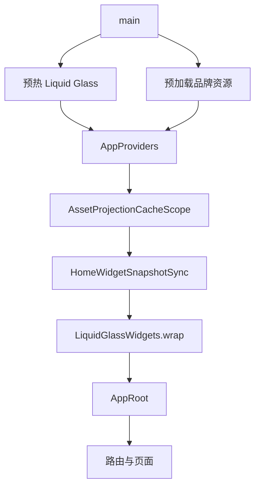
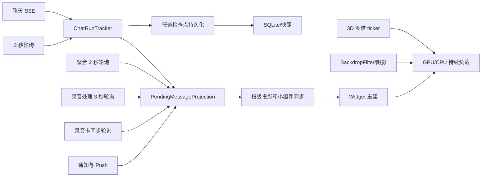
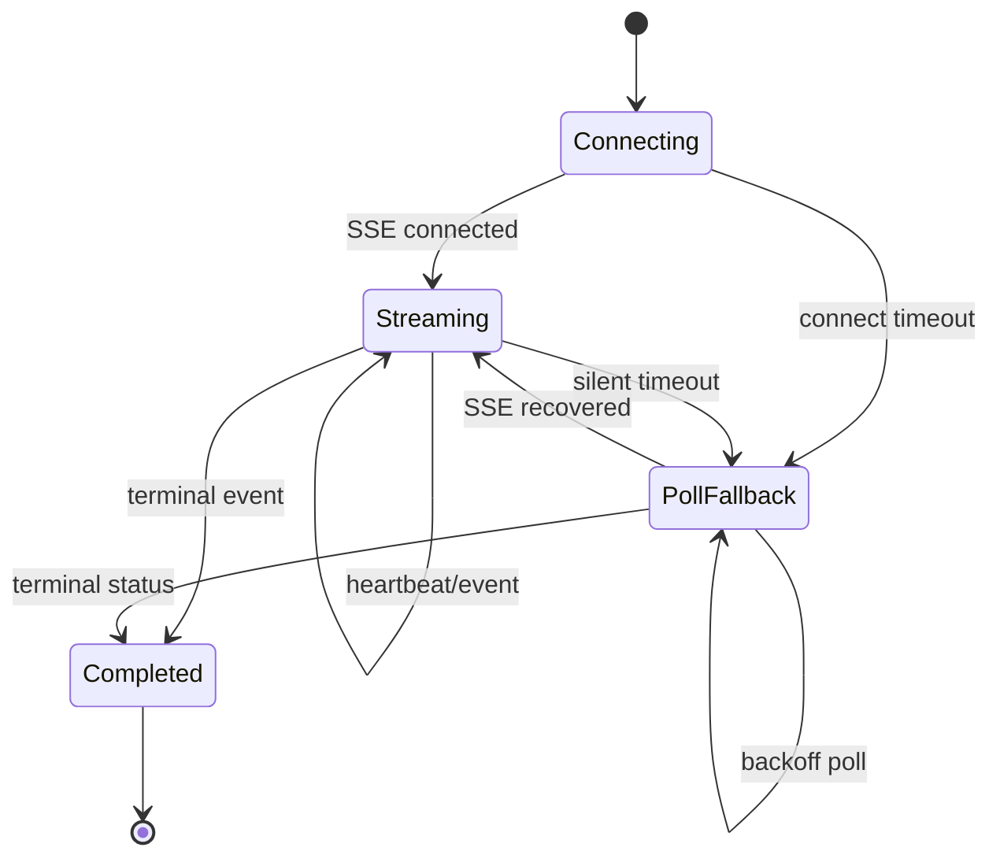
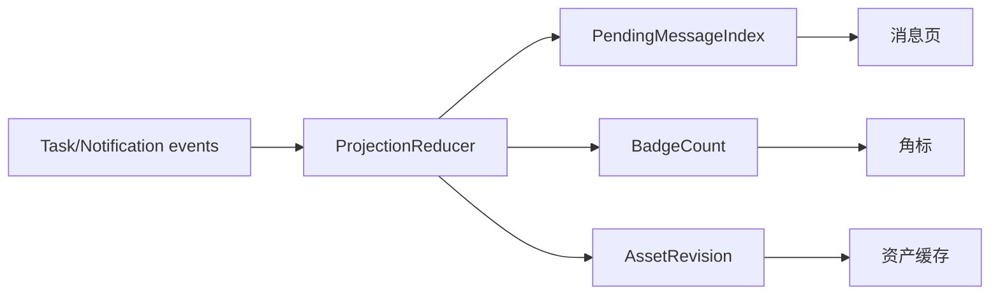
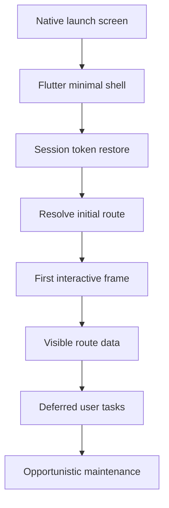
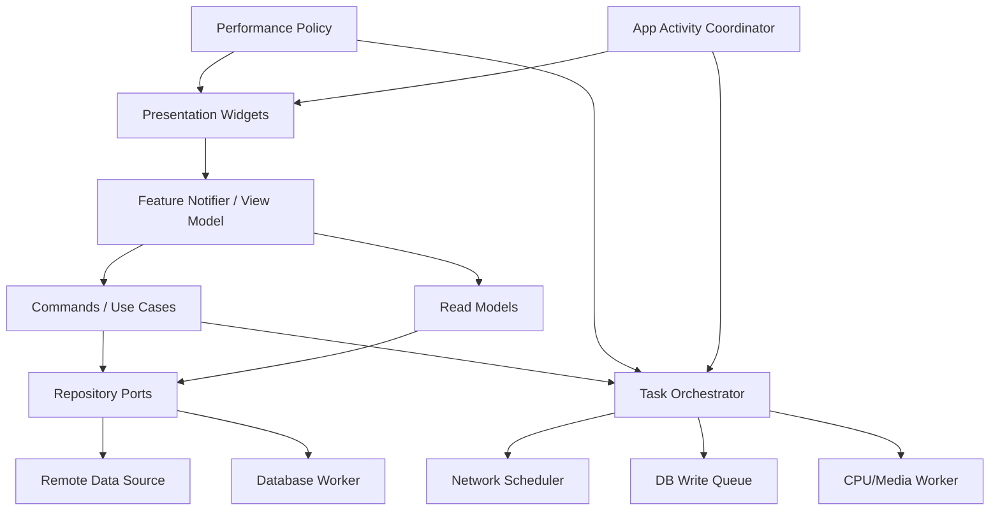

# 花火 Flutter 工程性能、功耗与可持续架构优化方案

> 仓库：`Xieyangzai/Flutter`  
> 分支：`main`  
> 审计基线：`78005b991f594603edcccdc6d44889a48005594a`  
> 基线提交：`Merge origin/main digital twin changes`  
> 审计范围：以 `Flutter/src` 手机端为主，同时覆盖 `Flutter/packages`、`Flutter/desktop`、工程治理与共享基础设施  
> 文档性质：静态代码审计 + 可执行改造方案  
> 重要说明：本文发现的是**代码层面的高风险热点和架构性问题**。发热、卡顿的最终占比必须通过 Profile 真机数据确认；本文不把尚未测量的数据伪装成实测结果。

---

## 目录

1. [结论摘要](#1-结论摘要)
2. [优化目标与性能预算](#2-优化目标与性能预算)
3. [当前架构与性能热点总览](#3-当前架构与性能热点总览)
4. [P0：立即处理的发热与卡顿问题](#4-p0立即处理的发热与卡顿问题)
5. [P1：状态管理与重建范围优化](#5-p1状态管理与重建范围优化)
6. [P1：网络、轮询与后台任务统一治理](#6-p1网络轮询与后台任务统一治理)
7. [P1：数据库与持久化架构优化](#7-p1数据库与持久化架构优化)
8. [P1：图片、音视频和文档处理优化](#8-p1图片音视频和文档处理优化)
9. [P1：启动、生命周期和页面驻留优化](#9-p1启动生命周期和页面驻留优化)
10. [P2：超大页面与超大控制器拆分](#10-p2超大页面与超大控制器拆分)
11. [目标可持续架构](#11-目标可持续架构)
12. [性能观测与真机验证体系](#12-性能观测与真机验证体系)
13. [测试、CI、分支与安全治理](#13-测试ci分支与安全治理)
14. [分阶段实施路线](#14-分阶段实施路线)
15. [推荐的首批 16 个 PR](#15-推荐的首批-16-个-pr)
16. [完整优化任务清单](#16-完整优化任务清单)
17. [验收标准与 Definition of Done](#17-验收标准与-definition-of-done)
18. [风险控制与回滚策略](#18-风险控制与回滚策略)
19. [代码证据索引](#19-代码证据索引)

---

# 1. 结论摘要

## 1.1 核心判断

当前工程的问题不是“某个页面写得慢”，而是多类高成本行为叠加：

1. **静止页面仍在持续渲染。**  
   思想图谱默认倾向 3D 球形展示，存在约 30 FPS 的持续运动路径；图谱还保底生成较多视觉节点，并叠加网格、连线、节点、发光、交互等多层绘制。用户不操作时，CPU/GPU 仍可能持续工作，这是“打开一段时间后发热”的首要嫌疑。

2. **玻璃、模糊、阴影和独立图层覆盖范围过大。**  
   全局使用 Liquid Glass，部分组件包含 `BackdropFilter`、较大的模糊半径、渐变、阴影、自定义绘制以及独立合成层。滚动、页面切换或图谱运动时，这些效果会与动画叠加。

3. **多个业务模块各自维护 Timer、轮询、恢复和重试。**  
   聊天任务、聚合任务、录音处理、录音卡同步、上传恢复、通知刷新等链路相互独立。应用恢复前台时，多个协调器可能同时启动，形成“恢复风暴”。

4. **聊天任务存在 SSE 正常时仍轮询的重复工作。**  
   流式事件、3 秒轮询、持久化检查点和 UI 通知可以同时发生。长回复时容易形成高频网络事件、JSON 编码、SQLite 写入和状态重建。

5. **当前数据库持久化存在同步 I/O 和整库快照写入风险。**  
   `sqlite3` 同步 API、打开/关闭数据库、快照式保存和频繁偏好写入相互叠加，可能阻塞 UI isolate。诊断日志、任务检查点等小写入也可能被放大成较重的存储操作。

6. **根节点监听和巨型 ChangeNotifier 导致状态扩散。**  
   `AppRoot`、`AppProviders`、桌面小组件同步、消息投影和资产投影会监听多个大型控制器。一个局部变化可能触发跨模块派生计算和较大范围重建。

7. **多个核心文件已经成为“上帝文件”。**  
   聊天页、创作画布、知识库控制器、玻璃组件、Provider 装配文件体量过大，职责混杂。即使修复单次卡顿，也容易在下一次功能迭代中重新引入问题。

因此，建议采用两条并行路线：

- **止血路线：** 关闭空闲持续渲染、合并轮询、削减模糊、降低写入频率、限制全局监听。改动小、效果直接。
- **治理路线：** 建立统一任务调度、性能策略、数据库 worker、细粒度状态和模块边界，让后续功能不会再次累积成相同问题。

## 1.2 优先级结论

| 优先级 | 问题 | 对症状的解释力 | 首要动作 |
|---|---|---:|---|
| P0 | 3D 图谱空闲持续运动与高绘制预算 | 极高 | 默认静态；空闲停止 ticker；动态节点/边预算 |
| P0 | 全局玻璃模糊与高成本合成层 | 高 | 开启自适应质量；滚动区禁用实时背景模糊 |
| P0 | 聊天 SSE + 轮询 + 高频持久化 | 极高 | SSE 健康时停轮询；UI/磁盘分别节流 |
| P0 | 同步 SQLite 与快照式写入 | 极高 | 加写队列；迁移到长连接数据库 isolate；增量更新 |
| P0 | 缺少真机性能基线 | 极高 | 先加入 FrameTiming、任务数、DB 写入、网络唤醒指标 |
| P1 | App 恢复时多个任务同时启动 | 高 | 统一 `AppActivityCoordinator` 和 `TaskOrchestrator` |
| P1 | 根部全量 watch 和派生投影 | 高 | 改为 revision/select；派生结果增量更新 |
| P1 | 图片压缩缓存与解码缓存双重占用 | 中高 | 按显示尺寸解码；限制 decoded image cache |
| P1 | 重型页面长期 KeepAlive | 中高 | 页面活性租约；重型资源退出时释放 |
| P2 | 超大页面和控制器 | 长期极高 | 按职责拆分，不做纯文件切割 |
| P2 | CI、架构规则和性能门禁不足 | 长期极高 | 分支保护、架构测试、性能回归基线 |

## 1.3 本次优化不建议做的事情

- 不建议一次性重写整个 APP。
- 不建议为了“架构整洁”先大规模改文件名和目录，而不解决持续 ticker、轮询和磁盘写入。
- 不建议把所有 `ChangeNotifier` 同时替换成另一种状态库；应先拆职责和缩小更新粒度。
- 不建议仅在模拟器判断发热和流畅度。模拟器只能做功能和部分帧分析，功耗必须真机验证。
- 不建议简单粗暴地删除所有动画和玻璃效果。应建立质量等级和动态降级策略。
- 不建议继续给 `app_providers.dart`、`v3_chat_page.dart`、`knowledge_library_controller.dart` 增加新职责。
- 不建议在没有测量前随意增加缓存。缓存可能把 CPU 问题变成内存问题。

---

# 2. 优化目标与性能预算

以下是**建议工程目标**，不是当前实测值。第一轮 Profile 完成后，应把目标补充为按设备分层的正式预算。

## 2.1 用户体验目标

| 场景 | 目标 |
|---|---|
| 冷启动 | 原生启动页之后尽快出现可交互 Flutter UI；非关键同步不得阻塞首屏 |
| 普通页面静止 | 2 秒后不再持续产生无意义帧；无持续自转、呼吸或后台动画 |
| 页面滚动 | 60 Hz 设备主要交互帧 P95 不超过 16.7 ms；明显卡顿帧比例低于 1%–2% |
| 120 Hz 设备 | 核心滚动和输入尽量满足 8.3 ms；无法满足时稳定降为 60 Hz 体验，避免帧时抖动 |
| AI 流式回复 | 文本连续出现但不按每个 token 重建整页；滚动、输入框和按钮保持响应 |
| 创作画布输入 | 连续输入时不做全文序列化、全文 Markdown 转换或同步落盘 |
| APP 空闲 | 同步完成后普通页面不应持续轮询、持续写库或持续占用 GPU |
| 前后台切换 | 恢复任务分批执行，不出现多个网络请求和数据库任务同时爆发 |
| 长时间使用 | 15–30 分钟常见场景不出现持续升温、内存单调增长或交互逐渐变慢 |

## 2.2 量化性能预算

| 指标 | 建议预算 |
|---|---|
| 60 Hz 帧耗时 | Build P95 `< 8 ms`；Raster P95 `< 8 ms`；总帧 P95 `< 16.7 ms` |
| 严重卡顿帧 | `> 32 ms` 的帧占比 `< 0.5%` |
| 空闲帧 | 页面稳定 2 秒后，除光标/必要系统动画外，不应有持续 frame callback |
| 空闲 CPU | 代表性真机稳定页面平均进程 CPU 目标 `< 3%–5%` |
| 空闲网络 | 状态稳定后普通页面网络轮询目标为 `0 次/分钟` |
| 空闲数据库写 | 状态稳定后 `0 次/分钟` |
| SSE 健康期轮询 | `0`；只在超时、断线或校验时退化轮询 |
| 聊天流式 UI 更新 | 合并至约 `10–20 次/秒`，而不是每个 token 一次 |
| 聊天检查点写入 | 普通过程最多约 `1–2 次/秒`；完成、暂停、退后台立即 flush |
| 图谱空闲刷新 | 默认 `0 FPS`；用户拖动时动态提升；演示自转必须有明确时限 |
| 内存稳定性 | 重复 20 次核心页面往返后，GC 后不得持续单调增长；回落至初始稳定值的 `±10%–15%` |
| 图片解码 | 使用接近实际显示尺寸的解码尺寸，避免原图进入 decoded image cache |
| 恢复并发 | 同一时间高优先级网络任务建议不超过 2–3 个；数据库写通道保持单队列 |
| 启动改进 | 先建立基线，再以首屏可交互时间降低至少 30% 为首轮目标 |

## 2.3 功耗与温控预算

建立三档运行策略：

| 等级 | 触发条件 | 策略 |
|---|---|---|
| `high` | 前台、温度正常、非省电、性能充足 | 允许有限玻璃效果和完整交互质量 |
| `balanced` | 默认手机策略 | 图谱按需渲染；中等模糊；限制预取和后台任务 |
| `constrained` | 设备发热、省电模式、后台、低端机或持续掉帧 | 关闭实时背景模糊、图谱网格/光晕、自转和图片预取；延长非关键任务间隔 |

`constrained` 不应依赖用户手动选择。应用应通过原生桥接读取平台热状态、省电状态、生命周期和帧性能趋势，自动切换。

---

# 3. 当前架构与性能热点总览

## 3.1 当前工作区

```text
Flutter/
├── src/                         Android / iOS 手机端
├── desktop/                     Windows / macOS 桌面端
├── packages/
│   ├── huahuo_api/
│   ├── huahuo_editor/
│   └── huahuo_foundation/
├── scm/
├── docs/
├── reports/
├── third_party/
└── vendor/
```

手机端：

```text
Flutter/src/lib/
├── app/                         启动、Provider 装配、路由、全局协调
├── core/                        API、认证、数据库、存储、原生桥、诊断
├── features/                    业务模块
├── shared/                      UI、主题、导航和公共工具
└── main.dart
```

当前已经具备 feature-first 的雏形，但关键问题是：**模块目录存在，运行时边界尚未真正建立**。大量功能仍通过全局 Provider、根级监听、巨型控制器和共享投影彼此影响。

## 3.2 启动链路热点

当前大致链路：



风险：

- 手机端可能 defer 首帧，并等待视觉系统和品牌资源预热。
- `LiquidGlassWidgets.wrap` 包裹整个应用。
- `AppProviders` 不仅提供依赖，还挂载多个全局 activation。
- 资产投影和桌面小组件同步位于根节点，容易被大量状态变化唤醒。
- `AppRoot` 同时承担主题、路由、推送、外部导入、恢复同步、支付恢复、定位和录音卡协调。

**优化原则：首屏只做“显示首屏必需”的工作。**  
知识同步、录音卡恢复、支付恢复、上传恢复、图谱预计算、诊断整理均应进入首屏之后的分级队列。

## 3.3 运行时热点关系



最危险的不是任一箭头，而是多个箭头同时发生。例如 AI 长回复期间：

```text
SSE 事件
→ ChatRunTracker 更新
→ notifyListeners
→ 消息投影重新计算
→ 根部监听被触发
→ UI 重新 build
→ 检查点 JSON 编码
→ SQLite 写入
→ 同时保留轮询校验
→ 图谱或玻璃动画仍可能持续渲染
```

这正是“单独看每段代码都能工作，但整机不丝滑且发热”的典型原因。

---

# 4. P0：立即处理的发热与卡顿问题

# 4.1 PERF-001：思想图谱空闲持续渲染

## 当前风险

重点文件：

```text
Flutter/src/lib/features/ui_v3/presentation/v3_interactive_graph.dart
Flutter/src/lib/features/ui_v3/application/v3_graph_view_mode_controller.dart
Flutter/src/lib/features/ui_v3/application/graph_render_quality_controller.dart
Flutter/src/lib/features/ui_v3/application/graph_render_budget.dart
Flutter/src/lib/features/ui_v3/presentation/v3_feed_page.dart
Flutter/src/lib/features/ui_v3/application/feed_graph_controller.dart
```

静态审计显示：

- 3D 球形模式存在约 33 ms 的帧间隔，即约 30 FPS。
- 存在物理 ticker 和球形运动 ticker。
- 空闲后可能自动旋转。
- 视觉节点有较高的保底数量。
- 绘制包含球面网格、连线、节点、覆盖层和交互。
- Feed 页面使用 KeepAlive，图谱相关控制器还会监听知识库变化并重建快照。
- 已经存在活性判断、LOD 和 render budget，这是良好基础，但默认空闲质量仍偏高。

## 最小止血改动

1. 将首次默认模式改为 2D 或静态 3D。
2. 默认关闭无限自转；只有用户点“自动旋转”后才启用。
3. 即使用户启用自动旋转，也设置最长演示时限，例如 5–10 秒。
4. 页面不在前台、不在当前 Tab、被弹窗覆盖或 App 非 resumed 时，彻底停止 ticker。
5. 空闲状态不再以 30 FPS 继续更新；只在以下事件触发重绘：
   - 用户拖动；
   - 缩放；
   - 数据版本变化；
   - 页面尺寸变化；
   - 显式播放动画。
6. 手机默认视觉节点预算从固定较高下限改为动态预算：
   - `constrained`：24；
   - `balanced`：36；
   - `high`：60–72；
   - 平板/桌面可更高。
7. 交互期间隐藏次要语义边、球面网格、光晕和非焦点标签；交互结束后分两帧恢复，避免单帧突增。

## 目标实现

新增统一策略：

```dart
enum GraphActivity {
  inactive,
  idle,
  interacting,
  settling,
  presenting,
}

final class GraphRenderPolicy {
  final GraphActivity activity;
  final int maxNodes;
  final int maxEdges;
  final bool showMesh;
  final bool showGlow;
  final bool animate;
  final Duration? frameInterval;
}
```

策略矩阵：

| 状态 | ticker | 节点 | 边 | 网格/光晕 |
|---|---:|---:|---:|---|
| inactive | 停止 | 0 | 0 | 关闭 |
| idle | 停止 | 36 | 精简 | 静态、低质量 |
| interacting | 30/60 FPS | 24–36 | 最少 | 关闭 |
| settling | 30 FPS，限时 | 36 | 中等 | 部分 |
| presenting | 30 FPS，限时 | 60 | 完整 | 可开启 |

## 进一步优化

- 将图布局、3D 投影、节点筛选和碰撞计算移入 isolate，主 isolate 只接收不可变绘制快照。
- 使用版本号和输入哈希，只有图数据、相机或尺寸真正变化时才重算。
- 将静态球面网格缓存为 Picture/绘制缓存。
- 给节点、边、标签建立分层 `RepaintBoundary`，但必须通过 DevTools 验证，避免层数过多。
- 搜索输入增加 150–250 ms debounce，避免每个字符重建图谱。
- 大图只把可见/高权重节点送入绘制层，完整数据留在领域层。

## 验收

- 图谱页面静止 2 秒后，frame callback 不再持续。
- APP 切到其他 Tab 后，图谱 ticker 数为 0。
- 连续停留 10 分钟，设备温度与普通静态列表接近。
- 拖动时可流畅交互；放手后在有限时间内稳定并停止。
- 节点数量较多时，不得把所有节点和边直接交给单帧 painter。

---

# 4.2 PERF-002：Liquid Glass、BackdropFilter 与合成层过重

## 当前风险

重点文件：

```text
Flutter/src/lib/main.dart
Flutter/src/lib/shared/ui_v3/v3_liquid_glass.dart
Flutter/src/lib/shared/ui_v3/v3_components.dart
Flutter/src/lib/features/ui_v3/presentation/v3_app_shell.dart
```

风险行为：

- 全局使用 Liquid Glass 包装。
- 根配置关闭了自适应质量。
- 多处存在背景模糊、较大 sigma、阴影、渐变、自定义光晕和独立图层。
- 玻璃按钮或面板可能在滚动区域、动画区域和图谱上方叠加。
- 背景 blur 通常需要读取并处理下层内容；下层持续变化时成本更高。

## 最小止血改动

1. 根配置改为允许 `adaptiveQuality`。
2. 引入三档玻璃质量：
   - `high`：仅顶部导航、固定浮层保留完整 blur；
   - `balanced`：降低 blur，减少阴影和独立层；
   - `constrained`：使用半透明纯色 + 1 px 描边，不使用实时 BackdropFilter。
3. 滚动列表的每个 item 禁止各自使用实时背景 blur。
4. 对 blur 明确裁剪范围，避免全屏处理。
5. 图谱运动、快速滚动、页面过渡期间临时降为静态玻璃。
6. 检查 `useOwnLayer: true` 的使用；仅保留确有视觉或裁剪必要的组件。
7. 动画中不要同时改变 blur、透明度、阴影和位置；优先只动画 transform/opacity。

## 组件接口建议

```dart
enum V3VisualQuality { high, balanced, constrained }

class V3GlassSurface extends StatelessWidget {
  const V3GlassSurface({
    required this.child,
    this.role = V3GlassRole.panel,
    this.allowBackdrop = true,
  });

  final Widget child;
  final V3GlassRole role;
  final bool allowBackdrop;
}
```

所有玻璃组件只读取一个 `PerformancePolicy`，不允许页面自行决定任意 blur 参数。这样设计系统调整一次即可覆盖全 APP。

## 使用边界

允许完整玻璃：

- 顶部固定导航；
- 少量重要模态面板；
- 不随列表一起滚动的大面积固定背景。

不允许实时玻璃：

- 列表中的每一行；
- 图谱节点；
- 聊天消息气泡；
- 持续位移动画中的卡片；
- 同时嵌套两层以上的玻璃；
- 页面不可见时。

## 验收

- 快速滚动列表时 Raster 线程 P95 明显降低。
- 图谱运动和玻璃叠加场景无持续 GPU 满载。
- `constrained` 模式视觉仍完整可用，不出现文字对比度问题。
- Reduce Motion、降低透明度和系统辅助功能得到统一尊重。

---

# 4.3 PERF-003：聊天 SSE、轮询、持久化和 UI 更新叠加

## 当前风险

重点文件：

```text
Flutter/src/lib/features/chat/application/chat_run_tracker.dart
Flutter/src/lib/features/chat/data/chat_api.dart
Flutter/src/lib/features/ui_v3/presentation/v3_chat_page.dart
Flutter/src/lib/app/bootstrap/app_providers.dart
Flutter/src/lib/features/notifications/application/pending_message_projection.dart
```

当前可能存在：

- SSE 连接正常时仍保留约 3 秒轮询。
- SSE 每个事件更新任务状态。
- 每个事件可能触发检查点持久化。
- 持久化可能序列化整个任务集合。
- `notifyListeners` 又触发消息投影、角标、资产投影或页面重建。
- Chat 页面本身职责和组件很多，更新边界难以控制。

## 正确状态机



规则：

- SSE 在健康窗口内是唯一实时状态来源。
- 健康 SSE 期间不做固定周期轮询。
- 只有超过静默阈值、断线、序列缺口或进入恢复流程时才轮询。
- 轮询使用指数退避和 jitter，不固定 3 秒永久执行。
- 前台可见的当前会话优先；非当前会话只保留低频状态。
- 后台普通任务暂停主动轮询，优先由 Push/系统恢复触发。

## 将三种频率分开

### 网络事件频率

可以高频接收，不代表每次都更新 UI 或落盘。

### UI 更新频率

流式文本写入一个缓冲区，按 50–100 ms 合并一次：

```dart
class StreamingTextBuffer {
  void append(String delta);
  Stream<String> get coalescedSnapshots;
}
```

仅正在生成的消息 widget 订阅该缓冲区，聊天列表其余部分不重建。

### 磁盘检查点频率

- 普通过程：500–1000 ms 合并一次；
- 收到 terminal event：立即写；
- App 即将 inactive/paused：立即写；
- SSE sequence 发生跳跃：立即写；
- 不再每个 token 或每个小事件写整套任务台账。

## 数据结构建议

把当前全量任务列表改为标准化存储：

```text
ChatRunIndex
├── orderedRunIds
├── activeRunIds
└── revision

ChatRunEntity(runId)
├── status
├── sequence
├── threadId
├── currentMessageId
├── updatedAt
└── persistedRevision
```

Riverpod 使用 `family(runId)`，页面只监听当前 run 和当前消息，不监听所有 run。

## 持久化建议

不要每次序列化完整任务集合：

```sql
INSERT INTO chat_run_checkpoint (...)
VALUES (...)
ON CONFLICT(run_id) DO UPDATE SET ...;
```

完成任务可移入历史表或删除活跃检查点，避免 active ledger 无限增长。

## 验收

- SSE 健康时网络面板不出现周期 poll。
- 1000 个流式 delta 不产生 1000 次 UI 全页 rebuild。
- 1000 个流式 delta 不产生 1000 次数据库写。
- 聊天列表滚动和输入在长回复期间保持可响应。
- 杀进程恢复不会丢失已确认 sequence。
- SSE 断线后仍能通过 fallback 正确完成任务。

---

# 4.4 PERF-004：同步 SQLite 与整库快照写入

## 当前风险

重点文件：

```text
Flutter/src/lib/core/database/app_database.dart
Flutter/src/lib/core/database/app_preferences_dao.dart
Flutter/src/lib/core/database/diagnostic_log_dao.dart
Flutter/src/lib/app/bootstrap/app_providers.dart
```

当前风险特征：

- 使用同步 `sqlite3` API。
- 读取或保存时可能打开/关闭数据库。
- 快照式存储会把内存状态整体写回。
- 偏好、诊断、任务检查点等频繁小写入可能被放大。
- 若这些操作发生在主 isolate，可能直接形成输入延迟和丢帧。

## 迁移策略：不要一次性换库

### 阶段 A：先加观测

为所有写入记录：

```text
operation
table
queue_wait_ms
execute_ms
rows
bytes
reason
caller_feature
```

不记录敏感正文，只记录体量和时延。

### 阶段 B：加入单写队列与合并

```dart
final class DatabaseWriteQueue {
  Future<T> enqueue<T>({
    required String key,
    required Future<T> Function() operation,
    bool replacePending = false,
  });
}
```

- 相同 key 的可覆盖状态写使用 latest-wins。
- 不可丢日志使用批量 append。
- terminal、logout、pause 可要求 flush。
- UI 不等待非关键写入结束。

### 阶段 C：长连接数据库 worker

建立专用 isolate：

```text
UI isolate
   │ typed commands
   ▼
Database worker isolate
   ├── long-lived sqlite connection
   ├── prepared statements
   ├── migrations
   ├── write batching
   └── query result DTO
```

严禁把 sqlite connection 跨 isolate 传递。通过 SendPort/ReceivePort 或成熟数据库 worker 机制传递命令。

### 阶段 D：增量表操作替代整库快照

按实体增量更新：

- app preferences；
- chat run checkpoint；
- recording task；
- upload draft；
- diagnostics；
- canvas draft；
- workspace metadata。

整库快照只允许用于：

- 明确的导出；
- 测试 fixture；
- 灾难恢复；
- 低频压缩。

### 阶段 E：可选技术升级

在保持 repository/DAO 接口不变的前提下，再评估是否引入 Drift 等方案。不要把“换 ORM”当成性能优化本身；关键是：

- worker isolate；
- 长连接；
- 增量 SQL；
- 索引；
- 事务批处理；
- 可观测写队列。

## 数据库具体优化

- 启用并验证 WAL。
- 常用 `workspace_id`、`user_id`、`status`、`updated_at`、`task_id` 建索引。
- schema 校验仅在 open/migration 时执行，不在每次 save 时执行。
- 大字段与列表索引分表，避免更新状态时重写正文。
- 诊断日志批量写入，限制容量并滚动删除。
- 压缩/清理只在前台空闲、充电或 `balanced/high` 策略下执行。
- 所有 DAO API 区分：
  - `read`；
  - `command`；
  - `observe`；
  - `flush`。
- Repository 返回不可变 DTO，不暴露数据库对象。

## 验收

- UI isolate 上无同步文件和 SQLite 写入。
- 普通输入、滚动期间数据库操作不会产生长帧。
- Chat 流式期间写入次数满足预算。
- 数据库连接不在每次小写入时反复打开/关闭。
- 数据迁移、进程中断和崩溃恢复有自动化测试。

---

# 4.5 PERF-005：先建立真实性能观测，避免盲目优化

没有基线就无法判断优化是否真实有效，也无法防止以后回退。

## 必须增加的应用内指标

新增：

```text
Flutter/src/lib/core/performance/
├── frame_metrics_collector.dart
├── runtime_activity_metrics.dart
├── task_metrics.dart
├── database_metrics.dart
├── network_metrics.dart
├── memory_pressure_port.dart
├── thermal_state_port.dart
└── performance_snapshot.dart
```

采集：

- Build/Raster/总帧 P50/P95/P99；
- jank 数量；
- 当前 route 和 tab；
- 活跃 ticker 数；
- 活跃 poller 数；
- SSE 状态；
- 活跃任务数；
- 网络请求数、重试数；
- DB 写队列长度、写入次数和最长耗时；
- 图片压缩缓存和 decoded image cache 大小；
- 生命周期；
- thermal/power 策略；
- 当前视觉质量等级。

## 记录方式

- Release 默认只保留聚合值，不保留正文。
- 使用内存 ring buffer。
- 每隔一段时间批量落盘，而不是每个事件落盘。
- 出现严重长帧时保存前后 5–10 秒上下文。
- 用户可在“诊断导出”中导出性能快照。
- 日志必须有采样、去重和速率限制。

## 验收

每次性能问题都能回答：

```text
卡顿发生在哪个 route？
当时是否有图谱 ticker？
有几个网络任务？
是否正在 DB flush？
是否刚恢复前台？
是否正在解码大图？
视觉质量档位是什么？
```

---

# 5. P1：状态管理与重建范围优化

# 5.1 根节点职责拆分

当前 `AppRoot` 同时处理：

- MaterialApp；
- 生命周期；
- 推送消息；
- 推送导航；
- Deep Link；
- 外部文件导入；
- Session 恢复；
- 知识同步；
- 录音卡同步；
- 支付恢复；
- 初始定位；
- 主题与视觉范围。

建议拆为：

```text
AppRoot
├── AppView                         只负责 MaterialApp/router/theme
├── SessionLifecycleCoordinator    登录、退出、workspace 变化
├── IngressCoordinator             Deep Link、分享、Push 导航
├── ForegroundResumeCoordinator    前台恢复分批调度
├── AppTaskActivation              只把任务注册给 TaskOrchestrator
└── PerformancePolicyScope         性能/功耗策略
```

这些协调器不必全是 Widget。优先做成带明确 `start/stop/dispose` 的 application service，通过一个根 activation 启动。

原则：

- 根节点不 watch 大型业务状态。
- 根节点只 watch 路由、Session 阶段、主题等低频状态。
- 业务副作用不放在 `build()`。
- 所有监听都必须可取消、可测试、可观测。

# 5.2 `app_providers.dart` 拆分

建议目录：

```text
app/bootstrap/
├── app_providers.dart              只聚合模块
├── core_provider_module.dart
├── auth_provider_module.dart
├── chat_provider_module.dart
├── knowledge_provider_module.dart
├── recording_provider_module.dart
├── notification_provider_module.dart
├── billing_provider_module.dart
├── ui_v3_provider_module.dart
└── runtime_activation.dart
```

注意：不要只机械拆文件。每个模块需要明确：

- 输入依赖；
- 对外 Provider；
- 启动时机；
- 生命周期；
- dispose；
- 是否允许后台运行；
- 是否包含磁盘/网络副作用。

## Provider 设计规则

1. 热状态使用细粒度 Provider。
2. 大集合不通过一个 `ChangeNotifier` 广播。
3. 列表页面监听 `ids + revision`，单元格监听 `entity(id)`。
4. 使用 `.select` 时只返回稳定、可比较的小值。
5. 派生列表不要在 getter 中每次 `where + sort + toList`。
6. 对高频流式状态建立专门 channel，不进入全局冷状态。
7. 默认使用 `autoDispose`；确需常驻的 Provider 写明原因。
8. 不在 Provider 构造期间做不可控的同步 I/O。
9. `build()` 中不得调用 scheduleMicrotask 去反复启动业务任务。
10. 同一业务对象只有一个真相源，避免 controller、projection、cache 各存一份可变状态。

# 5.3 知识库控制器拆分

当前知识库控制器同时承担：

- 笔记集合；
- 文件夹；
- 关系；
- 筛选/排序；
- 同步；
- 冲突；
- 删除/恢复；
- 分类；
- 订阅；
- 持久化队列；
- 图谱输入。

建议拆为：

```text
features/knowledge/
├── domain/
│   ├── note.dart
│   ├── folder.dart
│   ├── relation.dart
│   └── sync_conflict.dart
├── application/
│   ├── note_command_service.dart
│   ├── note_index_controller.dart
│   ├── folder_controller.dart
│   ├── relation_controller.dart
│   ├── trash_controller.dart
│   ├── knowledge_sync_engine.dart
│   └── knowledge_read_model.dart
├── data/
│   ├── note_repository.dart
│   ├── local_note_data_source.dart
│   └── remote_note_data_source.dart
└── presentation/
```

读写分离：

```text
Command:
  createNote / updateNote / moveNote / deleteNote

Read model:
  noteIdsForFolder
  recentNoteIds
  graphSnapshot
  unreadCount
```

图谱不直接监听整个知识库控制器；它只订阅 `GraphSnapshotRevision`，再从 `GraphReadModel` 读取一次不可变快照。

# 5.4 消息投影与资产投影增量化

当前 Pending Message Projection 汇聚多个控制器，任何来源变化都可能重算全部投影。

建议改为事件式投影：



关键点：

- 角标只订阅整数，不订阅完整消息列表。
- 资产缓存只订阅 `assetRevision`，不订阅所有任务字段。
- ProjectionReducer 按 event 更新一项，不遍历所有模块。
- 完整重建只用于冷启动恢复和一致性校验。
- 对相同任务 ID 去重，保证幂等。

# 5.5 Home Widget 同步脱离 Widget build

当前桌面小组件/系统小组件同步位于根 Widget 链路，并监听多个业务控制器。

改造为：

```text
HomeWidgetProjectionService
├── listens to small revisions
├── builds snapshot off build path
├── debounce 1–5 s
├── compares content hash
└── publishes through native port
```

规则：

- 只有内容哈希变化才调用原生 MethodChannel。
- 不因普通 UI rebuild 发布。
- 不为了更新“经过秒数”每秒写系统小组件。
- APP 后台时遵循平台刷新机制，不自行保持 Timer。
- 发布失败使用受控退避，不无限重试。

---

# 6. P1：网络、轮询与后台任务统一治理

# 6.1 当前问题

当前多个模块独立管理：

- Timer；
- polling generation；
- SSE；
- retry；
- deadline；
- lifecycle；
- persistence；
- resume。

结果是：

- 无统一并发预算；
- 无统一后台策略；
- 无统一去重；
- 无统一 jitter；
- 前台恢复容易同时触发；
- 很难知道当前到底有几个活动任务。

# 6.2 建立 `AppActivityCoordinator`

统一描述 APP 当前活动状态：

```dart
enum AppVisibility { foreground, inactive, background }
enum UserAttention { currentRoute, currentTab, hidden }
enum PowerClass { normal, lowPower, thermalLimited }

final class AppActivityState {
  final AppVisibility visibility;
  final String route;
  final String activeTab;
  final PowerClass powerClass;
  final bool networkAvailable;
}
```

所有长任务订阅这一状态，而不是各自成为 `WidgetsBindingObserver`。

# 6.3 建立 `TaskOrchestrator`

```dart
enum TaskPriority {
  userBlocking,
  userVisible,
  foregroundDeferred,
  backgroundOpportunistic,
}

enum TaskResource {
  network,
  database,
  cpu,
  media,
}

final class TaskSpec {
  final String key;
  final TaskPriority priority;
  final Set<TaskResource> resources;
  final bool foregroundOnly;
  final bool replaceExisting;
  final Duration? deadline;
}
```

能力：

- 任务 key 去重；
- 同类任务 replace/collapse；
- 统一取消；
- 统一超时；
- 指数退避 + jitter；
- 网络、数据库、CPU 并发预算；
- 前台恢复分批；
- 后台暂停；
- 指标统计；
- 测试使用 fake clock。

建议默认预算：

```text
userBlocking network:       最大 2
all network:                最大 3
database write:             最大 1
heavy CPU isolate jobs:     最大 1–2，按设备分级
media decode/export:        最大 1
```

# 6.4 前台恢复防风暴

当前多个任务可能在 `resumed` 时一起执行。改为分层：

```text
T0：恢复路由和用户当前操作
T1：当前页面可见数据
T2：未完成的用户显式任务
T3：通知、角标、录音卡状态
T4：知识全量同步、缓存整理、压缩
```

- T0/T1 立即；
- T2 在首帧之后；
- T3 加随机抖动；
- T4 只在空闲且温控允许时执行。
- 同一 workspace 的同步只允许一个实例。
- 快速前后台切换不重复创建任务；使用 generation token。

# 6.5 轮询统一规则

所有轮询必须满足：

- 有唯一 task key；
- 有最大期限；
- 有最大失败次数或退避上限；
- App background 时明确说明是否运行；
- SSE/Push 健康时停止；
- 加 jitter；
- 页面退出可取消；
- 任务完成立即结束；
- 每次轮询不无条件落盘；
- 轮询指标可见。

禁止：

```dart
Timer.periodic(const Duration(seconds: 2), ...)
```

直接散落在 feature 中。必须通过 `TaskOrchestrator` 注册。

# 6.6 请求去重、取消和缓存

在 `huahuo_api` 或手机端 API foundation 增加：

- GET 请求同 key 合并；
- route 切换时取消已无消费者的请求；
- token refresh single-flight；
- workspace sync single-flight；
- 可重试错误分类；
- 幂等请求统一 idempotency key；
- 网络不可用时快速失败/入队，避免多个模块各自重试；
- 缓存带 revision/ETag；
- 只在服务端不支持事件流时使用 polling。

---

# 7. P1：数据库与持久化架构优化

# 7.1 持久化分级

将数据分成四类：

| 类型 | 示例 | 策略 |
|---|---|---|
| 强一致用户数据 | 笔记正文、创作稿、订单状态 | 命令完成前确认写入或进入可靠 outbox |
| 可恢复任务检查点 | chat run、上传、ASR | 合并写；终态/退后台强制 flush |
| 可重建派生数据 | 图谱快照、角标、排序结果 | 缓存，不要求每次落盘 |
| 诊断数据 | 性能、错误、请求摘要 | 内存 ring buffer + 批量采样写 |

不要用同一种“每次变化立即保存”的策略处理全部数据。

# 7.2 创作画布 Autosave

重点文件：

```text
Flutter/src/lib/features/ui_v3/presentation/v3_creation_canvas_page.dart
Flutter/src/lib/core/database/creation_canvas_draft_dao.dart
```

建议：

- 文本编辑事件只更新内存 draft。
- 300–800 ms idle debounce 后保存。
- 保存变更集或结构化 delta，而不是每次全文 JSON/Markdown 双份转换。
- 用户离开页面、App paused、显式保存时立即 flush。
- 大文档序列化和 Markdown/PDF 转换放 isolate。
- 只有正文 revision 变化才生成预览。
- 标题、标签、正文使用独立 revision，避免修改标题触发正文重算。
- export 与 autosave 使用不同队列，避免互相阻塞。

# 7.3 诊断日志

当前日志若每条直接写数据库，可能反过来制造性能问题。

改为：

```text
log()
  → memory ring buffer
  → severity/sample filter
  → batch of 20/50 or idle flush
  → incremental INSERT transaction
```

- Debug/trace 在 release 关闭或强采样。
- 相同错误一分钟内聚合计数。
- 日志表设置容量和时间上限。
- 导出时再拼接完整诊断包。
- 性能监控本身开销必须小于被监控功能。

# 7.4 数据压缩与清理

- 不在启动首屏执行。
- 不在滚动/录音/流式生成时执行。
- 使用 orchestrator 的 `backgroundOpportunistic`。
- 大删除分批进行。
- 清理前记录体积，清理后记录耗时。
- 触发条件使用体积/行数，而不是每次启动。
- 热限制或低电量时取消。

---

# 8. P1：图片、音视频和文档处理优化

# 8.1 图片内存

重点文件：

```text
Flutter/src/lib/features/chat/data/authenticated_resource_image_cache.dart
Flutter/src/lib/features/ui_v3/...
```

风险：

- 压缩字节内存缓存与 Flutter decoded image cache 是两套缓存。
- 压缩缓存 64 MB 并不代表总图片内存只有 64 MB。
- 大尺寸原图即使压缩文件不大，解码后可能占用几十 MB。
- 磁盘缓存清理若每次扫描、stat 和排序整个目录，也会产生 I/O 抖动。

## 改造

1. 所有展示图片传入 `cacheWidth/cacheHeight` 或使用缩略图 URL。
2. 缩略图尺寸按：
   ```text
   logical display size × devicePixelRatio × 质量系数
   ```
3. 列表缩略图不加载原图。
4. 预览页先加载缩略图，用户放大时再加载高分辨率分片/原图。
5. 显式设置 decoded image cache 的数量和字节预算，按设备内存分级。
6. 压缩字节缓存下调手机默认上限，并使用 LRU。
7. 磁盘缓存建立索引表，不在每次写入后扫描全目录。
8. 缓存淘汰在 worker/isolate 或空闲任务中批处理。
9. 避免反复复制 `Uint8List`。
10. 在内存压力通知时立即释放：
    - 非当前页原图；
    - 图谱缓存；
    - 文档预览；
    - 视频帧；
    - 不可见页面图片 provider。

# 8.2 音频

- 一个功能只维护一个明确所有者的播放器/录音器。
- 页面不可见时停止波形动画。
- 录音电平 UI 限制刷新频率，例如 20–30 Hz。
- PCM 波形计算、格式转换、哈希计算放 isolate/native。
- 播放进度 UI 不需要 60 次/秒；通常 4–10 次/秒足够。
- 音频 Session 切换集中管理，避免多个页面竞争。
- 退出页面释放 stream subscription、player 和 controller。
- 后台上传与前台播放使用不同资源优先级。

# 8.3 视频与图片分析

- 视频缩略图提取不得阻塞 UI isolate。
- 长视频只读取必要元数据，不一次性加载到内存。
- 上传使用流式文件读取。
- 进度事件合并更新，避免每个数据块重建 UI。
- 多文件上传设置并发上限。
- 生成中的任务离开页面后可后台继续，但页面订阅必须释放。
- 失败重试使用可恢复上传偏移，不重新读完整文件。

# 8.4 Markdown、富文本和 PDF

- 长 Markdown 解析放 isolate，结果按 block 返回。
- 聊天流式回复不要每个 token 重新解析全文 Markdown；按块或 50–100 ms 合并。
- Quill 文档 autosave 使用 delta revision。
- PDF 导出、图片编码、ZIP 打包全部进入 CPU/media 队列。
- 预览缓存按 `documentId + revision + width`。
- 页面退出时取消无消费者的预览任务。
- 导出进度只更新局部 widget。

---

# 9. P1：启动、生命周期和页面驻留优化

# 9.1 启动分层

建议启动阶段：



### 首帧前允许

- Flutter binding；
- 必需的主题/locale；
- 极小品牌资源；
- Session token 的最小恢复；
- 初始路由判定。

### 首帧后执行

- Liquid Glass 高质量预热；
- 知识库同步；
- Push 注册刷新；
- 录音卡恢复；
- 支付恢复；
- 上传任务恢复；
- 图谱预计算；
- 缓存压缩；
- 诊断整理。

## 9.2 Liquid Glass 预热

当前不要让高成本 Shader/视觉预热成为进入 APP 的强依赖。

建议：

- 首帧使用静态 fallback。
- 首帧后按当前页面需要预热。
- 初始化超时不应阻塞。
- 低性能/温控受限设备直接使用静态 fallback。
- 记录初始化耗时与是否成功。

## 9.3 页面活性租约

新增：

```dart
abstract interface class PageActivityAware {
  void onPageActivated();
  void onPageDeactivated();
}
```

或 Provider 形式：

```text
route visible
AND current tab
AND app foreground
AND not covered by blocking route
= active lease
```

只有持有活性租约的页面可以：

- 运行动画；
- 订阅高频流；
- 进行预取；
- 更新播放进度；
- 绘制图谱；
- 刷新实时状态。

## 9.4 KeepAlive 使用规则

重型页面不得因为 `AutomaticKeepAliveClientMixin` 永久持有所有资源。

分离：

- 页面导航状态：保留；
- ScrollController offset：保留；
- 用户草稿：保留在 controller/repository；
- 图谱 ticker/布局缓存：释放或降级；
- 大图片和预览：释放；
- 网络订阅：按消费者数管理。

可采用：

- Tab 页面保留轻量壳；
- 重型子树在 inactive 时替换为 snapshot/placeholder；
- 返回时从 read model 快速恢复；
- 配合 PageStorage 保留滚动位置。

## 9.5 页面切换动画

`v3_app_shell.dart` 中的标题 Shader、AnimatedSize、AnimatedPositioned 等应遵守：

- 动画有限时，不可无限 repeat；
- 页面不可见停止；
- 同一时刻避免多种布局动画；
- 频繁切换用 transform，不反复触发布局；
- 首次品牌动画和日常切换动画分开；
- Reduce Motion 下直接切换；
- 给动态标题和固定背景建立清晰 repaint 边界。

---

# 10. P2：超大页面与超大控制器拆分

## 10.1 当前高风险文件

静态目录审计中，多个文件已经达到明显高复杂度：

| 文件 | 大致风险 |
|---|---|
| `v3_chat_page.dart` | 页面、流式消息、附件、音频、预览、滚动、任务状态混合 |
| `v3_creation_canvas_page.dart` | 编辑器、自动保存、AI、音频、侧栏、导入、导出混合 |
| `knowledge_library_controller.dart` | 数据、同步、关系、文件夹、筛选、持久化混合 |
| `v3_liquid_glass.dart` | 设计 token、组件、Painter、动画、平台适配混合 |
| `app_providers.dart` | 几乎所有依赖与 activation 集中 |
| `feed_graph_controller.dart` | 图数据、查询、快照、知识库监听混合 |

## 10.2 拆分原则

不能只是把一个 3000 行文件切成 8 个 part 文件。正确拆分单位是：

- 有独立状态；
- 有明确输入输出；
- 可单元测试；
- 生命周期明确；
- 能单独替换；
- 修改它不会导致整个页面重建。

## 10.3 Chat 页面目标结构

```text
features/chat/
├── application/
│   ├── chat_session_controller.dart
│   ├── chat_stream_controller.dart
│   ├── chat_composer_controller.dart
│   ├── chat_scroll_coordinator.dart
│   └── chat_attachment_controller.dart
├── presentation/
│   ├── chat_page.dart
│   ├── chat_message_list.dart
│   ├── chat_message_item.dart
│   ├── streaming_message_item.dart
│   ├── chat_composer.dart
│   ├── chat_attachment_strip.dart
│   ├── chat_task_status.dart
│   └── chat_voice_input.dart
```

重建边界：

```text
新 token → 只更新 streaming_message_item
输入文字 → 只更新 composer
上传进度 → 只更新对应 attachment item
线程列表变化 → 不重建当前消息正文
支付状态变化 → 不重建整个聊天列表
```

## 10.4 创作画布目标结构

```text
features/canvas/
├── application/
│   ├── canvas_session_controller.dart
│   ├── canvas_autosave_controller.dart
│   ├── canvas_ai_controller.dart
│   ├── canvas_export_controller.dart
│   └── canvas_panel_controller.dart
├── presentation/
│   ├── creation_canvas_page.dart
│   ├── canvas_editor.dart
│   ├── canvas_toolbar.dart
│   ├── canvas_outline.dart
│   ├── canvas_assistant_panel.dart
│   ├── canvas_history_panel.dart
│   └── canvas_export_sheet.dart
```

Editor 文档对象不应被整个页面 State 频繁复制。通过 revision 和 command 驱动局部更新。

## 10.5 设计系统拆分

```text
shared/ui_v3/
├── tokens/
│   ├── color_tokens.dart
│   ├── glass_tokens.dart
│   ├── motion_tokens.dart
│   └── typography_tokens.dart
├── surfaces/
│   ├── glass_surface.dart
│   ├── static_surface.dart
│   └── adaptive_surface.dart
├── controls/
├── feedback/
├── painters/
└── performance/
    └── visual_quality_policy.dart
```

所有动画时长、blur、阴影和质量档位必须由 token/策略控制，禁止页面散落 magic number。

## 10.6 复杂度约束

建议新代码软门限：

| 类型 | 建议门限 |
|---|---:|
| 普通 Widget 文件 | 500 行以内 |
| 页面编排文件 | 700 行以内 |
| Controller/Notifier | 400 行以内 |
| Service/Repository | 500 行以内 |
| 单个 build 方法 | 120 行以内 |
| 单类职责 | 不同时拥有 UI、网络、数据库和生命周期 |

已有超大文件不要求一次达标，但每个相关 PR 必须满足：

- 不继续扩大；
- 至少抽出一个可测试职责；
- 新增功能写在新边界内；
- 不通过 `part` 掩盖复杂度。

---

# 11. 目标可持续架构

# 11.1 总体结构



## 11.2 建议目录

```text
Flutter/src/lib/
├── app/
│   ├── bootstrap/
│   ├── navigation/
│   ├── lifecycle/
│   ├── runtime/
│   └── performance/
├── core/
│   ├── api/
│   ├── auth/
│   ├── database/
│   ├── diagnostics/
│   ├── native/
│   ├── storage/
│   └── tasking/
├── features/
│   └── <feature>/
│       ├── domain/
│       ├── application/
│       ├── data/
│       └── presentation/
└── shared/
    ├── design_system/
    ├── navigation/
    └── widgets/
```

## 11.3 依赖方向

```text
presentation → application → domain
data → domain/application ports
app → feature public APIs
shared → 不依赖 feature
feature A → 不直接 import feature B 的 presentation
mobile → 不 import desktop
desktop → 不 import mobile
共享能力 → 下沉 packages
```

跨 feature 协作通过：

- application port；
- typed domain event；
- read model；
- route command；
- task orchestrator。

禁止通过直接读取对方巨型 controller 的可变字段完成跨模块联动。

# 11.4 Command / Query 分离

### Command

有副作用：

```text
CreateNote
StartChatRun
UploadRecording
MoveAsset
ApplyDocumentProposal
```

返回明确结果或 task ID。

### Query / Read Model

无副作用：

```text
RecentNoteIds
PendingTaskCount
GraphSnapshot
CurrentChatThread
AssetSummary
```

UI build 只调用 Query，不触发 Command。

# 11.5 统一长任务模型

```dart
sealed class AppTaskState {
  const AppTaskState();
}

class Queued extends AppTaskState {}
class Running extends AppTaskState {
  final double? progress;
}
class WaitingRemote extends AppTaskState {}
class Paused extends AppTaskState {}
class Succeeded extends AppTaskState {}
class Failed extends AppTaskState {
  final AppFailure failure;
  final bool retryable;
}
class Cancelled extends AppTaskState {}
```

所有上传、AI run、聚合、ASR、数字分身生成、导出任务统一：

- ID；
- owner feature；
- workspace；
- priority；
- lifecycle policy；
- retry policy；
- checkpoint；
- terminal state；
- projection metadata。

这样通知、角标、任务中心、恢复和诊断不再各自适配一套状态。

# 11.6 `PerformancePolicy`

```dart
final class PerformancePolicy {
  final V3VisualQuality visualQuality;
  final int graphNodeBudget;
  final int graphEdgeBudget;
  final bool allowIdleAnimation;
  final bool allowImagePrefetch;
  final int maxNetworkConcurrency;
  final int maxCpuJobs;
  final Duration backgroundPollFloor;
}
```

输入：

- 平台热状态；
- 省电模式；
- APP 生命周期；
- 最近帧时间；
- 设备内存级别；
- 用户 Reduce Motion；
- 当前场景是否录音/视频/图谱；
- 远程配置。

输出供全应用统一使用，避免每个功能自行猜测。

# 11.7 共享包策略

现有：

```text
huahuo_api
huahuo_editor
huahuo_foundation
```

建议：

- `huahuo_api`：协议、DTO、API client、SSE、重试/取消契约。
- `huahuo_editor`：纯编辑领域与转换；不得依赖手机页面。
- `huahuo_foundation`：设计 token、通用错误、基础类型。
- 运行时调度先保留在手机端 `core/tasking`；当 Desktop 出现同需求且接口稳定后再抽为 `huahuo_runtime`。

不要过早抽共享包。至少满足“手机端与 Desktop 均有真实调用 + API 稳定”再下沉。

---

# 12. 性能观测与真机验证体系

# 12.1 测试设备矩阵

至少覆盖：

| 设备层级 | 目的 |
|---|---|
| 当前主力 iPhone 真机 | iOS 日常体验、Energy、Core Animation |
| 较老 iPhone 真机 | 发现 GPU、内存和高刷假设 |
| 中端 Android 6–8 GB | 代表多数用户 |
| 低端 Android 4–6 GB | 验证降级策略与内存压力 |
| 120 Hz Android | 验证帧率和动画策略 |
| iOS Simulator | 功能、布局、部分帧诊断；不用于发热结论 |
| Android Emulator | 功能回归；不用于功耗结论 |

# 12.2 固定场景

每次性能版本执行相同脚本：

1. 冷启动到首页。
2. 登录恢复到首页。
3. 首页静止 10 分钟。
4. 图谱 2D 静止 10 分钟。
5. 图谱 3D 拖动、缩放、静止。
6. 连续滚动 200 条 Feed。
7. AI 返回长文本，包含 Markdown、图片和任务卡片。
8. 创作画布连续输入、撤销、AI 辅助、自动保存。
9. 同时存在录音上传、ASR、聊天任务。
10. 前后台切换 10 次。
11. 三个主 Tab 往返 20 次。
12. 打开多张大图并返回。
13. 导出 Markdown/PDF/ZIP。
14. 断网、弱网、恢复网络。
15. 温控受限或省电模式下降级。

# 12.3 工具

Flutter：

- Profile 模式真机运行；
- DevTools Performance、CPU、Memory、Network；
- `SchedulerBinding.addTimingsCallback`；
- rebuild/repaint 辅助开关仅在调试环境使用；
- 应用内性能快照。

iOS：

- Instruments Time Profiler；
- Core Animation；
- Energy Log；
- Allocations/Leaks；
- Network；
- 原生 thermal state 记录。

Android：

- Android Studio CPU/Memory/Network Profiler；
- Perfetto；
- 系统帧和 thermal 信息；
- 真机功耗与温度趋势；
- release/profile 包验证，不能只看 debug。

# 12.4 Profile 报告模板

```markdown
## Scenario
- Commit:
- Device:
- OS:
- Build mode:
- Route:
- Network:
- Performance policy:

## Results
- First frame:
- First interactive:
- Build P95/P99:
- Raster P95/P99:
- Jank rate:
- Average CPU:
- Peak memory:
- Stable memory:
- Network requests/min:
- DB writes/min:
- Active tickers:
- Active pollers:
- Thermal state:
- Battery delta:

## Trace
- Top UI isolate functions:
- Top raster/GPU issue:
- Top allocation sources:
- Longest DB operations:
- Unexpected rebuilds:

## Conclusion
- Pass / Regressed / Inconclusive
```

# 12.5 性能回归存档

每个发布候选保留：

```text
reports/performance/
└── <commit>/
    ├── summary.md
    ├── ios/
    ├── android/
    ├── frame_metrics.json
    ├── runtime_metrics.json
    └── screenshots/
```

不要提交包含 Token、正文、私人音频路径或服务器凭据的数据。

---

# 13. 测试、CI、分支与安全治理

# 13.1 CI 必须项

每个 PR：

```text
dart format --set-exit-if-changed
flutter analyze
flutter test
architecture tests
SCM/SOURCE_TREE consistency check
secret scan
dependency audit
```

按计划/夜间：

```text
integration tests
profile performance scenarios
APK/IPA size tracking
memory navigation loop
database migration tests
network recovery tests
golden tests
desktop build
```

# 13.2 架构测试

自动阻止：

- presentation 直接 import data implementation；
- feature A import feature B presentation；
- mobile import desktop；
- desktop import mobile；
- `shared` import feature；
- Widget build 中直接调用 network/DAO；
- 新增裸 `Timer.periodic`；
- 新增未取消的 StreamSubscription；
- 新文件未同步 `SOURCE_TREE.md`；
- 修改源码但未先更新对应 SCM。

# 13.3 性能门禁

PR 不适合每次跑完整真机功耗测试，但可以设三层：

### PR 快速门禁

- 单元/Widget；
- 架构规则；
- 任务调度 fake clock；
- DB 写合并测试；
- 图谱 idle ticker 测试；
- 流式消息 rebuild 计数测试。

### 每日门禁

- Android 真机或设备农场 Profile；
- 固定滚动；
- 长回复；
- 页面循环；
- 内存增长。

### 发布门禁

- iOS + Android 真机；
- 15–30 分钟功耗；
- 弱网恢复；
- 后台恢复；
- 大图与导出。

# 13.4 分支保护

当前 `main` 应开启：

- 禁止直接 push；
- PR 必须通过检查；
- 至少一名 reviewer；
- 要求分支最新；
- 禁止 force push；
- 保留线性或明确 merge 规则；
- CODEOWNERS；
- release tag；
- 提交签名可逐步引入。

# 13.5 敏感信息

仓库规则文件中存在明文基础设施敏感信息，本报告不复述。

必须：

1. 立即轮换对应凭据。
2. 从当前文件移除。
3. 清理 Git 历史中的敏感内容。
4. 开启 secret scanning/push protection。
5. 本机通过 SSH config、Secret Manager、CI Secret 注入。
6. 文档只记录别名和访问范围，不记录密码。
7. 对只读服务器访问使用最小权限账号，不使用通用 root 凭据。
8. 对导出的性能日志做脱敏。

# 13.6 ADR 与性能 RFC

新增：

```text
Flutter/docs/architecture/adr/
Flutter/docs/performance/
```

至少记录：

- ADR-001 TaskOrchestrator；
- ADR-002 Database worker；
- ADR-003 Feature state boundaries；
- ADR-004 Visual quality policy；
- ADR-005 Long-running task model；
- ADR-006 Mobile/Desktop shared package boundary。

新增长轮询、后台任务、数据库、持续动画和全局 Provider 时，必须提交简短性能 RFC。

---

# 14. 分阶段实施路线

## 阶段 0：建立基线，不改变业务

目标：

- 接入 frame/runtime/task/DB/network 指标；
- 建立固定场景；
- 真机跑当前 commit；
- 输出第一份基线报告；
- 增加 feature flags。

完成条件：

- 能明确看到活跃 ticker、poller、DB 写和请求；
- 能复现至少两个用户所说的卡顿/发热场景；
- 后续 PR 能与基线比较。

## 阶段 1：停止无意义的持续工作

优先：

- 图谱默认静态与空闲停 ticker；
- 开启玻璃自适应质量；
- 页面不可见时停止动画；
- SSE 健康时停轮询；
- 合并流式 UI 更新；
- Home Widget 同步脱离 build；
- 恢复任务错峰。

这是最有可能快速改善发热和“莫名其妙卡”的阶段。

## 阶段 2：消除 UI isolate I/O 与写放大

优先：

- DB 写队列；
- 任务检查点节流；
- 诊断日志批写；
- SQLite 长连接 worker；
- 增量 DAO；
- Canvas autosave 改为 debounce/delta；
- 图片解码尺寸限制。

## 阶段 3：收缩状态传播范围

优先：

- Pending Projection 增量化；
- Home Widget revision 化；
- Chat per-run Provider；
- Knowledge Graph read model；
- AppRoot 协调器拆分；
- AppProviders 模块化；
- 重型页面 activity lease。

## 阶段 4：拆解上帝页面与建立边界

优先：

- Chat；
- Canvas；
- Knowledge library；
- Liquid Glass；
- Feed graph；
- 通用任务模型。

要求每次只迁移一个职责，并保持行为测试。

## 阶段 5：持续治理

- 分支保护；
- CI；
- 性能门禁；
- ADR；
- 依赖规则；
- 发布基线；
- 远程质量配置；
- 每个版本回顾性能预算。

---

# 15. 推荐的首批 16 个 PR

## PR-01：性能观测底座

修改/新增：

```text
core/performance/*
core/diagnostics/*
reports/performance/*
```

内容：

- FrameTiming；
- active ticker/poller/task counters；
- DB write metrics；
- network metrics；
- route/activity context；
- performance snapshot export。

不改业务行为。

## PR-02：图谱空闲停止

修改：

```text
v3_interactive_graph.dart
v3_graph_view_mode_controller.dart
graph_render_quality_controller.dart
graph_render_budget.dart
v3_feed_page.dart
```

内容：

- 默认静态；
- 自转显式开启且限时；
- idle 停 ticker；
- inactive 彻底释放；
- 动态节点预算；
- 自动测试。

## PR-03：视觉质量策略

修改：

```text
main.dart
v3_liquid_glass.dart
app/performance/*
```

内容：

- `adaptiveQuality`；
- high/balanced/constrained；
- 滚动/图谱交互时降级；
- thermal/low power 接口先用 fake/默认实现；
- 视觉回归测试。

## PR-04：统一 AppActivityCoordinator

内容：

- 单一 WidgetsBindingObserver；
- 输出 visibility/route/tab/power；
- 现有多个协调器先读取它，不立刻改内部业务。

## PR-05：前台恢复调度

内容：

- 引入轻量 `TaskOrchestrator`；
- 知识同步、支付恢复、录音卡、上传恢复分级；
- 去重和错峰；
- fake clock 测试。

## PR-06：聊天 SSE 主通道

内容：

- SSE 健康时关闭 poll；
- silent timeout fallback；
- reconnect/backoff/jitter；
- sequence gap 校验；
- 网络测试。

## PR-07：聊天 UI 与持久化节流

内容：

- delta buffer；
- 当前消息局部更新；
- 750 ms checkpoint；
- terminal/pause flush；
- 写入次数断言。

## PR-08：数据库写队列

内容：

- 单写通道；
- latest-wins；
- append batch；
- metrics；
- 不改现有 schema。

## PR-09：SQLite worker 与长连接

内容：

- 数据库 isolate；
- 连接生命周期；
- prepared statements；
- migration/open；
- 把最频繁的 preferences/chat checkpoint 先迁移。

## PR-10：Home Widget 投影服务

内容：

- 从根 Widget build 移除；
- 小 revision；
- debounce；
- 内容 hash；
- MethodChannel 调用测试。

## PR-11：图片内存与磁盘缓存

内容：

- display-size decode；
- decoded cache budget；
- 磁盘索引；
- 异步批量 eviction；
- 内存压力释放。

## PR-12：Pending Message Projection 增量化

内容：

- task event reducer；
- badge 独立；
- asset revision 独立；
- 冷启动全量 reconcile。

## PR-13：知识图谱 Read Model

内容：

- KnowledgeLibraryController 不再直接驱动图 painter；
- snapshot revision；
- isolate 构建；
- search debounce。

## PR-14：Chat 页面切出 streaming item/composer

内容：

- 不改路由和 API；
- 先拆高频更新边界；
- rebuild 计数测试。

## PR-15：Canvas autosave 和导出隔离

内容：

- debounce；
- revision；
- worker isolate；
- 退后台 flush；
- 大文档测试。

## PR-16：CI、分支保护与敏感信息治理

内容：

- workflows；
- branch rules；
- secret scan；
- CODEOWNERS；
- 架构测试；
- SCM/SOURCE_TREE 检查。

---

# 16. 完整优化任务清单

## 16.1 渲染与动画

| ID | 优先级 | 任务 | 验收 |
|---|---|---|---|
| PERF-001 | P0 | 图谱 idle 停止 ticker | 稳定 2 秒后 0 持续帧 |
| PERF-002 | P0 | 3D 自转默认关闭 | 新用户不自动无限自转 |
| PERF-003 | P0 | 图谱节点预算分级 | constrained ≤ 24–36 |
| PERF-004 | P0 | 图谱页面 inactive 释放 | 离开 Tab ticker=0 |
| PERF-005 | P1 | 图谱布局 isolate 化 | 大图计算不阻塞 UI |
| PERF-006 | P1 | 图谱搜索 debounce | 输入期间不逐字全量构图 |
| PERF-007 | P1 | 图谱 painter 缓存 | 静态层不重复绘制 |
| PERF-008 | P0 | Liquid Glass adaptive quality | 热/掉帧时自动降级 |
| PERF-009 | P0 | 滚动 item 禁止实时 blur | 列表 raster P95 降低 |
| PERF-010 | P1 | blur 范围裁剪 | 无全屏无必要 backdrop |
| PERF-011 | P1 | 清理独立合成层 | layer 数可解释 |
| PERF-012 | P1 | 所有 repeat 动画活性门控 | 不可见时全部停止 |
| PERF-013 | P1 | Reduce Motion 全局统一 | 动画正确禁用/缩短 |
| PERF-014 | P1 | 页面切换只动画 transform/opacity | 避免多重布局动画 |
| PERF-015 | P2 | 动效 token 化 | 页面无散落 duration/sigma |

## 16.2 状态与重建

| ID | 优先级 | 任务 | 验收 |
|---|---|---|---|
| STATE-001 | P0 | 加 rebuild 观测 | 可定位高频重建节点 |
| STATE-002 | P1 | AppRoot 只监听低频状态 | Chat token 不重建 AppRoot |
| STATE-003 | P1 | HomeWidget 监听 revision | 普通 rebuild 不调用原生 |
| STATE-004 | P1 | PendingProjection 增量 reducer | 单任务更新不遍历全部集合 |
| STATE-005 | P1 | 角标 Provider 独立 | 角标只监听 int |
| STATE-006 | P1 | Chat run family Provider | 只重建当前 run |
| STATE-007 | P1 | 知识库读写分离 | 图谱不 watch 整个 controller |
| STATE-008 | P1 | 派生排序结果 memoize | getter 不反复 sort |
| STATE-009 | P1 | 大集合 normalized | row 按 ID 订阅 |
| STATE-010 | P1 | 热状态与冷状态分离 | token delta 不进入全局状态 |
| STATE-011 | P2 | 默认 autoDispose | 无消费者资源释放 |
| STATE-012 | P2 | build 副作用门禁 | build 不发网络/写库/启动任务 |

## 16.3 网络与后台任务

| ID | 优先级 | 任务 | 验收 |
|---|---|---|---|
| TASK-001 | P0 | SSE 健康时停聊天 polling | 健康期 poll=0 |
| TASK-002 | P0 | 流式 UI 事件合并 | 10–20 次/秒 |
| TASK-003 | P0 | Chat checkpoint 合并 | ≤1–2 写/秒 |
| TASK-004 | P1 | AppActivityCoordinator | 单一生命周期真相源 |
| TASK-005 | P1 | TaskOrchestrator | 去重、取消、预算、指标 |
| TASK-006 | P1 | Resume 分层错峰 | 无恢复请求风暴 |
| TASK-007 | P1 | 录音处理接统一调度 | 后台策略明确 |
| TASK-008 | P1 | 聚合任务接统一调度 | 不固定 2 秒永久 poll |
| TASK-009 | P1 | 录音卡任务接统一调度 | 断线/后台正确暂停 |
| TASK-010 | P1 | 上传恢复 single-flight | 同 task 不重复恢复 |
| TASK-011 | P1 | retry 指数退避 + jitter | 多客户端不整齐重试 |
| TASK-012 | P1 | 请求取消 | 页面无消费者即取消 |
| TASK-013 | P1 | GET single-flight | 相同请求合并 |
| TASK-014 | P1 | token refresh single-flight | 不出现并发刷新 |
| TASK-015 | P2 | Push 优先代替后台轮询 | 后台普通 poll=0 |

## 16.4 数据库与文件

| ID | 优先级 | 任务 | 验收 |
|---|---|---|---|
| DB-001 | P0 | 统计每类写入次数/耗时 | 性能报告可见 |
| DB-002 | P0 | 单写队列 | 并发写串行化 |
| DB-003 | P0 | latest-wins 合并 | 高频状态不重复写 |
| DB-004 | P0 | 诊断日志批写 | 单条日志不触发重快照 |
| DB-005 | P0 | SQLite worker isolate | UI isolate 无同步写 |
| DB-006 | P1 | 长连接 | 小写入不反复 open/close |
| DB-007 | P1 | 增量 SQL | 不每次保存整库快照 |
| DB-008 | P1 | prepared statements | 高频操作复用 |
| DB-009 | P1 | WAL 与索引验证 | 查询/写入可测 |
| DB-010 | P1 | Canvas autosave debounce | 输入不按键落盘 |
| DB-011 | P1 | Chat per-run checkpoint 表 | 不写完整 ledger |
| DB-012 | P1 | 日志容量与清理 | 数据库不会无限增长 |
| DB-013 | P2 | 大字段分离 | 状态更新不重写正文 |
| DB-014 | P2 | migration fault tests | 中断可恢复 |
| DB-015 | P2 | outbox/inbox | 离线写可靠同步 |

## 16.5 图片、音视频与文档

| ID | 优先级 | 任务 | 验收 |
|---|---|---|---|
| MEDIA-001 | P0 | 列表图片按显示尺寸解码 | 不加载原尺寸 |
| MEDIA-002 | P1 | decoded cache 预算 | 内存受控 |
| MEDIA-003 | P1 | 压缩字节缓存下调/分级 | 低端机更小 |
| MEDIA-004 | P1 | 磁盘缓存索引 | 不每写一次扫全目录 |
| MEDIA-005 | P1 | 内存压力释放 | 收到压力立即清重资源 |
| MEDIA-006 | P1 | 图片变换 isolate | UI 不做重编码 |
| MEDIA-007 | P1 | 音频进度降频 | 4–10 Hz |
| MEDIA-008 | P1 | 波形计算离开 UI | 录音页不卡 |
| MEDIA-009 | P1 | 上传流式读取 | 不整文件进内存 |
| MEDIA-010 | P1 | 上传并发限制 | 手机不同时处理过多文件 |
| MEDIA-011 | P1 | Markdown 合并解析 | token 不全文重解析 |
| MEDIA-012 | P1 | PDF/ZIP worker | 导出不冻结 UI |
| MEDIA-013 | P2 | 预览 revision cache | 不重复生成 |
| MEDIA-014 | P2 | 大图渐进加载 | 首屏先缩略图 |

## 16.6 启动与生命周期

| ID | 优先级 | 任务 | 验收 |
|---|---|---|---|
| BOOT-001 | P0 | 记录 first frame/interactive | 有稳定基线 |
| BOOT-002 | P0 | 非关键任务移到首帧后 | 首屏不等全量同步 |
| BOOT-003 | P1 | 视觉预热按需 | 失败不阻塞 |
| BOOT-004 | P1 | 单一生命周期 observer | 模块不各自监听 |
| BOOT-005 | P1 | 页面 activity lease | 隐藏页停高频工作 |
| BOOT-006 | P1 | 重型 KeepAlive 资源拆分 | 保留状态不保留 ticker |
| BOOT-007 | P1 | 快速前后台 generation token | 不重复恢复 |
| BOOT-008 | P2 | 首屏依赖图 | 新依赖需审核 |

## 16.7 架构与工程治理

| ID | 优先级 | 任务 | 验收 |
|---|---|---|---|
| ARCH-001 | P1 | app_providers 模块化 | 聚合文件不再增长 |
| ARCH-002 | P1 | AppRoot 协调器拆分 | 根 Widget 简化 |
| ARCH-003 | P1 | Knowledge controller 分域 | 单职责可测 |
| ARCH-004 | P1 | Chat 高频子树拆分 | token 局部更新 |
| ARCH-005 | P1 | Canvas autosave/export 拆分 | 编辑和后台任务解耦 |
| ARCH-006 | P2 | Liquid Glass 设计系统拆分 | token/组件/painter 分离 |
| ARCH-007 | P2 | feature 依赖规则 | CI 自动阻止反向依赖 |
| ARCH-008 | P2 | long task 统一模型 | 通知/恢复共用 |
| ARCH-009 | P2 | ADR | 核心决策可追踪 |
| ARCH-010 | P2 | 性能 RFC | 新常驻任务需审核 |
| GOV-001 | P0 | 敏感凭据轮换与历史清理 | 扫描通过 |
| GOV-002 | P1 | main 分支保护 | 禁止直接 push |
| GOV-003 | P1 | CI format/analyze/test | PR 强制通过 |
| GOV-004 | P1 | SOURCE_TREE/SCM 检查 | 自动化 |
| GOV-005 | P1 | nightly profile | 有趋势报告 |
| GOV-006 | P2 | 发布性能门禁 | 回退可阻止 |

---

# 17. 验收标准与 Definition of Done

任何涉及 UI、任务、网络、数据库、媒体的新功能，必须回答以下问题。

## 17.1 UI

- 哪些状态变化会重建该 Widget？
- 高频状态是否只影响最小子树？
- 页面不可见时是否停止动画和订阅？
- 是否支持 Reduce Motion 和 constrained quality？
- 是否在滚动 item 中使用 blur、ShaderMask 或昂贵 Painter？
- 是否通过 Profile 模式验证？

## 17.2 长任务

- 唯一 task key 是什么？
- 谁创建、谁取消、谁恢复？
- 前台/后台策略是什么？
- 是否使用统一 orchestrator？
- 是否有 deadline、backoff、jitter？
- SSE/Push 健康时是否仍在 polling？
- 任务完成后 Timer/Stream 是否释放？

## 17.3 数据库

- 是否在 UI isolate 做同步 I/O？
- 写入是否可合并？
- 是否重写大对象或整库？
- 是否有索引？
- 进程中断是否安全？
- 是否有迁移测试？
- 是否记录写入耗时和队列长度？

## 17.4 媒体

- 图片是否按显示尺寸解码？
- 是否把完整文件一次性读入内存？
- 是否有并发上限？
- 是否可取消？
- 是否在 isolate/native 执行重计算？
- 页面退出是否释放资源？

## 17.5 架构

- 是否新增了跨 feature presentation import？
- 是否扩大上帝文件？
- 是否更新 SCM 和 SOURCE_TREE？
- 是否有单元测试和性能测试？
- 是否增加常驻 Provider/Timer？
- 该状态是真相源、缓存还是投影，是否明确？

## 17.6 发布性能 DoD

- 固定场景全部执行。
- 与上一个 release 比较，无未解释的回退。
- 空闲页面无持续无意义帧。
- 无后台普通固定轮询。
- 无 UI isolate 同步数据库写。
- 20 次导航循环无单调内存增长。
- 15–30 分钟代表场景无严重 thermal。
- 日志与性能包完成脱敏。
- feature flags 和回滚路径已验证。

---

# 18. 风险控制与回滚策略

## 18.1 功能开关

建议至少提供：

```text
graph_idle_animation_enabled
graph_default_mode
graph_quality_tier
adaptive_glass_enabled
chat_sse_authoritative
coalesced_streaming_ui
database_worker_enabled
incremental_projection_enabled
home_widget_projection_v2
```

要求：

- 默认值由稳定配置给出；
- 本地开发可覆盖；
- 远程配置不得导致安全/数据一致性问题；
- 开关切换必须可观测；
- 废弃开关在稳定后删除，避免永久双路径。

## 18.2 数据迁移双写

数据库迁移可短期采用：

```text
旧快照写 + 新增量写
→ 后台一致性比较
→ 新读旧写
→ 新读新写
→ 停旧写
→ 删除旧结构
```

双写期必须有限，不能无限保留。

## 18.3 视觉降级

玻璃和图谱改动通过质量策略回滚，不通过复制两套页面。遇到异常可快速切到静态 surface 和 2D graph。

## 18.4 行为拆分

Chat/Canvas 巨型页面拆分时：

- 先加行为测试；
- 抽纯渲染组件；
- 再抽 controller；
- 最后迁移状态；
- 每一步保持路由和 API 不变。

## 18.5 性能结论置信度

每项结论标记：

- `Measured`：真机测得；
- `Trace-backed`：Profile trace 支持；
- `Static high risk`：静态审计高度可疑；
- `Hypothesis`：待实验。

本报告目前大部分属于 `Static high risk`。执行阶段 0 后应逐项升级或降级置信度。

---

# 19. 代码证据索引

| 证据路径 | 主要观察 |
|---|---|
| `Flutter/src/lib/main.dart` | 首帧 defer、视觉预热、全局 Liquid Glass wrapper、adaptive quality 配置 |
| `Flutter/src/lib/app/bootstrap/app_root.dart` | 生命周期、Push、外部导入、同步、支付、定位等根级协调 |
| `Flutter/src/lib/app/bootstrap/app_providers.dart` | 超大依赖装配与多个全局 activation |
| `Flutter/src/lib/app/bootstrap/home_widget_snapshot_sync.dart` | 根级状态监听与原生快照同步 |
| `Flutter/src/lib/app/bootstrap/asset_projection_cache_scope.dart` | 根级 pending projection 派生 revision |
| `Flutter/src/lib/shared/ui_v3/v3_liquid_glass.dart` | BackdropFilter、blur、阴影、Painter、独立层和玻璃组件集中 |
| `Flutter/src/lib/features/ui_v3/presentation/v3_interactive_graph.dart` | 3D/物理 ticker、多层 CustomPaint、节点与运动 |
| `Flutter/src/lib/features/ui_v3/application/v3_graph_view_mode_controller.dart` | 图谱模式默认和持久化 |
| `Flutter/src/lib/features/ui_v3/application/graph_render_quality_controller.dart` | 图谱质量状态 |
| `Flutter/src/lib/features/ui_v3/application/graph_render_budget.dart` | 节点/边绘制预算 |
| `Flutter/src/lib/features/ui_v3/presentation/v3_feed_page.dart` | Feed 与图谱页面驻留/KeepAlive |
| `Flutter/src/lib/features/ui_v3/application/feed_graph_controller.dart` | 知识库监听、图快照和搜索 |
| `Flutter/src/lib/features/chat/application/chat_run_tracker.dart` | SSE、轮询、任务 ledger、检查点持久化 |
| `Flutter/src/lib/features/ui_v3/application/feed_aggregation_controller.dart` | 聚合任务固定轮询和排序派生 |
| `Flutter/src/lib/features/recordings/application/recording_processing_tracker.dart` | 录音后处理轮询与恢复 |
| `Flutter/src/lib/features/recording_card/application/recording_card_auto_sync_coordinator.dart` | 录音卡 Timer、退避、恢复 |
| `Flutter/src/lib/features/notifications/application/pending_message_projection.dart` | 多业务状态汇聚和全量投影 |
| `Flutter/src/lib/core/database/app_database.dart` | SQLite 快照、同步 I/O、事务保存 |
| `Flutter/src/lib/core/database/app_preferences_dao.dart` | 频繁偏好/任务检查点入口 |
| `Flutter/src/lib/core/database/diagnostic_log_dao.dart` | 诊断日志落库 |
| `Flutter/src/lib/core/diagnostics/diagnostic_logger.dart` | 日志事件入口 |
| `Flutter/src/lib/features/chat/data/authenticated_resource_image_cache.dart` | 内存/磁盘压缩字节缓存与目录淘汰 |
| `Flutter/src/lib/features/ui_v3/presentation/v3_chat_page.dart` | 超大聊天编排与多功能耦合 |
| `Flutter/src/lib/features/ui_v3/presentation/v3_creation_canvas_page.dart` | 超大编辑页、Timer、autosave、导出和 AI 耦合 |
| `Flutter/src/lib/features/ui_v3/application/knowledge_library_controller.dart` | 巨型知识库可变状态与派生列表 |
| `Flutter/src/analysis_options.yaml` | 当前 lint 基础较薄 |
| `AGENTS.md` | 存在敏感信息治理风险；具体信息未在本报告复述 |

---

# 最终建议

本工程已有不少正确基础：Feature 目录、共享包、路由守卫、部分 `.select`、图谱 LOD、Reduce Motion、测试目录和恢复机制都已经存在。问题并不是“完全没有架构”，而是**高成本能力在全局和高频路径中过度激活，缺少统一资源预算与强制边界**。

优化顺序必须坚持：

```text
先测量
→ 停止空闲持续工作
→ 合并轮询和写入
→ 把 I/O 移出 UI isolate
→ 缩小状态传播范围
→ 再拆大页面和大控制器
→ 最后用 CI/架构规则防止回退
```

只要优先落实图谱 idle 停止、玻璃质量降级、聊天 SSE/持久化节流、数据库 worker、恢复任务错峰这五项，发热和随机卡顿预计会获得最明显改善。随后通过统一任务模型、细粒度状态和工程门禁，才能把这次优化变成可持续能力，而不是一次性的“性能专项”。
