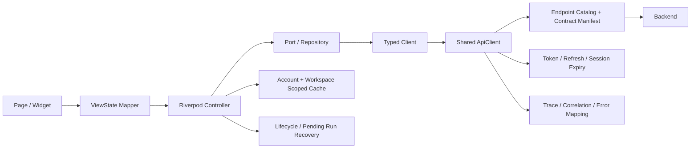
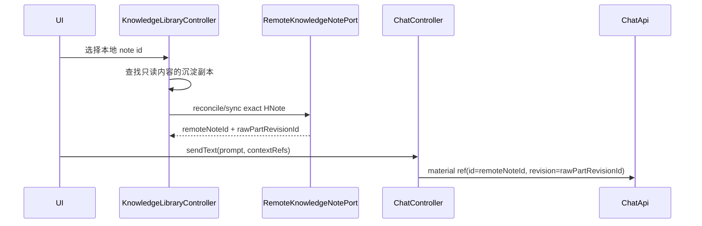
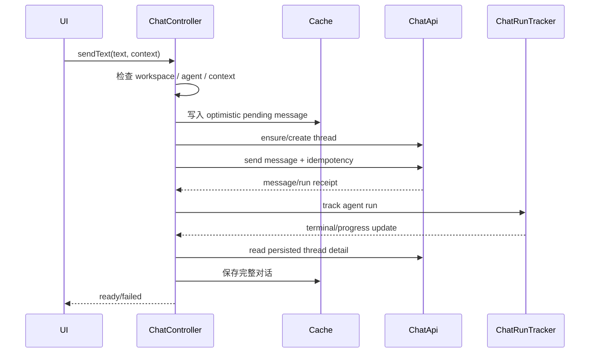
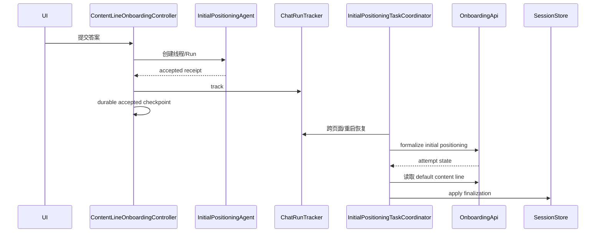

# 花火 AI Figma → Flutter UI 迁移与后端连续性执行方案 V2

> 本文不是“按截图重画页面”的说明，而是一份以 **现有后端/API 能力不回归** 为第一优先级的工程迁移方案。  
> 目标仓库：`git@github.com:Xieyangzai/Flutter-mobile.git`  
> 目标分支：`Flutter-Desk-Mobile`  
> 本次阅读基线：`178fd247ac56c50ce117a239dd9cdc3ffb906241`  
> 手机端目录：`Flutter/src/`  
> 共享 API 包：`Flutter/packages/huahuo_api/`  
> Figma 文件：`cB9ops5llz7DvBJ1QTvCu9 / 花火AI`

---

# 0. 本版修订说明

上一版有三个明显不足，本版已按此修正：

1. **补齐所有正式 Figma 输入链接**，每个功能模块都记录了链接、节点、范围和是否纳入实现。
2. **收窄 M05 范围**：M05 不再以整个 `816:2560` 画布作为实现依据；当前唯一视觉验收节点为：
   - `2084:22831`
   - `M34 · 聊天 / 聊一聊 · 引导问题`
3. **把“后端连续性”提升为主线**：本文详细记录当前 Flutter 工程如何完成鉴权、Workspace 绑定、缓存、HNote 同步、聊天、附件、语音、AgentRun、纲要、点火、文档 Diff、订阅、录音卡、Onboarding 和 Billing 接入，以及 UI 替换时哪些边界绝对不能改变。

本文的核心结论是：

> **新 Figma UI 只能替换 Presentation 层。现有路由参数、Provider Scope、Controller、Port、Repository、ApiClient、Endpoint Catalog、ETag、Revision、Idempotency、缓存和生命周期恢复机制，默认全部保留。**

---

# 1. Source of Truth：冲突时以什么为准

从高到低依次为：

1. **当前固定的 Git commit**
2. **正式 API Contract / Endpoint Catalog**
3. **当前 Controller、Port、Repository 的实现约束**
4. **本次明确纳入范围的 Figma 节点**
5. **Figma Prototype 的交互连线**
6. **旧 UI 的视觉表现**
7. **Demo/Mock/截图数据**

发生冲突时遵守以下规则：

- Figma 不得覆盖正式 API 字段、Agent ID、Revision、ETag 或错误码。
- Figma 中“延时后成功”的表现不能替代真实后端异步状态。
- 旧 UI 中能够工作的后端能力，迁移后必须继续通过原 Controller 调用。
- Figma 有按钮但当前无正式后端合同的，必须标记为 `unavailable` 或 `product-gate`，不能本地假成功。
- Prototype destination 只代表行为意图，不自动等于一个新的 Flutter Route。
- 开始编码前重新读取远端分支 HEAD；若不等于本文基线，先做差异审查并更新本文。

---

# 2. 正式 Figma 输入登记表

## 2.1 纳入范围的链接

| 编号 | 功能 | Figma 节点 | 正式链接 | 范围说明 |
|---|---|---:|---|---|
| M01 | 首页、Feed、采集、导入、搜索 | `377:1595` | https://www.figma.com/design/cB9ops5llz7DvBJ1QTvCu9/%E8%8A%B1%E7%81%ABAI?node-id=377-1595 | 模块级画布，需二次筛选 Route/State/Overlay |
| M02 | 笔记详情 | `438:4364` | https://www.figma.com/design/cB9ops5llz7DvBJ1QTvCu9/%E8%8A%B1%E7%81%ABAI?node-id=438-4364 | 原始、纲要、点火、笔记内聊天等 |
| M03 | 创作空间、自由创作、创作历史 | `377:1596` | https://www.figma.com/design/cB9ops5llz7DvBJ1QTvCu9/%E8%8A%B1%E7%81%ABAI?node-id=377-1596 | 编辑器及其状态机 |
| M04 | 我的资产 | `638:8213` | https://www.figma.com/design/cB9ops5llz7DvBJ1QTvCu9/%E8%8A%B1%E7%81%ABAI?node-id=638-8213 | 文件夹、笔记、沉淀、拖拽和操作 |
| M05 | 聊一聊入口页 | `2084:22831` | https://www.figma.com/design/cB9ops5llz7DvBJ1QTvCu9/%E8%8A%B1%E7%81%ABAI?node-id=2084-22831&t=hgX0iDzaQOFlHwN3-11 | **当前 M05 唯一视觉验收节点** |
| M06 | 我的、设置、账号、声纹、会员 | `739:7557` | https://www.figma.com/design/cB9ops5llz7DvBJ1QTvCu9/%E8%8A%B1%E7%81%ABAI?node-id=739-7557 | 模块级画布 |
| M07 | 知识广场 | `739:11214` | https://www.figma.com/design/cB9ops5llz7DvBJ1QTvCu9/%E8%8A%B1%E7%81%ABAI?node-id=739-11214 | 订阅、频道、文章、保存 |
| M08 | 代表作 | `1135:6808` | https://www.figma.com/design/cB9ops5llz7DvBJ1QTvCu9/%E8%8A%B1%E7%81%ABAI?node-id=1135-6808 | 代表作阅读、目录和协作 |
| M09 | 录音卡 | `1360:7418` | https://www.figma.com/design/cB9ops5llz7DvBJ1QTvCu9/%E8%8A%B1%E7%81%ABAI?node-id=1360-7418 | BLE、绑定、传输、文件、转写 |
| M10 | 启动引导 | `1360:8803` | https://www.figma.com/design/cB9ops5llz7DvBJ1QTvCu9/%E8%8A%B1%E7%81%ABAI?node-id=1360-8803 | Auth、问卷、定位、首次设备设置 |
| M11 | 顶层“我的”、日历、定位入口 | `1605:20590` | https://www.figma.com/design/cB9ops5llz7DvBJ1QTvCu9/%E8%8A%B1%E7%81%ABAI?node-id=1605-20590 | 左侧抽屉、日历和快捷入口 |

## 2.2 明确不作为当前视觉验收输入的内容

| 内容 | 处理 |
|---|---|
| M05 整个 `816:2560` 画布 | **不作为当前 M05 全量视觉实现范围** |
| M05 中个人 IP、获客营销、视觉设计、视频分析等复制状态机 | 后端能力继续保留，但当前不据此做视觉验收 |
| M05 其他附件、语音、历史、发送后 Frame | 可作为行为参考；除非后续明确给出链接，否则不作为像素级验收目标 |
| `Source copy`、`Reused`、`Prototype endpoint` | 不创建重复生产页面 |
| Figma 中绘制的 iOS 键盘 | 使用系统真实键盘，不在 Flutter 中重画 |
| 仅示例文章、示例文件名、示例日期不同的 Frame | 作为 Fixture，不创建新页面 |
| Smart Animate 的中间帧 | 不创建页面；必要时用 Flutter 动画实现 |

## 2.3 后续增加范围的规则

后续你提供新的精确节点时，必须在本文增加一行：

```text
Figma URL
Node ID
页面名称
是否 Route
是否状态
是否 Overlay
当前 Flutter Owner
当前 Backend Owner
验收优先级
```

没有登记的 Frame 不进入开发任务，避免再次被整页画布中的无关设计干扰。

---

# 3. 页面筛选：怎样判断哪些真正需要实现

每个 Frame 必须分类为：

| 分类 | 定义 | Flutter 实现 |
|---|---|---|
| `route` | 可深链接、进入返回栈、刷新后需要恢复 | `GoRoute` + Page |
| `state` | 页面主体不变，只是数据、异步任务或选中项变化 | Controller/ViewState |
| `overlay` | 关闭后仍停留原页面 | Sheet/Dialog/Drawer |
| `component` | 可复用的视觉构件 | Widget |
| `fixture` | 示例数据或测试内容 | Test Fixture |
| `ignore` | 键盘、Source Copy、中间动画帧等 | 不实现 |
| `product-gate` | Figma 有意图，但后端或产品语义尚未确认 | 禁用/待定，不假实现 |

## 3.1 Route 的最低条件

只有满足至少一项时才注册 Route：

- 支持系统返回栈；
- 支持 Deep Link；
- App 重启后需要通过 URL 恢复；
- 从通知/Push 可直接进入；
- 独立生命周期和数据加载；
- 需要 route-scoped Provider。

以下不注册 Route：

- Tab 切换；
- Loading/Failure/Success；
- Agent Picker；
- 文件夹选择；
- 重命名；
- 删除确认；
- “换一批”；
- 快捷问题选中；
- 键盘展开；
- 格式工具选中；
- 录音卡连接中。

---

# 4. 当前工程后端/API 是怎样接入的

## 4.1 实际调用链



新 UI 必须停在最左侧，不能跳过 Controller 直接访问 `ApiClient`。

## 4.2 Shared ApiClient 的职责

代码位置：

```text
Flutter/packages/huahuo_api/lib/src/api/api_client.dart
Flutter/src/lib/core/api/api_client.dart
```

当前 ApiClient 负责：

- 根据 `endpointId` 从 Catalog/Manifest 解析 Endpoint；
- 检查 prohibited/retired/contract-only 等状态；
- 生成 trace/request ID；
- 注入客户端版本、设备 ID、平台、语言、时区；
- 注入 Access Token；
- 统一处理 strict/legacy envelope；
- 处理 `202`、`204`、`304`、二进制和 SSE；
- 处理 `401` 刷新和 Session Expiry；
- 解析 `409` / `412` 冲突；
- 解析 `429` 限流和 retry metadata；
- 统一网络、超时、格式和兼容性错误；
- 注入 Idempotency Context；
- 阻止危险或不符合合同的请求字段。

因此 UI 改造时：

- 不得手写 `HttpClient`；
- 不得自行拼 URL；
- 不得自己加 Authorization Header；
- 不得根据截图猜测 Response JSON；
- 不得绕开 `endpointId`；
- 不得把旧页面里的 DTO 复制进新 UI。

## 4.3 Bootstrap 和 Provider 装配

核心位置：

```text
Flutter/src/lib/app/bootstrap/app_providers.dart
Flutter/src/lib/app/di/chat_providers.dart
```

关键机制：

- 主 API Base URL 来自 `HUAHUO_API_BASE_URL`；
- Recording 服务可使用独立 `HUAHUO_RECORDING_API_BASE_URL`；
- Release 环境要求 HTTPS；
- Token 存储在 Secure Store；
- SessionStore 管理用户、Workspace 与 Auth 状态；
- Cache 按用户和 Workspace 隔离；
- 登录且 Workspace Ready 后才装配 Remote Port；
- Demo Fixture 在生产路径中禁用；
- App 生命周期恢复时自动恢复：
  - Chat Run；
  - 上传任务；
  - 录音处理；
  - Workspace 内容同步；
  - Onboarding Accepted Run；
- Recording 服务的鉴权错误不应误清理主业务 Session。

UI 替换不能把 Provider 从根 Scope 移到临时 Widget Scope，也不能无意间改变 autoDispose、keepAlive 或 route-scoped override 的生命周期。

## 4.4 Route Scope 也是后端接入的一部分

聊天路由：

```text
/v3/feed/chat
```

当前会解析并校验：

```text
threadId
window
contentLineId
itemId
skill
agentProfileId
purpose
materialIds
analyzeAssets
dailyTopicTitle
```

对于有上下文的聊天，路由会创建 route-scoped `ProviderScope`，从而保证：

- 当前线程和 Agent 选择互不串线；
- 不同窗口/内容线的聊天状态隔离；
- 语音 Controller 与 Chat Controller 生命周期一致；
- Deep Positioning 与 General Chat 使用正确的 Controller；
- 页面离开时可以正确终止麦克风和前台线程标记。

因此：

> “换成新的聊天 UI”不能顺便把 `/v3/feed/chat` 改成一个普通 `Navigator.push(MaterialPageRoute(...))`。

---

# 5. UI 迁移中绝对不能破坏的后端连续性约束

## 5.1 十二条硬规则

1. **UI 不直接调用 ApiClient。**
2. **不复制现有业务 Controller。**
3. **不改变 Route 参数名称和安全校验。**
4. **不丢失 user/workspace-scoped cache。**
5. **不把 Remote ID 替换为 Local ID。**
6. **不丢失 HNote 的 `ownerRevisionId`、`rawPartRevisionId` 和 ETag。**
7. **Mutation 必须继续使用原 Idempotency Key 机制。**
8. **分页必须保留 Cursor 去重和重复 Cursor 防护。**
9. **异步 AgentRun 必须继续由 Tracker 恢复，而不是页面 Timer。**
10. **App 后台/前台、Route 离开/返回时必须保留现有恢复和取消行为。**
11. **附件只发送服务端 Resource ID，不发送本地文件路径。**
12. **未接入能力必须明确失败，不得静默使用 Mock 或其他 Agent。**

## 5.2 版本一致性约束

HNote、文档修改、Book/Work、文件夹等能力都存在版本语义：

```text
ETag
If-Match
owner revision
part revision
row version
proposal version
content cursor
binding generation
```

新 UI 必须将“点击时看到的版本”交给原 Controller，由 Controller/Port 决定：

- 成功；
- 冲突；
- 重新读取；
- Superseded；
- Stale；
- Retry。

UI 不应该在冲突时直接覆盖服务端。

## 5.3 双击与重复提交约束

新设计往往会增加更大的按钮和动画，容易引入重复点击。所有 Mutation UI 需做到：

- Controller busy 时禁用；
- 不在 Widget 内生成第二个并行 Future；
- 同一 intent 重用 Controller 的 Idempotency；
- 不因为 Widget rebuild 重新提交；
- Route 返回后不自动重复执行 Mutation；
- Retry 必须调用现有 retry 方法，而不是重新构造一套请求。

---

# 6. 推荐迁移架构：接线层与纯 UI 分离

## 6.1 Route Page 保持现有名字

例如：

```text
V3ChatPage
V3FeedItemDetailPage
V3CreationCanvasPage
V3MyAssetsPage
V3KnowledgeLibraryPage
V3RecordingCardLivePage
```

这些 Page 继续负责：

- Route 参数；
- Provider；
- 生命周期；
- RouteAware；
- Controller 操作；
- 错误/恢复；
- 转换 ViewState。

新建纯 UI Surface：

```text
ChatEntrySurface
ChatConversationSurface
NoteDetailSurface
CreationCanvasSurface
AssetsSurface
KnowledgeSurface
RecordingCardSurface
```

## 6.2 示例：禁止与正确写法

错误：

```dart
class NewChatScreen extends ConsumerWidget {
  @override
  Widget build(BuildContext context, WidgetRef ref) {
    return FilledButton(
      onPressed: () async {
        final api = ref.read(apiClientProvider);
        await api.request(...); // 禁止
      },
      child: const Text('发送'),
    );
  }
}
```

正确：

```dart
class ChatEntrySurface extends StatelessWidget {
  const ChatEntrySurface({
    required this.state,
    required this.onSend,
    required this.onVoice,
    required this.onOpenHistory,
    required this.onNewConversation,
    super.key,
  });

  final ChatEntryViewState state;
  final ValueChanged<String> onSend;
  final VoidCallback onVoice;
  final VoidCallback onOpenHistory;
  final VoidCallback onNewConversation;

  @override
  Widget build(BuildContext context) {
    // 只渲染 UI 和发出用户意图
  }
}
```

Route Page 中：

```dart
final chat = ref.watch(feedAiChatControllerProvider);
return ChatEntrySurface(
  state: ChatEntryViewState.fromController(chat),
  onSend: (text) => unawaited(_sendThroughExistingController(text)),
  onVoice: _handleVoice,
  onOpenHistory: _openHistory,
  onNewConversation: chat.startNewThread,
);
```

---

# 7. M05 精确节点 `2084:22831` 深度审查

## 7.1 当前唯一视觉目标

页面名：

```text
M34 · 聊天 / 聊一聊 · 引导问题
```

画板：

```text
402 × 874
```

可见内容包括：

- 返回；
- 标题“聊一聊”；
- 新建会话；
- 会话历史；
- Greeting：
  - `Hello，我是花火 AI`
  - `把你的想法整理成清晰、可执行的创作方向。`
- `猜你想问`
- `换一批`
- 三个快捷问题：
  1. `从我的笔记库选一篇生成选题`
  2. `去笔记库里面帮我选一篇生成选题`
  3. `帮我选一个今天的热点生成选题`
- 底部 Composer：
  - 添加上下文；
  - 文本输入；
  - 语音；
  - 发送；
- Disclaimer：
  - `内容由 AI 生成，仅供参考`

## 7.2 当前 Prototype 中能确认的行为

| 控件 | Figma 行为证据 | Flutter 解释 |
|---|---|---|
| 返回 | Back/Navigate back | `context.pop()`；无栈时走现有 fallback |
| 历史 | 打开会话记录 | 复用现有 Chat History |
| 添加 | 打开添加上下文 | 复用 Plus Menu |
| 快捷问题 1 | 打开笔记选择 | 先选笔记，再发送标准 Prompt |
| 快捷问题 2 | 进入发送后状态 | 具体后端语义未被 Figma 定义，需 Product Gate |
| 快捷问题 3 | 进入发送后状态 | 优先评估 Daily Topic，不得假造热点 |
| 语音 | 进入转写状态 | 复用 `VoiceMessageController` |
| 发送 | 进入读取工作空间/回复状态 | 复用 `ChatController.sendText()` 链路 |
| 新建会话 | 图标存在，但该刷新版本没有完整 reaction | 按当前 App 语义定义为清空当前 thread，首条发送时再创建 |
| 换一批 | UI 存在，但没有明确后端 reaction | 默认本地轮换 Prompt，不调用后端 |

Prototype destination Frame 可用于理解行为，但当前不纳入像素级验收。

## 7.3 M05 与当前 Flutter 的映射

```text
Route
└── /v3/feed/chat
    ├── V3ChatPage                   # 路由、生命周期与后端接线
    ├── ChatController               # 线程、消息、发送、缓存
    ├── ChatApi                      # 服务端 Chat/Thread/Run
    ├── ChatRunTracker               # AgentRun 跨页面恢复
    ├── ChatFileAttachmentUploader   # 上传资料
    ├── VoiceMessageController       # 录音/转写/发送
    ├── KnowledgeLibraryController   # 引用 HNote
    ├── WorkspaceSearchController    # 关键词搜索
    └── DailyTopicController         # 今日推荐
```

建议新增：

```text
presentation/chat/
├── chat_entry_surface.dart
├── chat_entry_view_state.dart
├── chat_suggestion_config.dart
├── chat_guided_questions.dart
├── chat_floating_composer.dart
└── chat_generation_disclaimer.dart
```

不新增：

```text
NewChatController
NewChatApi
M05ChatRepository
FigmaChatService
```

## 7.4 M05 每个控件的后端绑定

### A. 返回

执行：

```dart
context.pop();
```

保留当前 fallback：

- General Chat → Feed；
- Workbench Agent → Workbench；
- Masterpiece → Masterpiece；
- Deep Positioning → 对应流程。

不得硬编码为 Figma 的旧 destination node。

### B. 新建会话

建议语义：

1. 若当前无消息：保持当前空会话，不发 API。
2. 若当前有会话：
   - 调用现有 `startNewThread()`/等价动作；
   - 清空 active thread 的 UI 选择；
   - 保留历史缓存；
   - 不删除旧服务端线程。
3. 第一条消息发送时，由现有 Controller 懒创建新线程。

原因：

- 当前 Controller 已对 Thread 创建、Agent Profile、Purpose、Cache 和 Mutation 做绑定；
- 点击“新建”立即 POST Thread 会产生大量空线程；
- UI 不应自行创建 Thread。

### C. 会话历史

必须继续使用：

```text
ChatController.loadThreads()
ChatController.selectThread()
ChatController.updateThreadTitle()
ChatController.hideThread()
ChatThreadAliasRepository
```

注意：

- “隐藏本机历史”不等于服务端删除；
- 重命名要保留 expected version / idempotency；
- Thread List 的轻量结果不能覆盖已读取的完整消息；
- Account/Workspace 切换时必须清空错误账号的缓存。

### D. 添加上下文

当前 Plus Menu 能力：

- 引用我的资产；
- 上传资料；
- 视频分析时选择图片/视频/视频文件。

#### 引用资产完整流程



必须继续满足：

```text
note.syncState == synced
remoteNoteId 非空
rawPartRevisionId 非空
ID 通过安全校验
```

不得：

- 将本地 `note.id` 当服务端 ID；
- 把 `rawBody` 直接塞入自定义 JSON；
- 把本地路径发给 Chat API；
- 引用只读外部文章时绕过沉淀副本规则。

#### 上传资料完整流程

当前 `ChatFileAttachmentUploader` 已实现：

1. Native Picker；
2. 文件类型和数量限制；
3. 文件大小校验；
4. SHA-256；
5. Upload Token；
6. Object Store；
7. Complete Upload；
8. 获得 `resourceId`；
9. Chat 仅发送 Resource Input Part。

新 UI 只展示：

```text
uploading
ready
failed
retry
remove
```

不能自行实现上传。

### E. 文本发送

继续调用现有 Chat Controller。完整链路应保持：



新 UI 不得：

- 直接调用 `ChatApi.sendText`；
- 自行决定 Agent Profile ID；
- 在 Widget build 中触发 send；
- 用 Loading 动画的结束时间判断回答完成；
- 在失败后重复创建 Thread。

### F. 语音

继续使用 `VoiceMessageController`，保留：

- 麦克风权限；
- Native Recorder；
- 开始/暂停/继续/结束；
- 实时转写；
- 上传；
- ASR Poll；
- Retry；
- Route 离开时终止隐形录音；
- Recording Service 与主 Chat Service 的分离。

Figma 只负责语音按钮外观，不能重写录音状态机。

### G. “换一批”

当前精确节点没有确认后端动作。建议一期实现为：

```dart
suggestionBatchIndex = (suggestionBatchIndex + 1) % batches.length;
```

规则：

- 只切换本地 UI 文案；
- 不创建 Thread；
- 不调用 Chat API；
- 不消耗 Agent 配额；
- 不改变 Agent Profile；
- 埋点可以记录 `suggestion_batch_changed`，但不记录用户正文。

若未来产品要求服务端推荐，必须先有正式 Endpoint/Contract。

## 7.5 三个快捷问题的实施决策

### 快捷问题 1：从我的笔记库选一篇生成选题

**可实施，后端链路完整。**

流程：

1. 打开现有 Asset Picker；
2. 用户选择一篇；
3. 调用 `KnowledgeLibraryController` 完成 exact HNote sync；
4. 生成 `ChatContextReference(material)`；
5. 将标准 Prompt 写入 Composer 或直接二次确认发送；
6. 通过 ChatController 发送；
7. 成功后保留 Thread 与选中资产关联。

建议标准 Prompt 由配置对象管理：

```text
请基于我选择的这篇笔记，提炼一个最值得展开的创作选题，并说明：
1. 核心判断；
2. 目标读者；
3. 适合的表达角度；
4. 可直接开始写的结构。
```

Prompt 文案变化不能改变 Context Reference 结构。

### 快捷问题 2：去笔记库里面帮我选一篇生成选题

**当前标记为 `product-gate`。**

原因：

- 当前 `WorkspaceSearchController` 支持的是明确关键词搜索；
- 它不等于“让 AI 浏览整个笔记库并任意挑选”；
- 当前 Chat Context 也不会自动把全部笔记传给 Agent；
- Figma 只有发送后状态，没有定义候选范围、排序规则和隐私边界。

推荐一期行为二选一：

**方案 A，推荐：**

- 打开笔记选择器；
- UI 文案改成“去笔记库选一篇生成选题”；
- 用户明确选择；
- 走快捷问题 1 的安全链路。

**方案 B，需后端合同：**

- 增加正式“推荐候选笔记”能力；
- 服务端返回 HNote ID + Revision；
- 客户端逐条校验 exact revision；
- 用户确认后再发 Chat。

禁止：

- 把所有本地笔记正文拼进 Prompt；
- 随机选择本地笔记；
- 根据本地列表第一篇静默发送；
- 用 Workspace Keyword Search 传空关键词。

### 快捷问题 3：帮我选一个今天的热点生成选题

**当前标记为 `product-semantic-gate`。**

工程中已有 `DailyTopicController`，支持：

- list；
- get detail；
- mark read；
- dismiss；
- use；
- Workspace Gate；
- 本地缓存；
- ETag 412 重读；
- Idempotency。

但“每日推荐”是否等于“今天的热点”需要产品确认。

推荐实施：

1. Product 确认 Daily Topic 可作为热点来源；
2. `DailyTopicController.load()`；
3. 无 Recommendation 时显示明确 Empty/Unavailable；
4. 打开 Recommendation；
5. `markRead`；
6. 将 `recommendationId`、`topicId` 或标题作为现有 Route/Chat Context；
7. 通过 ChatController 发送；
8. 若调用 `use()`，保留现有 Idempotency 和刷新。

禁止调用历史上已 retired/prohibited 的热点 Endpoint，也禁止用前端静态热点伪装真实内容。

---

# 8. 当前后端能力状态总表

状态定义：

| 状态 | 含义 |
|---|---|
| `wired` | 代码已经通过 Remote Port/Typed Client 接入 |
| `verify-env` | 代码已接入，但必须在目标环境验证 Endpoint、权限或第三方 |
| `local` | 当前主要是本地存储/Native 能力 |
| `unavailable` | 当前明确无正式 Backend |
| `product-gate` | 技术可做，但产品语义或数据边界未确认 |

| 模块 | 能力 | 状态 | 迁移策略 |
|---|---|---|---|
| Auth | Token、Refresh、Session、Workspace | `wired` | 完全保留 |
| Chat | Thread、Message、AgentRun、Runtime | `wired` | 新 UI 接现有 Controller |
| Chat Attachment | Token/Object Store/Complete | `wired` | 复用 Uploader |
| Chat Voice | Native Capture、Upload、ASR | `verify-env` | 真机与 Recording 服务验证 |
| HNote | Create/Update/List/Part/Tombstone/Restore | `wired` | 保留 revision/etag |
| Outline | HNote exact revision + AgentRun | `verify-env` | Profile/Skill 发布状态要验证 |
| Sprout/点火 | Faya AgentRun | `verify-env` | 不允许静默降级 |
| Workspace Folder | Create/Rename/Move/Delete/Restore/Batch Move | `verify-env` | 代码有 Remote Port，需环境验收 |
| Workspace Search | Keyword Search + exact HNote hydration | `wired` | 仅明确关键词 |
| Daily Topic | list/get/read/dismiss/use | `verify-env` | 与“热点”语义需确认 |
| Knowledge Subscription | Catalog/Follow/Unfollow/Article/Save | `verify-env` | 保留只读/沉淀关系 |
| Creation Draft | Local draft/history | `local` | 保留本地恢复 |
| Document Proposal | Create/Poll/Diff/Candidate/Apply/Reject/Cancel | `verify-env` | 保留 hash/revision/etag |
| Book/Work | Book、Work、Part、Complete、Promote | `verify-env` | 代表作 UI 接现有 Controller |
| Recording Card BLE | 扫描/连接/文件/传输 | `local` + Native | 不用 HTTP 替代 BLE |
| Recording Card Binding | Cloud bind/unbind/current | `verify-env` | 保留硬件前置检查 |
| Onboarding | Intake、AgentRun、Formalization、Session Finalize | `wired`/`verify-env` | 保留 durable checkpoint |
| Profile Account Security | 微信/手机/邮箱/密码 | `unavailable` | UI 明确未开放 |
| Support Feedback | Bug 提交 | `unavailable` | 不假提交 |
| Version Check | `appConfig` | `wired` | UI 接现有 Port |
| Billing | Catalog、Membership、Android/iOS Purchase、Recovery | `verify-env` | 沙箱和真机专项 |

---

# 9. 各 Figma 模块的后端保留方案

# 9.1 M01：首页、采集、导入

Figma：

https://www.figma.com/design/cB9ops5llz7DvBJ1QTvCu9/%E8%8A%B1%E7%81%ABAI?node-id=377-1595

当前主要代码：

```text
v3_app_shell.dart
v3_feed_page.dart
v3_feed_quick_dock.dart
v3_link_import_page.dart
v3_document_import_page.dart
v3_capture_pages.dart
features/ingestion/application/material_ingestion_coordinator.dart
```

后端链路：

```text
UI
→ MaterialIngestionCoordinator
→ UploadClient / MaterialIngestionApi / RecordingApi
→ Persistent Ingestion Store
→ Poll
→ GeneratedMemoryNote
→ KnowledgeLibraryController
```

当前 Coordinator 已承担：

- Link URL normalize；
- 去重 recoverable draft；
- Internal recording SHA-256 去重；
- Upload Token / Object Store / Complete；
- Recording 创建；
- Link task 创建；
- Poll；
- Retry；
- Cancel；
- App 重启恢复；
- 成功后写入 Knowledge Library；
- Diagnostic correlation ID；
- 私有媒体清理。

迁移要求：

- Loading 页面只读 Coordinator 状态；
- 不在新 Import Page 中直接调用 UploadClient；
- 不因页面关闭取消可恢复任务，除非用户明确点击取消；
- Retry 使用同一个 Draft/Submit Key；
- 成功后使用 Coordinator 产出的 Note ID 跳笔记详情；
- App 启动恢复仍由 Root Provider 触发；
- 1D/2D/3D 是 Feed View 状态，不影响 Ingestion。

测试：

- 相同链接重复提交；
- 相同录音 hash 重复提交；
- Upload Token 成功、Object Store 失败；
- Complete Upload 失败；
- App 被杀后恢复；
- Poll 超时；
- 用户取消；
- 成功后 Knowledge Library 可见。

---

# 9.2 M02：笔记详情、纲要、点火

Figma：

https://www.figma.com/design/cB9ops5llz7DvBJ1QTvCu9/%E8%8A%B1%E7%81%ABAI?node-id=438-4364

当前代码：

```text
v3_feed_item_detail_page.dart
feed_item_detail_controller.dart
knowledge_library_controller.dart
knowledge_note_port.dart
outline_repository.dart
sprout_repository.dart
note_file_agent_client.dart
faya_germination_client.dart
chat_run_tracker.dart
```

## HNote 同步

当前 HNote 不是简单的本地 Markdown：

```text
local note id
remoteNoteId
ownerRevisionId
rawPartRevisionId
ETag
syncState
syncErrorCode
```

创建/更新流程可能拆分为：

- Metadata；
- Raw Part；
- Exact Revision Read；
- Conflict Reload。

新 UI 必须继续显示：

```text
syncing
synced
conflicted
failed
read-only
```

不能把本地保存成功等同于云端同步成功。

## 纲要

现有流程：

1. `startOutline()`；
2. `_prepareDerivedPartSource()`；
3. Sync HNote；
4. 验证 exact raw revision；
5. 根据来源选择 Agent/Skill；
6. Submit Note File Agent Run；
7. ChatRunTracker Track；
8. Terminal 后读取 HNote Head；
9. 验证目标 Part Revision；
10. 更新 Library；
11. 页面恢复时重新 reconcile。

新 UI 只能映射：

```text
notStarted → empty
running    → loading
succeeded  → result
failed     → error
```

不能自行生成内容。

## 点火

与纲要类似，但使用 Faya selector。必须保留：

- exact source revision；
- Published Agent/Skill Gate；
- Outdated outline/source detection；
- result contract；
- retry；
- run tracker。

## 录音笔记纲要

录音笔记可能由 Recording Processing API 管理，而不是通用 Outline Agent。新 UI 必须继续通过 Controller 判断：

```text
usesBackendRecordingOutline
canGenerateOutline
canRetryOutline
```

不能把所有笔记统一走同一个按钮请求。

测试：

- 未同步 Note；
- Read-only Note；
- Sync superseded；
- HNote revision changed；
- Run accepted 后退出页面；
- App resume；
- Run failed；
- Result part empty；
- Recording outline retry；
- 同时快速点击 Generate 两次。

---

# 9.3 M03：自由创作与文档 AI

Figma：

https://www.figma.com/design/cB9ops5llz7DvBJ1QTvCu9/%E8%8A%B1%E7%81%ABAI?node-id=377-1596

当前代码：

```text
v3_creation_canvas_page.dart
creation_canvas_draft_repository.dart
creation_canvas_history_port.dart
canvas_document_codec.dart
canvas_ai_controller.dart
document_change_proposal_controller.dart
document_change_proposal_api.dart
```

## 本地草稿与正式笔记必须区分

本地草稿保存：

- Quill Delta JSON；
- Markdown；
- Title；
- Linked Materials；
- Source Topic；
- synchronizedNoteId；
- local revision；
- created/updated time。

正式保存：

1. Create/Update Manual Note；
2. 分类为 Creation；
3. Flush Persistence；
4. 写本地 Creation History；
5. 若保存期间正文继续变化，只把旧版本记为已保存；
6. 清理已使用 Draft；
7. 跳转笔记详情。

新 UI 改造 Editor 外壳时，不能丢失：

- `_pendingSavedId`；
- `_baselineSignature`；
- `_documentRevision`；
- `_allowLeave`；
- Draft Conflict；
- Source Topic；
- Linked Materials；
- Owned Canvas Image cleanup。

## 服务端文档修改 Proposal

现有服务端链路：

```text
同步当前 Canvas 为 exact HNote
→ createDocumentChangeProposal
→ poll proposal
→ getDiff cursor
→ getCandidate cursor
→ 校验 proposalVersion
→ 校验 candidate offset
→ 校验 SHA-256
→ 用户 Apply/Reject
→ If-Match + Idempotency
→ 校验 applied part/owner revision
→ adoptAppliedRawPartProposal
→ 替换本地 Quill 文档
```

新 Figma 中“AI 思考中、差分等待确认、应用、拒绝”只能替换 UI；不能减少上述校验。

禁止：

- AI 返回后直接 `controller.document = candidate`；
- 忽略本地正文在生成期间变化；
- 忽略 proposal stale；
- 关闭 Sheet 时不 Cancel 正在生成的 Proposal；
- Apply 失败后本地先显示成功。

---

# 9.4 M04：我的资产和文件夹

Figma：

https://www.figma.com/design/cB9ops5llz7DvBJ1QTvCu9/%E8%8A%B1%E7%81%ABAI?node-id=638-8213

当前代码：

```text
v3_my_assets_page.dart
knowledge_library_controller.dart
knowledge_note_port.dart
workspace_folder_port.dart
workspace_search_controller.dart
```

当前 Remote Folder Port 已实现：

- Read；
- Create；
- Rename；
- Move；
- Delete；
- Restore；
- Batch Move HNotes；
- ETag；
- Idempotency；
- Server event/result validation。

注意：代码中已有 Remote Port 不等于目标环境已完全可用。开发前仍需：

- 读取 Endpoint Inventory；
- 在测试环境调用；
- 确认权限；
- 确认排序合同；
- 确认删除文件夹后笔记去向；
- 确认撤销时限。

迁移要求：

- Folder 展开/折叠只属于本地 UI State；
- Folder Create/Rename/Delete 必须走 Port；
- Note Move 必须走 Batch Move；
- UI 乐观更新必须有 rollback；
- ETag Conflict 要重载；
- “创建副本”必须使用正式 Note Create，不得只复制 List Item；
- 系统分享应传正式可分享内容/链接；无合同则只分享本地文本并明确能力边界；
- Search 用 Workspace Keyword Search，不能对未加载全量数据假装全局搜索。

---

# 9.5 M05：聊一聊

Figma：

https://www.figma.com/design/cB9ops5llz7DvBJ1QTvCu9/%E8%8A%B1%E7%81%ABAI?node-id=2084-22831&t=hgX0iDzaQOFlHwN3-11

以第 7 章为具体实现规范。

本模块开发不读取整个 M05 画布作为视觉范围。

---

# 9.6 M06：我的、设置、账号、声纹、会员

Figma：

https://www.figma.com/design/cB9ops5llz7DvBJ1QTvCu9/%E8%8A%B1%E7%81%ABAI?node-id=739-7557

当前代码：

```text
v3_profile_side_panel.dart
v3_account_profile_page.dart
v3_voiceprint_page.dart
features/settings/
features/billing/
profile_capability_ports.dart
```

能力分组：

### 可直接接现有能力

- 本地外观设置；
- 声纹；
- 回收站/HNote lifecycle；
- 版本检查 `appConfig`；
- Billing Catalog；
- Membership；
- Android 微信/支付宝 Order；
- iOS Store Purchase；
- Pending Order Recovery；
- Transaction History。

### 当前明确不可用

- 微信绑定；
- 手机换绑；
- 邮箱绑定；
- 密码修改；
- Support Bug Submit。

这些 Port 当前返回明确 unavailable。新 UI 应：

- 禁用提交；
- 显示“服务尚未开放”；
- 不使用 Demo Port 作为生产成功；
- 不保存用户密码；
- 不模拟验证码成功。

### Billing 迁移硬约束

Billing UI 只调用 `BillingController`，必须保留：

- Catalog 与协议版本；
- iOS Store Price 覆盖；
- App Account Token；
- Android Create Order；
- Payment App Availability；
- Pending Order Store；
- Server Confirm；
- iOS Verification；
- Restore Purchase；
- Purchase Stream；
- 并发与重复 Verification 防护。

会员套餐 Frame 只是 UI State，不是新 Route。

---

# 9.7 M07：知识广场

Figma：

https://www.figma.com/design/cB9ops5llz7DvBJ1QTvCu9/%E8%8A%B1%E7%81%ABAI?node-id=739-11214

当前代码：

```text
v3_knowledge_library_page.dart
knowledge_library_controller.dart
subscription_port.dart
workspace_search_controller.dart
knowledge_note_port.dart
```

Remote Subscription 能力：

- Fast first-screen catalog；
- Cursor 完整分页；
- Follow/Unfollow；
- Exact Article Read；
- Article Asset；
- Save Article as Note；
- Idempotency；
- Response validation。

迁移要求：

- 外部 Article 保持 Read-only；
- 保存后产生 Owned HNote；
- 已保存副本与原 Article 的关系保留；
- Follow/Unfollow 按钮 busy 时禁用；
- Catalog 快速首屏与完整分页不能被 UI 当成重复数据；
- 返回页面时继续 refresh；
- Filter 只改变 Query/Category，不直接修改服务端订阅；
- 保存目录选择走正式 Folder/Note 流程。

测试：

- Catalog 第一页与后续页重复；
- Follow 失败；
- Unfollow 失败；
- Article revision mismatch；
- 保存成功但本地刷新延迟；
- Read-only Article 被错误编辑；
- Workspace 切换。

---

# 9.8 M08：代表作

Figma：

https://www.figma.com/design/cB9ops5llz7DvBJ1QTvCu9/%E8%8A%B1%E7%81%ABAI?node-id=1135-6808

当前代码：

```text
v3_masterpiece_page.dart
features/book_work/application/mobile_book_work_controller.dart
features/book_work/data/mobile_book_work_port.dart
```

Remote Book/Work 能力：

- Book Detail；
- Work Page Cursor；
- Work Detail；
- Book Section Part Exact Revision；
- Work Part Exact Revision；
- Complete Work；
- Promote Work to Book；
- ETag；
- Idempotency；
- Identity Binding；
- Selection superseded；
- Cursor repeat detection；
- Duplicate work conflict。

迁移要求：

- 目录打开是 Overlay；
- Reader/Edit 是同一页面状态；
- Work Complete/Promote 必须调用 Controller；
- Part 打开必须使用当前 head revision；
- Workspace/User 切换时 Controller binding generation 变化，旧响应必须丢弃；
- 不能根据本地 Markdown 直接宣称已 Promote；
- “每 7 天/每月”如果只是展示计划，不应无合同写服务端。

---

# 9.9 M09：录音卡

Figma：

https://www.figma.com/design/cB9ops5llz7DvBJ1QTvCu9/%E8%8A%B1%E7%81%ABAI?node-id=1360-7418

当前代码：

```text
v3_recording_card_live_page.dart
v3_recording_card_detail_page.dart
v3_transcription_detail_page.dart
recording_card_controller.dart
recording_card_account_binding_controller.dart
recording_card_account_binding_repository.dart
recording_card_auto_sync_coordinator.dart
recording_card_native_port.dart
recording_api.dart
```

录音卡是三层组合：

```text
Figma UI
→ RecordingCardController
→ Native RecordingCardPort (BLE/Wi-Fi/File)

账户绑定 UI
→ RecordingCardCloudBindingController
→ RecordingCardBindingClient
→ Main Backend

录音上传/转写
→ RecordingApi
→ Recording Service
```

## BLE Controller 已处理

- Permission；
- Scan；
- Discovered device authorization；
- Provisional Connection；
- Cloud authorization；
- Connection history；
- Recording transition；
- File scan coalescing；
- Download verification；
- Wi-Fi Batch；
- Pause/Resume/Cancel；
- BLE Recovery；
- Batch persistence；
- Delete；
- Error mapping。

新 UI 不能根据一个 `connected` bool 简化掉 provisional authorization。

## Cloud Binding 前置条件

绑定前必须：

```text
已连接
录音处于 idle
没有传输
没有命令进行中
用户已登录
```

Bind/Unbind 使用 Idempotency；成功后的云端状态是权威，Local Cache 仅加速授权。

## 录音卡验收必须使用真机

模拟器只能验 UI State。以下必须真机：

- 蓝牙权限；
- 系统蓝牙关闭；
- 扫描；
- 连接；
- 账号授权；
- 录音状态；
- BLE 文件列表；
- Wi-Fi Hotspot；
- 批量传输；
- 后台/前台；
- App 被杀恢复；
- 删除和校验；
- Recording Service 上传/转写。

---

# 9.10 M10：启动引导

Figma：

https://www.figma.com/design/cB9ops5llz7DvBJ1QTvCu9/%E8%8A%B1%E7%81%ABAI?node-id=1360-8803

当前代码：

```text
content_line_onboarding_controller.dart
initial_positioning_task_coordinator.dart
initial_positioning_agent.dart
onboarding_api.dart
onboarding_progress_repository.dart
v3_first_launch_device_setup_page.dart
```

当前流程并非简单问卷：



迁移要求：

- 有业务 4 步和没业务 7 步只是同一个 Controller 的不同 question list；
- 每步切换不注册 Route；
- Draft 和 deferred progress 继续持久化；
- Submit 后 Controller 需要 keepAlive；
- Accepted Run 离开页面后继续完成；
- Progress Page 读取 Task Coordinator；
- Finalization 成功后才更新 Session；
- 失败状态允许 retry；
- 不用 UI Timer 把 Running 自动切 Succeeded；
- 首次设备设置是后续独立流程，跳过状态也要持久化。

---

# 9.11 M11：顶层“我的”、日历、深度定位

Figma：

https://www.figma.com/design/cB9ops5llz7DvBJ1QTvCu9/%E8%8A%B1%E7%81%ABAI?node-id=1605-20590

当前代码：

```text
v3_app_shell.dart
v3_profile_side_panel.dart
v3_activity_calendar_page.dart
v3_deep_positioning_page.dart
profile_workspace_controller.dart
recording_card_controller.dart
```

迁移要求：

- 左侧抽屉保持 Overlay；
- 抽屉中录音卡状态来自 Controller，不复制状态；
- 日历日期切换是页面状态/query；
- 深度定位跳现有 Route；
- 快捷入口统一使用 `AppRoutePaths`；
- 抽屉关闭后再执行 Route Push，避免 Overlay 与 Route 栈错乱。

---

# 10. 文件级实施方案

## 10.1 新增目录

```text
Flutter/src/lib/features/ui_v3/presentation/
├── figma_migration/
│   ├── feature_flags.dart
│   ├── async_view_state.dart
│   └── backend_availability_view.dart
│
├── chat/
│   ├── chat_entry_surface.dart
│   ├── chat_entry_view_state.dart
│   ├── chat_suggestion_config.dart
│   ├── chat_guided_questions.dart
│   ├── chat_floating_composer.dart
│   └── chat_generation_disclaimer.dart
│
├── note_detail/
│   ├── note_detail_surface.dart
│   ├── note_detail_view_state.dart
│   ├── note_detail_mapper.dart
│   ├── note_detail_header.dart
│   ├── note_stage_tabs.dart
│   ├── note_raw_surface.dart
│   ├── note_outline_surface.dart
│   ├── note_ignite_surface.dart
│   └── note_creation_dock.dart
│
├── creation/
│   ├── creation_canvas_surface.dart
│   ├── creation_toolbar.dart
│   ├── creation_ai_toolbar.dart
│   └── creation_proposal_surface.dart
│
├── assets/
│   ├── assets_surface.dart
│   ├── assets_view_state.dart
│   ├── asset_folder_section.dart
│   └── asset_action_sheets.dart
│
└── knowledge/
    ├── knowledge_home_surface.dart
    ├── knowledge_channel_surface.dart
    └── knowledge_save_picker.dart
```

## 10.2 入口文件保留

以下文件不删除，只逐步变薄：

```text
v3_chat_page.dart
v3_feed_item_detail_page.dart
v3_creation_canvas_page.dart
v3_my_assets_page.dart
v3_knowledge_library_page.dart
v3_recording_card_live_page.dart
v3_masterpiece_page.dart
```

## 10.3 后端层默认不修改

第一阶段禁止修改：

```text
packages/huahuo_api/
core/api/
features/chat/data/
features/chat/application/chat_controller.dart
knowledge_note_port.dart
outline_repository.dart
sprout_repository.dart
recording_card_controller.dart
onboarding_api.dart
billing_api.dart
```

只有发现真实 Bug 且有独立测试时，才在单独 PR 修改后端接入层，不能和大面积 UI PR 混在一起。

---

# 11. Feature Flag 和回滚

建议迁移期间保留旧 Surface：

```dart
const useFigmaChatEntryV2 = bool.fromEnvironment(
  'HUAHUO_FIGMA_CHAT_ENTRY_V2',
  defaultValue: false,
);
```

Route 与 Controller 不变：

```dart
return useFigmaChatEntryV2
    ? ChatEntrySurfaceV2(...)
    : ExistingChatBody(...);
```

推荐 flags：

```text
HUAHUO_FIGMA_CHAT_ENTRY_V2
HUAHUO_FIGMA_NOTE_DETAIL_V2
HUAHUO_FIGMA_CREATION_V2
HUAHUO_FIGMA_ASSETS_V2
HUAHUO_FIGMA_KNOWLEDGE_V2
```

规则：

- Flag 只切 UI，不切 Repository；
- 同一时刻只有一套 UI 能发 Mutation；
- 旧 UI 保留到 Integration Test 和真机验收通过；
- 不通过数据库 schema change 实现 UI 切换；
- 出现线上问题时可回滚 UI，而不影响已创建的 Thread、HNote、Proposal、Order 或 Recording。

---

# 12. Characterization First：改 UI 前先锁住现有后端行为

每个模块改造前先写“行为表征测试”，不是先重构。

## 12.1 Chat 必须先锁住

- 路由参数解析；
- route-scoped Controller；
- Cached Thread Restore；
- First Message Lazy Create；
- Optimistic Message；
- Idempotent Retry；
- Agent Profile Gate；
- Context Reference；
- Attachment Resource ID；
- Run Tracking；
- App Resume；
- Route Leave Voice Cancel；
- Account Switch Cache Isolation。

## 12.2 HNote 必须先锁住

- Create Manual Note；
- Update Metadata/Raw；
- ETag 412；
- Revision mismatch；
- Sync superseded；
- Read-only；
- Tombstone/Restore；
- Page cursor；
- exact part hydration。

## 12.3 Document Proposal 必须先锁住

- Proposal create；
- polling；
- repeated cursor；
- candidate offset；
- candidate hash；
- local document changed；
- apply ETag conflict；
- mutation recovery；
- cancel during create。

## 12.4 Onboarding 必须先锁住

- 两个 Intake 分支；
- Draft；
- Defer；
- Accepted Run；
- Page Dispose 后继续；
- App Restart；
- Formalization；
- Default Content Line；
- Session finalize；
- Failure retry。

---

# 13. 分阶段执行计划

# Phase 0：固定范围与后端基线

产物：

```text
docs/figma_migration/
├── execution_plan_v2.md
├── screen_manifest.md
├── route_matrix.md
├── backend_binding_matrix.md
├── api_gate_register.md
└── state_coverage.md
```

任务：

- [ ] 重新确认 Branch HEAD；
- [ ] 固定 Commit；
- [ ] 列出所有正式 Figma 链接；
- [ ] M05 只登记 `2084:22831`；
- [ ] 为每个可点击控件登记 Controller Owner；
- [ ] 为每个 Mutation 登记 Port、Idempotency、ETag/Revision；
- [ ] 标记 wired/verify-env/local/unavailable/product-gate；
- [ ] 更新 SCM 和 `SOURCE_TREE.md`。

完成标准：

- 没有一个按钮处于“先做 UI，以后再想接什么 API”的状态。

---

# Phase 1：只实现 M05 精确入口页

目标：

- 视觉只对齐 `2084:22831`；
- 后端完全复用当前 Chat；
- 不重做其他 Agent 页面。

任务：

- [ ] 抽 `ChatEntrySurface`；
- [ ] Greeting；
- [ ] Guided Questions；
- [ ] 本地“换一批”；
- [ ] Floating Composer；
- [ ] New Thread；
- [ ] History；
- [ ] Add Context；
- [ ] Voice；
- [ ] Send；
- [ ] Disclaimer；
- [ ] Quick Action 1；
- [ ] Quick Action 2 标记 Product Gate；
- [ ] Quick Action 3 接 Daily Topic Gate；
- [ ] 旧 UI Feature Flag 回退。

必须修改：

```text
v3_chat_page.dart
presentation/chat/*
shared/theme/*
test/*
SCM
SOURCE_TREE.md
```

默认不修改：

```text
chat_controller.dart
chat_api.dart
api_client.dart
```

验收：

- 新 UI 与旧 UI 使用同一 Controller 实例；
- 首条发送创建一个 Thread；
- 快速双击发送不会创建两个 Thread；
- 历史可恢复；
- 语音离开 Route 后停止；
- 笔记引用发送 exact HNote ref；
- 附件只发送 Resource ID；
- 401 Refresh 正常；
- 429 展示可重试状态；
- App Resume 后回复恢复；
- M05 视觉只用精确节点验收。

---

# Phase 2：笔记详情与聊天衔接

目标链路：

```text
首页
→ 笔记详情
→ 纲要
→ 点火
→ 聊天
→ 返回笔记
```

任务：

- [ ] 抽 NoteDetailSurface；
- [ ] 原始/纲要/点火；
- [ ] Outline 四态；
- [ ] Sprout 四态；
- [ ] RouteAware Refresh；
- [ ] Pending Run Acknowledge；
- [ ] Chat Route 携带 itemId/threadId；
- [ ] 返回后 Derived Part Refresh；
- [ ] Recording Outline 分支不回归。

验收：

- exact revision；
- Run 退出恢复；
- Result stale 不展示为成功；
- Read-only 行为正确；
- 重试不重复提交。

---

# Phase 3：自由创作

任务：

- [ ] 只替换编辑器 Chrome；
- [ ] 保留 Quill；
- [ ] 保留 Draft；
- [ ] 保留 Image Ownership；
- [ ] 保留 Save Race；
- [ ] 保留 Document Proposal；
- [ ] Diff Review 新 UI；
- [ ] App Background/Resume；
- [ ] 未保存返回。

验收：

- Proposal candidate hash；
- 本地正文变化后禁止 Apply；
- Save 时继续编辑不丢内容；
- Draft 恢复；
- Server/Local Revision 一致。

---

# Phase 4：资产与知识

资产：

- Folder Remote Port；
- HNote Move；
- Delete/Restore；
- Search。

知识：

- Subscription；
- Article；
- Save as Note；
- Read-only。

重点验收：

- Workspace 切换；
- Cursor；
- ETag；
- Optimistic rollback；
- 原文章与沉淀副本关系。

---

# Phase 5：Onboarding、代表作、录音卡、Billing

这四部分风险较高，应独立 PR 和专项环境：

- Onboarding：AgentRun + Session Finalize；
- 代表作：Book/Work Exact Part；
- 录音卡：Native/BLE + Cloud Binding + Recording Service；
- Billing：Store/Payment Provider + Server Confirm。

---

# 14. 后端测试矩阵

## 14.1 通用 HTTP 情况

每个 Remote Port 至少覆盖：

| 情况 | 预期 |
|---|---|
| 200 strict envelope | 正确解析 |
| 200 legacy envelope | 仅在合同允许时解析 |
| 202 accepted | 进入 Tracker/Poll |
| 204 empty | 不做 JSON parse |
| 304 | 使用缓存，不视为错误 |
| 400 | 显示业务错误，不重试 |
| 401 首次 | Token Refresh 后重放 |
| 401 再次 | Session Expired |
| 403 | 能力/权限不可用 |
| 404 | 区分资源不存在和服务未发布 |
| 409 | Conflict |
| 412 | ETag/Revision 重读 |
| 429 | 保留 Retry Metadata |
| 5xx | Retryable Failure |
| Timeout | 不丢 Idempotency Intent |
| Invalid JSON | Contract Error |
| Duplicate Cursor | Fail Fast |
| Account Switch | 丢弃旧响应 |
| Workspace Switch | 丢弃旧响应 |

## 14.2 生命周期

- Route push 覆盖当前页；
- Route pop 回来；
- App inactive；
- App background；
- App terminated；
- App cold start；
- Token 过期；
- Workspace 恢复；
- 网络从离线变在线；
- Permission Prompt 后用户切 App；
- 上传中被杀；
- AgentRun 中被杀；
- Recording transfer 中被杀。

## 14.3 数据完整性

必须验证：

```text
Local ID != Remote ID 时仍正确
Revision 更新
ETag 更新
Thread ID 稳定
Resource ID 稳定
Idempotency 重试不重复写
Cache 不跨账号
Read-only 不被更新
Failed Mutation 不显示 Success
```

---

# 15. Widget / Golden / Integration Test

## Widget Test

- M05 exact initial layout；
- 快捷问题；
- 换一批；
- New Thread；
- Composer；
- Keyboard Insets；
- Loading/Failure/Unavailable；
- Long Text；
- Semantics；
- 390/402/430 宽度。

## Golden

只对纳入范围的节点做视觉基线。M05 目前只做：

```text
2084:22831 初始引导页
```

其他 M05 状态不做像素级验收，除非后续提供精确链接。

## Integration

核心：

```text
打开 M05
→ 选择笔记
→ HNote Sync
→ 发送
→ 创建 Thread
→ Run
→ 回复
→ 历史
→ 新会话
→ App Resume
```

故障：

```text
Sync 失败
Upload 失败
Voice Permission 拒绝
401 Refresh
429
Run Failed
App Background
```

---

# 16. Observability

UI 迁移后需要保留和补充：

- Correlation ID；
- Endpoint ID；
- Error Code；
- Controller State Transition；
- Route；
- Thread/Run/Note ID 的安全哈希或非敏感 ID；
- Upload Stage；
- Sync Outcome；
- Lifecycle Event；
- Feature Flag。

禁止日志：

- Access Token；
- Refresh Token；
- 密码；
- 完整录音路径；
- 本地私有 URI；
- 用户完整正文；
- 手机号/邮箱明文；
- 支付凭证；
- 录音卡完整序列号。

建议事件：

```text
figma_ui_surface_opened
chat_suggestion_clicked
chat_context_note_selected
chat_context_sync_failed
chat_send_started
chat_send_failed
chat_run_recovered
note_outline_started
note_outline_recovered
document_proposal_stale
recording_card_authorization_failed
```

---

# 17. API Gate Register：必须由产品或后端确认的点

| 编号 | 问题 | 默认处理 |
|---|---|---|
| G01 | M05 快捷问题 2 是否允许 AI 浏览整个笔记库 | 默认改为用户选择 |
| G02 | M05 “今天的热点”是否等同 Daily Topic | 未确认则不可自动发送 |
| G03 | “换一批”是否需要服务端推荐 | 默认本地轮换 |
| G04 | Folder Delete 后笔记去向 | 合同确认前不开放删除 |
| G05 | Folder Reorder 是否有服务端排序字段 | 无合同则只本地且不宣称同步 |
| G06 | Share 是否需要生成公共链接 | 无合同仅使用系统本地分享 |
| G07 | Profile 手机/邮箱/密码接口 | 当前显示未开放 |
| G08 | Billing 目标环境和商品配置 | 沙箱成功前不开放生产购买 |
| G09 | 代表作周期计划是否服务端持久化 | 无合同只展示，不写服务端 |
| G10 | M05 其他 Frame 是否进入视觉验收 | 必须后续给精确链接 |

---

# 18. PR 拆分

建议：

```text
PR-00 文档、Manifest、Backend Binding Matrix
PR-01 M05 Characterization Tests
PR-02 ChatEntrySurface 纯 UI
PR-03 M05 接现有 Chat Controller
PR-04 M05 笔记引用和 Quick Action 1
PR-05 M05 Daily Topic Gate 和 Quick Action 3
PR-06 NoteDetailSurface
PR-07 Note Outline/Sprout 接线回归
PR-08 Creation Chrome
PR-09 Document Proposal Review UI
PR-10 Assets Surface
...
```

每个 PR 必须报告：

```text
基线 commit
Figma exact node
修改的 SCM
修改的源文件
Controller/Port 是否改变
Endpoint 是否改变
Idempotency/ETag/Revision 是否改变
测试
模拟器
真机
API 环境
未验证项
回滚 Flag
```

---

# 19. 第一批具体任务单

## T01：建立 M05 Exact Scope Fixture

产物：

```text
chat_entry_figma_spec.dart
chat_entry_figma_fixture.dart
chat_entry_surface_test.dart
chat_entry_surface_golden_test.dart
```

Fixture 必须包含精确文案：

```text
聊一聊
Hello，我是花火 AI
把你的想法整理成清晰、可执行的创作方向。
猜你想问
换一批
从我的笔记库选一篇生成选题
去笔记库里面帮我选一篇生成选题
帮我选一个今天的热点生成选题
输入你的问题或想法…
内容由 AI 生成，仅供参考
```

## T02：Chat 后端 Characterization

不改 UI，先测试：

- Route Scope；
- Lazy Thread；
- Send；
- Cache；
- Context Ref；
- Run；
- Retry；
- Voice Leave；
- Account Switch。

## T03：实现 ChatEntrySurface

只写 Stateless/Stateful UI，不读 Provider。

## T04：接入 V3ChatPage

保留：

- `_chatControllerProvider`；
- `_prepareCapabilityAndLoad()`；
- `_loadInitialThreads()`；
- RouteAware；
- Foreground thread；
- Voice teardown；
- Scroll behavior；
- Attachment Uploader。

## T05：实现 Quick Action 1

必须完整走 HNote Sync 和 Context Reference。

## T06：处理 Quick Action 2/3 Gate

- Quick 2 默认用户选择；
- Quick 3 Product 确认后接 Daily Topic；
- 不允许前端伪造热点。

---

# 20. Codex 执行提示词模板

```text
任务：
实现 Figma 节点 2084:22831 的 Chat Entry UI。

Figma：
https://www.figma.com/design/cB9ops5llz7DvBJ1QTvCu9/%E8%8A%B1%E7%81%ABAI?node-id=2084-22831&t=hgX0iDzaQOFlHwN3-11

代码：
repository: Xieyangzai/Flutter-mobile
branch/commit: <PINNED_COMMIT>
mobile root: Flutter/src

视觉范围：
仅节点 2084:22831。
不得以 M05 整页其他 Frame 作为像素级验收目标。

必须保留：
1. /v3/feed/chat 路由及全部参数解析。
2. Route-scoped ProviderScope。
3. feedAiChatControllerProvider / deepPositioningChatControllerProvider。
4. ChatApi、ChatRunTracker、ChatFileAttachmentUploader。
5. VoiceMessageController 和 Route 离开取消录音。
6. KnowledgeLibraryController exact HNote 引用。
7. Account/Workspace scoped cache。
8. Agent Profile/Skill Catalog Gate。
9. Idempotency、ETag、Revision 和现有错误码。

允许：
- 新增 presentation/chat 下纯 UI 文件。
- 调整 v3_chat_page.dart 的布局组合。
- 增加 ViewState Mapper。
- 增加 Widget/Golden/Integration Test。
- 更新 SCM 和 SOURCE_TREE.md。

禁止：
1. 新建第二个 ChatController。
2. UI 直接调用 ApiClient/ChatApi。
3. 删除 RouteAware 和 lifecycle recovery。
4. 点击新会话就无条件创建空服务端 Thread。
5. 将本地 Note ID/正文/路径直接发给 Chat。
6. 用 Timer 模拟 AI 完成。
7. 未确认合同前实现“AI 自动遍历整个笔记库”。
8. 用静态热点伪装 Daily Topic。
9. 修改正式 Agent Profile ID。
10. 把 M05 其他画布 Frame 做成页面。

验收：
- 视觉符合 2084:22831。
- Quick Action 1 可选笔记、同步、引用并发送。
- History 和 New Conversation 工作。
- Add、Voice、Send 复用原能力。
- App Resume 后 Run 恢复。
- 401、429、Run Failed 有明确 UI。
- 390×844、402×874、430×932 无溢出。
- flutter analyze / flutter test 通过。
```

---

# 21. Definition of Done

一个迁移模块只有满足全部条件才完成：

- [ ] 有精确 Figma 链接。
- [ ] Frame 已分类。
- [ ] 明确 Route/State/Overlay。
- [ ] 明确 Controller Owner。
- [ ] 明确 Port/Repository/Typed Client。
- [ ] 明确 Remote/Local/Unavailable/Product Gate。
- [ ] UI 不直接访问 ApiClient。
- [ ] Route 参数不变。
- [ ] Provider Scope 不变。
- [ ] Cache Scope 不变。
- [ ] Idempotency 不变。
- [ ] ETag/Revision 不变。
- [ ] Lifecycle Recovery 不变。
- [ ] Mutation 有 Busy/Retry/Rollback。
- [ ] Loading/Empty/Failure/Success 完整。
- [ ] 401/409/412/429/5xx 测试。
- [ ] Account/Workspace 切换测试。
- [ ] App Background/Resume 测试。
- [ ] Widget Test。
- [ ] Exact-node Golden Test。
- [ ] Integration Test。
- [ ] 必要的真机测试。
- [ ] SCM 和 `SOURCE_TREE.md` 更新。
- [ ] PR 记录未验证项。
- [ ] 有 UI Feature Flag 回滚。

---

# 22. 立即执行顺序

```text
1. 重新确认 Flutter-Desk-Mobile HEAD
2. 把本文放入仓库 docs/figma_migration/
3. 建 Screen Manifest 和 Backend Binding Matrix
4. 只针对 M05 2084:22831 写 Characterization Test
5. 抽 ChatEntrySurface
6. 接现有 ChatController
7. 完成 Quick Action 1 的 exact HNote 流程
8. 确认 Quick Action 2 产品语义
9. 确认“热点”与 Daily Topic 的关系
10. 完成 M05 后，再进入笔记详情
```

最重要的工程纪律是：

> **每次只替换一个视觉 Surface；在同一个 PR 中不要同时重写 Controller、API 和 UI。**

这样即使新设计需要调整，现有后端线程、笔记、Revision、Run、上传、录音和订单能力也不会被一起破坏。
