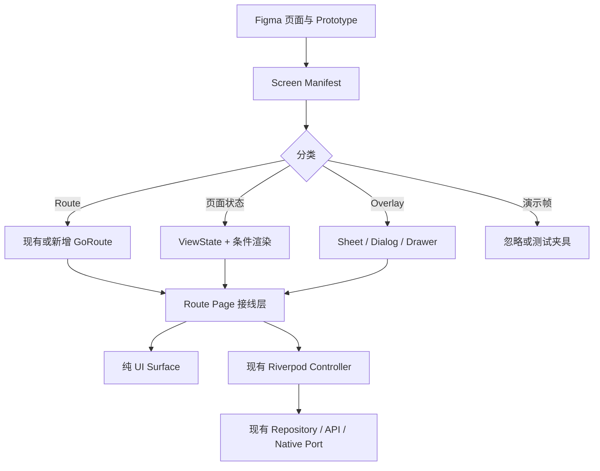

# 花火 AI：Figma → Flutter UI 迁移执行方案

> 目标仓库：`Xieyangzai/Flutter-mobile`  
> 目标分支：`Flutter-Desk-Mobile`  
> 阅读基线：`178fd247ac56c50ce117a239dd9cdc3ffb906241`  
> Flutter 手机端目录：`Flutter/src/`  
> Figma 文件：`cB9ops5llz7DvBJ1QTvCu9 / 花火AI`  
> 文档用途：页面筛选、页面替换、功能/API 衔接、实施顺序与验收  
> 重要说明：开始编码前必须再次确认远端分支 HEAD；如果 HEAD 已变化，应先完成差异审查，再更新本文基线。

---

## 1. 执行摘要

本次迁移不应采用“把 Figma 中每个 Frame 生成一个 Flutter 页面”的方式，而应采用**渐进替换**：

1. 保留现有 GoRouter 路由、Riverpod Controller、Repository、API 和 Native Port。
2. 将 Figma Frame 归并为四类：
   - 独立页面 Route；
   - 同一页面的业务/视觉状态；
   - Bottom Sheet、Dialog、Drawer 等临时弹层；
   - 仅用于原型演示的中间帧、键盘帧、Source Copy 和 Endpoint。
3. 现有 Page 类继续作为“路由与业务接线层”，新建纯 UI Surface 负责视觉呈现。
4. 在 Controller 与 UI 之间增加 ViewState/Mapper，避免新 UI 直接依赖 API DTO 或复杂业务状态。
5. 先完成一条核心纵向链路，再扩展到其他模块：

```text
首页
→ 笔记详情
→ 原始 / 纲要 / 点火
→ 笔记内聊天 Sheet
→ 全屏聊天
→ 会话历史
→ 返回笔记
```

6. 每个模块按“静态 UI → 现有状态接线 → API/异常 → 测试 → 截图验收”的顺序交付。

---

## 2. 项目现状与不可破坏的基础

### 2.1 当前技术栈

当前工程已经具备本次迁移所需的主要能力：

- Flutter 3.44+ / Dart 3.12+
- `flutter_riverpod`
- `go_router`
- `huahuo_api`
- `huahuo_editor`
- `flutter_quill`
- SQLite
- 音频录制、播放与转写
- Native 文件、权限、蓝牙和录音卡接口
- 统一主题、玻璃效果、公共组件与弹层
- Widget Test、Integration Test 基础

### 2.2 必须保留的工程骨架

```text
Flutter/src/lib/app/navigation/
├── app_router.dart
├── app_routes.dart
├── app_route_paths.dart
├── route_guards.dart
├── route_parameter_parser.dart
└── app_route_observer.dart
```

路由层已经承担：

- 登录与工作空间 Guard；
- 启动引导与首次设备设置；
- 旧路径重定向；
- 深链接参数校验；
- Chat Route Scope；
- 页面恢复和路由观察。

**禁止为了匹配 Figma 重新引入一套路由系统。**

### 2.3 仓库修改约束

执行每个任务时遵守仓库现有规则：

1. 修改 `Flutter/src/...` 前，先更新对应的 `Flutter/scm/...`。
2. 新增有效源文件或测试文件时，同步更新 `SOURCE_TREE.md`。
3. 涉及请求参数、响应字段、鉴权、错误码、同步或异步任务时，先确认正式 API 合同和现有实现。
4. UI 可以用 Mock 数据验收，但所有可见交互必须可操作，不能只做静态截图。
5. 不在文档、日志、测试数据或提交信息中复制仓库内的敏感凭据。

---

## 3. 总体技术方案



### 3.1 Route Page 的职责

Route Page 只负责：

- 读取路由参数；
- 读取 Provider；
- 将 Controller 状态转换为 ViewState；
- 绑定用户操作；
- 管理页面级生命周期与返回行为；
- 渲染纯 UI Surface。

示例：

```dart
class V3FeedItemDetailPage extends ConsumerWidget {
  const V3FeedItemDetailPage({
    required this.itemId,
    this.initialStage = V3ContentStage.raw,
    super.key,
  });

  final String itemId;
  final V3ContentStage initialStage;

  @override
  Widget build(BuildContext context, WidgetRef ref) {
    final controller = ref.watch(
      feedItemDetailControllerProvider(itemId),
    );

    final state = NoteDetailViewState.fromController(controller);

    return NoteDetailSurface(
      state: state,
      onBack: () => context.pop(),
      onSelectStage: controller.selectStage,
      onGenerateOutline: controller.startOutline,
      onRetryOutline: controller.retryOutline,
      onGenerateIgnite: controller.startSprout,
      onRetryIgnite: controller.retrySprout,
      onOpenChat: () => _openNoteChat(context, itemId),
    );
  }
}
```

### 3.2 纯 UI Surface 的职责

纯 UI Surface：

- 不读取 API Client；
- 不创建 Repository；
- 尽量不直接读取全局 Provider；
- 输入为不可变 ViewState；
- 输出为回调；
- 可独立做 Widget/Golden Test。

### 3.3 ViewState 映射

业务状态与 Figma 视觉状态之间增加一层映射：

```dart
enum AsyncViewStatus {
  idle,
  loading,
  success,
  failure,
}

@immutable
class NoteOutlineViewState {
  const NoteOutlineViewState({
    required this.status,
    required this.markdown,
    required this.errorMessage,
  });

  final AsyncViewStatus status;
  final String? markdown;
  final String? errorMessage;
}
```

例如：

```text
V3OutlineTaskStatus.notStarted → AsyncViewStatus.idle
V3OutlineTaskStatus.running    → AsyncViewStatus.loading
V3OutlineTaskStatus.succeeded  → AsyncViewStatus.success
V3OutlineTaskStatus.failed     → AsyncViewStatus.failure
```

---

## 4. Figma 页面筛选规则

每个 Figma Frame 必须在 `screen_manifest.md` 中标记为以下之一：

| 分类 | 判定标准 | Flutter 实现 |
|---|---|---|
| `route` | 可深链接、进入返回栈、刷新后要恢复 | `GoRoute` + Page |
| `state` | 页面主体不变，只是加载、选择或任务结果变化 | Controller/ViewState |
| `overlay` | 关闭后仍停留在原页面 | Sheet/Dialog/Drawer |
| `component` | 多页复用的小型 UI | Widget |
| `fixture` | 示例数据、不同文章/文件名/推荐问题 | 测试夹具 |
| `ignore` | iOS 键盘、Source copy、Prototype endpoint、中间动画帧 | 不实现 |

辅助判断：

- `Oxx`：通常是 Overlay。
- `P00`、`Prototype endpoint`、`Source copy`、`Reused`：通常不是新业务页面。
- “加载中、失败、已选择、已展开、处理中、成功提示”：通常是状态。
- 仅内容样本不同但布局相同：使用同一个组件和不同数据。
- Figma 的系统键盘不在 Flutter 中重画，使用系统真实键盘。

---

## 5. 11 个 Figma 节点的实施清单

### 5.1 `377:1595`：首页、Feed、采集、导入、搜索

**页面族**

- 首页壳；
- Feed/思想图谱；
- 搜索；
- 通知；
- 文字快速记录；
- 独白/录音采集；
- 链接导入；
- 文件/媒体导入；
- 随机聚合结果。

**状态，不建新路由**

- 1D / 2D / 3D；
- 添加菜单展开；
- 导入处理中；
- 聚合处理中；
- 搜索最近记录、筛选选中；
- 通知已读/未读。

**Overlay**

- 个人侧栏；
- 通知面板；
- 更多创建方式；
- 快速采集 Sheet；
- 聚合来源确认；
- 搜索筛选。

**当前映射**

```text
V3AppShell
V3FeedPage
V3FeedQuickDock
V3NotificationsPage
V3CapturePages
V3DocumentImportPage
V3LinkImportPage
```

**实施决定**

- 保留 `V3AppShell` 的三个主模式和 PageView。
- 1D/2D/3D 作为 Feed 内部模式，不增加路由。
- 如 Figma 搜索需要完整页面，新增 `/v3/search`；否则使用现有 Overlay。
- 首批只替换 Header、Feed Card、Quick Dock 与弹层视觉，不同时改图谱业务。

---

### 5.2 `438:4364`：笔记详情

**真正页面**

- 笔记详情；
- 全屏聊天。

**同一页面状态**

- 原始；
- 纲要待生成、生成中、失败、成功；
- 点火待生成、生成中、失败、成功；
- 仅纲要存在、仅点火存在；
- 后台任务恢复。

**Overlay**

- 选择 Agent；
- 笔记内聊天 Sheet；
- 会话历史；
- 会话操作；
- 重命名；
- 删除确认；
- 沉淀/目录选择。

**当前映射**

```text
V3FeedItemDetailPage
FeedItemDetailController
V3ChatPage
noteAppendControllerProvider
knowledgeLibraryControllerProvider
```

**实施决定**

- 保留一个 `V3FeedItemDetailPage`。
- 保留现有 `FeedItemDetailController` 和纲要/点火 API。
- 新增 `NoteDetailSurface`、`NoteStageTabs`、`NoteCreationDock`。
- 聊天 Sheet 与全屏聊天共用同一个 `ChatConversationSurface`。
- Sheet 切全屏时必须携带同一 `threadId` 和 `itemId`。

---

### 5.3 `377:1596`：创作空间、每日推荐、自由创作、创作历史

**真正页面**

- 创作空间；
- 每日推荐详情；
- 自由创作编辑器；
- 创作历史。

**同一编辑器状态**

- 键盘打开/关闭；
- 正文、H1/H2/H3；
- 加粗、斜体、引用、列表、代码、链接；
- AI 工具开始、处理中、Diff 等待确认；
- 语音输入前、中、后和异常；
- 选区与复制粘贴；
- 未保存草稿。

**Overlay**

- 链接编辑；
- AI 参数选择；
- AI Diff 接受/拒绝；
- 聊一聊 Sheet；
- 更多操作；
- 删除确认。

**当前映射**

```text
V3WorkbenchPage
V3CreationCanvasPage
V3CreationHistoryPage
CanvasAiController
DocumentChangeProposalController
CreationCanvasDraftRepository
CreationCanvasHistoryPort
```

**实施决定**

- 不重写 Quill 与草稿系统。
- 保留 `V3CreationCanvasPage` 的编辑、自动保存、草稿恢复、AI Proposal。
- 将 Toolbar、Mode Switch、AI Action Strip、Chat Entry 拆为独立组件。
- 不绘制 Figma 中的 iOS 键盘。
- 创作历史加载、空、失败、删除中均为一个页面的状态。

---

### 5.4 `638:8213`：我的资产

**真正页面**

- 我的资产；
- 笔记预览复用笔记详情；
- 编辑复用自由创作。

**同一页面状态**

- 我的笔记 / 我的沉淀；
- 文件夹展开/折叠；
- 空文件夹；
- 搜索；
- 排序；
- 拖动归档；
- 文件夹排序；
- 加载、失败、空状态。

**Overlay**

- 笔记操作；
- 新建/重命名文件夹；
- 移动到文件夹；
- 删除确认；
- 分享系统面板。

**当前映射**

```text
V3MyAssetsPage
KnowledgeLibraryController
V3FeedItemDetailPage
V3CreationCanvasPage
```

**实施决定**

- 保留 `V3MyAssetsPage` 页面入口。
- 新建 Folder ViewState，将现有资产分类适配成 Figma 文件夹分组。
- 笔记点击跳转现有 `AppRoutePaths.feedItem`。
- 编辑跳转 `AppRoutePaths.editNote` 或 Canvas。
- 拖拽只修改归属，不复制页面。
- 删除文件夹要明确“仅删除文件夹还是同时删除笔记”的 API 合同。

---

### 5.5 `816:2560`：聊一聊

**真正页面**

- 一个通用全屏聊天页。

**Agent 变体**

- 通用聊一聊；
- 个人 IP；
- 获客营销；
- 视觉设计；
- 视频分析；
- 代表作相关聊天。

**同一页面状态**

- 引导问题；
- 首次加载；
- 读取工作空间；
- 回复输出；
- 附件上传中/成功/失败；
- 语音转写前/中/后；
- 分析引用笔记；
- 查阅资料；
- 推荐问题已发送；
- 对话记录。

**Overlay**

- 添加附件；
- 选择引用笔记；
- 会话历史；
- 会话操作；
- 重命名；
- 删除确认。

**当前映射**

```text
/v3/feed/chat
V3ChatPage
ChatController
ChatFileAttachmentUploader
VoiceMessageController
ChatRunTracker
MobileAgentCapabilityController
```

**实施决定**

- 绝不为每个 Agent 复制页面。
- 通过 `agentProfileId`、`skill`、`conversationPurpose` 和 UI 配置切换。
- 抽出 `ChatConversationSurface`。
- Agent Opening、推荐问题、允许附件类型放入配置对象：

```dart
class ChatAgentUiConfig {
  final String agentProfileId;
  final String title;
  final String openingMessage;
  final List<String> suggestedPrompts;
  final Set<ChatAttachmentKind> attachmentKinds;
}
```

- 现有服务端 Public ID 保持不变，UI 不自行拼接 Agent ID。

---

### 5.6 `739:7557`：我的、设置、账号、声纹、会员

**真正页面**

- 个人中心；
- 系统设置；
- 账号与安全；
- 声纹管理/录入；
- 对话记录；
- 外观与显示；
- 日报提醒；
- 权限管理；
- 回收站；
- 版本与关于；
- 帮助；
- 会员中心、开通记录、协议。

**状态，不建新路由**

- 浅色/深色/跟随系统；
- 字号、清晰度和主题色；
- 日报提醒开关和工作日；
- 回收站空/有内容；
- 版本检查中/最新/发现更新；
- 会员套餐选中、已开通；
- 自动续费开关。

**Overlay**

- 更换头像；
- 退出登录；
- 权限跳转确认；
- 声纹档案操作；
- 重命名/重录/删除确认；
- 时间选择；
- 会员确认购买。

**当前映射**

```text
V3ProfileSidePanel
V3ProfilePlaceholderPage
V3AccountProfilePage
V3VoiceprintPage
V3MembershipPage
SettingsController
Profile capability ports
```

**实施决定**

- 对已有业务能力直接替换 UI。
- 对仅有占位或无正式合同的功能，显示明确不可用状态。
- 购买与自动续费只在支付能力和合同确认后启用。
- 不用“点击后本地假成功”模拟生产购买。

---

### 5.7 `739:11214`：知识广场

**真正页面**

- 外部世界首页；
- 知识世界；
- 频道详情；
- 文章详情。

**状态，不建新路由**

- 已订阅/未订阅；
- 行业筛选；
- 频道 Carousel Focus；
- 文章保存中/成功/失败；
- 不同文章样本和保存目录。

**Overlay**

- 订阅确认；
- 取消订阅；
- 订阅管理；
- 行业筛选；
- 保存到文件夹；
- 保存成功提示。

**当前映射**

```text
V3KnowledgeLibraryPage
V3KnowledgeChannelDetailPage
V3RemoteKnowledgeWorldDetailPage
KnowledgeLibraryController
SubscriptionPort
```

**实施决定**

- 保留“已订阅 / 知识广场”两个主 Tab。
- 文章详情优先复用现有外部知识阅读器。
- 文件夹选择复用统一 Folder Picker。
- 保存后的笔记继续进入统一 `V3FeedItemDetailPage`。
- Demo 与 Remote 模式的视觉结构一致，只替换数据源。

---

### 5.8 `1135:6808`：代表作

**真正页面**

- 一个代表作阅读/编辑页面。

**状态**

- 锁定；
- 阅读；
- 编辑；
- 每 7 天/每月计划；
- 有更新待整合。

**Overlay**

- 锁定说明；
- 代表作信息；
- 目录；
- 协作说明。

**当前映射**

```text
V3MasterpiecePage
ProfileWorkspaceController
KnowledgeLibraryController
```

**实施决定**

- 保留 `V3MasterpiecePage`。
- 目录继续作为浮层，不建路由。
- 计划周期作为设置状态。
- 解锁阈值和后端生成规则保持现有业务定义，不以 Figma 示例值覆盖。

---

### 5.9 `1360:7418`：录音卡

**真正页面**

- 设备管理；
- 设备详情；
- 转写详情。

**状态**

- 未连接；
- 蓝牙关闭；
- 搜索中；
- 设备列表；
- 连接中/已连接；
- 已连接空文件；
- 批量选择；
- Wi-Fi 传输中、暂停、完成、失败；
- 播放加载、播放中、暂停、失败；
- 上传并转写；
- 转写中、等待标注。

**Overlay**

- 设备操作；
- 断开确认；
- 修改蓝牙名称；
- 解除绑定确认；
- 单文件操作；
- 重命名；
- 删除确认；
- 停止传输确认。

**当前映射**

```text
V3RecordingCardLivePage
V3RecordingCardDetailPage
V3RecordingCardControlPage
V3TranscriptionDetailPage
RecordingCardController
RecordingCardAccountBindingController
Native recording-card ports
```

**实施决定**

- Figma 状态完全映射现有 Controller，不使用 Timer 伪造连接成功。
- 蓝牙、权限、文件、Wi-Fi 传输必须真机验收。
- 同一文件名不同的 Figma Frame 只是测试数据。
- 录音卡模块单独建 Integration Test 流程。

---

### 5.10 `1360:8803`：登录、启动引导、定位、设备设置

**真正页面**

- Auth；
- Onboarding Wizard；
- 定位进度；
- 首次设备设置。

**状态**

- 有业务 1/4～4/4；
- 没业务 1/7～7/7；
- 定位运行、收尾、成功、失败；
- 声纹设备设置；
- 录音卡设备设置；
- 录音卡搜索/连接。

**Overlay**

- 延后确认；
- 录音卡搜索和验证 SN。

**当前映射**

```text
AuthScreen
ContentLineOnboardingPage
V3InitialPositioningProgressPage
V3FirstLaunchDeviceSetupPage
V3VoiceprintPage
Recording Card pages
```

**实施决定**

- 两条 Onboarding 分支使用一个 Wizard State。
- 步骤变化不是 GoRoute。
- 流程结束用 `context.go(AppRoutePaths.home)`。
- 声纹和录音卡具体操作继续跳到现有功能页。
- Prototype Endpoint 不实现。

---

### 5.11 `1605:20590`：顶层“我的”抽屉、日历、深度定位

**真正页面/容器**

- 左侧“我的”抽屉；
- 活动日历；
- 深度定位。

**状态**

- 录音卡未连接、连接中、待录音、录音中、暂停；
- 月视图；
- 某日有/无记录；
- 外部世界、资产、商学院等快捷入口。

**当前映射**

```text
showV3ProfileSidePanel
V3ActivityCalendarPage
V3DeepPositioningPage
V3AppShell
```

**实施决定**

- 抽屉继续使用 `showGeneralDialog` 或侧滑 Route。
- 抽屉中的录音状态读取 RecordingCard/Recording Controller，不创建独立页面。
- 日期详情是 Calendar 内部状态或 query 参数。
- 快捷入口统一调用 `AppRoutePaths`。

---

## 6. 路由与 Prototype 翻译规范

### 6.1 Figma → Flutter

| Figma 动作 | Flutter 规则 |
|---|---|
| Navigate to | 独立页面：`context.push()` |
| 主模块切换/流程结束 | `context.go()` |
| Back | `context.pop()` |
| Open overlay | `showModalBottomSheet` / `showDialog` / `showGeneralDialog` |
| Swap overlay | 弹层内部状态切换，或关闭后打开下一弹层 |
| Change to | 本地状态、Controller 状态或组件参数 |
| Smart Animate | 第二阶段用 `AnimatedSwitcher` 等补充 |
| After delay | 仅用于纯视觉动画；业务结果必须由真实异步状态驱动 |
| Drag | `PageView`、`Dismissible`、`Draggable`、自定义手势 |
| Keyboard frame | 系统键盘和 `MediaQuery.viewInsets` |
| Prototype endpoint | 不创建生产页面 |

### 6.2 `push` 与 `go`

使用 `push`：

- 打开笔记详情；
- 打开全屏聊天；
- 打开编辑器；
- 打开创作历史；
- 打开频道/文章；
- 打开录音卡详情；
- 打开设置子页。

使用 `go`：

- 登录完成进入首页；
- Onboarding 完成；
- 顶级主模式重建；
- 必须清理前序流程栈时。

不产生路由：

- 原始/纲要/点火切换；
- Feed 1D/2D/3D；
- Agent Picker；
- 会话操作；
- 文件夹操作；
- 加载/失败/成功状态。

### 6.3 建议新增或确认的路径

优先复用现有路径。仅在功能确实需要深链接时增加：

```text
/v3/search                        # 若搜索是完整页面
/v3/knowledge/article/:articleId  # 仅当现有外部阅读路由无法稳定表达
```

其余 Figma Overlay 不增加 GoRoute。

---

## 7. API 与功能衔接方案

### 7.1 UI 不直接调用 API

新 UI 只能通过意图回调调用现有 Controller：

| 用户动作 | Controller/Port |
|---|---|
| 生成纲要 | `FeedItemDetailController.startOutline()` |
| 重试纲要 | `retryOutline()` |
| 点火 | `startSprout()` |
| 重试点火 | `retrySprout()` |
| 发送聊天 | 现有 Chat Controller |
| 上传聊天附件 | `ChatFileAttachmentUploader` |
| 语音消息 | `VoiceMessageController` |
| 保存自由创作 | Canvas Draft/History Repository |
| 资产移动/删除 | Knowledge Library Controller/Port |
| 订阅频道 | Subscription Port |
| 连接录音卡 | `RecordingCardController` |
| 声纹录入 | Voiceprint Controller |
| 首次设备设置 | FirstLaunchDeviceSetupController |

### 7.2 保留正式标识符

不得因 UI 文案变化修改或推断以下标识符：

```text
itemId
threadId
windowId
contentLineId
agentProfileId
skillProfileIds
recordingId
publicationId
channelId
workspaceId
```

聊天 Sheet 切全屏的参数示例：

```dart
final location = Uri(
  path: '/v3/feed/chat',
  queryParameters: {
    'itemId': itemId,
    if (threadId != null) 'threadId': threadId,
    if (windowId != null) 'window': windowId,
    if (agentProfileId != null) 'agentProfileId': agentProfileId,
  },
).toString();

Navigator.of(sheetContext).pop();
context.push(location);
```

### 7.3 统一能力状态

所有尚未确认正式合同的功能使用统一状态：

```dart
enum FeatureAvailability {
  available,
  mock,
  unavailable,
}
```

表现规则：

- `available`：正常操作；
- `mock`：仅 Debug/验收环境启用，并显示“演示数据”；
- `unavailable`：按钮禁用或明确提示“能力尚未开放”。

禁止出现：

- 本地假成功；
- 重进页面后状态回退；
- 未发布 Agent 静默降级到其他 Agent；
- UI 自行构造 API 字段。

### 7.4 API Binding Matrix

在仓库增加：

```text
docs/figma_migration/api_binding_matrix.md
```

建议字段：

| Figma 节点 | 页面 | 动作 | Controller | Repository/API | 参数 | Loading | Success | Error | 合同状态 |
|---|---|---|---|---|---|---|---|---|---|
| 438:4364 | 笔记详情 | 生成纲要 | FeedItemDetailController | OutlineRepository | itemId/revision | 生成中 | 纲要结果 | 重试页 | 已接 |
| 816:2560 | 聊天 | 发送消息 | ChatController | Chat API | thread/agent | 回复中 | 消息追加 | 可重试 | 已接 |
| 739:11214 | 知识 | 订阅频道 | KnowledgeLibraryController | SubscriptionPort | publicationId | 按钮忙 | 已订阅 | 错误提示 | 需联调 |
| 739:7557 | 我的 | 绑定手机 | Account Port | Account API | phone/code | 提交中 | 已绑定 | 字段错误 | 待确认 |

---

## 8. 推荐代码目录

保留现有入口文件，新增按模块拆分的 UI：

```text
Flutter/src/lib/features/ui_v3/presentation/
├── v3_feed_item_detail_page.dart          # 路由和业务接线
├── v3_chat_page.dart                      # 路由和业务接线
├── v3_creation_canvas_page.dart           # 编辑器业务接线
├── v3_my_assets_page.dart
├── v3_knowledge_library_page.dart
├── v3_recording_card_live_page.dart
│
├── note_detail/
│   ├── note_detail_surface.dart
│   ├── note_detail_view_state.dart
│   ├── note_detail_mapper.dart
│   ├── note_detail_header.dart
│   ├── note_stage_tabs.dart
│   ├── note_raw_content.dart
│   ├── note_outline_content.dart
│   ├── note_ignite_content.dart
│   └── note_creation_dock.dart
│
├── chat/
│   ├── chat_conversation_surface.dart
│   ├── chat_view_state.dart
│   ├── chat_agent_ui_config.dart
│   ├── chat_message_list.dart
│   ├── chat_suggested_prompts.dart
│   ├── chat_composer.dart
│   ├── chat_attachment_tray.dart
│   ├── chat_attachment_sheet.dart
│   ├── chat_history_sheet.dart
│   └── chat_thread_dialogs.dart
│
├── creation/
│   ├── creation_surface.dart
│   ├── creation_top_bar.dart
│   ├── creation_mode_toolbar.dart
│   ├── creation_ai_toolbar.dart
│   ├── creation_chat_sheet.dart
│   └── creation_proposal_panel.dart
│
├── assets/
│   ├── assets_surface.dart
│   ├── assets_view_state.dart
│   ├── asset_folder_section.dart
│   ├── asset_note_card.dart
│   ├── asset_folder_editor_sheet.dart
│   └── asset_move_sheet.dart
│
└── knowledge/
    ├── knowledge_home_surface.dart
    ├── knowledge_channel_surface.dart
    ├── knowledge_article_surface.dart
    ├── knowledge_filter_sheet.dart
    └── knowledge_save_picker.dart
```

共享 UI 继续放在：

```text
Flutter/src/lib/shared/ui_v3/
Flutter/src/lib/shared/theme/
```

建议新增的共享组件：

```text
V3AsyncStateView
V3EmptyState
V3ErrorState
V3LoadingState
V3BottomDock
V3SheetHeader
V3ConfirmSheet
V3FolderPicker
V3AgentPicker
```

---

## 9. 主题与 Design Token 迁移

当前已有：

```text
HuahuoSpacing
HuahuoRadius
HuahuoControlSize
HuahuoTypography
HuahuoV3ThemeTokens
HuahuoV3GlassTokens
```

执行方式：

1. 从 Figma 提取语义 Token，不按单个页面抄数值。
2. 先新增新 Token，不直接覆盖所有旧 Token。
3. 新页面使用新 Token。
4. 模块全部迁移后，再清理旧值。

建议增加：

```dart
abstract final class HuahuoLayout {
  static const mobileHorizontal = 20.0;
  static const topBarHeight = 56.0;
  static const bottomDockHeight = 64.0;
  static const sheetRadius = 20.0;
}

abstract final class HuahuoMotion {
  static const fast = Duration(milliseconds: 160);
  static const normal = Duration(milliseconds: 220);
  static const slow = Duration(milliseconds: 320);
}
```

注意：

- Figma 的 `402 × 874` 仅是视觉基准，不能固定页面尺寸。
- 使用 `SafeArea`、`LayoutBuilder`、`Expanded`、`Flexible`。
- 不得用大量 `Stack + Positioned` 复刻普通内容流。
- Android 与 iOS 字体排版需要单独截图核对。

---

## 10. 分阶段实施计划

## Phase 0：冻结基线与建立清单

**目标**

- 确认唯一代码基线；
- 不写业务 UI；
- 建立页面、路由和 API 清单。

**任务**

- [ ] 拉取 `Flutter-Desk-Mobile` 最新远端。
- [ ] 记录实际 HEAD。
- [ ] 创建 `feature/figma-ui-migration`。
- [ ] 确认 SCM 与 `SOURCE_TREE.md` 更新流程。
- [ ] 新建：
  - `docs/figma_migration/screen_manifest.md`
  - `docs/figma_migration/route_matrix.md`
  - `docs/figma_migration/api_binding_matrix.md`
  - `docs/figma_migration/state_coverage.md`
- [ ] 将 11 个 Figma 节点逐条登记。
- [ ] 对每个 Frame 标记 `route/state/overlay/component/fixture/ignore`。
- [ ] 确认一期、二期、条件性功能。

**验收**

- 每个 Figma 主流程都有 Flutter Owner。
- 没有任何“待实现但不知道接哪个 Controller/API”的按钮。

---

## Phase 1：设计系统与公共壳

**目标**

先做所有页面都会使用的基础组件。

**任务**

- [ ] 更新/补充 Theme Token。
- [ ] 完成 Page Top Bar。
- [ ] 完成 Tabs。
- [ ] 完成 Async State View。
- [ ] 完成 Bottom Dock。
- [ ] 完成统一 Sheet Header、Action Sheet、Confirm Dialog。
- [ ] 完成 Agent Picker 和 Folder Picker 外壳。
- [ ] 建立 390、402、430 宽度的 Golden Test Harness。

**验收**

- 公共组件在浅色/深色、不同安全区下无溢出。
- 不依赖具体业务 Provider。
- 通过 `flutter analyze` 和组件测试。

---

## Phase 2：核心链路——首页、笔记、聊天

**目标**

跑通最高复用率的完整路径。

**任务 A：首页**

- [ ] 新 Header。
- [ ] Feed Card 和 Notes Overview。
- [ ] Quick Dock。
- [ ] 个人侧栏视觉更新。
- [ ] 搜索和通知入口接现有路径。
- [ ] 1D/2D/3D 内部状态。

**任务 B：笔记详情**

- [ ] 抽出 `NoteDetailSurface`。
- [ ] 完成原始、纲要、点火三段。
- [ ] 完成纲要四态。
- [ ] 完成点火四态。
- [ ] 完成 Creation Dock。
- [ ] 保留章节定位和生命周期刷新。
- [ ] 保留沉淀、订阅、创建等现有操作。

**任务 C：聊天**

- [ ] 从 `V3ChatPage` 抽出 `ChatConversationSurface`。
- [ ] 全屏聊天继续使用现有 Route Scope。
- [ ] 增加笔记内 Chat Sheet。
- [ ] Sheet 与全屏共享 Controller/thread。
- [ ] 会话历史、重命名、删除。
- [ ] 附件上传和语音输入。
- [ ] Agent UI Config。

**验收路径**

```text
/v3
→ /v3/feed/items/:itemId
→ 纲要生成
→ 点火生成
→ 打开 Chat Sheet
→ 发送推荐问题
→ 切换全屏
→ 查看会话历史
→ 返回笔记
```

**关键验收**

- Sheet 切全屏不创建新会话。
- 返回后笔记能刷新后台结果。
- 任务失败时显示现有错误映射。
- 390×844、402×874、430×932 无溢出。
- 键盘出现时 Composer 和 Dock 正确上移。

---

## Phase 3：自由创作与创作历史

**目标**

用新设计替换编辑器外壳，不破坏编辑和保存能力。

**任务**

- [ ] 重构 Top Bar 和编辑器 Toolbar。
- [ ] 普通编辑/AI 编辑模式切换。
- [ ] Markdown/Quill 格式按钮。
- [ ] 链接编辑器。
- [ ] AI Action Strip。
- [ ] AI Proposal Diff 接受/拒绝。
- [ ] 聊一聊 Sheet。
- [ ] 更多操作。
- [ ] 语音输入状态。
- [ ] 创作历史列表、空、失败、删除。
- [ ] 从每日推荐带入编辑器。
- [ ] 从资产编辑进入同一 Canvas。

**验收**

- 草稿恢复不回归。
- 自动保存不回归。
- 未保存返回拦截不回归。
- AI Proposal 不直接覆盖正文。
- 长文、图片、列表、代码块均可编辑。

---

## Phase 4：我的资产

**目标**

实现文件夹化资产管理设计，并复用笔记和编辑器。

**任务**

- [ ] 资产主页与两个主 Tab。
- [ ] 文件夹展开/折叠。
- [ ] 搜索和排序。
- [ ] 新建/重命名文件夹。
- [ ] 笔记操作菜单。
- [ ] 移动、复制、删除、分享。
- [ ] 拖动归档。
- [ ] 文件夹拖动排序。
- [ ] 空、加载、失败。
- [ ] 打开笔记详情。
- [ ] 编辑到自由创作。

**API Gate**

在实现删除文件夹、排序、移动前，必须确认：

- 文件夹是否为服务端实体；
- 是否有排序字段和并发控制；
- 删除文件夹是否保留笔记；
- 是否支持撤销；
- 创建副本返回的新 ID；
- 分享是否返回可分享链接。

---

## Phase 5：知识广场

**任务**

- [ ] 外部世界首页。
- [ ] 已订阅/知识世界。
- [ ] 频道卡片和 Carousel。
- [ ] 频道详情。
- [ ] 文章详情。
- [ ] 行业筛选。
- [ ] 订阅/取消订阅。
- [ ] 保存到文件夹。
- [ ] 保存成功和失败。
- [ ] Demo/Remote 状态统一。

**验收**

- 订阅状态与服务端刷新一致。
- 保存后的笔记能在资产/笔记详情中打开。
- 只读文章不能被错误当成本人可编辑笔记。
- 返回知识页时刷新订阅和保存状态。

---

## Phase 6：我的、设置、会员与声纹

**任务**

- [ ] 个人中心。
- [ ] 系统设置。
- [ ] 外观与显示。
- [ ] 日报提醒。
- [ ] 权限管理。
- [ ] 账号与安全。
- [ ] 声纹管理和录入。
- [ ] 回收站。
- [ ] 版本、帮助、关于。
- [ ] 会员中心和开通记录。

**功能分级**

- 已有正式能力：直接接线。
- 有 Port/Mock、无正式合同：保留明确占位。
- 需要支付或系统权限：真机/沙箱专项验收。

---

## Phase 7：启动引导与顶层抽屉

**任务**

- [ ] Auth 视觉替换。
- [ ] 有业务 4 步 Wizard。
- [ ] 没业务 7 步 Wizard。
- [ ] 定位运行/成功/失败。
- [ ] 延后确认。
- [ ] 首次声纹和录音卡设置。
- [ ] 顶层“我的”抽屉。
- [ ] 月历和日期记录。
- [ ] 深度定位入口。

**验收**

- Onboarding 状态可恢复。
- 退出 App 后不会重复进入已完成步骤。
- 跳过流程不会破坏 Guard。
- 系统返回行为符合 Prototype。

---

## Phase 8：代表作与录音卡

这两个模块可以并行，但录音卡必须安排真机专项。

**代表作**

- [ ] 锁定状态。
- [ ] 阅读/编辑。
- [ ] 目录。
- [ ] 信息与协作说明。
- [ ] 更新待整合。
- [ ] Chat 入口。

**录音卡**

- [ ] 连接与授权。
- [ ] 设备管理。
- [ ] 文件列表与批量管理。
- [ ] 设备详情和账号绑定。
- [ ] Wi-Fi 传输。
- [ ] 播放和单文件操作。
- [ ] 上传转写和转写详情。
- [ ] 异常与恢复。

---

## 11. 第一批可直接创建的任务

### Task 01：建立迁移清单和测试基线

**范围**

```text
docs/figma_migration/
Flutter/src/test/ui_v3/figma_harness/
SOURCE_TREE.md
对应 SCM
```

**产物**

- Screen Manifest；
- Route Matrix；
- API Binding Matrix；
- 3 个标准手机尺寸的 Golden Harness。

---

### Task 02：新建异步状态和底部 Dock 公共组件

**产物**

```text
shared/ui_v3/v3_async_state_view.dart
shared/ui_v3/v3_bottom_dock.dart
shared/ui_v3/v3_sheet_header.dart
```

**验收**

- Loading/Empty/Error/Success；
- Safe Area；
- 视觉可配置；
- Widget Test。

---

### Task 03：重构笔记详情 UI，不改业务 Controller

**允许修改**

```text
v3_feed_item_detail_page.dart
presentation/note_detail/*
shared/ui_v3/*
theme/*
测试
SCM/SOURCE_TREE
```

**禁止**

- 新建纲要/点火业务 Controller；
- 改 API 字段；
- 每个状态建页面；
- 固定 402×874；
- 删除生命周期恢复和章节定位。

**验收**

- 三段切换；
- 纲要/点火四态；
- Bottom Dock；
- 现有测试通过；
- Golden 通过。

---

### Task 04：抽取 ChatConversationSurface

**目标**

- 全屏聊天行为不变；
- 新 Surface 可在 Sheet 使用。

**禁止**

- 复制整个 `V3ChatPage`；
- 新建第二个 Chat Controller；
- 改 thread 恢复规则。

**验收**

- 历史 thread 正确恢复；
- 附件与语音工作；
- Agent Profile 不漂移；
- Sheet 与全屏共享同一会话。

---

### Task 05：笔记内聊天 Sheet 和全屏切换

**验收**

- 从笔记打开；
- 推荐问题可发送；
- 关闭 Sheet 回笔记；
- 切全屏携带 thread；
- 返回全屏前页面；
- 不重复生成 Opening Message。

---

## 12. 估算与排期参考

以下为**单名熟悉当前工程的 Flutter 工程师**、后端合同无重大缺口时的粗略估算；不是承诺日期。

| 阶段 | 估算 |
|---|---:|
| Phase 0 清单与基线 | 2–4 人日 |
| Phase 1 Design System | 4–7 人日 |
| Phase 2 首页/笔记/聊天 | 12–18 人日 |
| Phase 3 自由创作 | 10–16 人日 |
| Phase 4 我的资产 | 8–14 人日 |
| Phase 5 知识广场 | 7–12 人日 |
| Phase 6 我的/设置/会员 | 10–18 人日 |
| Phase 7 引导/抽屉/日历 | 7–12 人日 |
| Phase 8 代表作/录音卡 | 12–22 人日 |
| 总体 | 72–123 人日 |

建议两个工程师并行：

- A：笔记、聊天、自由创作；
- B：首页、资产、知识、我的；
- 共同负责 Design System；
- 录音卡由熟悉 Native/BLE 的工程师主责。

如果一期只上线核心链路、自由创作、我的资产，范围可明显缩短。

---

## 13. 测试与验收策略

### 13.1 Unit Test

覆盖：

- ViewState Mapper；
- Figma 状态与 Controller 状态映射；
- Route 参数构造与解析；
- Agent UI Config；
- 错误码到 UI 文案；
- 文件夹状态变更；
- Onboarding Wizard 分支。

### 13.2 Widget Test

覆盖：

- 每个 Surface 的关键交互；
- Tabs；
- Sheet/Dialog；
- 键盘 inset；
- 空、加载、错误、成功；
- 长文和极端标题；
- Semantics 和可点击区域。

### 13.3 Golden Test

代表状态即可，不按 Figma Frame 全量截图：

```text
首页默认 / 添加菜单
笔记原始 / 纲要空 / 纲要中 / 纲要失败 / 纲要成功 / 点火成功
Chat 引导 / 对话 / 附件 / 语音 / 历史
编辑器空白 / 键盘 / AI 工具 / Proposal
资产有内容 / 空 / 文件夹编辑 / 拖动
知识首页 / 文章 / 保存 Picker
录音卡未连接 / 蓝牙关闭 / 已连接 / 传输中 / 失败
```

### 13.4 Integration Test

核心流程：

1. 首页 → 笔记 → 纲要 → 点火 → Chat Sheet → 全屏 Chat。
2. 创作空间 → 编辑 → 保存 → 历史 → 再编辑。
3. 资产 → 文件夹 → 移动 → 删除 → 打开详情。
4. 知识广场 → 频道 → 文章 → 保存到笔记。
5. Onboarding → 定位 → 声纹/录音卡 → 首页。
6. 录音卡 → 连接 → 文件 → 播放/传输/转写。

### 13.5 设备矩阵

最低覆盖：

- iOS 主模拟器：iPhone 17 Pro；
- iOS 小屏；
- Android 360×800；
- Android 430 宽设备；
- 真机：权限、录音、蓝牙、文件、支付、系统分享。

---

## 14. 每个 PR 的交付规范

一个 PR 只交付一个可验收用户流程或一个公共组件组。

PR 描述必须包含：

```text
基线 commit
Figma 节点
实现的 Route/State/Overlay
修改的 SCM
修改的源码
新增/更新测试
API/Mock 状态
flutter analyze 结果
flutter test 结果
真机/模拟器结果
截图
未完成与风险
```

建议 PR 顺序：

```text
PR-01 文档与 Harness
PR-02 Design Token 与公共状态组件
PR-03 笔记详情 Surface
PR-04 Chat Surface 抽取
PR-05 笔记 Chat Sheet
PR-06 首页视觉
PR-07 自由创作外壳
PR-08 创作历史
PR-09 我的资产
...
```

不要把多个大模块合入同一个 PR。

---

## 15. Codex/AI 编码任务模板

```text
目标：
将 Flutter 页面 <CURRENT_PAGE> 的表现层替换为 Figma <NODE_ID>，
但保留现有业务、路由、Controller、Repository 和 API。

代码基线：
repository: Xieyangzai/Flutter-mobile
branch/commit: <PINNED_COMMIT>
mobile root: Flutter/src

Figma：
file: cB9ops5llz7DvBJ1QTvCu9
node: <NODE_ID>
代表状态：
- <STATE_A>
- <STATE_B>

必须复用：
- <EXISTING_ROUTE>
- <EXISTING_CONTROLLER>
- <EXISTING_REPOSITORY>
- HuahuoV3Theme
- shared/ui_v3 组件

允许修改：
- <FILES>
- 对应 SCM
- SOURCE_TREE.md
- 测试

禁止：
1. 不得创建重复业务 Controller。
2. 不得改变 API 字段或错误码。
3. 不得将每个 Figma Frame 做成页面。
4. 不得固定页面为 402×874。
5. 不得使用大量绝对定位。
6. 不得删除现有生命周期、恢复、Guard 和参数校验。
7. 不得用 Timer 模拟真实异步完成。

验收：
1. <FLOW>
2. <STATE_COVERAGE>
3. 390×844、402×874、430×932 无溢出。
4. flutter analyze 通过。
5. 相关 flutter test 通过。
6. 提供前后截图。
7. 报告 API/Mock/Unavailable 状态。
```

---

## 16. 主要风险与处理

| 风险 | 影响 | 处理 |
|---|---|---|
| 分支持续变化 | UI 重构频繁冲突 | 固定 commit，按模块短 PR |
| Figma Frame 数量巨大 | 路由和代码爆炸 | 强制 Screen Manifest 分类 |
| Chat 页面过大 | 抽取时行为回归 | 先 Characterization Test，再抽 Surface |
| 全局 Theme 修改 | 未迁移页面一起变化 | 新语义 Token，渐进切换 |
| API 合同不完整 | UI 无法真实落地 | Binding Matrix + Availability |
| Mock 看似成功 | 生产状态不一致 | Mock 环境标记，生产禁用 |
| 录音卡平台差异 | 模拟器无法验证 | 真机专项和 Native Owner |
| 编辑器复杂 | 选区、键盘、草稿回归 | 保留 Quill/Repository，仅替换外壳 |
| Sheet 切全屏丢会话 | 重复 thread 和上下文 | 复用 Route Scope 和 threadId |
| Figma 原型与后端规则冲突 | 交互无法实现 | 后端合同优先，记录设计差异 |

---

## 17. Definition of Done

一个页面或流程只有满足以下条件才算完成：

- [ ] Figma Frame 已归类。
- [ ] Route/State/Overlay 映射已记录。
- [ ] 使用现有 Controller/Repository/API。
- [ ] 无重复业务逻辑。
- [ ] Loading、Empty、Error、Success 均有处理。
- [ ] 返回、系统返回、键盘和安全区正确。
- [ ] 深链接参数可恢复。
- [ ] 生命周期恢复后数据正确刷新。
- [ ] 390、402、430 宽度无溢出。
- [ ] Widget Test 通过。
- [ ] 代表 Golden 通过。
- [ ] 核心 Integration Flow 通过。
- [ ] `flutter analyze` 通过。
- [ ] SCM 与 `SOURCE_TREE.md` 已同步。
- [ ] API/Mock/Unavailable 状态已在 PR 中声明。
- [ ] 已提供截图和剩余风险。

---

## 18. 建议立即执行的下一步

第一批不要同时改 11 个模块，直接执行以下顺序：

```text
1. 固定代码基线
2. 建 Screen Manifest、Route Matrix、API Binding Matrix
3. 做 Design Token 和 Async/Sheet/Dock 公共组件
4. 重构笔记详情 Surface
5. 抽 ChatConversationSurface
6. 实现笔记内 Chat Sheet
7. 跑通首页 → 笔记 → Chat 完整链路
8. 再进入自由创作和我的资产
```

第一条链路完成后，应用后续模块会复用：

- Header；
- Tabs；
- Async State；
- Bottom Dock；
- Agent Picker；
- Folder Picker；
- Chat Composer；
- History Sheet；
- Confirm Dialog；
- 页面与 Sheet 的会话切换方式。

这能最大限度减少重复实现和后期返工。
