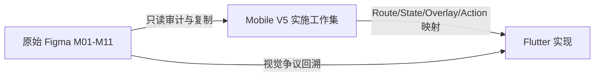
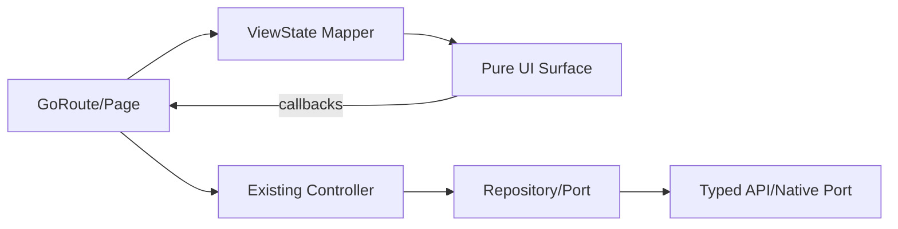

# 花火 AI：Mobile V5 Figma 归类、精简与 Flutter 实施映射流程

> Figma 文件：`cB9ops5llz7DvBJ1QTvCu9 / 花火AI`  
> 目标 Figma Page：`Mobile V5`  
> 目标工程：`/Users/run/huahuoai-app/Flutter/`  
> 文档性质：Figma 整理工作的强制流程、权限边界、筛选标准和 Flutter 落地入口  
> 当前阶段：只建立流程和规范，不据本文自动修改任何原始 Figma 页面或 Flutter 源码

---

## 0. 执行结论

Mobile V5 不是新的视觉探索页面，也不是把 M01-M11 全量复制一遍。它是从现有设计中筛选出的、供 Flutter 实施使用的唯一 UI 工作集。

整个过程遵守以下总原则：

1. **原始 Figma 页面只读。** 不重命名、不移动、不删除、不改文字、不改组件、不改 Prototype。
2. **唯一允许的 Figma 写入目标是最新的 Mobile V5 Page。**
3. **V5 只允许复制已有 UI。** 不在复制过程中擅自重画、修正或“优化”原 UI。
4. **先登记，后复制。** 未进入候选台账、未完成分类的节点不得复制到 V5。
5. **一个页面族只保留一个稳定骨架。** 状态、弹层、示例数据和系统键盘不得被误判为独立页面。
6. **V5 是 Flutter 实施输入，不是新的设计源。** 视觉争议仍回到原始节点和明确验收链接解决。
7. **Flutter 只替换表现层。** 现有路由、Controller、Repository、API、缓存、鉴权和生命周期机制默认保留。

统一口径：

> **Read originals, copy intentionally, deduplicate by behavior, implement from V5.**  
> 原页只读，有意复制，按行为去重，以 V5 为实施输入。

---

## 1. 目标与非目标

### 1.1 目标

Mobile V5 最终需要同时服务四类工作：

- 设计整理：明确哪些 UI 真正纳入移动端实现。
- Flutter 开发：明确 Route、页面状态、Overlay、组件和用户动作。
- 测试验收：明确每个状态的视觉参考、交互入口和截图基线。
- 自动化读取：避免工具扫描整个 Figma 文件并自行猜测页面关系。

完成后，应当能够直接回答：

```text
这个功能在 V5 中对应哪一张 UI？
它是 Route、State、Overlay 还是 Component？
它从哪个原始节点复制？
相似页面为什么被删除或合并？
点击某个控件后进入哪个状态？
Flutter 应由哪个 Page、Surface、Controller 承接？
需要哪些后端能力或产品确认？
```

### 1.2 非目标

本流程不负责：

- 修改原始设计页面；
- 在 V5 中重新设计不满意的 UI；
- 根据 Prototype 猜测后端接口；
- 把每个 Frame 一对一生成 Flutter Page；
- 把 Figma 系统键盘实现为 Flutter 自绘键盘；
- 把示例文章、示例文件名或不同日期做成不同页面；
- 绕过现有 Flutter Controller 直接调用 HTTP；
- 在未确认产品语义时实现“本地假成功”。

---

## 2. 权限与不可变边界

### 2.1 Figma 权限模型

| 对象 | 允许读取 | 允许复制 | 允许编辑 | 允许删除 |
|---|---:|---:|---:|---:|
| M01-M11 原始页面 | 是 | 是 | **否** | **否** |
| 原始组件库 | 是 | 实例可随 UI 一起复制 | **否** | **否** |
| 旧 Mobile V3/V4 派生页 | 可作比较参考 | 需明确批准 | 否 | 否 |
| 最新 Mobile V5 Page | 是 | 是 | 仅允许整理复制结果 | 允许删除误复制项 |
| Flutter 工程 | 是 | 不适用 | 后续独立任务授权后才允许 | 后续独立任务授权后才允许 |

### 2.2 “不编辑原页面”的具体含义

以下行为全部禁止：

- 修改原 Frame 名称；
- 在原页面添加 `[CANONICAL]`、`[IGNORE]` 等前缀；
- 移动原节点以便截图；
- 删除重复 Frame；
- 替换图标、字体、颜色或间距；
- 修改文字文案；
- 调整组件实例属性；
- 给原节点补 Prototype；
- 解除原组件实例；
- 将原节点重新放入 Section；
- 在原节点上写实施备注。

所有分类、命名和实施备注只存在于：

1. Mobile V5 的复制结果与 Section 名称；
2. 本文及后续 Manifest；
3. Flutter 工程的实施记录。

### 2.3 V5 中允许的操作

V5 仅允许以下操作：

- 从已登记的原始节点复制完整 UI；
- 将复制结果移动到对应 Section；
- 给复制结果增加 V5 归类名称；
- 删除误复制或确认重复的 V5 副本；
- 调整 V5 画布上的排列位置，不改变 UI 内部视觉；
- 增加 Section、页面级标签和非产品 UI 的实施说明；
- 在确认不改变视觉结构的情况下补充 V5 内部 Prototype 映射；
- 记录原始节点 ID、正式链接和分类结论。

禁止在 V5 副本内部进行“顺便修一下”的视觉修改。发现原设计问题时应登记为 `DESIGN_GAP`，等待新的正式源节点。

---

## 3. 三层 Source of Truth

必须区分三个层级：



### 3.1 原始 Figma

用途：

- 保存设计历史和正式视觉来源；
- 提供原始 Node ID 与链接；
- 作为像素级争议的最终回溯依据。

### 3.2 Mobile V5

用途：

- 保存经过筛选的 UI 副本；
- 按页面族和状态机归类；
- 作为 Flutter 开发默认读取范围；
- 作为测试截图节点清单。

V5 不获得“修改产品视觉”的权力。V5 和原节点视觉冲突时，以正式原节点及用户最新明确要求为准。

### 3.3 Flutter 工程

用途：

- 将 V5 的视觉骨架实现为 Widget；
- 将 V5 的状态映射到现有 ViewState/Controller；
- 将交互接回现有路由、API 和 Native Port；
- 使用真实系统能力处理键盘、权限、录音、蓝牙等平台行为。

---

## 4. 正式 Figma 输入登记

| 编号 | 功能 | 原始节点 | 正式链接 | 初始范围 |
|---|---|---:|---|---|
| M01 | 首页、Feed、采集、导入、搜索 | `377:1595` | [打开 M01](https://www.figma.com/design/cB9ops5llz7DvBJ1QTvCu9/%E8%8A%B1%E7%81%ABAI?node-id=377-1595) | 模块级画布，筛选 Route/State/Overlay |
| M02 | 笔记详情 | `438:4364` | [打开 M02](https://www.figma.com/design/cB9ops5llz7DvBJ1QTvCu9/%E8%8A%B1%E7%81%ABAI?node-id=438-4364) | 原始、纲要、点火、笔记内聊天 |
| M03 | 创作空间、自由创作、创作历史 | `377:1596` | [打开 M03](https://www.figma.com/design/cB9ops5llz7DvBJ1QTvCu9/%E8%8A%B1%E7%81%ABAI?node-id=377-1596) | 编辑器及状态机 |
| M04 | 我的资产 | `638:8213` | [打开 M04](https://www.figma.com/design/cB9ops5llz7DvBJ1QTvCu9/%E8%8A%B1%E7%81%ABAI?node-id=638-8213) | 文件夹、笔记、沉淀、拖拽和操作 |
| M05 | 聊一聊入口页 | `2084:22831` | [打开 M05](https://www.figma.com/design/cB9ops5llz7DvBJ1QTvCu9/%E8%8A%B1%E7%81%ABAI?node-id=2084-22831&t=hgX0iDzaQOFlHwN3-11) | 当前唯一视觉验收节点 |
| M06 | 我的、设置、账号、声纹、会员 | `739:7557` | [打开 M06](https://www.figma.com/design/cB9ops5llz7DvBJ1QTvCu9/%E8%8A%B1%E7%81%ABAI?node-id=739-7557) | 模块级画布 |
| M07 | 知识广场 | `739:11214` | [打开 M07](https://www.figma.com/design/cB9ops5llz7DvBJ1QTvCu9/%E8%8A%B1%E7%81%ABAI?node-id=739-11214) | 订阅、频道、文章、保存 |
| M08 | 代表作 | `1135:6808` | [打开 M08](https://www.figma.com/design/cB9ops5llz7DvBJ1QTvCu9/%E8%8A%B1%E7%81%ABAI?node-id=1135-6808) | 阅读、目录和协作 |
| M09 | 录音卡 | `1360:7418` | [打开 M09](https://www.figma.com/design/cB9ops5llz7DvBJ1QTvCu9/%E8%8A%B1%E7%81%ABAI?node-id=1360-7418) | BLE、绑定、传输、文件、转写 |
| M10 | 启动引导 | `1360:8803` | [打开 M10](https://www.figma.com/design/cB9ops5llz7DvBJ1QTvCu9/%E8%8A%B1%E7%81%ABAI?node-id=1360-8803) | Auth、问卷、定位、首次设备设置 |
| M11 | 顶层“我的”、日历、定位入口 | `1605:20590` | [打开 M11](https://www.figma.com/design/cB9ops5llz7DvBJ1QTvCu9/%E8%8A%B1%E7%81%ABAI?node-id=1605-20590) | 抽屉、日历和快捷入口 |

新增来源必须先加入本表。未登记的节点不得进入 V5。

---

## 5. Mobile V5 页面结构

建议页面名称：

```text
Mobile V5 · Implementation Set
```

页面只存放移动端真实实施需要的 UI 副本和实施索引。建议采用以下顶层 Section：

```text
00 · Guide & Registry
10 · App Shell & Entry
20 · Content & Notes
30 · Chat & Agents
40 · Creation
50 · Assets & Knowledge
60 · Profile & Account
70 · Recording Card
80 · Onboarding
90 · Shared Overlays
95 · Shared Components
99 · Excluded Index
```

### 5.1 Section 的职责

| Section | 内容 | 不应放入 |
|---|---|---|
| `00` | 来源登记、标签说明、版本、执行状态 | 产品 UI 正式副本 |
| `10` | 首页壳、顶层抽屉、搜索、入口 | 模块内部 Dialog |
| `20` | 笔记、文章阅读、纲要、点火 | 聊天专属页面 |
| `30` | 聊一聊、Agent 对话、会话历史 | 编辑器格式工具 |
| `40` | 创作空间、自由创作、编辑器状态 | 通用资产选择器 |
| `50` | 我的资产、知识广场、代表作 | 账号设置 |
| `60` | 我的、设置、账号、会员、声纹 | 启动问卷 |
| `70` | 录音卡绑定、录音、传输、文件 | 通用聊天录音 |
| `80` | 登录、问卷、定位、首次设置 | 日常业务页 |
| `90` | 多模块复用 Sheet/Dialog/Drawer | 单页独有状态 |
| `95` | 多模块复用的小型控件 | 完整手机页面 |
| `99` | 仅记录被排除节点及原因 | 被排除 UI 的副本 |

### 5.2 页面族内部排布

一个页面族使用一个 Section，内部从左到右、从上到下固定排序：

```text
第 1 行：Route 主状态 / Canonical
第 2 行：加载、空、失败、成功等业务状态
第 3 行：Overlay、Dialog、Drawer
第 4 行：键盘或平台交互的必要参考状态
第 5 行：特殊边界、权限、离线、Gate
```

不允许按创建时间随意堆放。

---

## 6. 统一分类体系

每个候选节点必须且只能有一个主分类。

| 分类 | 定义 | V5 是否复制 | Flutter 形态 |
|---|---|---:|---|
| `ROUTE` | 独立进入返回栈、可恢复或可深链接 | 是 | `GoRoute` + Page |
| `STATE` | 同一页面骨架下的业务或视觉状态 | 有结构差异时复制 | ViewState + 条件渲染 |
| `OVERLAY` | 关闭后仍停留当前页面 | 是 | Sheet/Dialog/Drawer |
| `COMPONENT` | 多处复用的小型 UI | 仅保留一个标准副本 | Widget |
| `FIXTURE` | 仅数据样例不同 | 通常不复制 | Test Fixture |
| `PLATFORM` | 系统键盘、权限框等平台 UI | 仅必要参考 | 系统能力 |
| `GATE` | 产品或后端能力未确认 | 视视觉必要性复制 | 禁用/待确认 |
| `SUPERSEDED` | 已被新节点替代 | 不复制 | 不实现 |
| `IGNORE` | 中间帧、Source copy、无效探索 | 不复制 | 不实现 |
| `DESIGN_GAP` | 需要设计补充或修正 | 不自行创建 | 等待正式节点 |

### 6.1 Route 判定

满足下列任一条件才考虑独立 Route：

- 支持 Deep Link；
- 可从通知或外部入口直接进入；
- 系统返回需要恢复上一个页面；
- App 恢复后需要定位到该页面；
- 具有独立数据生命周期；
- 需要 route-scoped Provider。

以下内容默认不是 Route：

- Tab 选中；
- Loading/Success/Failure；
- 键盘展开；
- 下拉菜单；
- Agent Picker；
- 重命名和删除确认；
- 格式工具选中；
- “换一批”；
- 上传进度；
- 录音卡连接中。

### 6.2 State 判定

当页面的 Header、主要布局、导航身份和业务 Owner 不变，只是以下内容变化时，归为 `STATE`：

- 异步任务阶段；
- 选中 Tab；
- 数据为空或有内容；
- 输入框空闲、输入中、发送中；
- 权限允许/拒绝；
- 连接中/已连接/失败；
- 编辑器选区或工具栏模式。

### 6.3 Overlay 判定

满足以下特征时归为 `OVERLAY`：

- 关闭后背景页面仍保持；
- 不需要独立 Deep Link；
- 不应进入系统返回历史；
- 由当前页面动作临时打开；
- 典型形式为 Bottom Sheet、Dialog、Drawer、Popover。

---

## 7. 去重与保留规则

### 7.1 去重不能只看 Frame 名称

去重必须同时比较：

1. 页面业务身份；
2. 顶层结构和组件树；
3. 视觉尺寸；
4. 可见文字与图标；
5. 状态语义；
6. 用户动作；
7. Prototype 目标；
8. Flutter/后端 Owner。

### 7.2 判定矩阵

| 差异 | 处理 |
|---|---|
| 像素和结构完全相同 | 只保留一个，其他记为重复来源 |
| 仅标题、文章、日期、文件名不同 | 保留一个 UI，数据差异归 `FIXTURE` |
| 仅 Agent 名称或引导问题不同 | 共用页面骨架，差异归 Config/Fixture |
| Loading/Success/Failure 不同 | 同一页面族的 `STATE` |
| 背景不变，只增加 Sheet/Dialog | 基础页 + `OVERLAY` |
| 只是 Figma 系统键盘展开 | 通常不复制；确有布局差异时归 `PLATFORM` |
| Smart Animate 中间帧 | `IGNORE` |
| 旧组件和新版组件并存 | 保留最新正式节点，旧版 `SUPERSEDED` |
| 视觉相似但业务实体不同 | 分成不同页面族，共用 Widget |
| 功能按钮存在但无后端能力 | `GATE`，不得本地假实现 |

### 7.3 重要业务例外

视觉相似不等于同一个页面族。例如：

```text
用户笔记详情 != 知识广场文章详情
```

二者可以共用 `ReadingSurface`，但必须保留不同 Route、Controller、权限和后端数据模型。

同理：

```text
录音卡文件 != 普通上传资产
创作历史 != 聊天历史
Agent 会话 != 普通聊一聊
```

不得为了减少 Frame 而合并业务身份。

### 7.4 Canonical 选择优先级

当多个节点候选相似时，按以下顺序选择：

1. 用户明确指定的验收节点；
2. 标记为 Source verified 或 Approved 的节点；
3. Prototype 主链上真实可达的节点；
4. 组件结构更完整、状态更清晰的节点；
5. 创建时间更新且没有被旧节点引用的节点；
6. 无法判断时停止复制，登记 `GATE`。

---

## 8. 复制前的候选台账

每个模块先建立候选台账，未填写完整不得复制。

| 字段 | 说明 |
|---|---|
| Module ID | M01-M11 |
| Source Node ID | 原始节点 ID |
| Source URL | 原始正式链接 |
| Source Frame Name | 原始名称，不修改 |
| Candidate Family | 页面族稳定英文 ID |
| Classification | ROUTE/STATE/OVERLAY 等 |
| Structural Key | 骨架特征 |
| State Key | 状态轴值 |
| Action Summary | 主要用户动作 |
| Duplicate Of | 若重复，填写保留节点 |
| Decision | COPY/SKIP/GATE |
| Decision Reason | 可审计原因 |
| V5 Node ID | 复制后填写 |
| Reviewer | 审核人 |
| Reviewed At | 审核日期 |

推荐决策值：

```text
COPY_CANONICAL
COPY_STATE
COPY_OVERLAY
COPY_COMPONENT
SKIP_DUPLICATE
SKIP_FIXTURE
SKIP_PLATFORM
SKIP_SUPERSEDED
GATE_DESIGN
GATE_PRODUCT
GATE_BACKEND
```

---

## 9. 标准执行流程

### Phase 0：冻结边界

1. 确认 Figma file key。
2. 确认 Mobile V5 Page 是唯一写入目标。
3. 记录 V5 Page ID、当前版本和整理日期。
4. 确认原始 M01-M11 页面全部只读。
5. 确认当前任务处理的模块范围，禁止跨模块顺手整理。

产物：`V5 Run Header`。

### Phase 1：读取模块结构

对一个模块执行只读审计：

1. 获取顶层节点列表；
2. 记录尺寸、名称、类型和位置；
3. 读取子组件和可见文字摘要；
4. 读取 Prototype 触发器与目标；
5. 标记图片、键盘、弹层和系统 UI；
6. 找出跨模块跳转目标；
7. 不进行任何 Figma 写入。

产物：模块原始节点清单。

### Phase 2：建立页面族

将原始节点先按业务身份归入页面族，例如：

```text
home_feed
note_detail
chat_entry
creation_canvas
asset_library
knowledge_home
article_detail
profile
recording_card
onboarding
```

一个页面族必须填写：

- Family ID；
- 中文名称；
- Route 身份；
- Canonical 候选；
- 页面骨架；
- 状态轴；
- Overlay 列表；
- Flutter Owner；
- Backend Owner；
- 排除项。

### Phase 3：结构去重

1. 比较相同尺寸、相同组件树的节点；
2. 将内容样例差异归为 Fixture；
3. 将弹层从背景页面中拆分为 Overlay；
4. 将状态组合拆成独立状态轴；
5. 标记完全重复节点；
6. 生成 COPY/SKIP/GATE 决策；
7. 人工确认存在争议的候选。

产物：已审核候选台账。

### Phase 4：复制到 V5

每次复制遵守：

1. 从候选台账读取原始 Node ID；
2. 从原页面复制完整节点；
3. 只粘贴到对应 V5 Section；
4. 保持 UI 内部结构和视觉不变；
5. 记录新 V5 Node ID；
6. 使用 V5 归类名称重命名副本；
7. 检查原始节点未发生变化；
8. 检查 V5 没有重叠和误复制。

禁止连续复制整个画布后再删除。必须按已审核的 Node ID 精确复制。

### Phase 5：排列与命名

1. 按 Route、State、Overlay 顺序排列；
2. 相同状态轴放在同一行；
3. 使用固定间距和列宽；
4. 为 Section 和副本使用稳定命名；
5. 不修改副本内部图层名称，除非另有组件治理任务。

### Phase 6：交互关系登记

Prototype 只用于发现行为，不直接决定 Flutter 路由。

每个可见动作必须登记：

| Action ID | 入口节点 | 控件 | 触发 | 结果类型 | 目标状态/页面 | Flutter 行为 |
|---|---|---|---|---|---|---|
| `note.open_chat` | note_detail | 聊一聊 | tap | OVERLAY | note_chat.prompts | show sheet |
| `note.generate_outline` | note_detail | 生成纲要 | tap | STATE | outline.loading | controller action |
| `chat.open_history` | chat_entry | 历史 | tap | OVERLAY/ROUTE | chat.history | show sheet/push |

仅当确认 V5 内部 Prototype 不会破坏组件结构时才补连线。无法安全重连时，保留台账映射，不解除组件实例。

### Phase 7：Flutter 映射

对每个页面族填写：

```text
Flutter Route
Route Page
Surface Widget
ViewState
Controller/Notifier
Repository/Port
Backend Capability
Native Capability
Widget Test
Golden Test
Integration Test
```

Flutter 映射完成前不得开始批量生成代码。

### Phase 8：模块验收与冻结

一个模块只有满足以下条件才标为 V5 Ready：

- 所有候选节点有决策；
- 所有 V5 副本有原始 Node ID；
- 无重复源 ID；
- 无画布重叠；
- 页面族和状态轴完整；
- Overlay 没有被误判为 Route；
- 关键动作有 Flutter 行为；
- Gate 有明确原因；
- 原始页面未修改；
- 截图抽检通过。

---

## 10. V5 命名规范

### 10.1 Section

```text
[序号] · [模块] · [页面族]
```

示例：

```text
20 · M02 · NOTE_DETAIL
30 · M05 · CHAT_ENTRY
40 · M03 · CREATION_CANVAS
```

### 10.2 UI 副本

```text
[模块]-[族内序号] · [分类] · [页面族] · [状态]
```

示例：

```text
M02-01 · ROUTE · NOTE_DETAIL · Raw
M02-02 · STATE · NOTE_DETAIL · OutlineLoading
M02-10 · OVERLAY · NOTE_DETAIL · ChatPrompts
M03-07 · STATE · CREATION_CANVAS · FormatToolbarText
```

### 10.3 稳定 ID

英文 Family ID 和 State ID 一旦进入 Flutter 映射，不因中文名称调整而修改。

推荐：

```text
snake_case: family_id, action_id
PascalCase: Flutter ViewState enum value
UPPERCASE: Figma 分类标签
```

---

## 11. 状态轴而不是状态爆炸

禁止为所有组合建立独立页面。

以笔记详情为例：

```text
Stage: raw | outline | ignite
Outline: idle | loading | ready | failed
Ignite: idle | loading | ready | failed
ChatOverlay: closed | prompts | typing | sent | history
```

UI 副本只保留能证明结构差异的代表状态。其余组合由 Flutter 状态组合实现。

以自由创作为例：

```text
Editor: idle | typing | selection
Toolbar: hidden | text | block | alignment | ai
Proposal: idle | running | review | applying | stale | failed
Save: clean | dirty | saving | saved | failed
Keyboard: collapsed | expanded
```

键盘状态只能挂在真实可输入的上下文，不能让所有页面都进入同一个“键盘展开”节点。

---

## 12. Prototype 与行为规则

### 12.1 Prototype 的用途

Prototype 用来识别：

- 入口；
- 用户动作；
- 状态转换；
- Overlay 打开与关闭；
- 返回方向；
- 自动超时状态。

Prototype 不自动等于 Flutter Route。

### 12.2 必须记录的转换

```text
Source State
Trigger
Guard
Action
Target State
Transition Type
Flutter Owner
Failure Path
```

### 12.3 自动跳转

Figma 的 `After timeout` 只能说明演示意图。Flutter 必须由真实状态驱动：

```text
Figma: 1.2 秒后进入成功
Flutter: Controller 返回成功后进入 ready
```

如果真实接口失败，应进入失败状态，不能按固定时间假成功。

### 12.4 返回与关闭

| Figma 行为 | Flutter 解释 |
|---|---|
| Back | `context.pop()` 或页面内部返回，需结合 Route 身份 |
| Close overlay | `Navigator.pop()` 关闭 Sheet/Dialog |
| Swap state | 本地 ViewState/Controller 状态 |
| Navigate | 只有 Route 条件成立时才 `go/push` |
| Open keyboard | `FocusNode.requestFocus()` |
| Hide keyboard | `FocusScope.unfocus()` |

---

## 13. Flutter 工程映射原则

### 13.1 表现层替换边界

V5 主要影响：

```text
Page
Surface Widget
Section Widget
Reusable UI Component
ViewState Mapper
Golden Fixture
```

默认不修改：

```text
GoRouter 总体结构
鉴权与 Workspace Guard
Controller/Notifier 业务职责
Repository/Port
Typed API Client
Endpoint Catalog
Token/Refresh
缓存与同步
Revision/ETag/Idempotency
Native BLE/ASR/File Port
```

### 13.2 标准页面结构



### 13.3 Action 映射格式

| Action | V5 控件 | Flutter 行为 | Controller | Backend/Native | 状态反馈 |
|---|---|---|---|---|---|
| 返回 | Back | pop | 无 | 无 | 页面退出 |
| 生成纲要 | Generate | start outline | Note Controller | Note/AI capability | loading/ready/failed |
| 发送消息 | Send | send text | Chat Controller | Chat API | sending/running/ready/failed |
| 语音输入 | Voice | start transcription | Voice Controller | ASR/Permission | recording/transcribing/error |

文档只记录 Controller/Port 边界，不在 Figma 台账中写 HTTP URL 和 JSON。

### 13.4 仓库强制规则

后续真正修改 `Flutter/src/...` 时：

1. 必须先更新对应的 `Flutter/scm/...`；
2. 新增有效源码或测试文件必须更新 `SOURCE_TREE.md`；
3. 涉及后端行为时先读取 `/Users/run/huahuo-ai-backend/huahuoai-all` 的实现和协议；
4. 可见点击、输入、弹窗、导航和状态变化必须可工作；
5. 模拟器验收默认使用 iPhone 17 Pro。

---

## 14. M01-M11 初始整理顺序

建议不要一次处理全部模块，而按纵向用户链路分批。

### 批次 A：核心内容链路

```text
M01 HOME_FEED
→ M02 NOTE_DETAIL
→ M05 CHAT_ENTRY
→ M03 CREATION_CANVAS
→ M04 MY_ASSETS
```

目标：先打通首页、笔记、聊天、创作和资产。

### 批次 B：内容消费与身份

```text
M07 KNOWLEDGE_HOME
→ M08 MASTERPIECE
→ M06 PROFILE
→ M11 APP_SHELL
```

目标：补充知识内容、代表作、账号和顶层入口。

### 批次 C：硬件与首次使用

```text
M09 RECORDING_CARD
→ M10 ONBOARDING
```

目标：最后处理 BLE、权限、转写和首次设置等高依赖模块。

每次只允许一个模块处于 `COPYING`，避免多个模块同时向 V5 写入造成重复和错放。

---

## 15. 每个模块的交付物

一个模块完成后必须产生：

1. 原始节点清单；
2. 候选决策台账；
3. 页面族列表；
4. 状态轴；
5. Overlay 列表；
6. V5 副本及新 Node ID；
7. 排除节点及原因；
8. Action 转换表；
9. Flutter 映射表；
10. Gate 清单；
11. 视觉抽检截图；
12. 模块验收结论。

---

## 16. 机器可读 Manifest 规划

后续可在独立任务中新增：

```text
测试脚本/figma_mobile_v5_manifest.yaml
```

建议结构：

```yaml
version: 1
figma:
  file_key: cB9ops5llz7DvBJ1QTvCu9
  target_page: "Mobile V5 · Implementation Set"

families:
  - id: note_detail
    module: M02
    canonical:
      source_node_id: "..."
      v5_node_id: "..."
      source_url: "..."
    classification: route
    state_axes:
      stage: [raw, outline, ignite]
      outline: [idle, loading, ready, failed]
      ignite: [idle, loading, ready, failed]
    flutter:
      route: "..."
      page: "..."
      surface: "..."
      controller: "..."
    overlays: []
    excluded: []
```

Manifest 只能登记已经人工确认的事实，不允许自动工具根据 Frame 名称推断并直接写入。

---

## 17. 变更与回滚

### 17.1 每次 V5 整理运行记录

```text
Run ID
Date
Operator
Module
Source Page ID
V5 Page ID
Copied Source IDs
Created V5 IDs
Skipped IDs
Gate IDs
Verification Result
```

### 17.2 误复制处理

发现误复制时：

1. 只删除 V5 中的误复制副本；
2. 不触碰原节点；
3. 更新候选台账为 `SKIP_*`；
4. 记录删除的 V5 Node ID；
5. 重新检查 Section 数量和重复源 ID。

### 17.3 原设计更新

原设计新增正式节点时：

1. 不覆盖现有 V5 副本；
2. 登记新原始 Node ID；
3. 比较结构和行为差异；
4. 标记旧 V5 副本为待替换；
5. 复制新节点；
6. 更新映射和验收；
7. 再删除旧 V5 副本。

保证任何时刻 V5 至少有一个可用实施节点。

---

## 18. 停止条件与升级规则

出现以下任一情况必须暂停复制：

- 无法判断哪个节点是正式版本；
- 两个节点视觉相同但业务身份不明；
- Prototype 指向不存在或跨模块未知节点；
- Figma 有操作但 Flutter/后端没有对应能力；
- 需要修改原节点才能继续；
- 需要解除组件实例才能完成整理；
- 复制结果字体、图标或图片丢失；
- 页面尺寸与目标移动端规范不一致；
- 用户最新要求与登记表冲突。

处理方式：

```text
标记 GATE
记录证据
提出一个明确问题
等待确认
不自行补设计
```

---

## 19. 模块验收清单

### 19.1 原始页面保护

- [ ] 原页面名称未修改。
- [ ] 原节点位置未修改。
- [ ] 原节点数量未减少。
- [ ] 原组件未解除实例。
- [ ] 原 Prototype 未修改。

### 19.2 V5 结构

- [ ] 只包含已登记来源。
- [ ] 每个副本都有 Source Node ID。
- [ ] 无重复 Source Node ID。
- [ ] 无重叠 UI。
- [ ] 命名符合规范。
- [ ] Route、State、Overlay 分区清晰。
- [ ] 没有把 Fixture 当页面。
- [ ] 没有把系统键盘当业务页面。

### 19.3 状态与交互

- [ ] 页面族有 Canonical。
- [ ] 状态轴完整且无组合爆炸。
- [ ] 每个入口有目标。
- [ ] 每个 Overlay 有关闭路径。
- [ ] Loading 有成功和失败出口。
- [ ] 键盘仅存在于可输入上下文。
- [ ] Prototype 和 Flutter 行为映射已记录。

### 19.4 Flutter 实施准备

- [ ] Route 身份明确。
- [ ] Page/Surface/Controller Owner 明确。
- [ ] 后端或 Native 边界明确。
- [ ] Gate 已登记。
- [ ] Golden/Widget/Integration Test 范围明确。
- [ ] 没有要求 UI 直接访问 API。

---

## 20. Mobile V5 总体验收标准

Mobile V5 完成时必须满足：

1. M01-M11 每个原始顶层节点都有 COPY/SKIP/GATE 结论。
2. 原始 Figma 页面全部保持不变。
3. V5 中不存在未经登记的 UI。
4. 每个页面族只有一个 Canonical 骨架。
5. 重复内容已归为 State、Overlay、Fixture、Component 或 Ignore。
6. 每个 V5 UI 都能追溯到原始 Node ID 和正式链接。
7. 每个 Route 都有 Flutter 路由身份。
8. 每个状态都属于明确状态轴。
9. 每个弹层都标明打开、关闭和返回行为。
10. 每个关键动作都有 Controller/Port 边界。
11. 后端未确认能力全部标为 Gate。
12. 自动化工具只读取 V5 和 Manifest，不再扫描完整原画布。
13. 开发和测试可以从 V5 直接得到实施节点、状态清单和验收节点。

最终统一规则：

> **One Family, One Canonical, One Traceable Source, One Flutter Owner.**  
> 一个页面族，一个标准骨架，一个可追溯原始来源，一个 Flutter 实施边界。

---

## 21. 后续执行顺序

本文批准后，后续任务按以下顺序进行：

1. 创建或确认唯一的 Mobile V5 Page；
2. 建立 `00 · Guide & Registry`；
3. 为 M01 建立只读节点清单和候选台账；
4. 审核 M01 的 COPY/SKIP/GATE；
5. 只复制审核通过的节点到 V5；
6. 完成 M01 结构、交互和 Flutter 映射；
7. 按 M02、M05、M03、M04 顺序继续；
8. 第一批核心链路完成后再进入其余模块；
9. V5 稳定后建立机器可读 Manifest；
10. 最后按页面族逐个实施 Flutter，不进行全量一次性重写。

在执行第 5 步之前，任何任务都不得向 Mobile V5 批量复制 UI。
