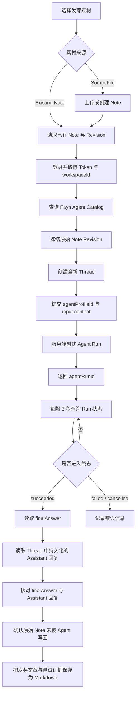

# 发芽测试脚本路径和流程

## 测试脚本

```text
E:\tmp\germination-note-smoke.ps1
```

## 请求流程



## 核心接口调用

提交发芽请求：

```text
POST /api/v1/chat/threads/{threadId}/messages
```

成功提交后取得 `agentRunId`，默认每隔 3 秒查询一次：

```text
GET /api/v1/agent/runs/{agentRunId}
```

持续查询，直到 Run 进入以下任一终态：

- `succeeded`：读取 `finalAnswer`，并检查 Thread 中持久化的 Assistant 回复。
- `failed`：记录服务端返回的错误码和错误信息。
- `cancelled`：记录任务取消状态。

## 输入方式

### Existing Note

直接使用已经存在且版本稳定的 Note 与 Revision。该方式可以避免 Note 刚写入后立即启动 Agent 时可能出现的 `AGENT_PLAN_EXPIRED` 版本竞态，推荐用于稳定回归测试。

### SourceFile

脚本先根据本地素材创建或上传 Note，再冻结对应的原始 Revision，然后创建新 Thread 并发起 Agent Run。

## 结果校验

发芽 Run 成功后需要检查：

1. Run 状态为 `succeeded`。
2. Run 返回了非空的 `finalAnswer`。
3. Thread 中存在持久化的 Assistant 回复。
4. Assistant 回复内容与 `finalAnswer` 一致。
5. 原始 Note 没有被 Agent 直接写回或覆盖。
6. 发芽文章和测试证据已经保存为 Markdown。

## 当前已知注意事项

当前脚本按 `viewpoint_germination.result.v2` 校验结果，但线上实际结果投影仍为 `viewpoint_germination.result.v1`。因此 Agent Run 可以成功，脚本最终仍可能将整体检查标记为 `recovery_required`。这不等同于发芽 Run 失败，但表示结果协议版本尚未完全一致。
