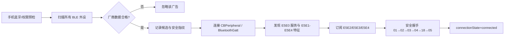

# 无限花火录音卡 BLE 连接调试总结

## 1. 文档信息

- 日期：2026-08-19
- 适用对象：FW920 类录音卡的 Flutter iOS / Android 原生 BLE 驱动与真机调试
- 代码基准：`4f55f92b`（本文按当前工作区实现整理）
- 目的：明确设备发现条件、广播包字段边界、连接成功的判定标准、蓝牙名称修改的协议边界，以及真机出现“已连接但页面未连接”“关机后无法重连”“改名后恢复默认名”时的排障方法。

本文区分三类结论：

| 标记 | 含义 |
| --- | --- |
| 已证实 | 当前代码、真机调试日志或用户提供的设备协议都直接支持。 |
| 观测推断 | 由已采集的单个或少量实机样本推得，不能当作所有固件的固定协议。 |
| 未证实 | 当前 App 没有足够信息判断，必须由固件读回、受控 HCI 抓包或新的协议文档确认。 |

## 2. 结论摘要

1. 当前 App 识别录音卡只依赖 BLE 广播的厂商数据，不再依赖蓝牙名称。名称仅在设备已经通过厂商数据筛选后，用于页面展示。
2. 设备协议描述的厂商字段语义为：`0x5C37 + 设备 MAC + SN`。iOS 真机日志实测得到的厂商原始数据前缀是 `5C 37`，总长度为 `18` 字节。
3. 当前代码不解析、不校验、不上报 MAC/SN 的内容，也不要求它们非零；最小结构仅要求厂商 ID 加 6 字节地址区后还至少有 1 个尾随字节。
4. 同一广播在 iOS 与 Android 的系统 API 表示不同：iOS 取得的数据含两个厂商 ID 字节；Android 以 `0x5C37` 作为索引取得该厂商 payload，payload 不再包含这两个厂商 ID 字节。不能直接复制两个平台的偏移量。
5. `didConnect` 只代表底层 BLE/GATT 已建立，不代表业务连接成功。页面只有在服务、四个特征、三个通知订阅和安全握手全部完成后，才应显示“已连接”。
6. 蓝牙名称命令 `0x3A` 的单字节 `0x00` ACK 只证明设备接受了设置命令；它不能证明名称已经写入 Flash/NVS、设备重启后重新加载，或新的广播名称已经对手机可见。
7. 手机系统蓝牙关闭时，iOS 和 Android 现在都会在连接前返回明确的 `RECORDING_CARD_BLUETOOTH_POWERED_OFF`，页面提示用户先打开手机蓝牙再重试，而不是等待连接超时后显示“连接异常”。

## 3. 证据来源与边界

### 3.1 设备协议说明

用户提供的 BLE 协议截图说明，广播 AD type `0xFF` 的厂商信息语义为：

```text
厂商 ID 0x5C37 + 设备 MAC 地址 + SN
```

截图没有给出 SN 的固定字节长度、MAC/SN 是否允许全零、是否存在额外厂商尾部字段，也没有定义名称持久化或名称读回命令。

### 3.2 当前代码

- iOS：`Flutter/src/ios/Runner/RecordingCardBridge.swift`
- Android：`Flutter/src/android/app/src/main/kotlin/com/hangzhouchuda/huahuoai/RecordingCardAndroidBridge.kt`
- iOS 原生单测：`Flutter/src/ios/RunnerTests/RunnerTests.swift`
- Flutter 页面与用户提示：
  - `Flutter/src/lib/features/ui_v3/presentation/v3_recording_card_detail_page.dart`
  - `Flutter/src/lib/features/ui_v3/presentation/v3_recording_card_control_page.dart`
  - `Flutter/src/lib/features/ui_v3/presentation/v3_recording_card_live_page.dart`

### 3.3 本轮真机日志

本轮 iOS 真机日志位于临时调试目录：

```text
/tmp/huahuo-fw920-name-current/Library/Caches/fw920-debug.log
```

该目录属于 App `Library/Caches`，会被 App 启动逻辑或系统清理，不能作为长期存档。日志采取脱敏设计，只记录厂商数据的资格结论、长度和前两个字节，不记录完整广播包、MAC、SN、设备名称、peripheral UUID、绑定令牌或 Wi-Fi 凭据。

## 4. 广播包格式与字段口径

### 4.1 不要混淆三个层次

| 层次 | 含义 | 本文涉及的内容 |
| --- | --- | --- |
| BLE 广播 PDU | 空口完整广播报文 | 不等于厂商字段长度，当前 App 不直接保存完整 PDU。 |
| AD structure | 广播中的一个字段，例如 `type=0xFF` | 设备协议中所说的“厂商信息”。 |
| 厂商数据内容 | `0xFF` 字段中的厂商 ID 与后续 payload | App 当前以它进行初筛。 |

日志中的 `dataLength=18` 指的是 iOS 的 `CBAdvertisementDataManufacturerDataKey` 内容长度，不是整个 BLE 广播包的长度。

### 4.2 协议语义与 iOS 原始数据布局

按设备协议语义，当前实机样本可按下表理解：

| iOS 原始厂商数据偏移 | 长度 | 字段 | 当前 App 的处理 |
| --- | ---: | --- | --- |
| `0..1` | 2 字节 | 厂商标识 `5C 37`，语义为 `0x5C37` | 必须严格匹配，是唯一的厂商 ID 判定。 |
| `2..7` | 6 字节 | 协议描述中的设备 MAC/地址区 | 不解析、不校验、不上传、不写日志。 |
| `8..N` | 至少 1 字节 | 协议描述中的 SN 或厂商尾部身份区 | 不解析、不校验、不上传、不写日志。 |

当前 iOS 的最小合格条件是：

```text
manufacturerData.count >= 9
manufacturerData[0] == 0x5C
manufacturerData[1] == 0x37
```

因此，当前运行时兼容边界是：

```text
2 字节厂商前缀 + 6 字节地址区 + 至少 1 字节尾随身份数据
```

这只是 App 的筛选下限，不是对固件完整广播定义的重新声明。

### 4.3 真机实测的 18 字节样本

本轮真机日志多次出现：

```text
manufacturer eligibility=eligible dataLength=18 companyPrefix=5C 37
```

若按设备协议中的“6 字节 MAC”拆分，则该实测样本可表示为：

```text
5C 37 | [MAC 6 bytes] | [SN / trailing identity data 10 bytes]
  2B            6B                     10B
```

这里必须保留以下边界：

- 已证实：当前实机样本厂商数据总长为 `18` 字节，前两个字节为 `5C 37`。
- 观测推断：若中间地址区固定为 6 字节，则当前样本尾部为 10 字节。
- 未证实：SN 是否对所有固件都固定为 10 字节；尾部是否全部都是 SN，还是包含型号、版本、保留位等厂商数据。
- 当前 App 不会因为总长不是 18 而拒绝设备；只要满足 `>= 9` 且前缀正确，就会进入候选列表。

### 4.4 MAC/SN 的非零校验已经取消

早期调试曾把前 6 字节当作 MAC、其余部分当作 SN，并要求二者至少包含非零字节。这会在设备广播中存在零填充、生产值尚未写入或字段语义不完全确定时误杀合法设备。

当前实现遵循以下规则：

```text
厂商 ID 正确 + 最小长度正确 => 可作为候选
MAC/SN 全零、部分全零、非 ASCII、长度超过最小值都不会影响候选资格
```

这样做的原因是：MAC/SN 在当前产品中不是连接凭据，也没有经过固件协议确认的逐字节解释。真正的业务安全边界在后续 GATT profile 与绑定握手，而不是对广播尾部做猜测性校验。

### 4.5 字节序：以当前实机数据为准

不要依据通用 BLE Company ID 的常见字节序习惯，擅自把 iOS 拿到的字节反转为 `37 5C`。

当前项目的实测和单测都锁定：

```text
iOS CBAdvertisementDataManufacturerDataKey:
  合格前缀 = 5C 37
  37 5C    = 不合格
```

原因并不需要在 App 层猜测。系统 API 给出的真实数据与实际设备日志已经是当前兼容依据；若固件版本变更，再通过真机样本和协议文档同步调整。

## 5. iOS 与 Android 的厂商数据 API 差异

### 5.1 iOS

iOS 从 `CBAdvertisementDataManufacturerDataKey` 取得 `Data`，当前实现直接读取原始前缀：

```text
Data: [5C, 37, ...]
最小长度：9 字节
```

实现位置：`RecordingCardBridge.swift` 的 `recordingCardManufacturerAdvertisementEligibility` 与 `centralManager(_:didDiscover:advertisementData:rssi:)`。

### 5.2 Android

Android 使用：

```kotlin
scanRecord?.getManufacturerSpecificData(0x5C37)
```

这里的 `0x5C37` 是系统 API 的厂商 ID 索引；返回的 `ByteArray` 是该厂商 ID 对应的后续 payload。当前 Android 仅要求 payload 长度至少 7 字节：

```text
6 字节地址区 + 至少 1 字节 SN/尾部数据
```

因此两端的下限等价，但数值不同：

| 平台 | 传给 App 筛选函数的数据 | 最小长度 | 原因 |
| --- | --- | ---: | --- |
| iOS | 含厂商 ID 的原始厂商数据 | 9 | `2B 厂商 ID + 6B 地址区 + >=1B 尾部`。 |
| Android | 已按 `0x5C37` 索引后的厂商 payload | 7 | 两个厂商 ID 字节已由系统 API 从返回 payload 中分离。 |

调试时不要把 Android 的 `payload.length >= 7` 误解为完整 `0xFF` 厂商字段只有 7 字节，也不要把 iOS 的前两字节再当作 Android payload 的内容。

## 6. 发现、连接与业务就绪状态机



### 6.1 发现阶段

1. 启动扫描时不按设备名过滤。
2. 收到广播后先判断厂商数据资格。
3. 只有资格通过后，才读取名称、RSSI 和系统 peripheral/device 对象并建立候选。
4. 若调用者传入 `safeDeviceFingerprint`，只有该指纹匹配的候选会被连接；未指定时可连接第一个合格候选。
5. 因为厂商 ID + 最小长度只是初筛，同厂商、相同字段形状的其他设备理论上也可能进入候选。后续 GATT profile 和绑定握手才是更强的确认。

### 6.2 名称不参与发现条件

名称的读取顺序仅用于展示：

| 平台 | 展示名称优先级 | 默认值 |
| --- | --- | --- |
| iOS | `CBAdvertisementDataLocalNameKey` -> `CBPeripheral.name` | `花火录音卡` |
| Android | `ScanRecord.deviceName` -> `BluetoothDevice.name` | `Huahuo Recording Card` |

这意味着下列名称变化都不应影响是否能发现录音卡：

- 用户修改了蓝牙名称；
- 广播没有 Local Name；
- 系统返回旧的 `peripheral.name`/`device.name`；
- 名称为空、非 ASCII 或被固件截断。

### 6.3 安全指纹不等于广播 MAC/SN

为了避免向 Flutter 层暴露原始硬件标识，当前候选列表使用安全指纹：

| 平台 | 指纹来源 | 输出形态 | 不等于 |
| --- | --- | --- | --- |
| iOS | `CBPeripheral.identifier.uuidString` | FNV-1a 摘要，前缀 `ios-card-` | 广播中的 6 字节 MAC/SN。 |
| Android | `BluetoothDevice.address` 小写文本 | SHA-256 前 8 字节摘要，前缀 `android-card-` | 广播中的 6 字节 MAC/SN。 |

广播包中协议称为 MAC 的 6 字节区域不会被保存、上传到 Flutter、显示或写入调试日志。

### 6.4 业务连接成功的严格定义

以下状态不可混为一谈：

| 观察到的事件 | 表示什么 | 页面是否应显示“已连接” |
| --- | --- | --- |
| 找到合格广播 | 仅说明初筛成功 | 否。 |
| `didConnect` / `onConnectionStateChange(connected)` | 底层 BLE 链路建立 | 否。 |
| 服务与四个特征发现成功 | GATT profile 可用 | 否。 |
| 三个通知已订阅 | 数据通道就绪 | 否。 |
| 握手完成并发布 `connectionState=connected` | 当前 App 的业务连接成功 | 是。 |

固定 GATT profile：

| UUID | 角色 |
| --- | --- |
| `E5E0` | 服务 |
| `E5E1` | 写特征 |
| `E5E2` | 控制通知 |
| `E5E3` | 实时通知 |
| `E5E4` | 离线文件通知 |

安全握手顺序：

```text
0x01 getSerial
  -> 0x02 getBindingInfo
  -> 0x03 bindDevice
  -> 0x04 setTime
  -> 0x18 setPhoneType
  -> 0x05 getDeviceInfo
  -> handshake completed
```

当前真机成功日志必须至少能看到：

```text
connect requested
manufacturer eligibility=eligible ...
ble connected; discovering service
services discovered nativeError=false
characteristics discovered nativeError=false
notify ready uuid=E5E2 count=1/3
notify ready uuid=E5E3 count=2/3
notify ready uuid=E5E4 count=3/3
handshake started
handshake completed
```

## 7. 手机蓝牙开关、权限与连接异常

### 7.1 当前预检行为

连接或手动扫描前必须先检查手机蓝牙，而不是直接进入搜索超时。

| 系统状态 | iOS 处理 | Android 处理 | Flutter 页面应呈现 |
| --- | --- | --- | --- |
| `poweredOn` / adapter enabled | 正常扫描或连接 | 正常扫描或连接 | 可连接。 |
| `poweredOff` / adapter disabled | 立即返回 `RECORDING_CARD_BLUETOOTH_POWERED_OFF` | `adapter.isEnabled == false` 时立即返回同类错误 | “请先在控制中心或系统设置中打开手机蓝牙，然后返回应用点击连接录音卡。” |
| 未授权 | `RECORDING_CARD_BLUETOOTH_UNAUTHORIZED` | `RECORDING_CARD_BLUETOOTH_PERMISSION_REQUIRED` | 引导到应用蓝牙权限设置。 |
| 不支持 | `RECORDING_CARD_BLUETOOTH_UNSUPPORTED` | 同类错误 | 告知当前手机不支持 BLE。 |
| `unknown` / `resetting` | 等待 Central 状态变化 | 由 Android Adapter 状态决定 | 短暂等待；不能与“已明确关闭”混淆。 |

iOS 没有公开 API 允许 App 直接打开用户的系统蓝牙开关。正确产品流程只能是：提示用户在控制中心或系统设置中打开蓝牙，然后回到 App 点击“重试”。

### 7.2 为什么之前会出现“蓝牙已连接但系统显示未连接”

此前容易混淆的原因有两个：

1. 底层 `didConnect` 已回调，但通知订阅或安全握手尚未完成，业务层仍不应标记 `connected`。
2. iOS 在系统蓝牙已经关闭时，旧路径可能创建连接计时器却不立即返回不可用错误，最终以 `RECORDING_CARD_NOT_FOUND` 或泛化失败结束，页面被渲染为“连接异常”。

当前修复后：

- `poweredOff`、`unauthorized`、`unsupported` 在创建 pending connect 和 15 秒搜索计时器前被拒绝；
- 原生状态发布为 `disconnected / idle + permissionProblem`，而不是 `error / failed`；
- 页面将 `bluetooth_powered_off` 和 `RECORDING_CARD_BLUETOOTH_POWERED_OFF` 映射为打开蓝牙后的重试引导；
- 系统蓝牙再次打开时，iOS 清除 `permissionProblem` 并重新发布快照。

### 7.3 超时参数

连接窗口默认 `15` 秒，调用参数会被钳制到 `3` 至 `60` 秒。它只用于蓝牙已可用但仍未找到或无法完成连接的场景；不能用于掩盖手机蓝牙明确关闭。

## 8. OS 恢复旧连接、关机重连与 force scan

### 8.1 为什么不能把系统恢复的连接直接当成已连接

iOS 配置了 CoreBluetooth state restoration。系统可能在 App 重新启动后交还一个 OS 层仍存活的 `CBPeripheral`，但这个进程尚未完成：

- E5E0 服务发现；
- E5E1-E5E4 特征确认；
- 三个通知订阅；
- 当前会话的绑定和安全握手。

因此该恢复的 transport 只能被视为“陈旧待清理连接”，不能直接显示已连接。

### 8.2 当前恢复策略

新扫描或新连接前：

1. 已经断开的恢复 peripheral 直接从待清理集合移除。
2. 手机蓝牙已打开且旧 peripheral 未断开时，调用取消连接并等待真实 `didDisconnect` 或 `didFailToConnect` 回调。
3. 手机蓝牙关闭时，不尝试取消，等待蓝牙可用。
4. 收到真实断开回调后，才恢复待处理的扫描或连接，并重新给出完整发现窗口。

`forceScan` 也会先主动断开当前活动 transport，防止旧 GATT 对象与新扫描争用。

### 8.3 关机后一直无法重连时的优先检查项

在真机日志中按顺序找：

```text
restored BLE transport reset requested
fresh connect awaiting BLE transport reset
... completed callback=didDisconnect
或 ... completed callback=didFailToConnect
```

如果持续出现“awaiting BLE transport reset”，但没有真实的断开/失败回调，新的扫描不会继续。这是“录音卡关机后重新连接一直失败”的首要排查方向。

注意：当前恢复等待阶段没有独立于发现窗口的额外兜底超时。遇到该现象时应保留完整日志，先做一次显式断开或 force scan，再决定是否需要为恢复阶段增加超时和强制清理策略。

## 9. 蓝牙名称修改协议 `0x3A`

### 9.1 通用 BLE 控制帧

App 当前两端的控制帧编码一致：

```text
D2 2D 02 | command(1) | payloadLength(1) | payload(N) | CRC16(2)
```

字段说明：

| 字段 | 长度 | 说明 |
| --- | ---: | --- |
| `D2 2D` | 2 | 帧头。 |
| `02` | 1 | 协议版本/固定控制字段。 |
| `command` | 1 | 命令号。 |
| `payloadLength` | 1 | payload 长度。 |
| `payload` | N | 命令参数。 |
| `CRC16` | 2 | CRC16，低字节在前、高字节在后。初值 `0x0000`，多项式 `0xA001`。 |

### 9.2 设置名称命令

```text
App -> Card
D2 2D 02 3A 20 [32-byte UTF-8 name field] [CRC16 low] [CRC16 high]
```

| 项目 | 规则 |
| --- | --- |
| 命令号 | `0x3A`。 |
| 名称编码 | UTF-8。 |
| 名称长度 | 文本不得为空或仅空白，UTF-8 编码必须为 `1..32` 个字节。当前原生层不会据此改写名称正文。 |
| 无效输入 | 空、仅空白、包含控制字符、超过 32 UTF-8 字节。 |
| 补齐方式 | 不足 32 字节时补 `0x00`。 |
| payload 长度 | 固定 32 字节，即 `0x20`。 |
| 控制帧总长 | `5 + 32 + 2 = 39` 字节。 |

中文必须按 UTF-8 字节数而不是字符数判断。常见汉字通常占 3 个 UTF-8 字节，因此 11 个这类汉字通常会超过 32 字节上限。

### 9.3 ACK 解释

设备回复的 `0x3A` payload 必须恰好为一个字节：

| 回复 payload | 当前解释 |
| --- | --- |
| `[0x00]` | 设备接受命令。 |
| `[0x01]` | 设备拒绝名称修改。 |
| 空、超过 1 字节、其他值 | `RECORDING_CARD_BLUETOOTH_NAME_RESPONSE_INVALID`。 |

本轮日志中两次设置均显示：

```text
tx scheduled cmd=0x3A payloadBytes=32
tx cmd=0x3A frameBytes=39
rx cmd=0x3A payloadBytes=1 status=0x00
```

这能证明 App 构帧正确、数据已写入 BLE 特征、设备对命令即时返回成功 ACK。

### 9.4 ACK 成功不等于名称已持久化

当前 iOS 和 Android 的 App 行为都是：

```text
收到 0x3A / 0x00
  -> 将当前会话内存中的 deviceName 更新为用户输入
  -> 发布 runtime snapshot
  -> 返回成功给 Flutter
断开连接
  -> 清空内存中的 deviceName
下一次扫描/连接
  -> 从新的广播 Local Name 或系统 peripheral/device.name 重新获取展示名称
```

当前协议与代码中不存在：

- 读取当前蓝牙名称的命令；
- `0x3A` 的“写入 Flash/NVS 已完成”状态；
- 名称持久化提交命令；
- `0x05` 设备信息中的蓝牙名称字段；
- App 本地数据库/文件保存蓝牙名称作为后续连接名称的机制。

因此，`0x00` 只能描述为“设备接受设置命令”，不能描述为“固件已固化且重启后广播名称已更新”。页面已明确提示：保存后需要重启录音卡，再重新连接才会验证新名称是否真正生效。

### 9.5 “改名后重连又显示默认名”的可能原因

当前脱敏日志无法唯一判定根因，以下情况都可能产生相同现象：

1. 录音卡固件只在 RAM 中更新了名称，没有写入 NVS/Flash。
2. 名称已写入非易失存储，但录音卡没有真正断电/重启，因此 BLE 广播栈未重载。
3. 固件重启后没有把新名称放入广告 Local Name，或者广告刷新延迟。
4. iOS 广播中没有 Local Name，于是 App 回退到 `CBPeripheral.name`，该值可能是系统缓存的默认名。
5. 日志中的“断开再连接”只是 App 主动断开并开始新扫描，并不能证明录音卡物理上已经关机重启。

本轮日志能够确认：两次 `0x3A` 都得到 `0x00`，随后又走了 `selected=false` 的新扫描和完整握手；但日志没有记录名称值、名称来源或完整广告包，所以不能证明或否定固件持久化。

### 9.6 名称功能的固件验收建议

最可靠的闭环方案是固件提供以下任一能力：

1. 新增“读取蓝牙名称”命令；或
2. 在 `0x3A` ACK 中明确返回“已持久化 / 需要重启 / 写入失败”的状态；或
3. 在设备信息中加入经过定义的名称版本或名称哈希字段。

在没有新协议前，真机验收只能采用：

```text
发送 0x3A 并收到 [00]
-> 确认录音卡真实断电并重新启动
-> 重新扫描该设备的首次广播
-> 验证 Local Name / 系统名称来源是否为新值
```

临时诊断若确实需要确认名称来源，建议仅记录：

```text
nameSource=advertisement | peripheralFallback | default
nameUtf8Length=N
nameHash=<短哈希>
```

不要写入明文名称、原始 MAC、SN、完整厂商数据、绑定令牌或 Wi-Fi 凭据。

## 10. 本轮真机日志时间线

### 10.1 首次连接健康链路

日志开始处显示：

```text
connect requested selected=false forceScan=false timeoutMs=15000
manufacturer eligibility=companyPrefixMismatch dataLength=29 companyPrefix=06 00
manufacturer eligibility=companyPrefixMismatch dataLength=29 companyPrefix=37 08
manufacturer eligibility=missing dataLength=0 companyPrefix=none
manufacturer eligibility=eligible dataLength=18 companyPrefix=5C 37
ble connected; discovering service
... 三个 notify ready ...
handshake started
... 0x01 / 0x02 / 0x03 / 0x04 / 0x18 / 0x05 ...
handshake completed
```

该序列说明：环境中存在其他广播包，但只有符合 `5C 37` 和长度下限的录音卡成为候选；随后服务发现、通知订阅和安全握手均成功。

日志还记录本次设备信息：

```text
firmware=1.0.6
wifiSupported=true
wifiVersion=1.0.2
deviceInfo payloadBytes=52
```

### 10.2 两次名称设置

第一轮名称设置发生在首次健康握手后，日志显示 `0x3A` 的 32 字节 payload、39 字节控制帧和单字节 `0x00` ACK。第二轮在后续新会话中重复得到相同结果。

结论：名称设置的 App 端帧格式和即时 ACK 已被两次实机验证；持久化与重新广播仍未被该日志验证。

### 10.3 断开后的新扫描

两次名称操作后都能看到：

```text
ble disconnected duringSetup=false expectedWifi=false nativeError=false
connect requested selected=false forceScan=false timeoutMs=15000
manufacturer eligibility=eligible dataLength=18 companyPrefix=5C 37
ble connected; discovering service
... handshake completed
```

这说明后续连接走的是新扫描路径而不是“已选中缓存候选”的路径；也说明当前记录中不是单纯的连接失败或 GATT 未释放问题。

## 11. 真机排障手册

### 11.1 现象：手机蓝牙未打开

预期现象：

```text
RECORDING_CARD_BLUETOOTH_POWERED_OFF
permissionProblem=bluetooth_powered_off
页面显示“蓝牙已关闭”与“打开手机蓝牙后重试”
```

排障步骤：

1. 在控制中心或系统设置打开手机蓝牙。
2. 回到 App，点击连接或重试。
3. 查看是否重新出现 `connect requested` 和厂商资格日志。
4. 若仍失败，不要直接归类为“蓝牙关闭”；检查是否进入 `unknown/resetting`、扫描失败或没有合格广播。

### 11.2 现象：扫描不到录音卡

按顺序检查：

1. 录音卡是否开机且处于可广播状态。
2. 手机蓝牙是否已开启并已给予 App 必要权限。
3. 扫描日志中是否出现 `manufacturer eligibility=eligible`。
4. 若只有 `missing`、`tooShort`、`companyPrefixMismatch`，说明附近广播没有满足当前录音卡筛选规则；不要用名称搜索来替代厂商字段筛选。
5. 若看到 `eligible` 但没有 `ble connected`，检查所请求的 `safeDeviceFingerprint` 是否与当前候选一致，或是否出现连接超时。
6. 若新固件的 iOS 原始前缀不再是 `5C 37`，必须先保存受控抓包和完整版本信息，再改筛选规则，不能盲目同时接受反序前缀。

### 11.3 现象：系统层已连接，App 仍显示未连接

不要只看 `didConnect`。继续检查：

1. 是否发现服务 `E5E0`。
2. 是否发现特征 `E5E1` 至 `E5E4`。
3. 是否出现三个 `notify ready`，计数达到 `3/3`。
4. 是否出现 `handshake started` 与 `handshake completed`。
5. 是否出现绑定冲突、写特征不支持、通知订阅失败、服务缺失或握手失败。

只有 `handshake completed` 和原生 `connectionState=connected` 才是当前业务页面应认可的“已连接”。

### 11.4 现象：录音卡关机后重新连接一直失败

按以下顺序留证：

1. 确认录音卡真正断电，而不是仅在 App 里断开。
2. 记录关闭前、关闭后、重新开机后的完整 `[FW920]` 日志。
3. 查找恢复旧连接或 force scan 的日志，尤其是：
   - `fresh connect awaiting BLE transport reset`
   - `restored BLE transport reset requested`
   - `... completed callback=didDisconnect`
   - `... completed callback=didFailToConnect`
4. 若只看到等待旧 transport reset、没有完成回调，先执行显式断开或 force scan，再测试一次。
5. 若已经重新开始扫描但无 `eligible`，问题在设备广播/筛选，而不是旧 GATT transport。
6. 若 `eligible` 后失败，继续定位在 GATT、通知或握手阶段。

### 11.5 现象：改名后 App 显示成功，重连又是默认名称

建议按下列矩阵记录，不要只做“断开后重连”：

| 步骤 | 必须记录的非敏感证据 | 可证明什么 |
| --- | --- | --- |
| 设置名称 | `0x3A` payload 长度为 32、ACK 为 `[00]` | 命令到达且设备接受。 |
| App 断开/重连 | 新扫描是否出现 `eligible`、是否完成握手 | App 链路是否健康。 |
| 设备真实断电重启 | 操作时间、重新上电时间 | BLE 广播栈是否有机会重新加载。 |
| 重启后首次广播 | 厂商字段长度/前缀、`nameSource`、名称哈希 | 新广播是否已提供新名称。 |
| 名称读回 | 固件读回值或定义的版本字段 | 是否已真正持久化。 |

若最后一步无法完成，不能把“App 保存成功”当成“设备固化成功”。

## 12. 主要错误码与日志关键词

| 场景 | 重点错误码或日志 | 首要动作 |
| --- | --- | --- |
| 手机蓝牙关闭 | `RECORDING_CARD_BLUETOOTH_POWERED_OFF`、`bluetooth_powered_off` | 打开手机蓝牙后重试。 |
| 蓝牙权限被拒 | `RECORDING_CARD_BLUETOOTH_UNAUTHORIZED` 或 `...PERMISSION_REQUIRED` | 到系统设置授予 App 蓝牙权限。 |
| 没有候选设备 | `RECORDING_CARD_NOT_FOUND` | 查看厂商资格日志、设备开机状态和扫描窗口。 |
| GATT 连接失败 | `RECORDING_CARD_CONNECT_FAILED` | 查系统连接状态和旧 transport。 |
| 服务/特征问题 | `SERVICE_DISCOVERY_FAILED`、`SERVICE_MISSING`、`CHARACTERISTIC_DISCOVERY_FAILED`、`PROFILE_INCOMPLETE` | 核对 E5E0-E5E4 profile。 |
| 通知订阅失败 | `RECORDING_CARD_NOTIFICATION_FAILED` | 检查三项通知和 CCCD 写入。 |
| 握手失败 | `RECORDING_CARD_HANDSHAKE_FAILED`、`BINDING_CONFLICT` | 按 01/02/03/04/18/05 顺序定位。 |
| 名称被拒 | `RECORDING_CARD_BLUETOOTH_NAME_REJECTED` | 检查固件对名称的约束。 |
| 名称 ACK 异常 | `RECORDING_CARD_BLUETOOTH_NAME_RESPONSE_INVALID` | 检查是否单字节 `[00]` 或 `[01]`。 |

## 13. 日志与隐私要求

### 13.1 当前日志的正确做法

厂商广播诊断只应记录：

```text
manufacturer eligibility=<missing|tooShort|companyPrefixMismatch|eligible>
dataLength=<N>
companyPrefix=<前两个字节或 none>
```

这已经足以判断：是否收到厂商数据、长度是否满足、厂商 ID 是否匹配。

### 13.2 禁止写入常规日志的数据

以下内容不得进入普通 App 日志、Flutter event、截图或工单正文：

- 完整厂商数据；
- 广播包中的 MAC/SN；
- `CBPeripheral.identifier`、Android 原始 `BluetoothDevice.address`；
- 绑定令牌、账号绑定明文；
- Wi-Fi SSID 明文、密码；
- 用户自定义蓝牙名称明文（除非用户明确授权且在受控单次诊断中使用）。

如必须关联多条日志，使用不可逆短哈希或由现有 `safeDeviceFingerprint` 关联。

### 13.3 iOS 日志采集注意事项

- `[FW920]` 调试日志写入 App sandbox 的 `Library/Caches/fw920-debug.log`。
- Bridge 初始化时会清空该文件；先复现再导出，避免重启 App 后覆盖现场。
- `Caches` 可被系统清理，不应作为正式证据唯一副本。
- 真机测试尽量只保留一个 Runner 进程，避免旧 EventChannel、旧 CoreBluetooth restoration 回调和新会话互相干扰。

## 14. 当前已知限制与后续建议

### 14.1 已知限制

1. 厂商字段初筛不是设备身份认证；它只确认“具有预期厂商字段形状”。
2. 当前 App 不知道 SN 的正式固定长度，也不解释 SN 语义。
3. 当前 App 不读回蓝牙名称，无法验证名称是否持久化。
4. 当前 iOS 常规日志不记录名称来源，因此无法区分“固件未更名”和“系统名称回退缓存”。
5. Android 代码与 iOS 筛选规则对齐，但当前可用的本轮物理扫描日志主要来自 iOS；Android 仍应补一次真实设备扫描验收。
6. CoreBluetooth 恢复旧连接的等待阶段依赖真实断开回调；若系统未回调，待处理的新连接可能停在 transport reset 阶段。

### 14.2 推荐的下一步

1. 向固件方确认厂商 `0xFF` 字段的正式字节表：厂商 ID 字节序、MAC 是否固定 6 字节、SN 固定长度、是否存在保留字段、是否允许全零。
2. 要求固件为蓝牙名称提供读回或持久化 ACK 状态，以结束当前“只能根据广播猜测”的状态。
3. 在受控 Debug 构建增加只记录名称来源和短哈希的诊断，不记录明文 MAC/SN/名称。
4. 用同一张录音卡在 iOS 与 Android 各完成一次：蓝牙关闭、首次扫描、连接、真实断电重启、重新扫描、改名持久化验证。
5. 对旧 transport reset 无完成回调的真机情况补充一条有界超时与明确错误，避免无限等待。

## 15. 关键实现索引

| 内容 | iOS | Android |
| --- | --- | --- |
| 厂商广播资格 | `RecordingCardBridge.swift`：`recordingCardManufacturerAdvertisementEligibility` | `RecordingCardAndroidBridge.kt`：`recordingCardHasCompatibleManufacturerData` |
| 扫描回调 | `centralManager(_:didDiscover:advertisementData:rssi:)` | `ScanCallback.onScanResult` |
| 蓝牙状态预检 | `recordingCardBluetoothConnectionPreflight`、`handleBluetoothUnavailableState` | `ensureBluetoothReady` |
| GATT profile | `serviceUuid` / `writeUuid` / 三个 notify UUID | `SERVICE_UUID` / `WRITE_UUID` / 三个 notify UUID |
| 安全握手 | `beginSecureHandshake` | `beginSecureHandshake` |
| 控制帧编解码 | `RecordingCardFrameCodec` / `RecordingCardFrameDecoder` | `encodeFrame` / `FrameDecoder` |
| 名称设置 | `setBluetoothName`、`recordingCardBluetoothNamePayload` | `setBluetoothName`、`recordingCardBluetoothNamePayload` |
| 安全设备指纹 | `safeFingerprintFor(_ peripheral:)` | `safeFingerprintFor(device)` |

---

维护原则：广播厂商字段只做最小、经实机验证的结构筛选；名称永远不能回到发现条件；`0x3A ACK=00` 只能表示命令接受，不应被表述为名称已永久固化。
